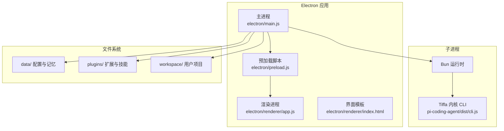
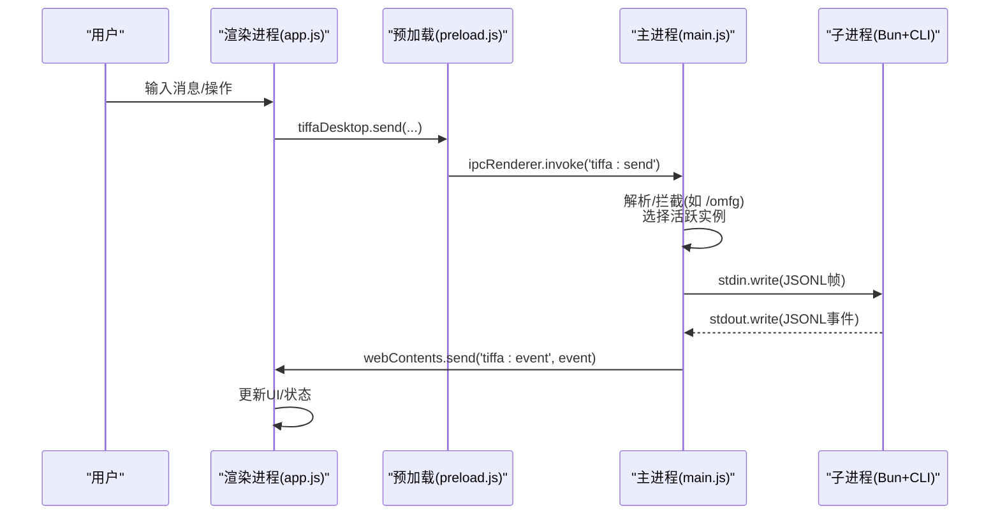
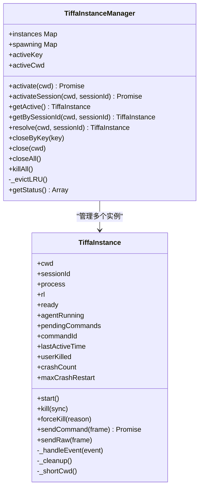
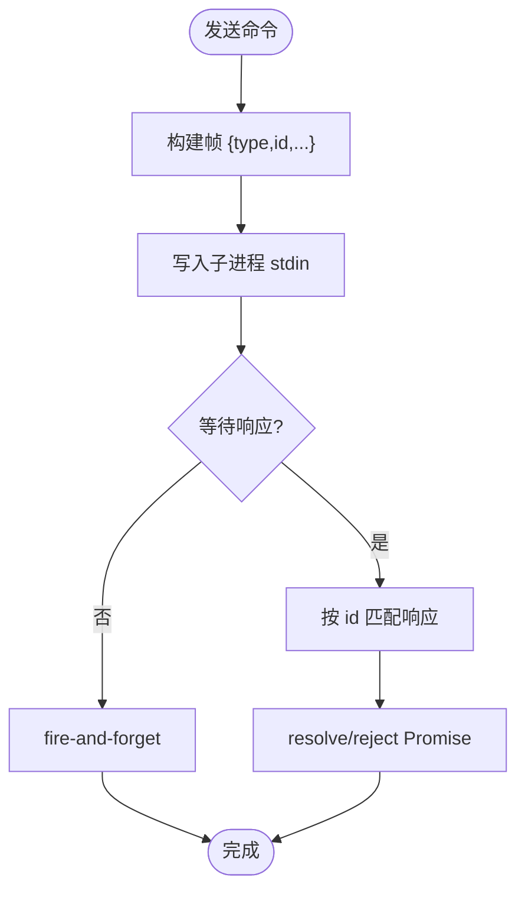
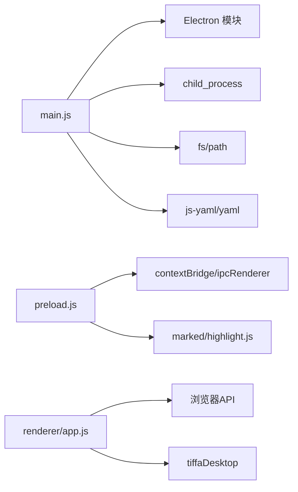

# 核心架构

<cite>
**本文引用的文件**   
- [electron/main.js](file://electron/main.js)
- [electron/preload.js](file://electron/preload.js)
- [electron/renderer/app.js](file://electron/renderer/app.js)
- [electron/renderer/index.html](file://electron/renderer/index.html)
- [electron/package.json](file://electron/package.json)
- [README.md](file://README.md)
</cite>

## 目录
1. [简介](#简介)
2. [项目结构](#项目结构)
3. [核心组件](#核心组件)
4. [架构总览](#架构总览)
5. [详细组件分析](#详细组件分析)
6. [依赖关系分析](#依赖关系分析)
7. [性能考量](#性能考量)
8. [故障排查指南](#故障排查指南)
9. [结论](#结论)
10. [附录](#附录)

## 简介
本文件系统化梳理 Tiffa 桌面应用的核心架构，重点解释 Electron 主进程、渲染进程与预加载脚本的职责分离；深入说明多实例管理系统（TiffaInstanceManager 与 TiffaInstance）、进程间通信机制（IPC）以及事件驱动的 JSONL over stdin/stdout 通信协议；同时阐述扩展系统与 Hook 机制的设计模式，并给出插件架构如何实现功能扩展。文档兼顾初学者概念理解与高级开发者实现细节，辅以架构图与数据流图帮助快速建立整体认知。

## 项目结构
Tiffa 采用“Electron 外壳 + Bun/Bun CLI 内核”的便携化部署方式：
- electron/ 目录包含主进程、预加载脚本与渲染层资源
- npm-global/ 目录内嵌 Bun 运行时与 Tiffa 内核（@oh-my-pi/pi-coding-agent）
- plugins/ 目录存放扩展与技能定义
- data/ 目录承载配置、记忆与会话等持久化数据
- workspace/ 为用户工作区

图表来源
- [electron/main.js:1-31](file://electron/main.js#L1-L31)
- [electron/preload.js:1-24](file://electron/preload.js#L1-L24)
- [electron/renderer/index.html:1-20](file://electron/renderer/index.html#L1-L20)
- [electron/package.json:1-21](file://electron/package.json#L1-L21)

章节来源
- [electron/package.json:1-75](file://electron/package.json#L1-L75)
- [README.md:1-214](file://README.md#L1-L214)

## 核心组件
- 主进程（Main Process）
  - 管理窗口生命周期、注册 IPC 通道、启动/管理 Tiffa 子进程、处理文件系统与系统能力调用
- 预加载脚本（Preload）
  - 通过 contextBridge 暴露受控 API，桥接渲染进程与主进程，屏蔽 Node/Electron 直接访问
- 渲染进程（Renderer）
  - UI 逻辑、状态管理、事件订阅与渲染、与 tiffaDesktop API 交互
- 多实例管理器（TiffaInstanceManager）
  - 懒启动、LRU 淘汰、会话级与项目级实例路由、状态查询与清理
- 单实例（TiffaInstance）
  - 子进程生命周期、JSONL 协议收发、命令响应匹配、自动重启与预热

章节来源
- [electron/main.js:68-112](file://electron/main.js#L68-L112)
- [electron/main.js:76-179](file://electron/main.js#L76-L179)
- [electron/main.js:325-570](file://electron/main.js#L325-L570)
- [electron/preload.js:24-133](file://electron/preload.js#L24-L133)
- [electron/renderer/app.js:94-154](file://electron/renderer/app.js#L94-L154)

## 架构总览
下图展示从用户输入到内核执行、再到事件回传的完整链路，体现主进程、预加载、渲染进程与子进程的协作关系。

图表来源
- [electron/renderer/app.js:423-441](file://electron/renderer/app.js#L423-L441)
- [electron/preload.js:24-36](file://electron/preload.js#L24-L36)
- [electron/main.js:627-708](file://electron/main.js#L627-L708)
- [electron/main.js:122-135](file://electron/main.js#L122-L135)

章节来源
- [electron/main.js:614-824](file://electron/main.js#L614-L824)
- [electron/preload.js:24-133](file://electron/preload.js#L24-L133)
- [electron/renderer/app.js:423-441](file://electron/renderer/app.js#L423-L441)

## 详细组件分析

### 主进程与 IPC 通道
- 窗口创建与预加载注入
  - 使用 preload 脚本启用 contextIsolation，仅暴露受限 API
- IPC 通道分类
  - tiffa:*：Tiffa 命令与多实例管理（发送消息、切换模型、获取状态、激活/关闭会话等）
  - fs:*：文件读写、图片读取
  - shell:*：打开外部链接/路径
  - path:*：工作区与根路径
  - sessions:*：会话与项目管理（列表、归档、导出、重命名等）
  - models:*：模型配置读写与重启
  - xml-translation:*：XML 翻译开关
- 多实例感知路由
  - 所有 tiffa:* 命令通过 _active() 或 resolve(cwd, sessionId) 路由到当前活跃实例

章节来源
- [electron/main.js:577-612](file://electron/main.js#L577-L612)
- [electron/main.js:614-824](file://electron/main.js#L614-L824)
- [electron/main.js:825-948](file://electron/main.js#L825-L948)
- [electron/main.js:950-1000](file://electron/main.js#L950-L1000)

### 预加载脚本与安全边界
- 通过 contextBridge.exposeInMainWorld 暴露 tiffaDesktop API
- 封装 Markdown 渲染与代码高亮能力（marked + highlight.js）
- 统一封装文件系统、Shell、会话/项目管理、模型配置等能力

章节来源
- [electron/preload.js:1-23](file://electron/preload.js#L1-L23)
- [electron/preload.js:24-133](file://electron/preload.js#L24-L133)

### 渲染进程与事件驱动 UI
- 全局状态集中管理（会话、模型、预览、Todo、审批模式等）
- 事件分发器 handleEvent 根据 type 分支处理 ready、agent_start/end、message_*、tool_execution_*、extension_ui_request、session_switch 等
- 卡住检测与首次响应超时提示，提升弱模型可用性体验
- 会话缓存与 DOM 树恢复，支持多标签页后台运行

章节来源
- [electron/renderer/app.js:94-154](file://electron/renderer/app.js#L94-L154)
- [electron/renderer/app.js:483-646](file://electron/renderer/app.js#L483-L646)
- [electron/renderer/app.js:648-731](file://electron/renderer/app.js#L648-L731)

### 多实例管理系统（TiffaInstanceManager 与 TiffaInstance）
- TiffaInstance
  - 负责单个子进程的生命周期：启动、stdin/stdout 管道、readline 逐行解析 JSONL 事件、命令响应 Promise 匹配、错误与退出处理、自动重启（最多 3 次）
  - 事件预处理：ready、agent_start/end、prompt_result、response 等，过滤 embedding 预热噪音
- TiffaInstanceManager
  - 维护 instances Map（key=cwd#sessionId），spawning Promise 去重，activeKey/activeCwd 指向活跃实例
  - activate/cwd 激活项目级实例；activateSession/cwd+sessionId 激活对话级实例
  - LRU 淘汰策略，按 lastActiveTime 淘汰最久未活跃的非当前实例
  - close/closeByKey/closeAll/killAll 提供不同粒度的清理与强制终止

图表来源
- [electron/main.js:76-179](file://electron/main.js#L76-L179)
- [electron/main.js:325-570](file://electron/main.js#L325-L570)

章节来源
- [electron/main.js:76-179](file://electron/main.js#L76-L179)
- [electron/main.js:325-570](file://electron/main.js#L325-L570)

### JSONL over stdin/stdout 通信协议
- 协议格式：每行一个 JSON 对象，通过子进程 stdout 输出，主进程用 readline 逐行解析
- 常用事件类型
  - ready：子进程就绪
  - agent_start/agent_end：代理开始/结束
  - prompt_result：提示结果（含 agentInvoked 标志）
  - message_start/message_update/message_end：消息分片流式推送
  - tool_execution_start/update/end：工具调用生命周期
  - extension_ui_request：扩展 UI 请求
  - session_info_update/config_update/notice/auto_retry_*：状态与通知
- 命令帧
  - sendCommand 为带 id 的请求帧，子进程返回 response 时通过 id 匹配 Promise 回调
  - sendRaw 用于无需等待响应的单向事件（如 abort、steer、follow_up、extension_ui_response）

图表来源
- [electron/main.js:207-248](file://electron/main.js#L207-L248)
- [electron/main.js:122-135](file://electron/main.js#L122-L135)

章节来源
- [electron/main.js:122-135](file://electron/main.js#L122-L135)
- [electron/main.js:207-248](file://electron/main.js#L207-L248)

### 扩展系统与 Hook 机制
- 扩展入口
  - 主进程通过参数 -e 指定扩展路径（plugins/claude-mode-extension.ts），由 Bun 加载执行
- Hook 机制
  - before_agent_start：在代理开始前注入约束/上下文
  - tool_call：对危险操作进行拦截与校验
  - TTSR 规则：基于正则的流式规则，零 Context 成本实时拦截违规输出
- 扩展 UI
  - 通过 extension_ui_request 事件与渲染进程交互，用户确认后通过 extension_ui_response 回传结果

章节来源
- [electron/main.js:28-31](file://electron/main.js#L28-L31)
- [electron/main.js:627-708](file://electron/main.js#L627-L708)
- [electron/main.js:786-797](file://electron/main.js#L786-L797)
- [README.md:76-126](file://README.md#L76-L126)

### 插件架构与技能系统
- 插件目录 plugins/ 存放扩展与技能定义，随应用打包
- 技能（skills/）以 SKILL.md 与配套脚本描述任务流程，供内核在执行阶段调用
- 通过 IPC 与 JSONL 协议，将技能执行过程映射为工具调用与事件流，前端可实时展示

章节来源
- [electron/package.json:44-71](file://electron/package.json#L44-L71)
- [README.md:128-143](file://README.md#L128-L143)

## 依赖关系分析
- 主进程依赖
  - Electron 模块（app、BrowserWindow、ipcMain、shell、dialog）
  - 子进程管理（child_process.spawn/execSync）
  - YAML 解析（js-yaml、yaml）
  - 文件系统（fs、path）
- 预加载脚本依赖
  - contextBridge、ipcRenderer、clipboard、webUtils
  - marked、highlight.js
- 渲染进程依赖
  - 浏览器 API（DOM、Canvas、ResizeObserver、MutationObserver）
  - tiffaDesktop API（由预加载暴露）

图表来源
- [electron/main.js:8-14](file://electron/main.js#L8-L14)
- [electron/preload.js:8-22](file://electron/preload.js#L8-L22)
- [electron/renderer/app.js:258-375](file://electron/renderer/app.js#L258-L375)

章节来源
- [electron/main.js:8-14](file://electron/main.js#L8-L14)
- [electron/preload.js:8-22](file://electron/preload.js#L8-L22)
- [electron/renderer/app.js:258-375](file://electron/renderer/app.js#L258-L375)

## 性能考量
- 子进程启动与预热
  - 启动后延迟 3 秒触发 /memory rebuild 预热 embedding，避免首次冷加载导致超时
- 事件解析与过滤
  - 使用 readline 逐行解析，避免大缓冲；预热期间过滤噪音事件
- 多实例内存控制
  - MAX_INSTANCES=8，LRU 淘汰最久未活跃实例，防止内存膨胀
- 渲染性能优化
  - minimap 使用 Canvas 绘制，批量重绘；历史加载禁用高亮避免卡顿
- 超时与重试
  - 命令超时 5 分钟；崩溃自动重启上限 3 次；首次响应 30 秒无响应提示

章节来源
- [electron/main.js:260-268](file://electron/main.js#L260-L268)
- [electron/main.js:217-223](file://electron/main.js#L217-L223)
- [electron/main.js:325-360](file://electron/main.js#L325-L360)
- [electron/renderer/app.js:258-375](file://electron/renderer/app.js#L258-L375)
- [electron/renderer/app.js:648-731](file://electron/renderer/app.js#L648-L731)

## 故障排查指南
- 子进程异常退出
  - 检查 stderr 日志与退出码；确认是否用户主动 kill；查看自动重启计数
- 中文乱码
  - 确保 UTF-8 环境变量注入生效（LANG/LC_ALL/PYTHONIOENCODING 等）
- 命令无响应
  - 检查 pendingCommands 队列与超时；确认 stdin 可写；验证事件 id 匹配
- 会话/项目丢失
  - 检查 projects.json 迁移逻辑与 removedCwds 列表；确认会话文件存在性与头信息
- 渲染卡顿
  - 禁用历史加载高亮；减少 minimap 重绘频率；检查 MutationObserver 监听范围

章节来源
- [electron/main.js:137-142](file://electron/main.js#L137-L142)
- [electron/main.js:50-66](file://electron/main.js#L50-L66)
- [electron/main.js:217-234](file://electron/main.js#L217-L234)
- [electron/main.js:1363-1385](file://electron/main.js#L1363-L1385)
- [electron/renderer/app.js:172-205](file://electron/renderer/app.js#L172-L205)

## 结论
Tiffa 通过清晰的职责分离与稳健的多实例管理，实现了可扩展、可观测、可运维的桌面 AI 助手架构。Electron 主进程负责系统能力与进程编排，预加载脚本提供安全边界，渲染进程专注 UI 与交互；子进程通过 JSONL 协议高效传输事件，配合 Hook 与扩展机制实现灵活的功能增强。该设计既满足初学者快速上手的易用性，也为高级开发者提供了深入的定制与扩展空间。

## 附录
- 启动与开发
  - 双击 tiffa-desktop.exe 或 start-desktop.bat 启动；开发模式 cd electron && npm start
- 便携部署
  - 整个应用为一个文件夹，拷贝即用，不写注册表，不留痕迹

章节来源
- [README.md:198-214](file://README.md#L198-L214)
- [electron/package.json:6-10](file://electron/package.json#L6-L10)