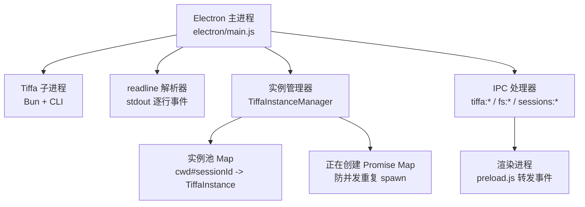
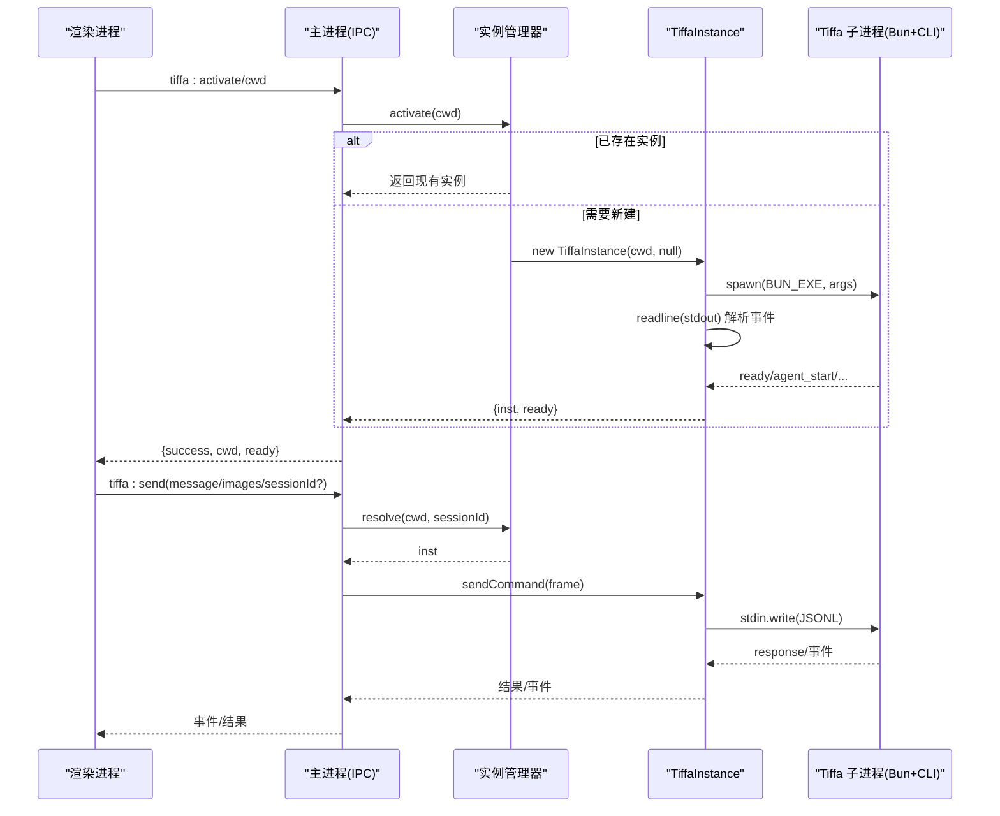
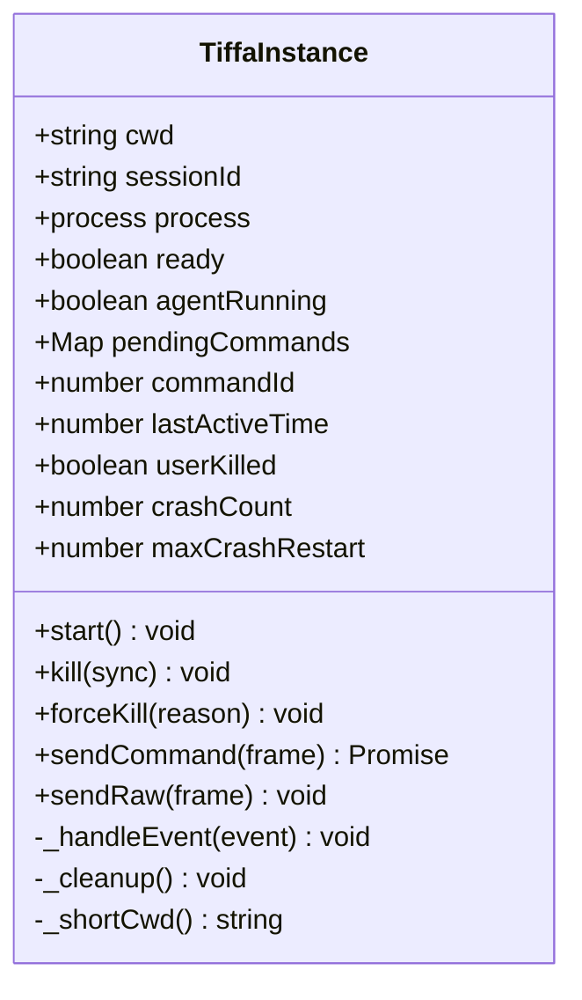
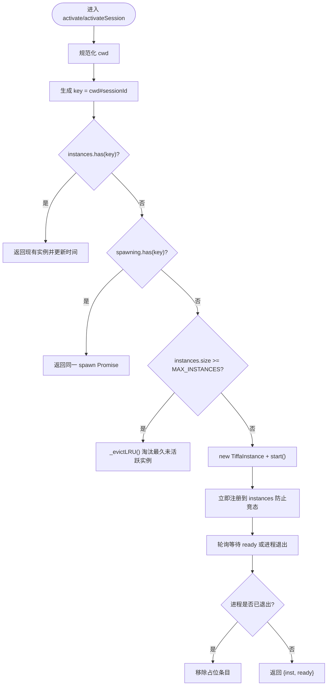
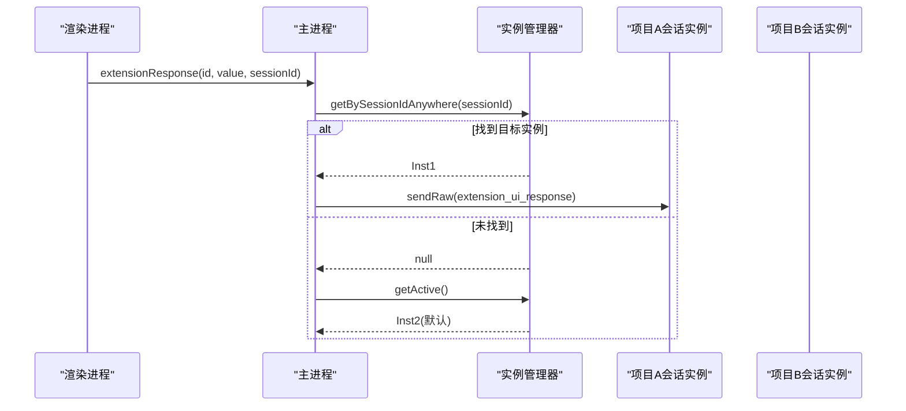
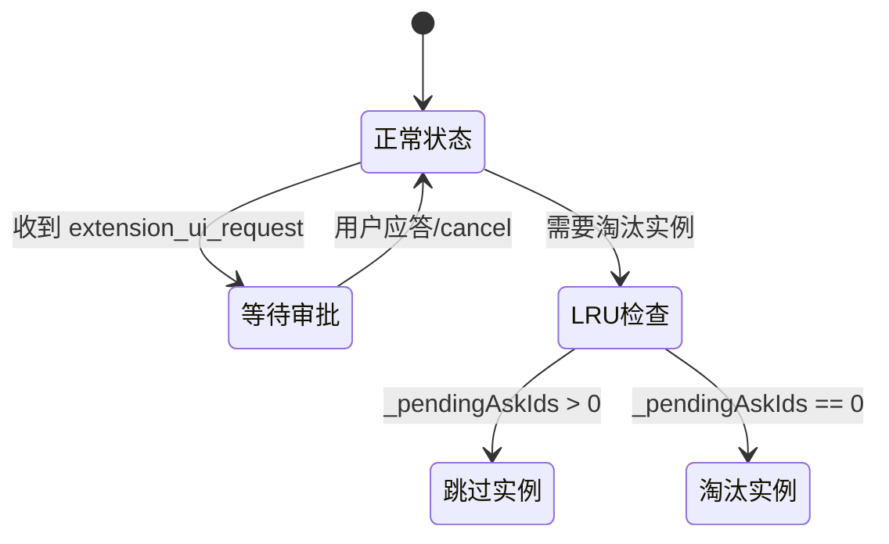
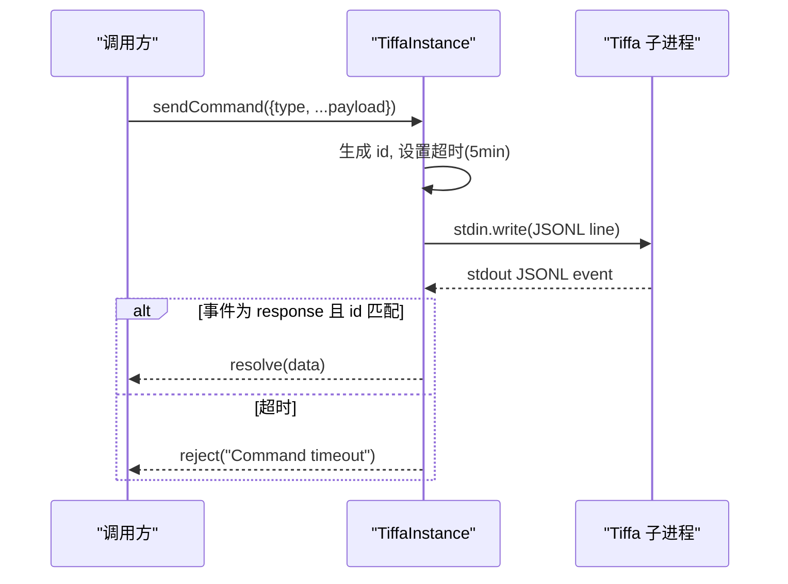
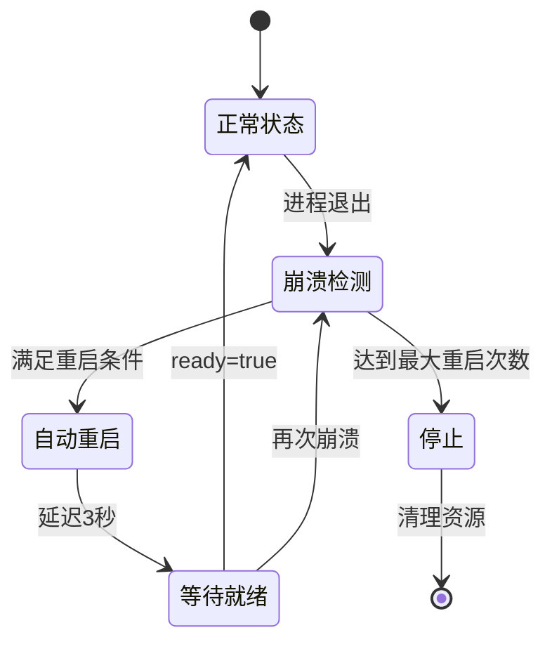
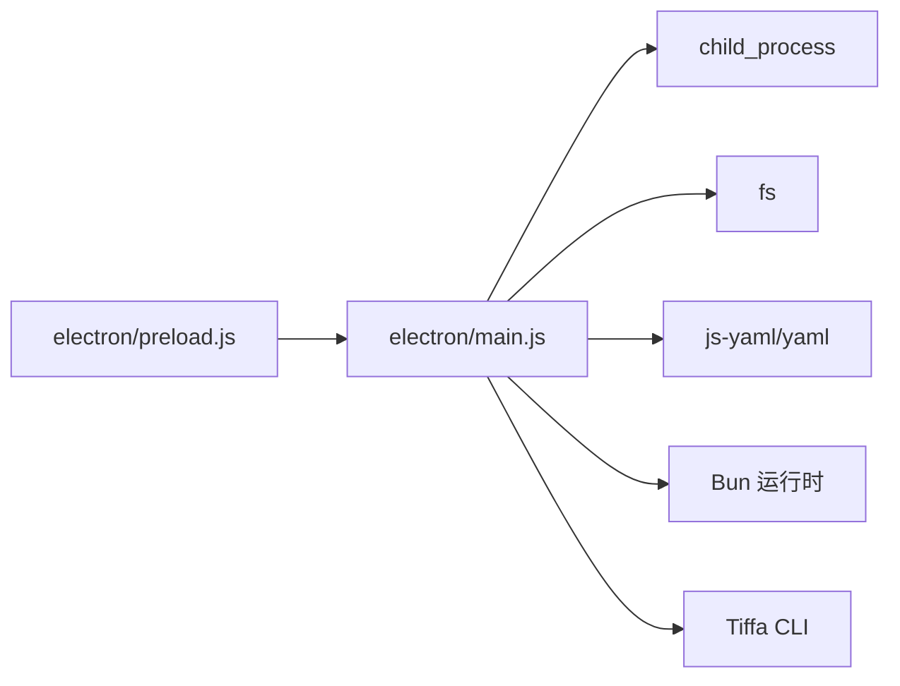

# 进程管理系统

<cite>
**本文引用的文件**   
- [electron/main.js](file://electron\main.js)
- [electron/preload.js](file://electron\preload.js)
</cite>

## 更新摘要
**所做更改**   
- 新增了跨项目会话处理的 `getBySessionIdAnywhere()` 方法，解决跨项目切换时的会话路由问题
- 增强了实例保护机制，防止等待用户审批的实例被误淘汰
- 改进了崩溃恢复逻辑和实例等待机制，确保在进程崩溃重启期间的稳定性
- 完善了进程间通信的错误处理和重试机制
- 优化了会话上下文恢复和实例迁移功能

## 目录
1. [简介](#简介)
2. [项目结构](#项目结构)
3. [核心组件](#核心组件)
4. [架构总览](#架构总览)
5. [详细组件分析](#详细组件分析)
6. [依赖关系分析](#依赖关系分析)
7. [性能考量](#性能考量)
8. [故障排查指南](#故障排查指南)
9. [结论](#结论)
10. [附录](#附录)

## 简介
本文件系统性地梳理 Tiffa 桌面端（Electron）中的进程管理子系统，重点围绕以下目标：
- 深入解释 TiffaInstance 类对单个子进程的完整生命周期管理：启动、运行、崩溃恢复、优雅关闭与资源清理。
- 详细说明 TiffaInstanceManager 的多实例管理机制：懒启动、LRU 淘汰、会话隔离与跨项目会话处理。
- 明确项目级实例与对话级实例的区别及其生命周期策略。
- 阐述进程间通信的 JSONL over stdin/stdout 协议实现：命令发送、响应处理与超时机制。
- 说明进程状态监控、错误处理与自动重启逻辑。
- 补充进程树管理、跨平台兼容性（Windows taskkill）与环境变量注入的实现细节。

## 项目结构
- Electron 主进程负责：
  - 通过 child_process.spawn 启动 Tiffa 子进程（Bun + CLI）。
  - 使用 readline 逐行解析 stdout，实现 JSONL 事件流消费。
  - 维护多实例管理器，提供懒启动、LRU 淘汰、会话隔离与跨项目会话处理能力。
  - 暴露 IPC 接口给渲染进程，统一路由到当前活跃实例或指定会话实例。
- 关键路径与配置：
  - PORTABLE_ROOT 决定可移植根目录，影响 BUN_EXE、TIFFA_CLI、EXTENSION_PATH 等路径。
  - UTF-8 环境变量注入解决 Windows 控制台编码问题。
  - 进程树终止在 Windows 上通过 taskkill 完成，非 Windows 使用 SIGKILL。

**图表来源** 
- [electron/main.js:1-120](file://electron\main.js#L1-L120)
- [electron/main.js:325-470](file://electron\main.js#L325-L470)
- [electron/preload.js:40-45](file://electron\preload.js#L40-L45)

**章节来源**
- [electron/main.js:16-31](file://electron\main.js#L16-L31)
- [electron/main.js:33-66](file://electron\main.js#L33-L66)

## 核心组件
- TiffaInstance：封装单个 Tiffa 子进程的生命周期与通信。
- TiffaInstanceManager：集中管理多个实例，支持懒启动、LRU 淘汰、会话隔离、跨项目会话处理与状态查询。
- IPC 层：将渲染进程请求路由到对应实例，并转发事件回渲染进程。

**章节来源**
- [electron/main.js:76-319](file://electron\main.js#L76-L319)
- [electron/main.js:325-570](file://electron\main.js#L325-570)
- [electron/main.js:614-827](file://electron\main.js#L614-L827)

## 架构总览
下图展示主进程、子进程、实例管理器与 IPC 的整体交互关系。

**图表来源** 
- [electron/main.js:614-827](file://electron\main.js#L614-L827)
- [electron/main.js:76-319](file://electron\main.js#L76-L319)
- [electron/main.js:325-470](file://electron\main.js#L325-L470)

## 详细组件分析

### TiffaInstance：单实例生命周期与通信
- 启动流程
  - 构造参数：cwd、可选 sessionId（null 表示项目级实例；UUID 表示对话级实例）。
  - 构建环境：继承 process.env，叠加 UTF-8 相关环境变量，设置 PI_CODING_AGENT_DIR、HOME、USERPROFILE、BUN_INSTALL，并删除 NODE_OPTIONS、ELECTRON_RUN_AS_NODE。
  - 启动子进程：spawn(BUN_EXE, [TIFFA_CLI, '--mode', 'rpc-ui', '-e', EXTENSION_PATH])，stdio 为 pipe。
  - 建立 stdout 读取：readline 逐行解析 JSONL 事件，stderr 输出日志。
  - 监听 exit/error：退出时拒绝所有 pendingCommands，清理资源，按策略自动重启（最多 3 次），并通过 IPC 通知渲染进程。
- 运行期
  - 事件处理：ready 标志置位，重置崩溃计数；prompt_result/agent_start/agent_end 更新 agentRunning；response 匹配 id 完成命令 Promise。
  - 预热 embedding：就绪后延迟 3 秒发送 /memory rebuild，预热期间过滤噪音事件。
  - 命令发送：sendCommand 生成唯一 id，设置 5 分钟超时，写入 stdin；sendRaw 用于无需等待响应的指令。
- 关闭与清理
  - kill(forceKill)：标记 userKilled，取消重启定时器，调用 _killTree(pid)，清理 readline、进程句柄与状态。
  - _cleanup：释放 readline、清空进程引用、复位 ready/agentRunning。

**图表来源** 
- [electron/main.js:76-319](file://electron\main.js#L76-L319)

**章节来源**
- [electron/main.js:94-179](file://electron\main.js#L94-L179)
- [electron/main.js:181-205](file://electron\main.js#L181-L205)
- [electron/main.js:207-248](file://electron\main.js#L207-L248)
- [electron/main.js:252-303](file://electron\main.js#L252-L303)
- [electron/main.js:305-319](file://electron\main.js#L305-L319)

### TiffaInstanceManager：多实例管理与 LRU 淘汰
- 数据结构
  - instances：Map<key, TiffaInstance>，key = path.resolve(cwd) + '#' + (sessionId || 'project')。
  - spawning：Map<key, Promise<TiffaInstance>>，防止并发重复 spawn。
  - activeKey/activeCwd：当前活跃实例标识。
- 懒启动与复用
  - activate(cwd)：若 key 已存在则复用并更新时间；若正在 spawn 中则复用 Promise；超过 MAX_INSTANCES 触发 LRU 淘汰；创建新实例后立即注册，避免竞态。
  - activateSession(cwd, sessionId)：同 activate，但带 sessionId，用于对话级独立进程。
- 查找与路由
  - getActive()：返回当前活跃实例。
  - getBySessionId(cwd, sessionId)：精确按会话查找。
  - **新增** getBySessionIdAnywhere(sessionId)：全池扫描按 sessionId 查找实例，不依赖 activeCwd，解决跨项目切换时的会话路由问题。
  - resolve(cwd, sessionId)：优先按会话查找，否则回退到活跃实例。
- 关闭与清理
  - closeByKey(key)、close(cwd)、closeAll()、killAll()：分别按 key、cwd、全部实例关闭；killAll 同步暴力清理，确保应用退出时进程彻底结束。
- LRU 淘汰
  - _evictLRU()：遍历实例，跳过 activeKey，选择 lastActiveTime 最小的实例关闭。**新增** 保护机制：跳过有未应答 ask 请求的实例，防止误杀等待用户审批的会话。

**图表来源** 
- [electron/main.js:337-451](file://electron\main.js#L337-L451)
- [electron/main.js:535-552](file://electron\main.js#L535-L552)

**章节来源**
- [electron/main.js:325-470](file://electron\main.js#L325-470)
- [electron/main.js:503-533](file://electron\main.js#L503-533)
- [electron/main.js:535-570](file://electron\main.js#L535-570)

### 跨项目会话处理增强
**新增** 为解决跨项目切换时的会话路由问题，新增了 `getBySessionIdAnywhere()` 方法。

- 问题背景
  - 当用户在不同项目间切换时，`activeCwd` 会变为当前项目的路径。
  - 使用 `getBySessionId(activeCwd, sessionId)` 无法找到后台会话的实例（因为它的 key 是"自己的 cwd#sessionId"）。
  - 回退到 `getActive()` 会将应答发送到当前活跃实例，导致原会话的 ask 永远等不到应答 → 卡死。

- 解决方案
  - `getBySessionIdAnywhere(sessionId)`：全池扫描所有实例，按 sessionId 精确匹配。
  - 在多个 IPC 处理器中使用此方法：send、abort、setModel、extensionResponse 等。
  - 确保即使跨项目切换，也能正确路由到发起请求的会话实例。

**图表来源** 
- [electron/main.js:864-870](file://electron\main.js#L864-L870)
- [electron/main.js:1324-1328](file://electron\main.js#L1324-L1328)

**章节来源**
- [electron/main.js:859-870](file://electron\main.js#L859-L870)
- [electron/main.js:1189-1197](file://electron\main.js#L1189-L1197)
- [electron/main.js:1244-1246](file://electron\main.js#L1244-L1246)
- [electron/main.js:1254-1261](file://electron\main.js#L1254-L1261)
- [electron/main.js:1324-1328](file://electron\main.js#L1324-L1328)

### 待审批请求保护机制
**新增** 实现了类似 dim pin 思路的实例保护机制，防止等待用户审批的会话被误淘汰。

- 保护原理
  - 实例维护 `_pendingAskIds` Set，记录待应答的 extension_ui_request 请求 ID。
  - 当收到 editor/select/confirm/input 类型的请求时，添加对应的 request id。
  - 当收到 cancel 或用户应答时，移除对应的 request id。
  - LRU 淘汰时跳过 `_pendingAskIds` 非空的实例。

- 保护场景
  - 等待用户审批的会话不会输出帧，lastActiveTime 陈旧。
  - 传统 LRU 算法会误判为"最闲"而强杀实例。
  - 实例被杀后，ask 弹窗失效，用户无法继续审批流程。

**图表来源** 
- [electron/main.js:580-594](file://electron\main.js#L580-L594)
- [electron/main.js:977-979](file://electron\main.js#L977-L979)

**章节来源**
- [electron/main.js:580-594](file://electron\main.js#L580-L594)
- [electron/main.js:977-979](file://electron\main.js#L977-L979)

### 项目级实例 vs 对话级实例
- 项目级实例
  - sessionId 为 null，key 后缀为 'project'。
  - 适用于文件操作、项目切换等通用场景。
  - 由 activate(cwd) 创建与激活。
- 对话级实例
  - sessionId 为 UUID，key 包含 sessionId。
  - 每个对话拥有独立进程，互不干扰。
  - 由 activateSession(cwd, sessionId) 创建与激活，可通过 closeSession(cwd, sessionId) 关闭。

**章节来源**
- [electron/main.js:76-92](file://electron\main.js#L76-L92)
- [electron/main.js:337-351](file://electron\main.js#L337-L351)
- [electron/main.js:397-451](file://electron\main.js#L397-L451)
- [electron/main.js:710-735](file://electron\main.js#L710-L735)

### JSONL over stdin/stdout 协议
- 发送命令
  - sendCommand：为 frame 附加唯一 id，设置 5 分钟超时，写入 stdin，等待 response 匹配 id。
  - sendRaw：直接写入 stdin，不等待响应，用于 abort/steer/follow_up 等即时指令。
- 接收事件
  - readline 逐行解析 stdout，JSON.parse 后交由 _handleEvent。
  - 事件类型包括 ready、prompt_result、agent_start、agent_end、response 等。
- 超时与错误
  - 命令超时：5 分钟后仍未收到 response，reject Promise。
  - 进程退出：拒绝所有 pendingCommands，清理资源，必要时自动重启。

**图表来源** 
- [electron/main.js:207-248](file://electron\main.js#L207-L248)
- [electron/main.js:252-303](file://electron\main.js#L252-L303)

**章节来源**
- [electron/main.js:207-248](file://electron\main.js#L207-L248)
- [electron/main.js:252-303](file://electron\main.js#L252-L303)

### 进程状态监控、错误处理与自动重启
- 状态监控
  - ready：子进程就绪标志。
  - agentRunning：代理运行状态（prompt_result/agent_start/agent_end 驱动）。
  - lastActiveTime：最近活跃时间，用于 LRU 淘汰。
  - pendingCommands：待响应命令数量，诊断用。
- 错误处理
  - stderr 输出打印日志。
  - exit(code, signal)：拒绝 pendingCommands，清理资源，根据条件自动重启。
  - error：启动失败记录日志并置空进程。
- 自动重启
  - 条件：非用户主动 kill、非零退出码、crashCount < maxCrashRestart。
  - 策略：延迟 3 秒后 restart，最多 3 次；成功启动后重置 crashCount。

**章节来源**
- [electron/main.js:144-179](file://electron\main.js#L144-L179)
- [electron/main.js:252-303](file://electron\main.js#L252-L303)

### 进程树管理与跨平台兼容
- Windows 进程树终止
  - 使用 taskkill /PID <pid> /T /F，支持同步/异步模式。
- 非 Windows 系统
  - 使用 process.kill(pid, 'SIGKILL')。
- 调用点
  - kill/sync、forceKill、killAll、before-quit 等场景均调用 _killTree。

**章节来源**
- [electron/main.js:33-48](file://electron\main.js#L33-L48)
- [electron/main.js:181-205](file://electron\main.js#L181-L205)
- [electron/main.js:513-533](file://electron\main.js#L513-L533)
- [electron/main.js:2233-2247](file://electron\main.js#L2233-L2247)

### 环境变量注入
- UTF-8 治理
  - LANG/LC_ALL 设置为 C.UTF-8。
  - PYTHONIOENCODING/PYTHONUTF8/PYTHONLEGACYWINDOWSSTDIO 强制 Python 使用 UTF-8。
  - NO_COLOR 禁用 ANSI 颜色码。
- 运行时注入
  - 启动子进程时合并 process.env 与 _utf8Env()，并设置 PI_CODING_AGENT_DIR、HOME、USERPROFILE、BUN_INSTALL。
  - 删除 NODE_OPTIONS、ELECTRON_RUN_AS_NODE 以避免冲突。

**章节来源**
- [electron/main.js:50-66](file://electron\main.js#L50-L66)
- [electron/main.js:98-109](file://electron\main.js#L98-L109)

### 增强的崩溃恢复与等待机制
**更新** 改进了崩溃恢复逻辑和实例等待机制，确保在进程崩溃重启期间的稳定性。

- 崩溃检测与恢复
  - 当实例检测到进程退出时，检查是否为自动重启条件（非用户主动kill、未达到最大重启次数）。
  - 使用 _restartTimer 延迟3秒后自动重启，避免频繁重启导致资源耗尽。
  - 重启成功后重置 crashCount 计数器，恢复正常工作状态。

- 智能等待机制
  - 在 activate/activateSession 方法中，如果实例处于崩溃重启状态，会等待 ready 状态。
  - 使用轮询机制检查实例状态，最多等待10秒或直到实例真正可用。
  - 等待条件包括：实例 ready、检查次数超过限制、重启计时器已清除且无进程。

- 发送重试机制
  - sendCommand 失败时，检测实例是否在重启中（_restartTimer 存在或进程为空但仍在重启范围内）。
  - 自动等待4秒后重试发送，提高在崩溃恢复期间的成功率。
  - 重试前验证实例是否已 ready 且有可用的进程。

- 会话上下文恢复
  - 崩溃重启后，通过 sessionFilePath 判断是否需要恢复历史上下文。
  - 使用 switch_session 命令重新加载之前的会话文件，确保对话连续性。
  - 在上下文恢复期间（_restoringContext=true），过滤掉重放的消息事件，避免前端重复渲染。

**图表来源** 
- [electron/main.js:201-232](file://electron\main.js#L201-L232)
- [electron/main.js:467-478](file://electron\main.js#L467-L478)
- [electron/main.js:540-551](file://electron\main.js#L540-L551)
- [electron/main.js:928-940](file://electron\main.js#L928-L940)

**章节来源**
- [electron/main.js:201-232](file://electron\main.js#L201-L232)
- [electron/main.js:467-478](file://electron\main.js#L467-L478)
- [electron/main.js:540-551](file://electron\main.js#L540-L551)
- [electron/main.js:928-940](file://electron\main.js#L928-L940)

## 依赖关系分析
- 模块耦合
  - main.js 依赖 electron、child_process、fs、yaml 等标准库与第三方库。
  - preload.js 仅负责 IPC 事件转发，降低渲染进程与主进程的直接耦合。
- 外部依赖
  - Bun 作为 Node 运行时执行 Tiffa CLI。
  - Tiffa CLI 通过 JSONL 协议与主进程通信。
- 潜在循环依赖
  - 无直接循环依赖；实例管理器与实例之间通过方法调用解耦。

**图表来源** 
- [electron/main.js:8-14](file://electron\main.js#L8-L14)
- [electron/preload.js:40-45](file://electron\preload.js#L40-L45)

**章节来源**
- [electron/main.js:8-14](file://electron\main.js#L8-L14)
- [electron/preload.js:40-45](file://electron\preload.js#L40-L45)

## 性能考量
- 懒启动：仅在首次访问项目或会话时创建实例，减少启动开销。
- LRU 淘汰：限制最大实例数（MAX_INSTANCES=8），避免内存与进程占用过高。
- 并发控制：spawning Map 防止重复 spawn，提升稳定性。
- 超时保护：命令 5 分钟超时，避免阻塞。
- 预热优化：就绪后延迟预热 embedding，降低首次消息冷加载导致的超时风险。
- **新增** 智能等待：在崩溃恢复期间避免不必要的等待和资源浪费。
- **新增** 重试机制：在进程重启时自动重试发送，提高可靠性。
- **新增** 跨项目会话处理：通过全池扫描确保会话路由准确性，避免会话丢失。

[本节为通用指导，不直接分析具体文件]

## 故障排查指南
- 常见问题
  - 子进程未启动：检查 BUN_EXE/TIFFA_CLI 路径是否正确，确认 PORTABLE_ROOT 配置。
  - 中文乱码：确认 UTF-8 环境变量注入生效，检查控制台 codepage。
  - 进程未退出：Windows 下使用 taskkill 强制终止，非 Windows 使用 SIGKILL。
  - 命令超时：检查子进程是否正常响应，确认 pendingCommands 数量。
  - **新增** 崩溃重启：查看崩溃计数是否达到上限，检查重启定时器状态。
  - **新增** 等待超时：检查实例是否在崩溃恢复中，确认等待机制是否正常工作。
  - **新增** 跨项目会话问题：确认 getBySessionIdAnywhere 是否能正确找到目标实例。
  - **新增** 审批卡死：检查是否有实例处于等待审批状态，确认 _pendingAskIds 是否正确管理。
- 诊断接口
  - tiffa:diagnostics：返回 ready、agentRunning、cwd、pid、stdinWritable、pendingCommands。
  - tiffa:exited：子进程退出事件，包含 code、signal、autoRestarting、crashCount。

**章节来源**
- [electron/main.js:756-768](file://electron\main.js#L756-L768)
- [electron/main.js:144-179](file://electron\main.js#L144-L179)
- [electron/main.js:33-48](file://electron\main.js#L33-L48)

## 结论
Tiffa 进程管理系统通过 TiffaInstance 与 TiffaInstanceManager 实现了健壮的单实例生命周期管理与多实例调度，结合 JSONL over stdin/stdout 协议、LRU 淘汰、自动重启与跨平台进程树管理，提供了稳定高效的进程隔离与通信能力。其设计兼顾了性能与可靠性，适合多项目、多会话的复杂使用场景。

**更新** 最新的改进显著增强了系统的鲁棒性，特别是在处理进程崩溃和恢复方面的能力，确保了用户体验的一致性和稳定性。新增的跨项目会话处理和待审批请求保护机制进一步提升了系统的稳定性和用户体验。

[本节为总结性内容，不直接分析具体文件]

## 附录
- 关键 IPC 接口
  - tiffa:activate/cwd：激活项目级实例。
  - tiffa:activateSession/cwd/sessionId：激活对话级实例。
  - tiffa:send/message/images/sessionId?：发送消息。
  - tiffa:abort/sessionId：中止当前代理。
  - tiffa:setModel/provider/modelId/sessionId：设置模型。
  - tiffa:getModels：获取可用模型。
  - tiffa:isReady：查询就绪状态。
  - tiffa:diagnostics：诊断信息。
  - tiffa:getState：获取状态。
  - tiffa:steer/followUp/message/sessionId：引导/跟进消息。
  - tiffa:extensionResponse/id/value：扩展 UI 响应。
  - tiffa:compact：压缩上下文。
  - tiffa:command/type/payload：通用命令。
  - tiffa:instances：获取实例列表。

**章节来源**
- [electron/main.js:626-827](file://electron\main.js#L626-L827)