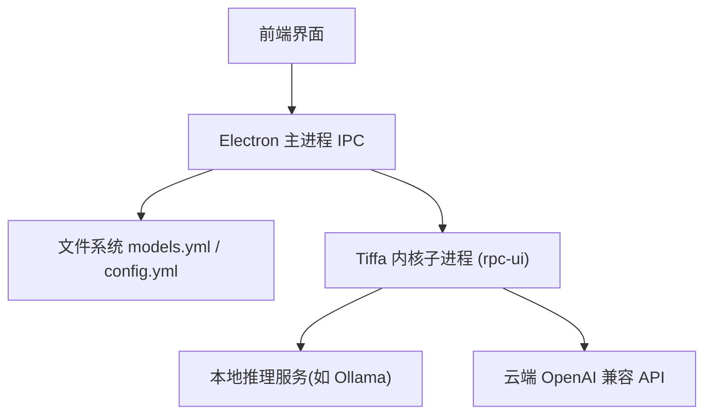
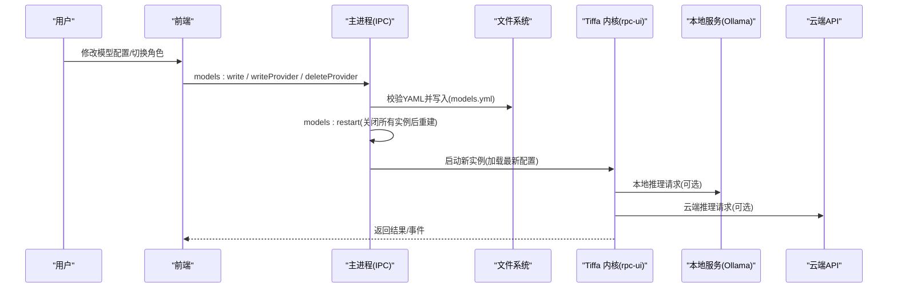
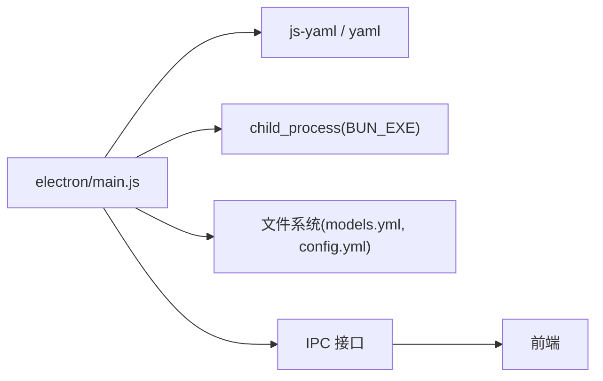

# 模型管理

<cite>
**本文引用的文件**   
- [electron/main.js](file://electron/main.js)
- [data/agent/models.yml](file://data/agent/models.yml)
- [data/agent/config.yml](file://data/agent/config.yml)
</cite>

## 目录
1. [简介](#简介)
2. [项目结构](#项目结构)
3. [核心组件](#核心组件)
4. [架构总览](#架构总览)
5. [详细组件分析](#详细组件分析)
6. [依赖关系分析](#依赖关系分析)
7. [性能与资源优化](#性能与资源优化)
8. [故障排查指南](#故障排查指南)
9. [结论](#结论)
10. [附录](#附录)

## 简介
本文件面向 Tiffa 模型管理系统，聚焦本地 llama.cpp 模型与云端 API 模型的配置与管理机制。内容涵盖：
- 模型提供者（Provider）注册、模型元数据定义、角色映射与切换逻辑
- 模型配置的读写、备份、校验与热重载
- 模型发现（远程 /models 枚举）、缓存与更新策略建议
- 量化级别选择、硬件适配与推理参数调优建议
- 多实例生命周期管理与资源回收
- 不同场景下的模型选择与性能调优实践

## 项目结构
Tiffa 的模型管理由 Electron 主进程与 YAML 配置文件协同完成：
- 主进程提供 IPC 接口，负责读取/写入 models.yml、config.yml，并触发实例重启以应用变更
- models.yml 集中声明 Provider、API 地址、鉴权、模型清单及能力元数据
- config.yml 通过 modelRoles 将“默认/慢速/视觉/计划/提交/微型”等角色映射到具体模型 ID

图表来源
- [electron/main.js:950-1060](file://electron/main.js#L950-L1060)
- [data/agent/models.yml:1-242](file://data/agent/models.yml#L1-L242)
- [data/agent/config.yml:1-30](file://data/agent/config.yml#L1-L30)

章节来源
- [electron/main.js:950-1060](file://electron/main.js#L950-L1060)
- [data/agent/models.yml:1-242](file://data/agent/models.yml#L1-L242)
- [data/agent/config.yml:1-30](file://data/agent/config.yml#L1-L30)

## 核心组件
- 模型提供者与模型清单（models.yml）
  - 每个 provider 包含 baseUrl、api、apiKey、models[] 列表
  - 模型元数据包括 id、name、reasoning、input、supportsTools、contextWindow、maxTokens、cost
- 角色映射（config.yml）
  - modelRoles 将业务角色映射到具体模型 id
- 主进程 IPC 接口
  - models:read/write/writeProvider/deleteProvider/restart
  - fetch:providerModels（调用远端 /models 枚举）
  - config:writeApprovalMode（工具审批模式）
- 子进程与实例管理
  - TiffaInstance 启动 rpc-ui 子进程，维护会话、崩溃自动重启、资源清理

章节来源
- [data/agent/models.yml:1-242](file://data/agent/models.yml#L1-L242)
- [data/agent/config.yml:1-30](file://data/agent/config.yml#L1-L30)
- [electron/main.js:950-1060](file://electron/main.js#L950-L1060)
- [electron/main.js:76-179](file://electron/main.js#L76-L179)

## 架构总览
下图展示从用户操作到模型推理的关键路径：

图表来源
- [electron/main.js:950-1060](file://electron/main.js#L950-L1060)
- [electron/main.js:76-179](file://electron/main.js#L76-L179)
- [data/agent/models.yml:1-242](file://data/agent/models.yml#L1-L242)

## 详细组件分析

### 模型提供者与模型清单（models.yml）
- 字段说明
  - providers.<id>.baseUrl: 服务端基础地址
  - providers.<id>.api: 统一为 openai-completions
  - providers.<id>.apiKey: 鉴权令牌
  - providers.<id>.models[].id/name: 模型标识与显示名
  - reasoning: 是否具备推理能力
  - input: 支持输入类型（text/image）
  - supportsTools: 是否支持工具调用
  - contextWindow/maxTokens: 上下文窗口与最大输出长度
  - cost: 计费项（示例中均为 0）
- 典型 Provider
  - kimi、xiaomi、qwen（本地直连或远程中继）、volcengine、opencode-zen、minimax 等

章节来源
- [data/agent/models.yml:1-242](file://data/agent/models.yml#L1-L242)

### 角色映射与模型切换（config.yml + 主进程）
- config.yml 的 modelRoles 将“default/smol/slow/plan/vision/commit/tiny”等角色映射到 models.yml 中的模型 id
- 主进程在 IPC 层暴露 models:read/write/writeProvider/deleteProvider/restart
- 写操作会先校验 YAML，再写入并生成 .bak 备份；随后触发 restart，关闭并重建所有实例以生效

图表来源
- [data/agent/config.yml:1-30](file://data/agent/config.yml#L1-L30)
- [data/agent/models.yml:1-242](file://data/agent/models.yml#L1-L242)
- [electron/main.js:950-1060](file://electron/main.js#L950-L1060)

章节来源
- [data/agent/config.yml:1-30](file://data/agent/config.yml#L1-L30)
- [electron/main.js:950-1060](file://electron/main.js#L950-L1060)

### 模型发现与远程枚举（fetch:providerModels）
- 主进程通过 fetch:providerModels 向 baseUrl + /models 发起 HTTP 请求，解析 data[].id 作为可用模型列表
- 该能力用于动态发现 Provider 暴露的模型，便于前端展示与选择

章节来源
- [electron/main.js:879-892](file://electron/main.js#L879-L892)

### 配置持久化与热重载
- models:write 会先进行 YAML 语法校验，成功后写入 models.yml，并生成 .bak 备份
- models:writeProvider / models:deleteProvider 使用 yaml parseDocument 保留注释与结构
- models:restart 会关闭所有实例，等待短暂时间后按 cwd 去重重建，确保配置立即生效

章节来源
- [electron/main.js:967-998](file://electron/main.js#L967-L998)
- [electron/main.js:1000-1049](file://electron/main.js#L1000-L1049)

### 子进程与实例生命周期
- TiffaInstance 负责启动 rpc-ui 子进程，注入环境变量（PI_CODING_AGENT_DIR/HOME/BUN_INSTALL 等）
- 通过 readline 逐行解析 JSONL 事件流，处理 stdout/stderr
- 异常退出时进行自动重启（最多 3 次），并通知渲染进程；用户主动 kill 则不重启

章节来源
- [electron/main.js:76-179](file://electron/main.js#L76-L179)

## 依赖关系分析
- 主进程依赖 js-yaml 与 yaml 包进行 YAML 解析与文档级编辑
- 主进程通过 child_process.spawn 启动 BUN_EXE 运行 Tiffa CLI（rpc-ui 模式）
- 模型清单与角色映射分别位于 models.yml 与 config.yml，二者共同决定最终使用的模型

图表来源
- [electron/main.js:1-30](file://electron/main.js#L1-L30)
- [electron/main.js:950-1060](file://electron/main.js#L950-L1060)

章节来源
- [electron/main.js:1-30](file://electron/main.js#L1-L30)
- [electron/main.js:950-1060](file://electron/main.js#L950-L1060)

## 性能与资源优化
- 模型选择建议
  - 日常对话/代码补全：优先本地 qwen/localmodel（低延迟、离线可用）
  - 复杂推理/长上下文：选择云端 reasoning 模型（如 kimi-k3、volcengine GLM-5.2）
  - 轻量快速任务：tiny 角色可映射至 xiaomi/mimo-v2.5
- 量化与格式（通用建议）
  - 本地 llama.cpp 常见量化：Q4_0/Q4_K_M/Q5_Q5/Q6/Q8_0；显存紧张选 Q4，质量敏感选 Q6/Q8
  - 模型格式：gguf（推荐）/bin/pt（需转换）；优先 gguf 以获得最佳内存占用与加载速度
- 硬件适配
  - GPU 加速：启用 CUDA/Metal/Vulkan（取决于后端实现）；合理设置线程数与层卸载
  - CPU 推理：增大线程数、开启 NUMA 亲和性；避免与其他高负载进程争抢
- 推理参数调优
  - temperature/top_p/top_k：降低温度提升稳定性，提高 top_p 增加多样性
  - max_tokens/context_window：限制输出长度，避免 OOM；按需裁剪历史上下文
  - stream：开启流式输出改善首字延迟
- 缓存与更新
  - 本地模型：首次加载较慢，建议预热；大模型分片加载可减少峰值内存
  - 云端模型：利用 Provider 缓存（cacheRead/cacheWrite）降低成本；对热点 prompt 做键值缓存
- 资源管理
  - 控制并发实例数量（MAX_INSTANCES=8），避免过多子进程导致系统抖动
  - 定期清理 sessions-archive，释放磁盘空间

[本节为通用指导，不直接分析具体文件]

## 故障排查指南
- 无法读取 models.yml
  - 检查路径是否存在、权限是否足够；确认 IPC models:read 返回 error
- YAML 写入失败
  - 校验语法错误；查看 models:write 的错误信息；必要时恢复 .bak 备份
- 模型切换未生效
  - 确认已调用 models:restart；检查实例是否成功重建
- 远程模型枚举失败
  - 检查 baseUrl 可达性与 apiKey；查看 fetch:providerModels 的 HTTP 状态码
- 子进程频繁崩溃
  - 观察 exit code/signal；检查日志 stderr；确认资源不足或依赖缺失

章节来源
- [electron/main.js:954-982](file://electron/main.js#L954-L982)
- [electron/main.js:879-892](file://electron/main.js#L879-L892)
- [electron/main.js:76-179](file://electron/main.js#L76-L179)

## 结论
Tiffa 的模型管理以 models.yml 为核心，结合 config.yml 的角色映射与主进程的 IPC 能力，实现了本地与云端模型的统一接入、动态发现与热重载。通过合理的模型选择、量化与推理参数调优，以及严格的实例生命周期管理，可在保证稳定性的同时获得良好的性能体验。

[本节为总结，不直接分析具体文件]

## 附录
- 常用 Provider 与模型
  - kimi/kimi-k3（推理强、上下文大）
  - xiaomi/mimo-v2.5（轻量快速）
  - qwen/localmodel（本地直连或远程中继）
  - volcengine/glm-5.2（大上下文）
  - opencode-zen（免费通道集合）
  - minimax/MiniMax-M3（百万上下文）
- 关键 IPC 接口
  - models:read/write/writeProvider/deleteProvider/restart
  - fetch:providerModels
  - config:writeApprovalMode

章节来源
- [data/agent/models.yml:1-242](file://data/agent/models.yml#L1-L242)
- [data/agent/config.yml:1-30](file://data/agent/config.yml#L1-L30)
- [electron/main.js:950-1060](file://electron/main.js#L950-L1060)