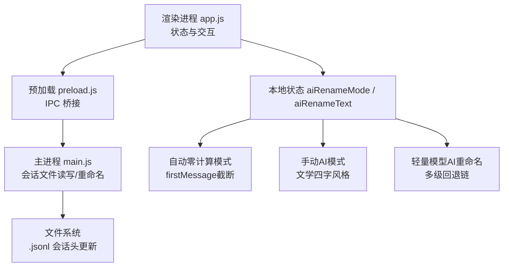
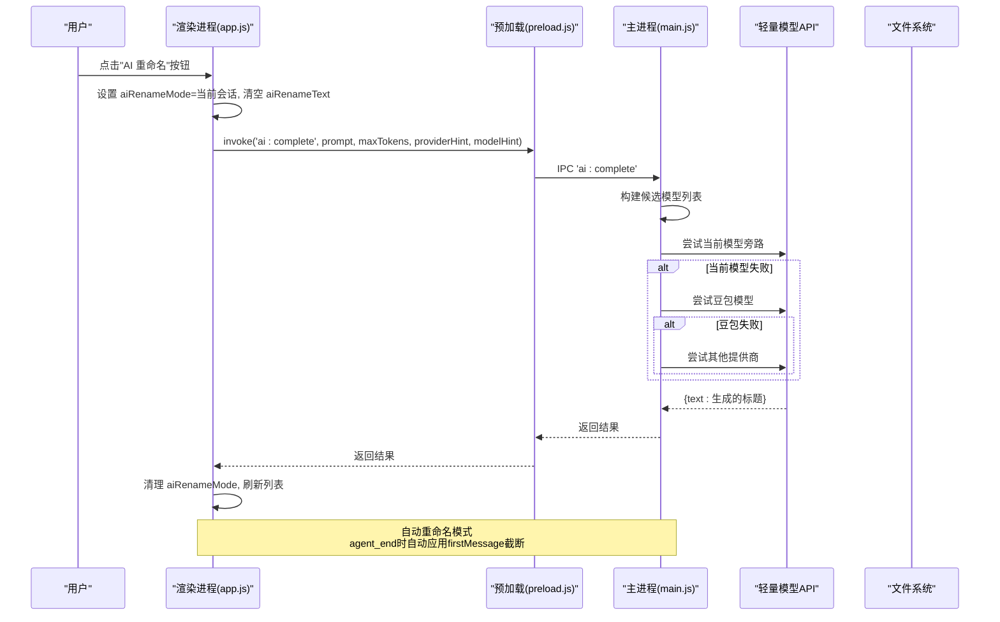
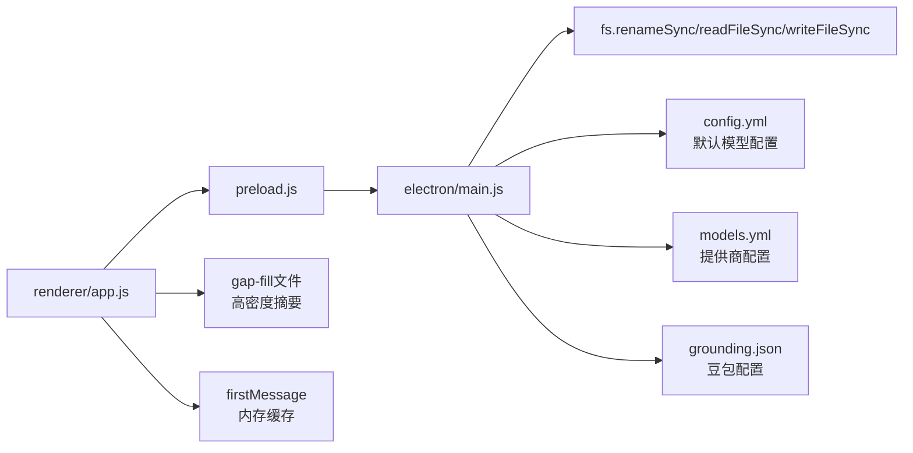

# AI智能重命名功能

<cite>
**本文引用的文件**   
- [README.md](file://README.md)
- [AGENTS.md](file://AGENTS.md)
- [main.js](file://electron/main.js)
- [preload.js](file://electron/preload.js)
- [app.js](file://electron/renderer/app.js)
</cite>

## 更新摘要
**变更内容**   
- 实现基于轻量模型的AI智能重命名系统，支持多级回退链（当前模型旁路 → 豆包 → 其他提供商）
- 新增上下文感知的标题生成，使用最近6条消息加原标题纠正主题漂移
- 增强自动零计算重命名模式，优化会话历史加载性能
- 完善三层状态检查机制防止竞态条件

## 目录
1. [简介](#简介)
2. [项目结构](#项目结构)
3. [核心组件](#核心组件)
4. [架构总览](#架构总览)
5. [详细组件分析](#详细组件分析)
6. [依赖关系分析](#依赖关系分析)
7. [性能考虑](#性能考虑)
8. [故障排查指南](#故障排查指南)
9. [结论](#结论)
10. [附录](#附录)

## 简介
本文件聚焦 Tiffa 的"AI 智能重命名"能力，主要覆盖会话标题的智能生成与持久化、用户手动重命名的实现路径，以及渲染层对重命名状态的交互控制。该能力依托 Electron 主进程的文件操作、IPC 通道与渲染进程的状态管理，确保在弱模型环境下也能稳定产出简洁、可读的会话标题，并支持用户即时修正。

**更新** 系统现已实现 sophisticated AI-based session renaming system，采用轻量模型方法，具备多级回退链（当前模型旁路 → 豆包 → 其他提供商），支持上下文感知建议和自动主题漂移预防，使用最近6条消息加原标题纠正。

## 项目结构
围绕"AI 智能重命名"，关键代码分布在以下位置：
- 渲染进程（UI/状态）：electron/renderer/app.js
- 预加载桥接（IPC 暴露）：electron/preload.js
- 主进程（文件系统/会话数据读写）：electron/main.js
- 项目说明与约束：README.md、AGENTS.md

图表来源
- [app.js:160-163](file://electron/renderer/app.js#L160-L163)
- [app.js:637-651](file://electron/renderer/app.js#L637-L651)
- [app.js:4104-4143](file://electron/renderer/app.js#L4104-L4143)
- [preload.js:72](file://electron/preload.js#L72)
- [main.js:2410-2437](file://electron/main.js#L2410-L2437)

章节来源
- [README.md:1-236](file://README.md#L1-L236)
- [AGENTS.md:158-208](file://AGENTS.md#L158-L208)

## 核心组件
- 渲染进程状态与交互
  - 维护 aiRenameMode 与 aiRenameText，用于控制"正在 AI 重命名"的显示抑制与文本累积。
  - 提供输出后处理（URL/代码块语言推断），提升展示质量。
  - 支持自动零计算重命名和手动AI重命名两种模式。
- IPC 桥接
  - 暴露 renameSession(sessionPath, newTitle) 给渲染进程调用。
  - 暴露 completeWithLightModel(prompt, maxTokens, providerHint, modelHint) 用于轻量模型调用。
- 主进程会话重命名
  - 校验 .jsonl 文件存在性
  - 读取首行 header JSON，更新 title 字段
  - 写回文件，返回成功或错误信息

**更新** 新增三级AI重命名系统：自动零计算模式、手动AI模式和轻量模型AI模式，通过多层回退链确保高可用性。

章节来源
- [app.js:160-163](file://electron/renderer/app.js#L160-L163)
- [app.js:32-91](file://electron/renderer/app.js#L32-L91)
- [app.js:637-651](file://electron/renderer/app.js#L637-L651)
- [app.js:4104-4143](file://electron/renderer/app.js#L4104-L4143)
- [preload.js:72](file://electron/preload.js#L72)
- [main.js:2410-2437](file://electron/main.js#L2410-L2437)

## 架构总览
下图展示了"AI 智能重命名"从用户触发到落盘的完整流程，包括渲染进程状态切换、IPC 调用、主进程文件解析与写入，以及轻量模型的多级回退机制。

图表来源
- [app.js:160-163](file://electron/renderer/app.js#L160-L163)
- [app.js:637-651](file://electron/renderer/app.js#L637-L651)
- [preload.js:72](file://electron/preload.js#L72)
- [main.js:2713-2912](file://electron/main.js#L2713-L2912)

## 详细组件分析

### 渲染进程：AI 重命名状态与交互
- 状态字段
  - aiRenameMode：非空表示正在进行 AI 重命名，用于抑制渲染或提示中。
  - aiRenameText：累积 AI 返回的标题文本，便于预览与提交。
- 输出后处理
  - fixBareUrls：将裸链接转换为 Markdown 链接，兼容 file:/// 与 Windows 路径。
  - fixCodeBlockLanguages：自动推断代码块语言，提升可读性。
- 交互建议
  - 进入重命名模式时，禁用输入框并显示"生成中…"；收到结果后恢复。
  - 若生成失败，保留旧标题并提供重试入口。

**更新** 新增三层状态检查机制：
1. 消息开始阶段：`if (state.aiRenameMode) return;` 防止用户消息渲染
2. 消息更新阶段：在text_delta中累积aiRenameText而非渲染
3. 消息发送阶段：`if (!state.aiRenameMode)` 阻止正常消息发送

章节来源
- [app.js:160-163](file://electron/renderer/app.js#L160-L163)
- [app.js:32-91](file://electron/renderer/app.js#L32-L91)
- [app.js:2279-2280](file://electron/renderer/app.js#L2279-L2280)
- [app.js:2314-2316](file://electron/renderer/app.js#L2314-L2316)
- [app.js:3277](file://electron/renderer/app.js#L3277)

### IPC 桥接：renameSession 与 completeWithLightModel
- 暴露方法：renameSession(sessionPath, newTitle)
- 作用：将渲染进程的请求转发至主进程 IPC 处理器，完成会话标题更新。
- 新增方法：completeWithLightModel(prompt, maxTokens, providerHint, modelHint)
- 作用：调用轻量模型进行AI重命名，支持多级回退链

章节来源
- [preload.js:72](file://electron/preload.js#L72)
- [preload.js:75](file://electron/preload.js#L75)

### 主进程：会话重命名逻辑与轻量模型调用
- 入口：ipcMain.handle('sessions:rename', ...)
- 处理步骤
  - 校验 sessionPath 以 .jsonl 结尾且存在
  - 读取文件首行作为 header JSON
  - 将 header.title 设置为 newTitle
  - 写回文件首行，保持后续内容不变
  - 返回 { success: true } 或 { error: message }
- 并发安全
  - 仅修改首行 header，避免读取整个文件导致与内核并发 append 冲突丢数据。

**更新** 新增轻量模型调用逻辑：
- 多级回退链：当前模型旁路 → 豆包 → 其他提供商
- 支持providerHint和modelHint参数优先使用指定模型
- 自动从config.yml和models.yml读取配置
- 20秒超时保护，防止长时间阻塞

章节来源
- [main.js:2713-2739](file://electron/main.js#L2713-L2739)
- [main.js:2813-2873](file://electron/main.js#L2813-L2873)

### 自动标题生成（补充）
- 当会话无标题时，系统会基于首条用户消息截取前若干字符作为标题，并写入 header.title 与追加 title 事件，保证列表展示一致性。
- 该逻辑与"AI 智能重命名"互补：前者兜底自动生成，后者由用户触发或上层策略驱动。

**更新** 新增自动零计算重命名模式：
- 在agent_end事件中，系统自动检测会话是否需要重命名
- 使用session.firstMessage进行截断处理（最多20字符）
- 零算力消耗，不调用AI模型
- 适用于首次对话结束后的快速标题生成

章节来源
- [main.js:1954-2022](file://electron/main.js#L1954-L2022)
- [app.js:637-651](file://electron/renderer/app.js#L637-L651)

### 手动AI重命名模式（新增）
- 用户触发时，系统构建文学四字风格的提示词
- 优先读取gap-fill文件获取高密度上下文摘要
- 其次使用内存中的firstMessage作为备选
- 生成≤10字的中文标题，要求文艺凝练有意境
- 禁止工程日志风格（如"修复XXX问题"）

**更新** 会话历史加载性能优化：
- 优先读取gap-fill文件（compaction后的高密度摘要）
- 其次使用session.firstMessage（内存中直接取，零延迟）
- 避免频繁的文件I/O操作

章节来源
- [app.js:4104-4143](file://electron/renderer/app.js#L4104-L4143)

### 轻量模型AI重命名系统（新增）
- **多级回退链设计**：
  1. 当前模型旁路：优先使用前端当前配置的provider/model
  2. 豆包模型：从computer-use/grounding.json读取配置
  3. 其他提供商：从models.yml中查找有apiKey的provider
- **上下文感知**：使用最近6条消息提取可读文本，结合原标题纠正主题漂移
- **智能提示词**：根据是否已有标题动态构建prompt，支持主题漂移检测
- **防并发机制**：_autoRenameInFlight标志防止重复调用

**更新** 自动重命名流程：
- agent_end事件触发后，检查会话是否已自动命名过
- 对于__new__临时路径，轮询等待迁移完成（最多10秒）
- 提取最近6条消息作为上下文，调用轻量模型生成标题
- 成功后更新UI并持久化到文件系统

章节来源
- [app.js:4688-4737](file://electron/renderer/app.js#L4688-L4737)
- [main.js:2813-2873](file://electron/main.js#L2813-L2873)

### 三层状态检查机制（新增）
为防止竞态条件，系统在三个关键位置检查aiRenameMode状态：

1. **消息开始检查**：`handleMessageStart`中阻止用户消息渲染
2. **消息更新检查**：`handleMessageUpdate`中累积文本而非渲染
3. **消息发送检查**：`sendMessage`中阻止正常消息发送

这种设计确保在AI重命名模式下，用户的正常交互不会干扰重命名过程。

章节来源
- [app.js:2279-2280](file://electron/renderer/app.js#L2279-L2280)
- [app.js:2314-2316](file://electron/renderer/app.js#L2314-L2316)
- [app.js:3277](file://electron/renderer/app.js#L3277)

## 依赖关系分析
- 渲染进程依赖预加载桥接暴露的 IPC 方法
- 主进程依赖 Node.js fs 模块进行 .jsonl 文件的头行读写
- 会话数据结构约定：首行为 JSON header，包含 id、version、title、cwd 等字段

图表来源
- [app.js:160-163](file://electron/renderer/app.js#L160-L163)
- [app.js:4112](file://electron/renderer/app.js#L4112)
- [app.js:4122](file://electron/renderer/app.js#L4122)
- [preload.js:72](file://electron/preload.js#L72)
- [main.js:2713-2912](file://electron/main.js#L2713-L2912)

章节来源
- [AGENTS.md:158-208](file://AGENTS.md#L158-L208)

## 性能考虑
- 只读/写首行 header，避免全量 I/O，降低与内核并发写入的冲突风险。
- 短路径校验与快速失败（文件不存在、格式非法）减少无效开销。
- 渲染层使用局部状态切换，避免频繁 DOM 重建。
- **新增** 自动零计算模式避免AI调用开销，提升响应速度。
- **新增** gap-fill文件优先读取，减少大文件解析时间。
- **新增** firstMessage内存缓存，避免重复文件读取。
- **新增** 轻量模型调用20秒超时保护，防止长时间阻塞。
- **新增** 多级回退链确保单个模型失败时快速切换到备用模型。

**更新** 性能优化重点：
- 自动重命名：零算力消耗，直接字符串处理
- 手动重命名：优先使用内存数据和gap-fill文件
- 轻量模型：多级回退链，20秒超时，防并发机制
- 状态检查：O(1)复杂度，避免不必要的DOM操作

[本节为通用指导，不直接分析具体文件]

## 故障排查指南
- 症状：重命名失败，提示"会话文件未找到"
  - 检查 sessionPath 是否指向有效的 .jsonl 文件
  - 确认文件未被占用或权限不足
- 症状：标题未更新
  - 确认 header JSON 合法，首行可被正确解析
  - 检查 writeFileSync 是否抛出异常
- 症状：列表未刷新
  - 渲染进程需在成功后清理 aiRenameMode 并触发列表重载
- **新增** 症状：自动重命名未生效
  - 检查会话是否为首次对话（path不以__new__开头）
  - 确认session.firstMessage不为空
- **新增** 症状：AI重命名模式卡住
  - 检查三层状态检查是否正确重置aiRenameMode
  - 确认agent_end事件正常触发
- **新增** 症状：轻量模型调用失败
  - 检查config.yml中modelRoles配置
  - 确认models.yml中有可用的provider配置
  - 验证computer-use/grounding.json中豆包配置
  - 查看网络连通性和API密钥有效性

章节来源
- [main.js:2713-2912](file://electron/main.js#L2713-L2912)
- [app.js:637-651](file://electron/renderer/app.js#L637-L651)
- [app.js:2279-2280](file://electron/renderer/app.js#L2279-L2280)
- [app.js:4139](file://electron/renderer/app.js#L4139)

## 结论
Tiffa 的"AI 智能重命名"通过渲染进程状态管理、IPC 桥接与主进程轻量文件操作，实现了低开销、高可靠的会话标题更新。配合自动标题生成机制，既满足弱模型环境下的稳定性，又保留了用户可控性与扩展空间。

**更新** 新版本的增强特性：
- 自动零计算模式提供即时响应，无需AI调用
- 手动AI模式支持文学四字风格，提升标题质量
- 轻量模型AI系统实现多级回退链，确保高可用性
- 上下文感知建议使用最近6条消息加原标题纠正主题漂移
- 三层状态检查确保并发安全性
- gap-fill文件和firstMessage优化提升性能

未来可在上层策略中接入更复杂的LLM生成标题，结合规则与记忆系统进一步提升标题质量与一致性。

[本节为总结性内容，不直接分析具体文件]

## 附录
- 相关启动方式与环境变量参考 README.md 与 AGENTS.md，便于定位运行环境与路径配置。
- 如需扩展重命名策略（如批量重命名、模板化命名），建议在 IPC 层新增接口并在主进程中统一校验与审计。

**更新** 新增功能参考：
- 自动重命名逻辑位于 `app.js:637-651`
- 手动AI重命名逻辑位于 `app.js:4104-4143`
- 轻量模型AI重命名逻辑位于 `app.js:4688-4737`
- 三层状态检查位于 `app.js:2279-2280`, `app.js:2314-2316`, `app.js:3277`
- 主进程轻量模型调用位于 `main.js:2813-2873`

章节来源
- [README.md:1-236](file://README.md#L1-L236)
- [AGENTS.md:158-208](file://AGENTS.md#L158-L208)