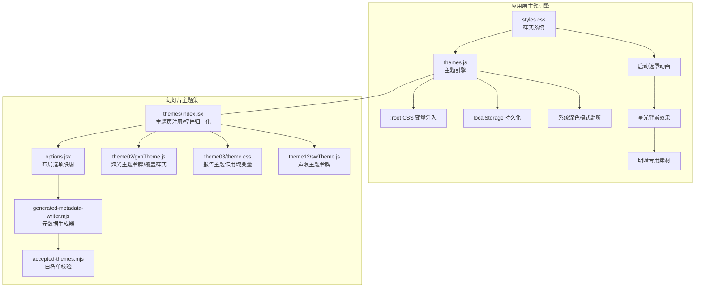
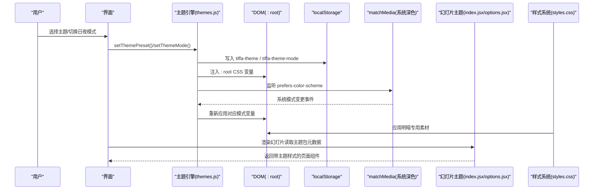
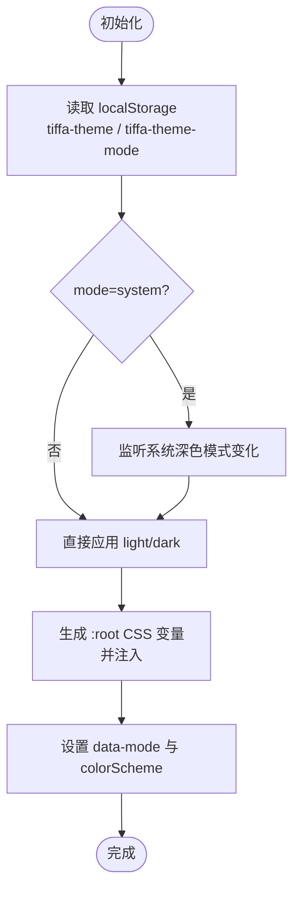
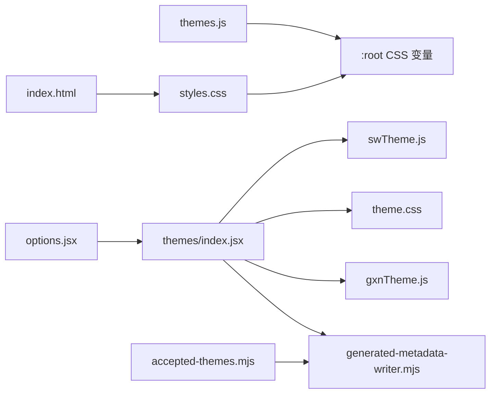

# 主题系统

<cite>
**本文引用的文件**   
- [electron/renderer/themes.js](file://electron\renderer\themes.js)
- [electron/renderer/styles.css](file://electron\renderer\styles.css)
- [electron/renderer/index.html](file://electron\renderer\index.html)
- [skills\dashiai-ppt\project\src\components\themes\index.jsx](file://skills\dashiai-ppt\project\src\components\themes\index.jsx)
- [skills\dashiai-ppt\project\src\options.jsx](file://skills\dashiai-ppt\project\src\options.jsx)
- [skills\dashiai-ppt\project\src\generated-metadata-writer.mjs](file://skills\dashiai-ppt\project\src\generated-metadata-writer.mjs)
- [skills\dashiai-ppt\project\src\accepted-themes.mjs](file://skills\dashiai-ppt\project\src\accepted-themes.mjs)
- [skills\dashiai-ppt\project\src\components\themes\theme02\source\src\gxnTheme.js](file://skills\dashiai-ppt\project\src\components\themes\theme02\source\src\gxnTheme.js)
- [skills\dashiai-ppt\project\src\components\themes\theme03\source\src\theme.css](file://skills\dashiai-ppt\project\src\components\themes\theme03\source\src\theme.css)
- [skills\dashiai-ppt\project\src\components\themes\theme12\source\src\swTheme.js](file://skills\dashiai-ppt\project\src\components\themes\theme12\source\src\swTheme.js)
- [skills\pdf\design\design.md](file://skills\pdf\design\design.md)
</cite>

## 更新摘要
**所做更改**   
- 更新了日夜模式实现原理，详细说明暗色模式使用亮星背景、浅色模式使用暗星背景的专用素材机制
- 增强了CSS变量系统和样式架构说明，突出HSL颜色系统的统一染色罩机制
- 完善了主题切换流程，包含新的启动遮罩动画和星光效果实现
- 更新了故障排查指南，增加了新特性相关的调试方法

## 目录
1. [简介](#简介)
2. [项目结构](#项目结构)
3. [核心组件](#核心组件)
4. [架构总览](#架构总览)
5. [详细组件分析](#详细组件分析)
6. [依赖关系分析](#依赖关系分析)
7. [性能考量](#性能考量)
8. [故障排查指南](#故障排查指南)
9. [结论](#结论)
10. [附录](#附录)

## 简介
本文件系统化阐述 Tiffa 的主题系统，涵盖：
- 7 套预设主题的切换机制与日夜模式的完整实现原理
- CSS 变量系统与样式架构（全局 :root 变量 + 各主题作用域变量）
- 主题配置格式、颜色变量定义、字体设置与响应式支持
- 自定义主题开发指南、打包与分发方法
- 配置文件示例、CSS 变量参考与最佳实践

该文档面向用户与开发者，力求以循序渐进的方式帮助理解并定制界面外观。

## 项目结构
Tiffa 的主题系统由两部分组成：
- 应用级主题引擎（Electron 渲染进程）：负责在 :root 注入 HSL 格式的 CSS 变量，管理主题与日夜模式的持久化与切换
- 幻灯片主题集（PPT 生成器）：每个主题包包含元数据、页面布局与样式，部分主题通过 JS/CSS 模块提供作用域内的设计令牌与样式

**图表来源** 
- [electron/renderer/themes.js](file://electron\renderer\themes.js)
- [electron/renderer/styles.css](file://electron\renderer\styles.css)
- [electron/renderer/index.html](file://electron\renderer\index.html)
- [skills\dashiai-ppt\project\src\components\themes\index.jsx](file://skills\dashiai-ppt\project\src\components\themes\index.jsx)
- [skills\dashiai-ppt\project\src\options.jsx](file://skills\dashiai-ppt\project\src\options.jsx)
- [skills\dashiai-ppt\project\src\generated-metadata-writer.mjs](file://skills\dashiai-ppt\project\src\generated-metadata-writer.mjs)
- [skills\dashiai-ppt\project\src\accepted-themes.mjs](file://skills\dashiai-ppt\project\src\accepted-themes.mjs)
- [skills\dashiai-ppt\project\src\components\themes\theme02\source\src\gxnTheme.js](file://skills\dashiai-ppt\project\src\components\themes\theme02\source\src\gxnTheme.js)
- [skills\dashiai-ppt\project\src\components\themes\theme03\source\src\theme.css](file://skills\dashiai-ppt\project\src\components\themes\theme03\source\src\theme.css)
- [skills\dashiai-ppt\project\src\components\themes\theme12\source\src\swTheme.js](file://skills\dashiai-ppt\project\src\components\themes\theme12\source\src\swTheme.js)

**章节来源**
- [electron/renderer/themes.js](file://electron\renderer\themes.js)
- [electron/renderer/styles.css](file://electron\renderer\styles.css)
- [electron/renderer/index.html](file://electron\renderer\index.html)
- [skills\dashiai-ppt\project\src\components\themes\index.jsx](file://skills\dashiai-ppt\project\src\components\themes\index.jsx)
- [skills\dashiai-ppt\project\src\options.jsx](file://skills\dashiai-ppt\project\src\options.jsx)

## 核心组件
- 应用级主题引擎（themes.js）
  - 维护 7 套预设主题（每套含 light/dark 两套配色），使用 HSL 字符串作为颜色值
  - 将主题颜色映射为 :root 下的 CSS 变量，并提供旧变量名别名以保证向后兼容
  - 支持 system/light/dark 三种日夜模式，自动跟随系统偏好变化
  - 通过 localStorage 持久化当前主题与模式选择
- 样式系统（styles.css）
  - 完整的CSS变量系统，包含背景、文本、强调、语义、边框等类别
  - 启动遮罩动画系统，包含四层星光呼吸效果和染色罩机制
  - 明暗模式专用素材切换，暗色使用亮星背景，浅色使用暗星背景
  - 无障碍支持，遵循 prefers-reduced-motion 规范
- 幻灯片主题索引与控件归一化（themes/index.jsx）
  - 汇总主题包与页面元数据，对控件类型进行统一处理（如 select/range/toggle 等）
  - 根据主题键过滤或注入控件，支持默认值与按槽位预设
- 布局选项映射（options.jsx）
  - 将 layoutName 解析为具体布局项，返回对应的组件工厂函数
- 元数据生成器（generated-metadata-writer.mjs）
  - 生成主题包与页面的元数据导出，供运行时消费
- 主题白名单（accepted-themes.mjs）
  - 基于生成的主题包 key 做白名单校验，确保仅加载受信任主题
- 主题令牌与样式（gxnTheme.js / theme.css / swTheme.js）
  - 各主题通过 JS 对象或 CSS 类作用域暴露设计令牌（颜色、字体、字号、间距等）
  - 支持 deck-level 的 scheme 覆盖（如炫光主题的 green/violet 方案）

**章节来源**
- [electron/renderer/themes.js](file://electron\renderer\themes.js)
- [electron/renderer/styles.css](file://electron\renderer\styles.css)
- [electron/renderer/index.html](file://electron\renderer\index.html)
- [skills\dashiai-ppt\project\src\components\themes\index.jsx](file://skills\dashiai-ppt\project\src\components\themes\index.jsx)
- [skills\dashiai-ppt\project\src\options.jsx](file://skills\dashiai-ppt\project\src\options.jsx)
- [skills\dashiai-ppt\project\src\generated-metadata-writer.mjs](file://skills\dashiai-ppt\project\src\generated-metadata-writer.mjs)
- [skills\diffia-ppt\project\src\accepted-themes.mjs](file://skills\dashiai-ppt\project\src\accepted-themes.mjs)
- [skills\dashiai-ppt\project\src\components\themes\theme02\source\src\gxnTheme.js](file://skills\dashiai-ppt\project\src\components\themes\theme02\source\src\gxnTheme.js)
- [skills\dashiai-ppt\project\src\components\themes\theme03\source\src\theme.css](file://skills\dashiai-ppt\project\src\components\themes\theme03\source\src\theme.css)
- [skills\dashiai-ppt\project\src\components\themes\theme12\source\src\swTheme.js](file://skills\dashiai-ppt\project\src\components\themes\theme12\source\src\swTheme.js)

## 架构总览
下图展示主题切换与日夜模式的核心流程，以及 PPT 主题包的运行期装配过程。

**图表来源** 
- [electron/renderer/themes.js](file://electron\renderer\themes.js)
- [electron/renderer/styles.css](file://electron\renderer\styles.css)
- [electron/renderer/index.html](file://electron\renderer\index.html)
- [skills\dashiai-ppt\project\src\components\themes\index.jsx](file://skills\dashiai-ppt\project\src\components\themes\index.jsx)
- [skills\dashiai-ppt\project\src\options.jsx](file://skills\dashiai-ppt\project\src\options.jsx)

## 详细组件分析

### 应用级主题引擎（themes.js）
- 预设主题与数据结构
  - 每个 ThemePreset 包含 id、name、description 以及 light/dark 两套 ThemeColors
  - ThemeColors 分为 background、text、accent、semantic、border、special 六大类别，采用 HSL 字符串存储
- 变量映射与兼容性
  - themeColorsToCSSVars 将 ThemeColors 转换为 :root 下的 CSS 变量
  - 同时生成旧版 hex 变量名别名，保证历史组件继续工作
- 日夜模式策略
  - resolveMode 支持 system/light/dark；system 模式下通过 matchMedia 监听系统偏好变化
  - applyThemeToDOM 将变量注入 <style> 标签并设置 data-mode 属性与 colorScheme
- 持久化与迁移
  - 使用 tiffa-theme 与 tiffa-theme-mode 两个 key 保存选择
  - 启动时检测并迁移旧 key（omp-theme* → tiffa-theme*）

**图表来源** 
- [electron/renderer/themes.js](file://electron\renderer\themes.js)

**章节来源**
- [electron/renderer/themes.js](file://electron\renderer\themes.js)

### 样式系统（styles.css）
- CSS变量系统
  - 完整的HSL颜色变量体系，包含背景、文本、强调、语义、边框等类别
  - Legacy别名支持，确保旧组件兼容性
  - 非颜色变量定义，包括圆角、尺寸、阴影等
- 启动遮罩动画系统
  - 四层星光呼吸效果，每层具有不同的动画周期和相位
  - 染色罩机制，使用 mix-blend-mode: color 将星光染成当前主题强调色
  - 明暗专用素材切换，暗色使用 tiffa-muse.png（亮星），浅色使用 tiffa-muse-light.png（暗星）
- 无障碍支持
  - 遵循 prefers-reduced-motion 规范，禁用动画时保持静态显示
  - 合理的透明度层级，确保可读性

**章节来源**
- [electron/renderer/styles.css](file://electron\renderer\styles.css)
- [electron/renderer/index.html](file://electron\renderer\index.html)

### 幻灯片主题索引与控件归一化（themes/index.jsx）
- 主题包与页面元数据
  - GENERATED_THEME_PACKS 与 GENERATED_THEME_PAGES 由生成器产出，描述主题包、页面键、布局、槽位、控件与默认值
- 控件类型归一化
  - normalizeType 将多种输入类型统一为标准类型（range/select/toggle/icons 等）
  - 针对颜色/调色板控件自动设置为 color 显示，小选项集合自动设为 tab
- 主题覆盖与注入
  - THEME_OVERRIDES 允许特定主题移除或注入控件，支持按 slot 预设默认值

**章节来源**
- [skills\dashiai-ppt\project\src\components\themes\index.jsx](file://skills\dashiai-ppt\project\src\components\themes\index.jsx)

### 布局选项映射（options.jsx）
- LAYOUT_OPTIONS 将 layoutName 映射到具体布局项，包含 label、dataLayout 与 component 工厂函数
- slide(layoutName, props) 创建幻灯片模型，内部调用 createSlideModel

**章节来源**
- [skills\dashiai-ppt\project\src\options.jsx](file://skills\dashiai-ppt\project\src\options.jsx)

### 元数据生成器（generated-metadata-writer.mjs）
- formatGeneratedMetadataModule 输出 GENERATED_THEME_PACKS 与 GENERATED_THEME_PAGES
- formatThemeMetadataModule 输出单个主题的 theme/pages 元数据

**章节来源**
- [skills\dashiai-ppt\project\src\generated-metadata-writer.mjs](file://skills\dashiai-ppt\project\src\generated-metadata-writer.mjs)

### 主题白名单（accepted-themes.mjs）
- ACCEPTED_THEME_KEYS 从生成的主题包 key 列表构建
- isAcceptedThemeKey/filterAcceptedThemePacks/filterAcceptedThemePages 用于安全校验

**章节来源**
- [skills\dashiai-ppt\project\src\accepted-themes.mjs](file://skills\dashiai-ppt\project\src\accepted-themes.mjs)

### 主题令牌与样式（gxnTheme.js / theme.css / swTheme.js）
- gxnTheme.js（炫光主题）
  - 定义 GXN_TOKENS/GXN_PALETTE/GXN_SCHEMES，支持 green/violet 两种 scheme
  - deckOverrideCSS 动态生成覆盖样式，包括强调卡片、极光文字、磁吸悬停等
- theme.css（报告主题）
  - 在 .rd-slide 作用域内声明 --rd-* 变量（背景、墨色、线条、蓝/青、面板、字体族、字号、间距）
  - 提供 rd-dark 修饰符切换暗色变量
- swTheme.js（声浪主题）
  - 以 JS 对象形式暴露 color/font/type/pad/radius 等令牌，支持 accent 色板切换

**章节来源**
- [skills\dashiai-ppt\project\src\components\themes\theme02\source\src\gxnTheme.js](file://skills\dashiai-ppt\project\src\components\themes\theme02\source\src\gxnTheme.js)
- [skills\dashiai-ppt\project\src\components\themes\theme03\source\src\theme.css](file://skills\dashiai-ppt\project\src\components\themes\theme03\source\src\theme.css)
- [skills\dashiai-ppt\project\src\components\themes\theme12\source\src\swTheme.js](file://skills\dashiai-ppt\project\src\components\themes\theme12\source\src\swTheme.js)

## 依赖关系分析
- 主题引擎与应用层
  - themes.js 独立于 PPT 主题集，仅负责 :root 变量注入与模式管理
- 幻灯片主题集内部依赖
  - index.jsx 依赖 generated-metadata-writer 产出的元数据
  - options.jsx 依赖 index.jsx 导出的 THEME_PAGES/THEME_PACK_OPTIONS
  - accepted-themes.mjs 依赖生成的主题包 key 列表
- 主题样式与令牌
  - 各主题通过 JS/CSS 模块暴露令牌，被 index.jsx 与运行时消费
- 样式系统依赖
  - styles.css 依赖 themes.js 注入的CSS变量
  - 启动遮罩动画依赖明暗专用素材文件和染色罩机制

**图表来源** 
- [electron/renderer/themes.js](file://electron\renderer\themes.js)
- [electron/renderer/styles.css](file://electron\renderer\styles.css)
- [electron/renderer/index.html](file://electron\renderer\index.html)
- [skills\dashiai-ppt\project\src\components\themes\index.jsx](file://skills\dashiai-ppt\project\src\components\themes\index.jsx)
- [skills\dashiai-ppt\project\src\options.jsx](file://skills\dashiai-ppt\project\src\options.jsx)
- [skills\dashiai-ppt\project\src\generated-metadata-writer.mjs](file://skills\dashiai-ppt\project\src\generated-metadata-writer.mjs)
- [skills\dashiai-ppt\project\src\accepted-themes.mjs](file://skills\dashiai-ppt\project\src\accepted-themes.mjs)
- [skills\dashiai-ppt\project\src\components\themes\theme02\source\src\gxnTheme.js](file://skills\dashiai-ppt\project\src\components\themes\theme02\source\src\gxnTheme.js)
- [skills\dashiai-ppt\project\src\components\themes\theme03\source\src\theme.css](file://skills\dashiai-ppt\project\src\components\themes\theme03\source\src\theme.css)
- [skills\dashiai-ppt\project\src\components\themes\theme12\source\src\swTheme.js](file://skills\dashiai-ppt\project\src\components\themes\theme12\source\src\swTheme.js)

**章节来源**
- [skills\dashiai-ppt\project\src\components\themes\index.jsx](file://skills\dashiai-ppt\project\src\components\themes\index.jsx)
- [skills\dashiai-ppt\project\src\options.jsx](file://skills\dashiai-ppt\project\src\options.jsx)
- [skills\dashiai-ppt\project\src\generated-metadata-writer.mjs](file://skills\dashiai-ppt\project\src\generated-metadata-writer.mjs)
- [skills\dashiai-ppt\project\src\accepted-themes.mjs](file://skills\dashiai-ppt\project\src\accepted-themes.mjs)

## 性能考量
- 变量注入策略
  - 仅在必要时更新 <style> 内容，避免频繁重排重绘
- 系统模式监听
  - 使用 matchMedia 事件驱动，减少轮询开销
- 主题包加载
  - 通过元数据与白名单控制按需加载，避免无关主题影响性能
- 动画与交互
  - 炫光主题中的磁吸悬停与极光文本动画已考虑 prefers-reduced-motion，降低无障碍场景下的负担
- 启动遮罩优化
  - 四层星光动画使用负延迟错开相位，避免同步闪烁
  - 明暗专用素材减少运行时判断开销
  - 染色罩使用 GPU 加速的 mix-blend-mode

## 故障排查指南
- 主题未生效
  - 检查 :root 是否注入了正确的 CSS 变量
  - 确认 localStorage 中 tiffa-theme 与 tiffa-theme-mode 的值是否正确
- 日夜模式不跟随系统
  - 验证 matchMedia('(prefers-color-scheme: dark)') 监听是否触发
  - 确认 mode 是否为 system
- 旧组件样式异常
  - 检查旧变量名别名是否生成（如 --bg-primary、--accent 等）
- 幻灯片主题加载失败
  - 核对 accepted-themes.mjs 白名单是否包含主题 key
  - 检查 generated-metadata-writer 输出的元数据是否完整
- 启动遮罩问题
  - 检查明暗专用素材文件是否存在（tiffa-muse.png 和 tiffa-muse-light.png）
  - 验证染色罩的 opacity 和 mix-blend-mode 设置
  - 确认 data-mode 属性是否正确设置

**章节来源**
- [electron/renderer/themes.js](file://electron\renderer\themes.js)
- [electron/renderer/styles.css](file://electron\renderer\styles.css)
- [skills\dashiai-ppt\project\src\accepted-themes.mjs](file://skills\dashiai-ppt\project\src\accepted-themes.mjs)
- [skills\dashiai-ppt\project\src\generated-metadata-writer.mjs](file://skills\dashiai-ppt\project\src\generated-metadata-writer.mjs)

## 结论
Tiffa 的主题系统通过"应用级 :root 变量 + 主题包作用域令牌"的双层架构，实现了灵活的预设主题切换与日夜模式支持。配合元数据生成与白名单校验，既保证了安全性，也提升了可维护性。新增的启动遮罩动画系统提供了精美的视觉体验，通过明暗专用素材和统一的染色罩机制，确保了在不同主题下的一致性和美观性。开发者可基于现有模板快速扩展新主题，并通过 deck-level scheme 覆盖实现更丰富的视觉变体。

## 附录

### 7 套预设主题与日夜模式
- 预设主题（light/dark 双配色）
  - Eucalyptus（莫兰迪桉树绿）
  - Claude（暖调橙色品牌风格）
  - Breeze（冷调青绿护眼）
  - Sakura（粉白色系）
  - Ocean（深蓝白色系）
  - Dracula（官方 Dracula 预设）
  - Obsidian（纯黑高对比紫灰）
- 日夜模式
  - system：跟随系统偏好
  - light/dark：强制亮/暗模式

**章节来源**
- [electron/renderer/themes.js](file://electron\renderer\themes.js)

### CSS 变量系统参考
- 应用级变量（:root）
  - 背景：--bg-000 ~ --bg-400
  - 文本：--text-000 ~ --text-600
  - 强调：--accent-brand、--accent-main-000/100/200、--accent-secondary-100
  - 语义：success/warning/danger/info 系列变量
  - 边框：--border-100/200/300
  - 特殊：--always-black、--always-white、--oncolor-100
  - 旧变量别名：--bg-primary、--accent、--success、--warning、--info 等
- 主题包变量（作用域）
  - 炫光主题：--gxn-bg、--gxn-accent、--gxn-glow 等
  - 报告主题：--rd-bg、--rd-ink、--rd-blue、--rd-lime、--rd-panel 等
  - 声浪主题：swTheme.color/font/type/pad/radius

**章节来源**
- [electron/renderer/themes.js](file://electron\renderer\themes.js)
- [electron/renderer/styles.css](file://electron\renderer\styles.css)
- [skills\dashiai-ppt\project\src\components\themes\theme02\source\src\gxnTheme.js](file://skills\dashiai-ppt\project\src\components\themes\theme02\source\src\gxnTheme.js)
- [skills\dashiai-ppt\project\src\components\themes\theme03\source\src\theme.css](file://skills\dashiai-ppt\project\src\components\themes\theme03\source\src\theme.css)
- [skills\dashiai-ppt\project\src\components\themes\theme12\source\src\swTheme.js](file://skills\dashiai-ppt\project\src\components\themes\theme12\source\src\swTheme.js)

### 启动遮罩动画系统
- 四层星光呼吸效果
  - 每层具有不同的动画周期（4.18s/4.73s/5.28s/5.83s）和相位偏移
  - 使用负延迟确保四层开局就处于不同相位，避免同步闪烁
- 明暗专用素材机制
  - 暗色模式：tiffa-muse.png（亮星在暗底上）
  - 浅色模式：tiffa-muse-light.png（暗星在浅底上）
- 染色罩系统
  - 使用 mix-blend-mode: color 将星光染成当前主题强调色
  - 浓度控制：暗色模式 0.45，浅色模式 0.42
- 无障碍支持
  - 遵循 prefers-reduced-motion 规范
  - 禁用动画时保持静态显示，确保可读性

**章节来源**
- [electron/renderer/styles.css](file://electron\renderer\styles.css)
- [electron/renderer/index.html](file://electron\renderer\index.html)

### 主题配置格式与示例
- 主题包元数据（GENERATED_THEME_PACKS/PAGES）
  - key、displayName、label、scenario、audience、pageCount 等
  - pages 数组包含 key、themeKey、layout、slot、controls、defaultProps
- 控件字段
  - key、type、default、min/max/step、unit、options、desc、publicKey 等
- 示例路径
  - 主题包元数据生成器：[generated-metadata-writer.mjs](file://skills\dashiai-ppt\project\src\generated-metadata-writer.mjs)
  - 主题包与页面元数据：[themes/index.jsx](file://skills\dashiai-ppt\project\src\components\themes\index.jsx)

**章节来源**
- [skills\dashiai-ppt\project\src\generated-metadata-writer.mjs](file://skills\dashiai-ppt\project\src\generated-metadata-writer.mjs)
- [skills\dashiai-ppt\project\src\components\themes\index.jsx](file://skills\dashiai-ppt\project\src\components\themes\index.jsx)

### 字体设置与响应式设计
- 字体家族
  - 应用级：由各主题 token 决定（如 Noto Sans SC、Space Mono 等）
  - 幻灯片主题：在各自作用域内声明（如 .rd-slide 的 --rd-sans/--rd-mono）
- 响应式
  - 字号与间距基于固定画布（如 1920×1080）设定，适配演示场景
  - 媒体查询与 prefers-reduced-motion 用于增强体验与无障碍

**章节来源**
- [skills\dashiai-ppt\project\src\components\themes\theme03\source\src\theme.css](file://skills\dashiai-ppt\project\src\components\themes\theme03\source\src\theme.css)
- [skills\pdf\design\design.md](file://skills\pdf\design\design.md)

### 自定义主题开发指南
- 步骤
  - 新增主题包：在 themes 目录下创建主题文件夹，提供 metadata.js 与 source 样式/令牌
  - 生成元数据：运行元数据生成器，产出 GENERATED_THEME_PACKS/PAGES
  - 白名单校验：确保主题 key 出现在 accepted-themes.mjs 中
  - 集成渲染：通过 options.jsx 的 LAYOUT_OPTIONS 映射布局组件
- 最佳实践
  - 使用作用域变量（避免污染 :root）
  - 遵循 HSL 颜色规范，便于明暗切换
  - 提供 deck-level scheme 覆盖，支持多视觉变体
  - 考虑明暗专用素材需求，确保视觉效果一致性

**章节来源**
- [skills\dashiai-ppt\project\src\components\themes\index.jsx](file://skills\dashiai-ppt\project\src\components\themes\index.jsx)
- [skills\dashiai-ppt\project\src\generated-metadata-writer.mjs](file://skills\dashiai-ppt\project\src\generated-metadata-writer.mjs)
- [skills\dashiai-ppt\project\src\accepted-themes.mjs](file://skills\dashiai-ppt\project\src\accepted-themes.mjs)

### 主题打包与分发方法
- 打包
  - 使用元数据生成器导出主题包与页面元数据
  - 将主题源文件（JS/CSS）纳入构建产物
- 分发
  - 发布前通过 accepted-themes.mjs 白名单校验
  - 提供 README 说明主题适用场景与控件用法
  - 确保明暗专用素材文件的完整性

**章节来源**
- [skills\dashiai-ppt\project\src\generated-metadata-writer.mjs](file://skills\dashiai-ppt\project\src\generated-metadata-writer.mjs)
- [skills\dashiai-ppt\project\src\accepted-themes.mjs](file://skills\dashiai-ppt\project\src\accepted-themes.mjs)