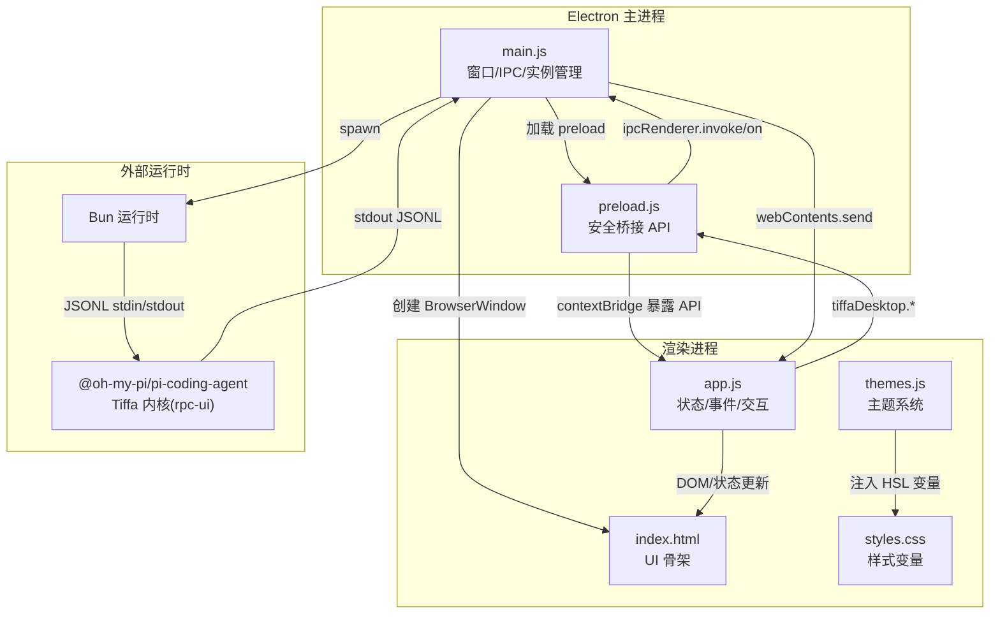
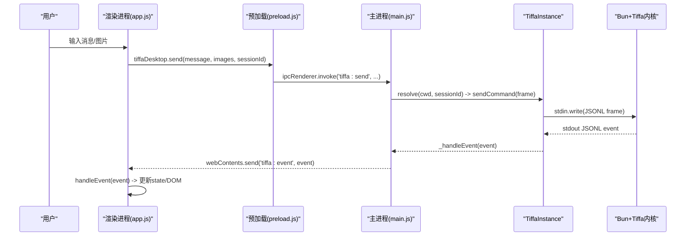
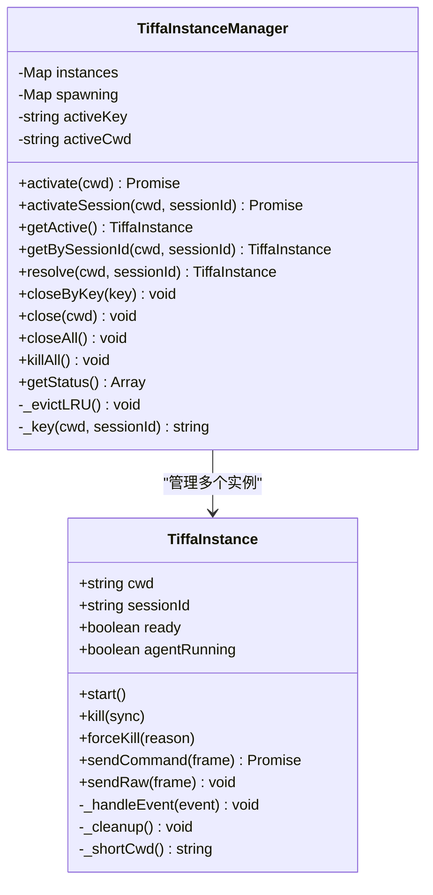
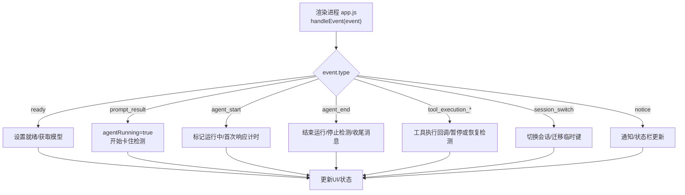
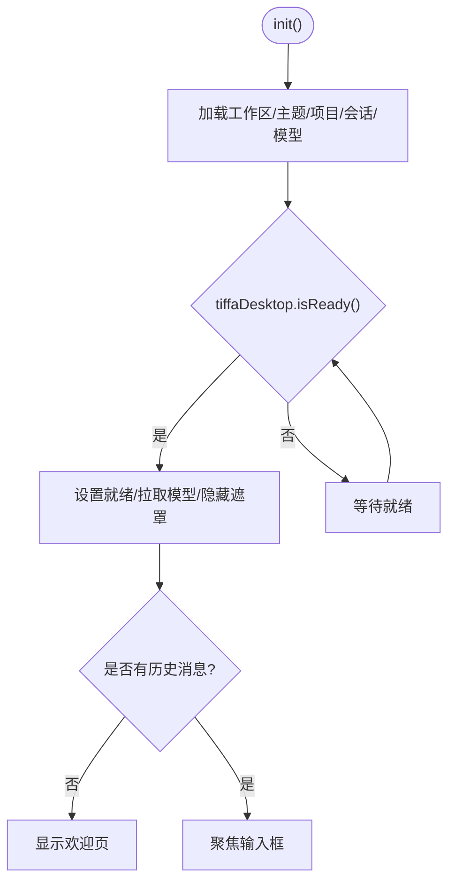
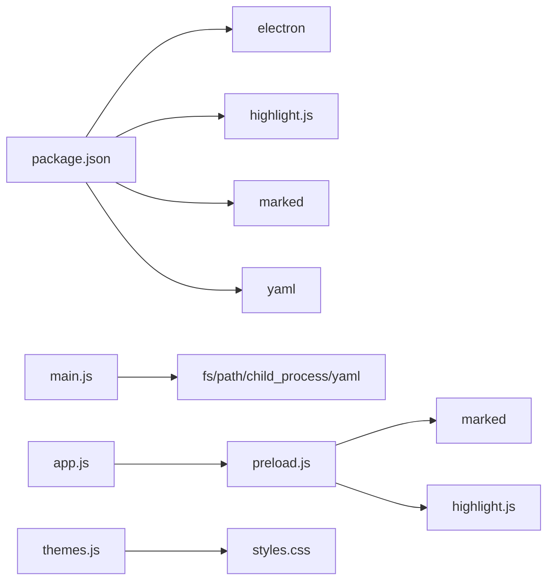

# 前端架构概览

<cite>
**本文引用的文件**   
- [electron/main.js](file://electron/main.js)
- [electron/preload.js](file://electron/preload.js)
- [electron/renderer/app.js](file://electron/renderer/app.js)
- [electron/renderer/index.html](file://electron/renderer/index.html)
- [electron/renderer/styles.css](file://electron/renderer/styles.css)
- [electron/renderer/themes.js](file://electron/renderer/themes.js)
- [electron/package.json](file://electron/package.json)
- [README.md](file://README.md)
</cite>

## 目录
1. [简介](#简介)
2. [项目结构](#项目结构)
3. [核心组件](#核心组件)
4. [架构总览](#架构总览)
5. [详细组件分析](#详细组件分析)
6. [依赖关系分析](#依赖关系分析)
7. [性能考量](#性能考量)
8. [故障排查指南](#故障排查指南)
9. [结论](#结论)
10. [附录](#附录)

## 简介
本文件面向开发者，系统化阐述 Tiffa 桌面端的前端架构与 Electron 渲染进程设计。重点覆盖：
- Electron 主进程与渲染进程的 IPC 通信协议、事件路由机制
- 多实例管理策略（项目级 + 对话级）
- 渲染进程状态管理与事件处理流程
- 应用初始化、生命周期、错误处理与调试方法
- 架构图、数据流图与关键代码路径指引

## 项目结构
Tiffa 的桌面端由 Electron 主进程、预加载脚本与渲染进程三部分组成，配合 Bun 运行时启动 Tiffa 内核子进程，通过 JSONL 协议进行进程间通信。

图表来源
- [electron/main.js:577-612](file://electron/main.js#L577-L612)
- [electron/preload.js:24-132](file://electron/preload.js#L24-L132)
- [electron/renderer/index.html:1-261](file://electron/renderer/index.html#L1-L261)
- [electron/renderer/app.js:378-481](file://electron/renderer/app.js#L378-L481)
- [electron/renderer/themes.js:1-200](file://electron/renderer/themes.js#L1-L200)
- [electron/renderer/styles.css:1-84](file://electron/renderer/styles.css#L1-L84)

章节来源
- [electron/package.json:1-75](file://electron/package.json#L1-L75)
- [README.md:1-214](file://README.md#L1-L214)

## 核心组件
- 主进程（main.js）
  - 窗口生命周期管理
  - IPC 路由与命令分发
  - TiffaInstance/TiffaInstanceManager：子进程生命周期、自动重启、LRU 淘汰、会话隔离
  - 文件系统、Shell、模型配置等能力封装
- 预加载脚本（preload.js）
  - 使用 contextBridge 暴露受控 API
  - 统一封装 ipcRenderer.invoke/on，屏蔽底层细节
- 渲染进程（app.js + index.html）
  - 全局 state 驱动 UI
  - 事件总线 handleEvent 分发
  - 最小化 DOM 操作与缓存（会话消息缓存、活跃 Tab 持久化）
  - 卡住检测、首次响应超时、崩溃恢复提示
- 主题系统（themes.js + styles.css）
  - HSL Token 体系，动态注入 :root 变量
  - 支持 7 套预设 × 3 种模式（light/dark/system）

章节来源
- [electron/main.js:76-319](file://electron/main.js#L76-L319)
- [electron/main.js:325-570](file://electron/main.js#L325-L570)
- [electron/preload.js:24-132](file://electron/preload.js#L24-L132)
- [electron/renderer/app.js:94-154](file://electron/renderer/app.js#L94-L154)
- [electron/renderer/app.js:484-646](file://electron/renderer/app.js#L484-L646)
- [electron/renderer/themes.js:1-200](file://electron/renderer/themes.js#L1-L200)
- [electron/renderer/styles.css:1-84](file://electron/renderer/styles.css#L1-L84)

## 架构总览
下图展示从用户输入到内核响应的完整调用链，以及事件回传渲染进程的路径。

图表来源
- [electron/preload.js:24-36](file://electron/preload.js#L24-L36)
- [electron/main.js:626-708](file://electron/main.js#L626-L708)
- [electron/main.js:207-303](file://electron/main.js#L207-L303)
- [electron/renderer/app.js:423-441](file://electron/renderer/app.js#L423-L441)
- [electron/renderer/app.js:484-646](file://electron/renderer/app.js#L484-L646)

## 详细组件分析

### 主进程：TiffaInstance 与多实例管理器
- TiffaInstance
  - 负责单个 Tiffa 子进程的启动、stdin/stdout 解析、命令发送与响应匹配、自动重启、清理
  - 事件过滤（embedding 预热噪音）、agent 运行状态标记、pendingCommands 超时控制
- TiffaInstanceManager
  - 维护 cwd#sessionId 维度的实例 Map，支持激活项目级/对话级实例
  - LRU 淘汰策略，避免过多实例占用资源
  - 提供 getActive/getBySessionId/resolve/closeByKey/close/kAll 等方法
  - 向渲染进程广播退出事件（含 autoRestarting/crashCount）

图表来源
- [electron/main.js:76-319](file://electron/main.js#L76-L319)
- [electron/main.js:325-570](file://electron/main.js#L325-L570)

章节来源
- [electron/main.js:76-319](file://electron/main.js#L76-L319)
- [electron/main.js:325-570](file://electron/main.js#L325-L570)

### IPC 通信协议与事件路由
- 预加载层（preload.js）
  - 通过 contextBridge.exposeInMainWorld 暴露 tiffaDesktop.* API
  - 将 invoke/on 映射到具体 channel，如 'tiffa:send'、'tiffa:event'、'tiffa:exited'
- 主进程层（main.js）
  - setupIpc() 注册所有 ipcMain.handle
  - 所有 Tiffa 命令通过 tiffaManager.resolve(cwd, sessionId) 路由到当前活跃实例或指定会话实例
  - 事件转发：子进程 stdout JSONL → _handleEvent → mainWindow.webContents.send('tiffa:event', event)
  - 退出事件：'tiffa:exited' 携带 code/signal/autoRestarting/crashCount 等字段
- 渲染进程层（app.js）
  - tiffaDesktop.onEvent(callback) 接收事件并进入 handleEvent
  - 按 event.type 分支处理：ready/prompt_result/agent_start/agent_end/tool_* 等
  - 多会话路由：根据 event._sessionId 与 state.activeSessionId 匹配，非活跃会话仅同步后台状态

图表来源
- [electron/preload.js:40-45](file://electron/preload.js#L40-L45)
- [electron/main.js:626-708](file://electron/main.js#L626-L708)
- [electron/main.js:252-303](file://electron/main.js#L252-L303)
- [electron/renderer/app.js:484-646](file://electron/renderer/app.js#L484-L646)

章节来源
- [electron/preload.js:24-132](file://electron/preload.js#L24-L132)
- [electron/main.js:616-958](file://electron/main.js#L616-L958)
- [electron/renderer/app.js:423-441](file://electron/renderer/app.js#L423-L441)
- [electron/renderer/app.js:484-646](file://electron/renderer/app.js#L484-L646)

### 渲染进程：状态管理与事件处理
- 全局 state
  - 包含 tiffaReady、agentRunning、lastEventTime、currentModel、会话/项目信息、预览面板、审批模式、待办阶段等
  - 会话级状态：sessionAgentRunning、instanceAgentRunning、sessionMessageCache、activeSessionPaths
- 事件处理
  - handleEvent 集中分发，按类型更新状态与 DOM
  - 卡住检测：120 秒无事件且 agent 仍在运行则提示可能卡住
  - 首次响应超时：30 秒无 agent 事件提示模型不可达
  - 会话切换：迁移 __new__ 临时路径到真实 sessionPath，保持状态一致性
- UI 初始化
  - init() 加载工作区、主题、项目列表、会话、模型配置，完成后移除启动遮罩
  - 监听本地文件链接点击，调用 shell.openPath 打开

图表来源
- [electron/renderer/app.js:378-481](file://electron/renderer/app.js#L378-L481)
- [electron/renderer/app.js:484-646](file://electron/renderer/app.js#L484-L646)

章节来源
- [electron/renderer/app.js:94-154](file://electron/renderer/app.js#L94-L154)
- [electron/renderer/app.js:378-481](file://electron/renderer/app.js#L378-L481)
- [electron/renderer/app.js:484-646](file://electron/renderer/app.js#L484-L646)

### 主题系统与样式
- themes.js
  - 定义多套主题（Eucalyptus/Claude/Breeze 等），每套包含 light/dark 两套配色
  - 颜色以 HSL Token 形式组织，运行时注入 <style>:root 变量
- styles.css
  - 基于 HSL 变量的全局样式，兼容旧 hex 别名
  - 布局：左侧项目栏、顶部标题栏、会话标签、聊天区域、侧边栏（文件树/Todo/预览）

章节来源
- [electron/renderer/themes.js:1-200](file://electron/renderer/themes.js#L1-L200)
- [electron/renderer/styles.css:1-200](file://electron/renderer/styles.css#L1-L200)

## 依赖关系分析
- 包依赖（package.json）
  - electron 框架、highlight.js（代码高亮）、marked（Markdown 解析）、yaml（YAML 配置读写）
  - 构建产物打包为便携版，包含 npm-global、plugins、data、home、workspace 等资源
- 模块耦合
  - main.js 依赖 child_process、fs、path、yaml、js-yaml
  - preload.js 依赖 marked/hljs，用于 Markdown 渲染与代码高亮
  - app.js 依赖 tiffaDesktop API，不直接访问 Node 模块
  - themes.js 与 styles.css 通过 CSS 变量解耦主题与样式

图表来源
- [electron/package.json:16-21](file://electron/package.json#L16-L21)
- [electron/main.js:8-14](file://electron/main.js#L8-L14)
- [electron/preload.js:8-22](file://electron/preload.js#L8-L22)

章节来源
- [electron/package.json:16-21](file://electron/package.json#L16-L21)
- [electron/main.js:8-14](file://electron/main.js#L8-L14)
- [electron/preload.js:8-22](file://electron/preload.js#L8-L22)

## 性能考量
- 子进程管理
  - LRU 淘汰限制最大实例数（MAX_INSTANCES=8），避免内存膨胀
  - 自动重启上限（maxCrashRestart=3），防止频繁崩溃导致抖动
- 渲染性能
  - 会话消息缓存（sessionMessageCache）减少切换时的重绘成本
  - minimap 使用 Canvas 绘制密度滚动条，批量绘制降低 DOM 操作开销
  - 历史加载禁用高亮（markedNoHighlight），避免长会话卡顿
- 网络与 IO
  - 首次响应超时与卡住检测提升用户体验
  - 文件读取/写入通过主进程统一封装，避免渲染进程直接访问 fs

[本节为通用指导，无需特定文件引用]

## 故障排查指南
- 常见问题定位
  - 子进程异常退出：查看 'tiffa:exited' 事件中的 code/signal/autoRestarting/crashCount
  - 命令超时：检查 pendingCommands 是否被清理，确认子进程 stdin 可写
  - 事件未到达渲染进程：确认 _handleEvent 是否正确附加 _cwd/_sessionId，并过滤预热噪音
  - 会话切换状态不一致：检查 __new__ 迁移逻辑与 sessionMessageCache 迁移
- 调试建议
  - 开发模式启用 DevTools：--dev/--verbose
  - 打印 stderr：主进程对子进程 stderr 输出进行日志记录
  - 诊断接口：tiffa:diagnostics 返回 ready/agentRunning/cwd/pid/stdinWritable/pendingCommands

章节来源
- [electron/main.js:144-173](file://electron/main.js#L144-L173)
- [electron/main.js:252-303](file://electron/main.js#L252-L303)
- [electron/main.js:756-768](file://electron/main.js#L756-L768)
- [electron/renderer/app.js:703-730](file://electron/renderer/app.js#L703-L730)

## 结论
Tiffa 前端采用清晰的三层架构：主进程负责实例与 IPC、预加载层提供安全 API、渲染进程专注状态与交互。通过 JSONL 协议与 Bun 运行时高效对接 Tiffa 内核，结合 LRU 与自动重启策略保障稳定性；渲染进程以全局 state 驱动 UI，具备完善的错误检测与调试能力。该设计便于扩展新能力（如新增 IPC 通道、会话功能、主题等），同时保持低耦合与高性能。

[本节为总结性内容，无需特定文件引用]

## 附录
- 启动与开发
  - 双击 tiffa-desktop.exe 或 vbs 启动
  - 开发模式：cd electron && npm start -- --dev
- 关键入口
  - 主进程入口：electron/main.js
  - 预加载桥接：electron/preload.js
  - 渲染入口：electron/renderer/index.html + app.js

章节来源
- [README.md:198-208](file://README.md#L198-L208)
- [electron/package.json:6-10](file://electron/package.json#L6-L10)