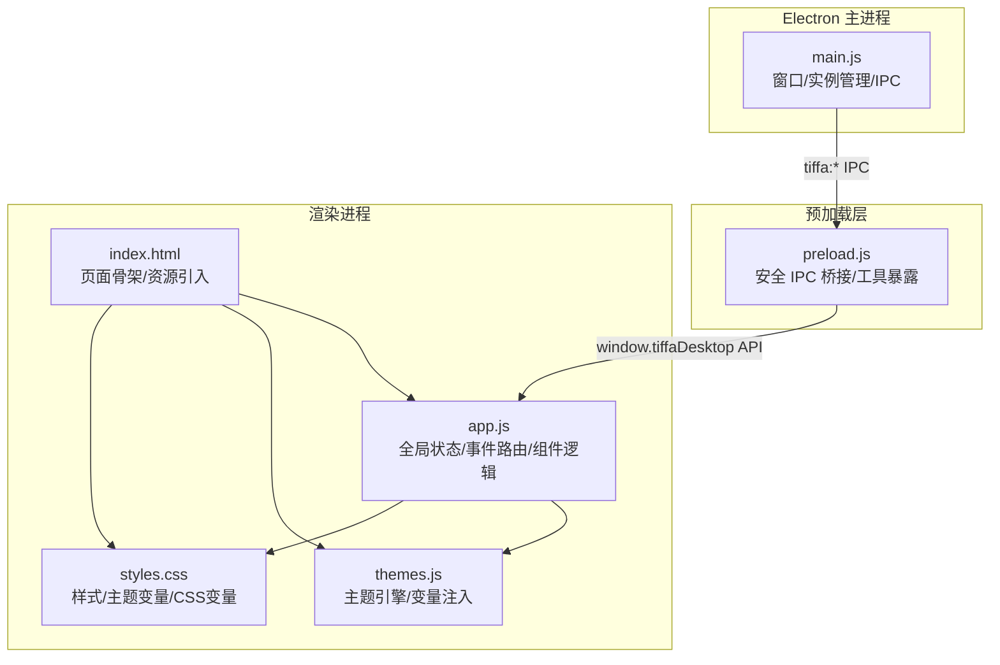
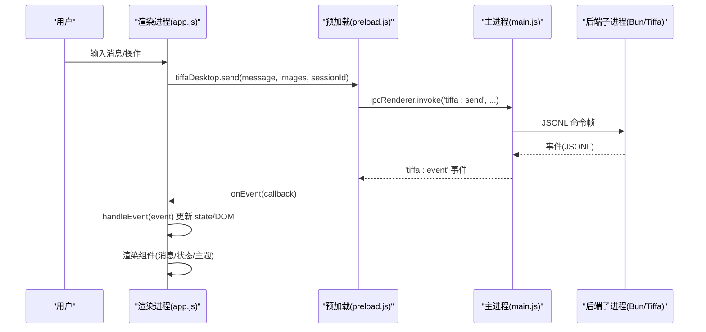
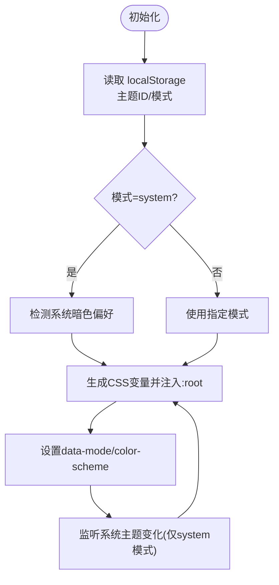
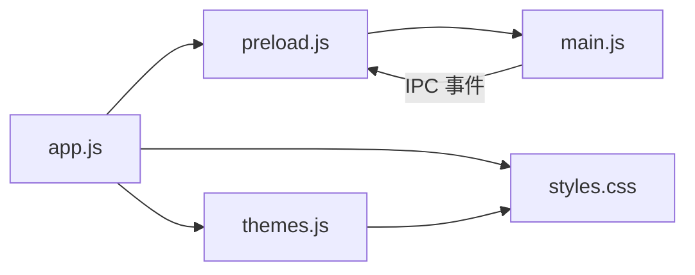

# 用户界面

<cite>
**本文引用的文件**
- [electron/main.js](file://electron/main.js)
- [electron/preload.js](file://electron/preload.js)
- [electron/renderer/index.html](file://electron/renderer/index.html)
- [electron/renderer/app.js](file://electron/renderer/app.js)
- [electron/renderer/themes.js](file://electron/renderer/themes.js)
- [electron/renderer/styles.css](file://electron/renderer/styles.css)
</cite>

## 目录
1. [简介](#简介)
2. [项目结构](#项目结构)
3. [核心组件](#核心组件)
4. [架构总览](#架构总览)
5. [详细组件分析](#详细组件分析)
6. [依赖关系分析](#依赖关系分析)
7. [性能考量](#性能考量)
8. [故障排查指南](#故障排查指南)
9. [结论](#结论)
10. [附录：主题与样式定制指南](#附录：主题与样式定制指南)

## 简介
本文件面向 Tiffa 桌面端的前端用户界面，聚焦 Electron 渲染进程中的 React/原生混合 UI、状态管理、主题系统与样式架构。文档将深入解释：
- 7 套预设主题的切换机制与日夜模式实现
- 响应式设计与多屏适配
- 主要界面组件：项目侧栏、会话标签、模型选择器、文件浏览器、Diff 视图（预览）、Todo 面板的功能与用法
- 界面定制指南、CSS 变量使用与主题开发最佳实践

## 项目结构
Tiffa 的 UI 位于 electron/renderer 目录，采用“HTML + CSS + 单页 JS”组织，配合 Electron 主进程与预加载脚本完成 IPC 通信与系统能力桥接。

图表来源
- [electron/main.js:576-612](file://electron/main.js#L576-L612)
- [electron/preload.js:24-132](file://electron/preload.js#L24-L132)
- [electron/renderer/index.html:1-261](file://electron/renderer/index.html#L1-L261)
- [electron/renderer/app.js:378-481](file://electron/renderer/app.js#L378-L481)
- [electron/renderer/themes.js:459-633](file://electron/renderer/themes.js#L459-L633)
- [electron/renderer/styles.css:8-84](file://electron/renderer/styles.css#L8-L84)

章节来源
- [electron/renderer/index.html:1-261](file://electron/renderer/index.html#L1-L261)
- [electron/renderer/app.js:378-481](file://electron/renderer/app.js#L378-L481)

## 核心组件
- 项目侧栏：展示项目列表、历史对话区、底部主题与设置按钮；支持折叠与右键菜单。
- 会话标签：顶部多 Tab 管理，支持新建、关闭、消息计数与标题同步。
- 聊天区：消息流、输入框、图片拖拽、发送/中止、排队提示、最小化滚动条（Minimap）。
- 右侧边栏：文件树、Todo 面板、预览区（含多标签），支持折叠与尺寸调整。
- 设置浮层：模型配置、当前模型切换、主题风格与日夜模式、约束规则编辑。
- 模型快速切换器：搜索、分组、选中高亮。
- 扩展模态对话框：统一替代 prompt/confirm，支持文本输入与选项选择。

章节来源
- [electron/renderer/index.html:20-255](file://electron/renderer/index.html#L20-L255)
- [electron/renderer/styles.css:104-227](file://electron/renderer/styles.css#L104-L227)
- [electron/renderer/styles.css:569-689](file://electron/renderer/styles.css#L569-L689)
- [electron/renderer/styles.css:698-978](file://electron/renderer/styles.css#L698-L978)
- [electron/renderer/styles.css:2200-2288](file://electron/renderer/styles.css#L2200-L2288)
- [electron/renderer/styles.css:2374-2468](file://electron/renderer/styles.css#L2374-L2468)
- [electron/renderer/styles.css:2554-2637](file://electron/renderer/styles.css#L2554-L2637)
- [electron/renderer/styles.css:2639-2719](file://electron/renderer/styles.css#L2639-L2719)

## 架构总览
Tiffa 前端采用“渲染进程集中式状态 + 事件驱动更新”的模式：
- 全局 state 对象维护应用状态（项目、会话、模型、UI 开关等）
- 通过 tiffaDesktop 暴露的 IPC API 与主进程交互
- 主进程转发后端子进程事件到渲染进程，渲染进程根据事件类型更新 UI
- 主题系统通过动态注入 CSS 变量到 :root，实现即时换肤与日夜模式

图表来源
- [electron/renderer/app.js:423-481](file://electron/renderer/app.js#L423-L481)
- [electron/preload.js:24-44](file://electron/preload.js#L24-L44)
- [electron/main.js:627-708](file://electron/main.js#L627-L708)

章节来源
- [electron/renderer/app.js:423-481](file://electron/renderer/app.js#L423-L481)
- [electron/preload.js:24-44](file://electron/preload.js#L24-L44)
- [electron/main.js:627-708](file://electron/main.js#L627-L708)

## 详细组件分析

### 主题系统与样式架构
- 主题预设：内置 7 套主题（Eucalyptus、Claude、Breeze、Sakura、Ocean、Dracula、Obsidian），每套包含 light/dark 两套配色。
- 日夜模式：支持 system/light/dark 三种模式，system 模式下自动跟随系统偏好。
- 变量注入：运行时将 HSL Token 转换为 CSS 变量并注入 <style id="tiffa-theme-vars"> 到 :root，同时设置 data-mode 与 color-scheme。
- 兼容别名：提供旧版 hex 变量名映射，确保历史组件不受影响。
- 样式分层：基础变量定义在 styles.css，主题变量由 themes.js 动态覆盖。

图表来源
- [electron/renderer/themes.js:459-633](file://electron/renderer/themes.js#L459-L633)
- [electron/renderer/styles.css:8-84](file://electron/renderer/styles.css#L8-L84)

章节来源
- [electron/renderer/themes.js:443-676](file://electron/renderer/themes.js#L443-L676)
- [electron/renderer/styles.css:8-84](file://electron/renderer/styles.css#L8-L84)

### 项目侧栏
- 功能：项目列表、刷新、新建项目、历史对话区、主题与设置按钮。
- 交互：折叠/展开、右键菜单、活跃项高亮、会话数显示。
- 样式：固定宽度、可折叠为图标模式，使用 CSS 变量控制颜色与边框。

章节来源
- [electron/renderer/index.html:22-49](file://electron/renderer/index.html#L22-L49)
- [electron/renderer/styles.css:104-227](file://electron/renderer/styles.css#L104-L227)

### 会话标签
- 功能：多会话 Tab 管理，支持新建、关闭、消息计数、标题同步。
- 持久化：活跃 Tab 列表持久化到 localStorage，重启后恢复。
- 事件：session_switch 事件更新 activeSessionPath 与 activeSessionId。

章节来源
- [electron/renderer/index.html:72-78](file://electron/renderer/index.html#L72-L78)
- [electron/renderer/app.js:599-646](file://electron/renderer/app.js#L599-L646)

### 聊天区与 Minimap
- 功能：消息流渲染、输入框、图片拖拽、发送/中止、排队提示、XML 翻译开关。
- Minimap：基于 Canvas 绘制消息密度滚动条，支持点击/拖拽跳转，按 user/assistant 着色。
- 性能：MutationObserver + ResizeObserver 触发重绘，requestAnimationFrame 节流。

章节来源
- [electron/renderer/index.html:82-111](file://electron/renderer/index.html#L82-L111)
- [electron/renderer/app.js:258-375](file://electron/renderer/app.js#L258-L375)
- [electron/renderer/styles.css:980-1000](file://electron/renderer/styles.css#L980-L1000)

### 右侧边栏（文件树、Todo、预览）
- 文件树：递归渲染、展开/折叠、大小显示、激活高亮。
- Todo 面板：接收 set_todos/tool_execution_end 事件更新 phases，支持折叠与计数。
- 预览区：多标签预览 HTML/图片，支持关闭与分隔线拖拽调整高度。

章节来源
- [electron/renderer/index.html:115-162](file://electron/renderer/index.html#L115-L162)
- [electron/renderer/styles.css:763-978](file://electron/renderer/styles.css#L763-L978)
- [electron/renderer/app.js:557-567](file://electron/renderer/app.js#L557-L567)

### 设置浮层与模型配置
- 模型配置：读取/写入 models.yml，添加供应商、删除、重启 Tiffa。
- 当前模型：获取可用模型列表，支持搜索与分组。
- 主题风格：预设列表与日夜模式切换。
- 约束规则：打开 constraints.md 进行编辑。

章节来源
- [electron/renderer/index.html:172-227](file://electron/renderer/index.html#L172-L227)
- [electron/preload.js:82-87](file://electron/preload.js#L82-L87)
- [electron/main.js:748-755](file://electron/main.js#L748-L755)

### 模型快速切换器
- 功能：搜索过滤、分组显示、选中高亮、键盘导航。
- 交互：点击切换当前模型，支持 per-session 记忆。

章节来源
- [electron/renderer/index.html:229-236](file://electron/renderer/index.html#L229-L236)
- [electron/renderer/styles.css:2639-2719](file://electron/renderer/styles.css#L2639-L2719)

### 扩展模态对话框
- 功能：统一替代 prompt/confirm，支持文本输入、选项选择、取消/确认。
- 样式：玻璃态背景、圆角面板、动画进入。

章节来源
- [electron/renderer/index.html:238-248](file://electron/renderer/index.html#L238-L248)
- [electron/renderer/styles.css:2290-2366](file://electron/renderer/styles.css#L2290-L2366)

## 依赖关系分析
- 渲染进程依赖 preload 暴露的 tiffaDesktop API 进行 IPC 调用。
- main.js 负责窗口生命周期、Tiffa 子进程管理与 IPC 路由。
- app.js 作为渲染进程入口，初始化 DOM 引用、事件监听、主题系统、侧边栏、预览等模块。
- themes.js 提供主题数据与变量注入逻辑。
- styles.css 定义所有样式与 CSS 变量，themes.js 动态覆盖。

图表来源
- [electron/renderer/app.js:378-481](file://electron/renderer/app.js#L378-L481)
- [electron/preload.js:24-132](file://electron/preload.js#L24-L132)
- [electron/main.js:616-800](file://electron/main.js#L616-L800)
- [electron/renderer/themes.js:459-633](file://electron/renderer/themes.js#L459-L633)
- [electron/renderer/styles.css:8-84](file://electron/renderer/styles.css#L8-L84)

章节来源
- [electron/renderer/app.js:378-481](file://electron/renderer/app.js#L378-L481)
- [electron/preload.js:24-132](file://electron/preload.js#L24-L132)
- [electron/main.js:616-800](file://electron/main.js#L616-L800)

## 性能考量
- Minimap 使用 Canvas 绘制，避免大量 DOM 操作，利用 requestAnimationFrame 与防抖重绘。
- 历史加载禁用高亮，仅在可见时按需高亮，避免长会话卡顿。
- 事件处理中区分活跃会话与非活跃会话，减少不必要的渲染。
- 主题切换仅更新 CSS 变量，无全量重排。

章节来源
- [electron/renderer/app.js:258-375](file://electron/renderer/app.js#L258-L375)
- [electron/preload.js:106-126](file://electron/preload.js#L106-L126)
- [electron/renderer/themes.js:588-609](file://electron/renderer/themes.js#L588-L609)

## 故障排查指南
- 连接问题：检查 isReady 状态与 ready 事件，确认主进程与子进程通信正常。
- 模型不可达：首次响应超时提示，检查网络与模型服务。
- 进程崩溃：自动重启机制，超过上限后停止，需手动干预。
- 主题不生效：确认 localStorage 键值迁移与 CSS 变量注入。

章节来源
- [electron/renderer/app.js:648-730](file://electron/renderer/app.js#L648-L730)
- [electron/main.js:144-178](file://electron/main.js#L144-L178)
- [electron/renderer/themes.js:466-477](file://electron/renderer/themes.js#L466-L477)

## 结论
Tiffa 的用户界面以简洁高效的架构实现了强大的 AI 协作体验。通过集中式状态管理、事件驱动更新与灵活的 theme 系统，用户在多项目、多会话场景下获得流畅的操作体验。主题系统支持 7 套预设与日夜模式，样式架构清晰可扩展，便于二次定制。

## 附录：主题与样式定制指南
- 新增主题：在 themes.js 中添加新的 ThemePreset（light/dark），并在 THEME_PRESETS 注册。
- 自定义变量：在 styles.css 中扩展 CSS 变量，或通过 themes.js 的 themeColorsToCSSVars 注入。
- 日夜模式：遵循 system/light/dark 三种模式，确保兼容性。
- 最佳实践：
  - 使用 HSL Token 而非硬编码颜色
  - 保持变量命名一致性与语义化
  - 避免在组件中直接修改 CSS 变量，通过主题系统统一管理
  - 测试不同主题下的对比度与可读性

章节来源
- [electron/renderer/themes.js:443-676](file://electron/renderer/themes.js#L443-L676)
- [electron/renderer/styles.css:8-84](file://electron/renderer/styles.css#L8-L84)