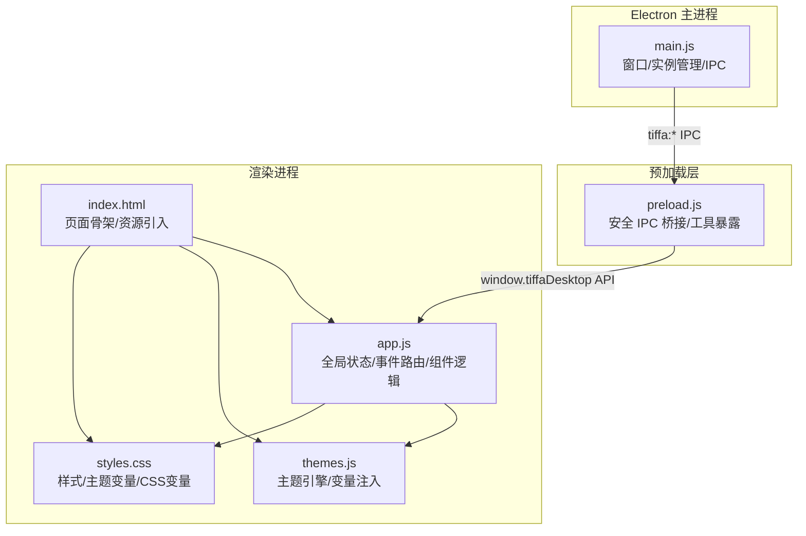
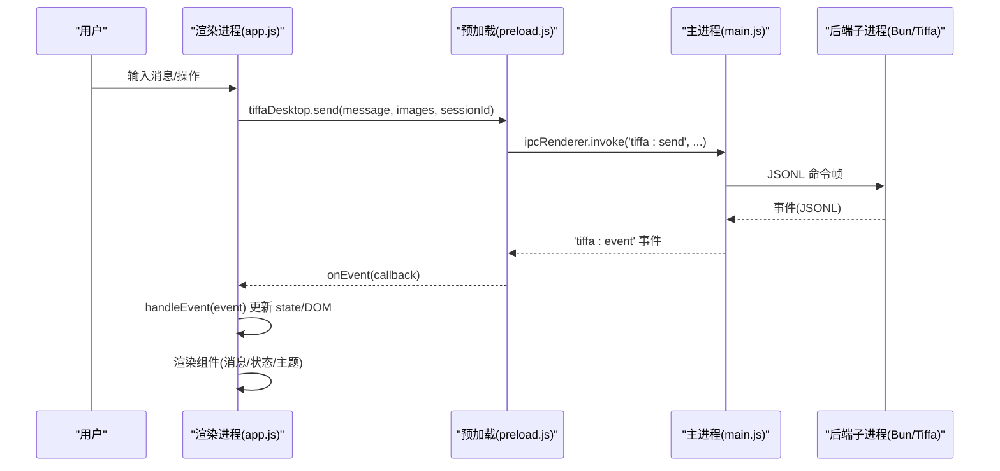
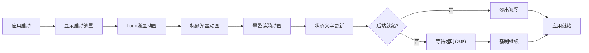
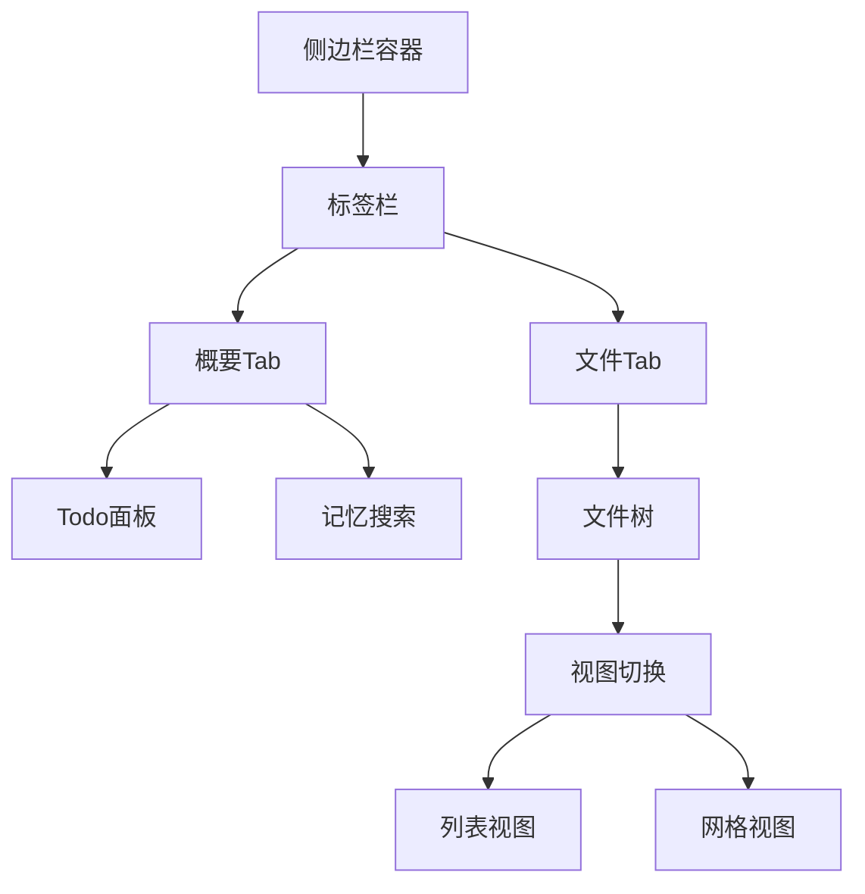
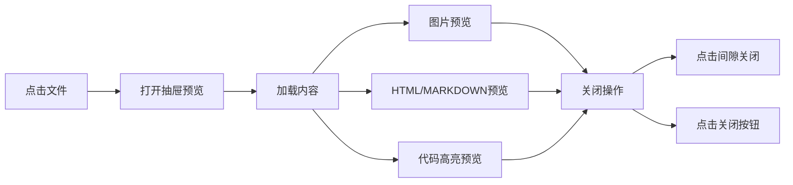
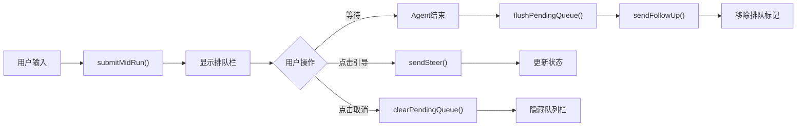
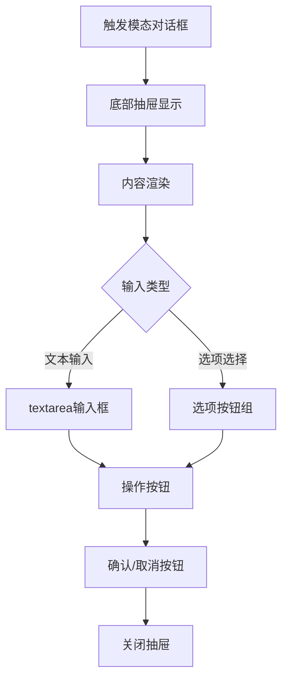
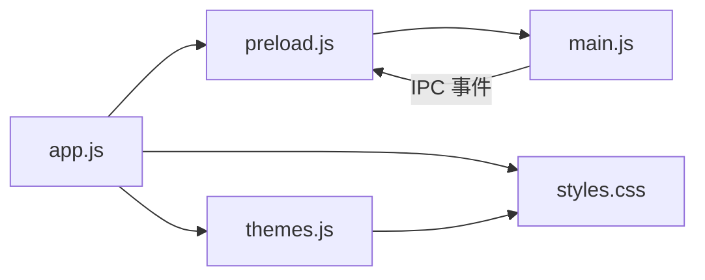

# 用户界面

<cite>
**本文引用的文件**
- [electron/main.js](file://electron/main.js)
- [electron/preload.js](file://electron/preload.js)
- [electron/renderer/index.html](file://electron/renderer/index.html)
- [electron/renderer/app.js](file://electron/renderer/app.js)
- [electron/renderer/themes.js](file://electron/renderer/themes.js)
- [electron/renderer/styles.css](file://electron/renderer/styles.css)
</cite>

## 更新摘要
**变更内容**
- 模态对话框系统完全重新设计，从居中弹窗改为底部抽屉样式（.ext-modal-panel类），720px宽度，圆角顶部，平滑动画效果
- 增强了会话标签页样式（最大宽度120px），隐藏消息计数徽章
- 改进了抽屉交互（点击背景区域关闭预览面板）
- 优化了扩展模态对话框的视觉设计和用户体验

## 目录
1. [简介](#简介)
2. [项目结构](#项目结构)
3. [核心组件](#核心组件)
4. [架构总览](#架构总览)
5. [详细组件分析](#详细组件分析)
6. [依赖关系分析](#依赖关系分析)
7. [性能考量](#性能考量)
8. [故障排查指南](#故障排查指南)
9. [结论](#结论)
10. [附录：主题与样式定制指南](#附录：主题与样式定制指南)

## 简介
本文件面向 Tiffa 桌面端的前端用户界面，聚焦 Electron 渲染进程中的 React/原生混合 UI、状态管理、主题系统与样式架构。文档将深入解释：
- 7 套预设主题的切换机制与日夜模式实现
- 响应式设计与多屏适配
- 主要界面组件：项目侧栏、会话标签、模型选择器、文件浏览器、Diff 视图（预览）、Todo 面板的功能与用法
- **新增**：右侧边栏标签式导航、抽屉式预览系统、网格视图支持、内存搜索集成、全新启动动画系统
- **更新**：重新设计的底部抽屉式模态对话框系统，增强的会话标签页样式，改进的抽屉交互体验
- 界面定制指南、CSS 变量使用与主题开发最佳实践

## 项目结构
Tiffa 的 UI 位于 electron/renderer 目录，采用"HTML + CSS + 单页 JS"组织，配合 Electron 主进程与预加载脚本完成 IPC 通信与系统能力桥接。



**图表来源**
- [electron/main.js:576-612](file://electron/main.js#L576-L612)
- [electron/preload.js:24-132](file://electron/preload.js#L24-L132)
- [electron/renderer/index.html:1-279](file://electron/renderer/index.html#L1-L279)
- [electron/renderer/app.js:387-530](file://electron/renderer/app.js#L387-L530)
- [electron/renderer/themes.js:459-633](file://electron/renderer/themes.js#L459-L633)
- [electron/renderer/styles.css:8-84](file://electron/renderer/styles.css#L8-L84)

**章节来源**
- [electron/renderer/index.html:1-279](file://electron/renderer/index.html#L1-L279)
- [electron/renderer/app.js:387-530](file://electron/renderer/app.js#L387-L530)

## 核心组件
- **项目侧栏**：展示项目列表、历史对话区、底部主题与设置按钮；支持折叠与右键菜单。
- **会话标签**：顶部多 Tab 管理，支持新建、关闭、消息计数与标题同步。**更新**：增强的样式支持，最大宽度120px，隐藏消息计数徽章。
- **聊天区**：消息流、输入框、图片拖拽、发送/中止、排队提示、最小化滚动条（Minimap）。
- **右侧边栏**：**新增**标签页界面（概要/文件），抽屉式预览系统，网格视图支持。
- **设置浮层**：模型配置、当前模型切换、主题风格与日夜模式、约束规则编辑。
- **模型快速切换器**：搜索、分组、选中高亮。
- **扩展模态对话框**：**重新设计**为底部抽屉样式，统一替代 prompt/confirm，支持文本输入与选项选择。
- **启动屏幕**：**全新设计**全屏遮罩，显示启动状态、进度信息和墨晕涟漪动画。

**章节来源**
- [electron/renderer/index.html:13-279](file://electron/renderer/index.html#L13-L279)
- [electron/renderer/styles.css:776-1273](file://electron/renderer/styles.css#L776-L1273)
- [electron/renderer/styles.css:2004-2086](file://electron/renderer/styles.css#L2004-L2086)

## 架构总览
Tiffa 前端采用"渲染进程集中式状态 + 事件驱动更新"的模式：
- 全局 state 对象维护应用状态（项目、会话、模型、UI 开关等）
- 通过 tiffaDesktop 暴露的 IPC API 与主进程交互
- 主进程转发后端子进程事件到渲染进程，渲染进程根据事件类型更新 UI
- 主题系统通过动态注入 CSS 变量到 :root，实现即时换肤与日夜模式



**图表来源**
- [electron/renderer/app.js:437-464](file://electron/renderer/app.js#L437-L464)
- [electron/preload.js:24-44](file://electron/preload.js#L24-L44)
- [electron/main.js:627-708](file://electron/main.js#L627-L708)

**章节来源**
- [electron/renderer/app.js:437-464](file://electron/renderer/app.js#L437-L464)
- [electron/preload.js:24-44](file://electron/preload.js#L24-L44)
- [electron/main.js:627-708](file://electron/main.js#L627-L708)

## 详细组件分析

### 主题系统与样式架构
- **主题预设**：内置 7 套主题（Eucalyptus、Claude、Breeze、Sakura、Ocean、Dracula、Obsidian），每套包含 light/dark 两套配色。
- **日夜模式**：支持 system/light/dark 三种模式，system 模式下自动跟随系统偏好。
- **变量注入**：运行时将 HSL Token 转换为 CSS 变量并注入 <style id="tiffa-theme-vars"> 到 :root，同时设置 data-mode 与 color-scheme。
- **兼容别名**：提供旧版 hex 变量名映射，确保历史组件不受影响。
- **样式分层**：基础变量定义在 styles.css，主题变量由 themes.js 动态覆盖。


**图表来源**
- [electron/renderer/themes.js:459-633](file://electron/renderer/themes.js#L459-L633)
- [electron/renderer/styles.css:8-84](file://electron/renderer/styles.css#L8-L84)

**章节来源**
- [electron/renderer/themes.js:443-676](file://electron/renderer/themes.js#L443-676)
- [electron/renderer/styles.css:8-84](file://electron/renderer/styles.css#L8-L84)

### 全新启动动画系统
- **全屏遮罩**：启动时显示全屏覆盖层，包含Logo、标题、加载动画和状态消息。
- **墨晕涟漪效果**：三层涟漪动画，中心呼吸灯效果，营造科技感启动体验。
- **状态更新**：实时显示"静候枰开…"、"凝心定神…"、"阅览旧谱…"等状态信息。
- **超时处理**：最多等待20秒，超时后仍允许进入但提示未就绪。
- **平滑过渡**：加载完成后淡出效果，避免用户过早操作。



**图表来源**
- [electron/renderer/index.html:13-24](file://electron/renderer/index.html#L13-L24)
- [electron/renderer/app.js:494-524](file://electron/renderer/app.js#L494-L524)
- [electron/renderer/styles.css:2004-2086](file://electron/renderer/styles.css#L2004-L2086)

**章节来源**
- [electron/renderer/index.html:13-24](file://electron/renderer/index.html#L13-L24)
- [electron/renderer/app.js:494-524](file://electron/renderer/app.js#L494-L524)
- [electron/renderer/styles.css:2004-2086](file://electron/renderer/styles.css#L2004-L2086)

### 右侧边栏标签式导航
- **标签页界面**：**新增**侧边栏顶部标签栏，支持"概要"和"文件"两个Tab切换。
- **概要Tab**：包含Todo面板和项目记忆搜索功能，支持实时搜索与结果召回。
- **文件Tab**：传统文件树浏览，支持递归展开/折叠、大小显示、激活高亮。
- **视图切换**：提供列表/网格视图按钮，支持独立的状态保存。
- **智能切换**：点击"文件浏览"按钮时自动切换到"文件"Tab。



**图表来源**
- [electron/renderer/index.html:121-167](file://electron/renderer/index.html#L121-L167)
- [electron/renderer/app.js:3396-3467](file://electron/renderer/app.js#L3396-L3467)
- [electron/renderer/styles.css:776-821](file://electron/renderer/styles.css#L776-L821)

**章节来源**
- [electron/renderer/index.html:121-167](file://electron/renderer/index.html#L121-L167)
- [electron/renderer/app.js:3396-3467](file://electron/renderer/app.js#L3396-L3467)
- [electron/renderer/styles.css:776-821](file://electron/renderer/styles.css#L776-L821)

### 抽屉式预览系统
- **滑动动画**：从右侧滑出的预览面板，带平滑的 transform 动画效果。
- **间隙点击关闭**：左侧留14px间隙，点击间隙区域可关闭预览。
- **多种文件支持**：图片全尺寸显示、HTML/Markdown用iframe渲染、代码文件语法高亮。
- **异步加载**：图片缩略图懒加载，带缓存机制提升性能。
- **视觉反馈**：打开时显示阴影和半透明背景，关闭时平滑回收。



**图表来源**
- [electron/renderer/index.html:169-179](file://electron/renderer/index.html#L169-L179)
- [electron/renderer/app.js:3656-3694](file://electron/renderer/app.js#L3656-3694)
- [electron/renderer/styles.css:977-1060](file://electron/renderer/styles.css#L977-L1060)

**章节来源**
- [electron/renderer/index.html:169-179](file://electron/renderer/index.html#L169-L179)
- [electron/renderer/app.js:3656-3694](file://electron/renderer/app.js#L3656-3694)
- [electron/renderer/styles.css:977-1060](file://electron/renderer/styles.css#L977-L1060)

### 网格视图支持
- **双模式切换**：列表视图和网格视图可自由切换，状态持久化存储。
- **缩略图显示**：图片文件显示缩略图，非图片文件显示图标。
- **自适应布局**：三列网格布局，支持不同屏幕尺寸。
- **性能优化**：缩略图异步加载，带缓存机制限制最大100条。
- **视觉区分**：悬停效果、边框高亮、尺寸信息显示。

```mermaid
flowchart TD
ListView["列表视图"] <- --> GridSwitch["视图切换按钮"]
GridSwitch --> GridView["网格视图"]
GridView --> ThumbnailLoad["缩略图加载"]
ThumbnailLoad --> CacheCheck{"缓存检查"}
CacheCheck --> |命中| ShowCached["显示缓存缩略图"]
CacheCheck --> |未命中| LoadFromDisk["从磁盘加载"]
LoadFromDisk --> CacheStore["存入缓存"]
CacheStore --> ShowThumbnail["显示缩略图"]
```

**图表来源**
- [electron/renderer/app.js:3576-3628](file://electron/renderer/app.js#L3576-L3628)
- [electron/renderer/styles.css:1157-1273](file://electron/renderer/styles.css#L1157-L1273)

**章节来源**
- [electron/renderer/app.js:3576-3628](file://electron/renderer/app.js#L3576-L3628)
- [electron/renderer/styles.css:1157-1273](file://electron/renderer/styles.css#L1157-L1273)

### 待处理队列栏功能
- **排队机制**：在AI生成过程中，用户可通过Enter键将消息加入队列。
- **队列显示**：输入区域上方显示排队消息，支持替换和取消操作。
- **引导功能**：提供"立即引导"按钮，跳过剩余工具执行直接干预。
- **自动发送**：Agent结束后自动发送排队消息作为follow_up。
- **视觉反馈**：不同状态的视觉区分，包括排队中、已引导等状态。



**图表来源**
- [electron/renderer/app.js:3261-3317](file://electron/renderer/app.js#L3261-L3317)
- [electron/renderer/index.html:100-104](file://electron/renderer/index.html#L100-L104)
- [electron/renderer/styles.css:1669-1714](file://electron/renderer/styles.css#L1669-L1714)

**章节来源**
- [electron/renderer/index.html:100-104](file://electron/renderer/index.html#L100-L104)
- [electron/renderer/app.js:3261-3317](file://electron/renderer/app.js#L3261-L3317)
- [electron/renderer/styles.css:1669-1714](file://electron/renderer/styles.css#L1669-L1714)

### 项目侧栏
- **功能**：项目列表、刷新、新建项目、历史对话区、主题与设置按钮。
- **交互**：折叠/展开、右键菜单、活跃项高亮、会话数显示。
- **样式**：固定宽度、可折叠为图标模式，使用 CSS 变量控制颜色与边框。

**章节来源**
- [electron/renderer/index.html:27-55](file://electron/renderer/index.html#L27-L55)
- [electron/renderer/styles.css:104-227](file://electron/renderer/styles.css#L104-L227)

### 会话标签
- **功能**：多会话 Tab 管理，支持新建、关闭、消息计数、标题同步。
- **持久化**：活跃 Tab 列表持久化到 localStorage，重启后恢复。
- **事件**：session_switch 事件更新 activeSessionPath 与 activeSessionId。
- **更新**：**增强样式支持**，最大宽度120px，隐藏消息计数徽章以节省空间。

**章节来源**
- [electron/renderer/index.html:78-84](file://electron/renderer/index.html#L78-L84)
- [electron/renderer/app.js:599-646](file://electron/renderer/app.js#L599-L646)
- [electron/renderer/styles.css:649-678](file://electron/renderer/styles.css#L649-L678)

### 聊天区与 Minimap
- **功能**：消息流渲染、输入框、图片拖拽、发送/中止、排队提示、XML 翻译开关。
- **Minimap**：基于 Canvas 绘制消息密度滚动条，支持点击/拖拽跳转，按 user/assistant 着色。
- **性能**：MutationObserver + ResizeObserver 触发重绘，requestAnimationFrame 节流。

**章节来源**
- [electron/renderer/index.html:86-117](file://electron/renderer/index.html#L86-L117)
- [electron/renderer/app.js:267-384](file://electron/renderer/app.js#L267-L384)
- [electron/renderer/styles.css:980-1000](file://electron/renderer/styles.css#L980-L1000)

### 设置浮层与模型配置
- **模型配置**：读取/写入 models.yml，添加供应商、删除、重启 Tiffa。
- **当前模型**：获取可用模型列表，支持搜索与分组。
- **主题风格**：预设列表与日夜模式切换。
- **约束规则**：打开 constraints.md 进行编辑。
- **简化界面**：优化的设置面板布局，更直观的配置体验。

**章节来源**
- [electron/renderer/index.html:190-245](file://electron/renderer/index.html#L190-L245)
- [electron/preload.js:82-87](file://electron/preload.js#L82-L87)
- [electron/main.js:748-755](file://electron/main.js#L748-L755)

### 模型快速切换器
- **功能**：搜索过滤、分组显示、选中高亮、键盘导航。
- **交互**：点击切换当前模型，支持 per-session 记忆。

**章节来源**
- [electron/renderer/index.html:247-254](file://electron/renderer/index.html#L247-L254)
- [electron/renderer/styles.css:2639-2719](file://electron/renderer/styles.css#L2639-L2719)

### 扩展模态对话框
- **功能**：统一替代 prompt/confirm，支持文本输入、选项选择、取消/确认。
- **重新设计**：**完全重构为底部抽屉样式**，采用 .ext-modal-panel 类，720px 宽度，圆角顶部设计。
- **动画效果**：平滑的 drawerSlideUp 动画，从底部滑入显示。
- **交互优化**：玻璃态背景、圆角面板、动画进入效果。
- **样式特性**：支持 textarea 和 input 输入，选项按钮悬停效果。



**图表来源**
- [electron/renderer/index.html:256-266](file://electron/renderer/index.html#L256-L266)
- [electron/renderer/styles.css:2670-2757](file://electron/renderer/styles.css#L2670-L2757)
- [electron/renderer/app.js:2745-2869](file://electron/renderer/app.js#L2745-L2869)

**章节来源**
- [electron/renderer/index.html:256-266](file://electron/renderer/index.html#L256-L266)
- [electron/renderer/styles.css:2670-2757](file://electron/renderer/styles.css#L2670-L2757)
- [electron/renderer/app.js:2745-2869](file://electron/renderer/app.js#L2745-L2869)

## 依赖关系分析
- 渲染进程依赖 preload 暴露的 tiffaDesktop API 进行 IPC 调用。
- main.js 负责窗口生命周期、Tiffa 子进程管理与 IPC 路由。
- app.js 作为渲染进程入口，初始化 DOM 引用、事件监听、主题系统、侧边栏、预览等模块。
- themes.js 提供主题数据与变量注入逻辑。
- styles.css 定义所有样式与 CSS 变量，themes.js 动态覆盖。



**图表来源**
- [electron/renderer/app.js:387-530](file://electron/renderer/app.js#L387-L530)
- [electron/preload.js:24-132](file://electron/preload.js#L24-L132)
- [electron/main.js:616-800](file://electron/main.js#L616-L800)
- [electron/renderer/themes.js:459-633](file://electron/renderer/themes.js#L459-L633)
- [electron/renderer/styles.css:8-84](file://electron/renderer/styles.css#L8-L84)

**章节来源**
- [electron/renderer/app.js:387-530](file://electron/renderer/app.js#L387-L530)
- [electron/preload.js:24-132](file://electron/preload.js#L24-L132)
- [electron/main.js:616-800](file://electron/main.js#L616-L800)

## 性能考量
- **Minimap**：使用 Canvas 绘制，避免大量 DOM 操作，利用 requestAnimationFrame 与防抖重绘。
- **历史加载**：禁用高亮，仅在可见时按需高亮，避免长会话卡顿。
- **事件处理**：区分活跃会话与非活跃会话，减少不必要的渲染。
- **主题切换**：仅更新 CSS 变量，无全量重排。
- **内存管理**：会话消息缓存限制为3个，防止内存泄漏。
- **启动优化**：启动屏幕延迟显示，避免阻塞主线程。
- **抽屉预览**：使用CSS transform实现硬件加速动画，避免布局抖动。
- **网格视图**：懒加载缩略图，按需渲染提高性能。
- **缩略图缓存**：限制最大100条缓存，及时清理最早条目。
- **模态对话框**：底部抽屉样式使用transform动画，性能优于居中弹窗。

**章节来源**
- [electron/renderer/app.js:267-384](file://electron/renderer/app.js#L267-L384)
- [electron/preload.js:106-126](file://electron/preload.js#L106-L126)
- [electron/renderer/themes.js:588-609](file://electron/renderer/themes.js#L588-L609)

## 故障排查指南
- **连接问题**：检查 isReady 状态与 ready 事件，确认主进程与子进程通信正常。
- **模型不可达**：首次响应超时提示，检查网络与模型服务。
- **进程崩溃**：自动重启机制，超过上限后停止，需手动干预。
- **主题不生效**：确认 localStorage 键值迁移与 CSS 变量注入。
- **启动卡住**：检查启动屏幕状态消息，确认后端服务是否正常启动。
- **队列功能异常**：验证 pendingQueueMessage 状态和DOM元素引用。
- **抽屉预览问题**：检查CSS transform属性和z-index层级。
- **网格视图异常**：确认文件类型识别和缩略图加载状态。
- **标签切换失效**：检查 sidebar-tab 类名和数据属性绑定。
- **模态对话框问题**：检查 .ext-modal-panel 样式类和 drawerSlideUp 动画。
- **会话标签样式**：确认 max-width: 120px 和消息计数徽章隐藏设置。

**章节来源**
- [electron/renderer/app.js:648-730](file://electron/renderer/app.js#L648-L730)
- [electron/main.js:144-178](file://electron/main.js#L144-L178)
- [electron/renderer/themes.js:466-477](file://electron/renderer/themes.js#L466-L477)

## 结论
Tiffa 的用户界面以简洁高效的架构实现了强大的 AI 协作体验。通过集中式状态管理、事件驱动更新与灵活的 theme 系统，用户在多项目、多会话场景下获得流畅的操作体验。**新增的右侧边栏标签式导航**提供了更好的功能组织，**抽屉式预览系统**增强了文件浏览体验，**网格视图支持**提升了多媒体文件管理效率，**内存搜索集成**强化了知识管理能力。**全新启动动画系统**提升了用户体验，**待处理队列栏功能**提供了更好的生成过程控制。**重新设计的底部抽屉式模态对话框系统**改善了用户交互体验，**增强的会话标签页样式**优化了界面布局。**启动屏幕状态管理**提升了用户体验。主题系统支持 7 套预设与日夜模式，样式架构清晰可扩展，便于二次定制。

## 附录：主题与样式定制指南
- **新增主题**：在 themes.js 中添加新的 ThemePreset（light/dark），并在 THEME_PRESETS 注册。
- **自定义变量**：在 styles.css 中扩展 CSS 变量，或通过 themes.js 的 themeColorsToCSSVars 注入。
- **日夜模式**：遵循 system/light/dark 三种模式，确保兼容性。
- **最佳实践**：
  - 使用 HSL Token 而非硬编码颜色
  - 保持变量命名一致性与语义化
  - 避免在组件中直接修改 CSS 变量，通过主题系统统一管理
  - 测试不同主题下的对比度与可读性
  - 为新功能添加相应的样式类和交互逻辑
  - 使用CSS变量确保主题一致性
  - 考虑移动端响应式设计
  - 优化动画性能，使用transform属性
  - 为新组件添加合适的过渡动画
  - 确保抽屉预览的z-index层级正确
  - 实现标签切换的平滑过渡效果
  - **模态对话框定制**：使用 .ext-modal-panel 类，保持720px宽度和圆角顶部设计
  - **会话标签优化**：遵循max-width: 120px限制，合理使用消息计数徽章隐藏
  - **抽屉交互改进**：确保点击背景区域能正确关闭预览面板

**章节来源**
- [electron/renderer/themes.js:443-676](file://electron/renderer/themes.js#L443-L676)
- [electron/renderer/styles.css:8-84](file://electron/renderer/styles.css#L8-L84)