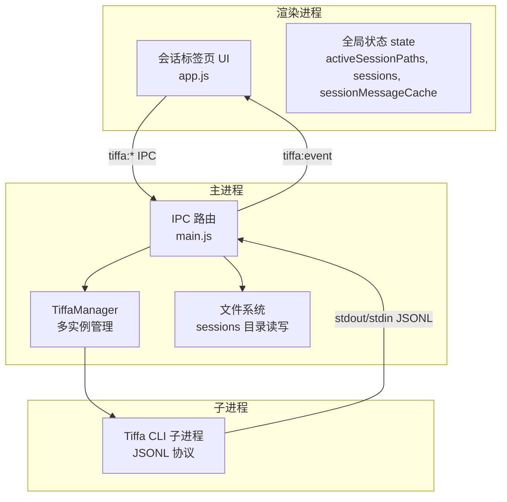
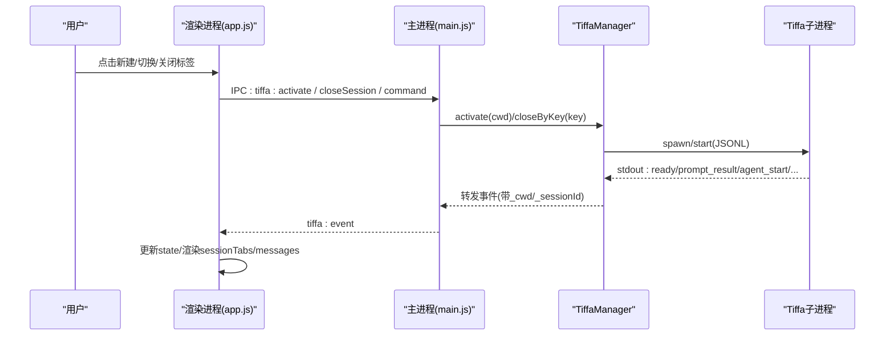
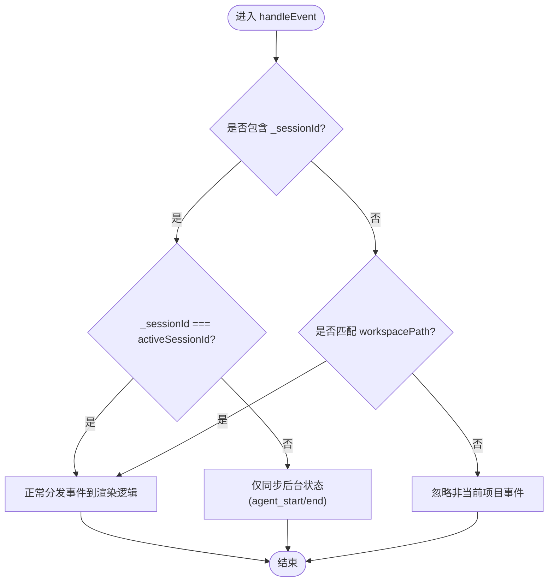
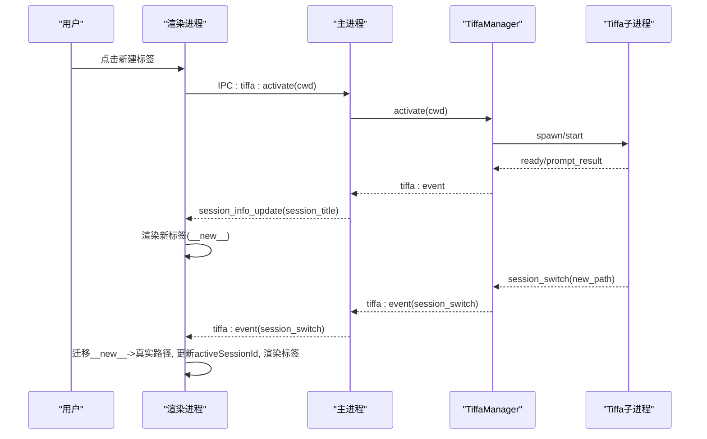
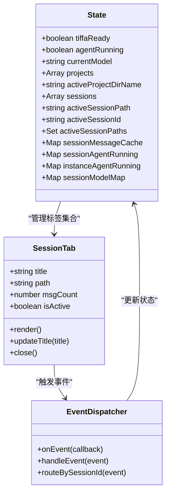
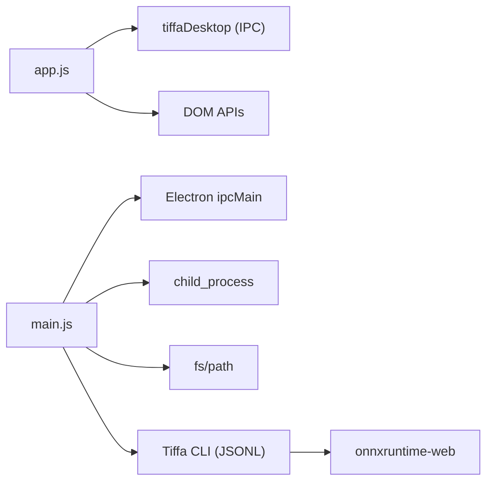

# 会话标签页

<cite>
**本文引用的文件**   
- [electron/main.js](file://electron/main.js)
- [electron/renderer/app.js](file://electron/renderer/app.js)
- [data/agent/session-model-map.json](file://data/agent/session-model-map.json)
</cite>

## 目录
1. [简介](#简介)
2. [项目结构](#项目结构)
3. [核心组件](#核心组件)
4. [架构总览](#架构总览)
5. [详细组件分析](#详细组件分析)
6. [依赖关系分析](#依赖关系分析)
7. [性能考量](#性能考量)
8. [故障排查指南](#故障排查指南)
9. [结论](#结论)
10. [附录：API 参考与扩展指南](#附录api-参考与扩展指南)

## 简介
本文件围绕“会话标签页”进行系统化文档化，覆盖多会话管理机制、标签页创建/关闭/切换逻辑、会话状态同步、UI交互（拖拽排序、右键菜单、标签页上限为8个）、数据持久化、内存管理与性能优化策略，以及事件处理、状态更新与用户反馈机制。同时提供会话管理 API 参考与自定义扩展指南，帮助开发者快速理解并扩展该模块。

## 项目结构
本项目采用 Electron 架构，主进程负责 IPC、子进程管理与文件系统操作；渲染进程负责 UI 与用户交互。会话标签页位于渲染进程的顶部区域，通过 IPC 与主进程通信，驱动 Tiffa 子进程实例的激活、消息收发与生命周期管理。

图表来源
- [electron/main.js:1-120](file://electron/main.js#L1-L120)
- [electron/renderer/app.js:94-154](file://electron/renderer/app.js#L94-L154)

章节来源
- [electron/main.js:1-120](file://electron/main.js#L1-L120)
- [electron/renderer/app.js:94-154](file://electron/renderer/app.js#L94-L154)

## 核心组件
- 渲染进程状态与标签页管理
  - activeSessionPaths：顶栏活跃标签集合（最多8个），持久化到 localStorage
  - sessions：当前项目全部会话列表（含活跃与非活跃）
  - activeSessionPath / activeSessionId：当前活跃会话路径与 UUID
  - sessionMessageCache：按会话缓存 DOM 子树与滚动位置，提升切换性能
  - sessionModelMap：每个会话记住的模型映射，持久化到 data/agent/session-model-map.json
- 主进程多实例管理
  - TiffaManager：按 cwd + sessionId 管理多个 Tiffa 子进程实例
  - IPC 接口：activate/closeSession/abort/setModel/getModels/isReady/command 等
- 事件流与状态同步
  - tiffa:event：从子进程到渲染进程的事件通道，带 _cwd 与 _sessionId 标记
  - session_switch：会话切换时更新 activeSessionId 与 UI 标题等

章节来源
- [electron/renderer/app.js:94-154](file://electron/renderer/app.js#L94-L154)
- [electron/main.js:717-746](file://electron/main.js#L717-L746)
- [electron/main.js:809-823](file://electron/main.js#L809-L823)

## 架构总览
下图展示会话标签页在整体系统中的职责与交互：渲染进程维护标签页状态与 UI，通过 IPC 调用主进程的多实例管理器，后者启动或复用 Tiffa 子进程实例，并通过 JSONL 协议与子进程通信。事件经 IPC 回传到渲染进程，驱动 UI 更新与状态同步。

图表来源
- [electron/renderer/app.js:423-441](file://electron/renderer/app.js#L423-L441)
- [electron/main.js:717-746](file://electron/main.js#L717-L746)
- [electron/main.js:809-823](file://electron/main.js#L809-L823)

## 详细组件分析

### 多会话管理机制
- 多实例键空间
  - 以 cwd + sessionId 作为实例唯一键，支持同一项目下多个对话并行运行
- 实例生命周期
  - 激活：根据 cwd 选择或创建实例，必要时预热 embedding
  - 关闭：按 key 关闭对应实例，释放进程资源
  - 事件路由：所有事件携带 _cwd 与 _sessionId，渲染进程据此过滤与分发
- 状态同步
  - agentRunning 状态分实例级与会话级存储，避免后台会话影响前台
  - session_switch 事件用于迁移 __new__ 临时路径到真实路径，并更新 activeSessionId

图表来源
- [electron/renderer/app.js:423-441](file://electron/renderer/app.js#L423-L441)
- [electron/main.js:291-303](file://electron/main.js#L291-L303)

章节来源
- [electron/renderer/app.js:423-441](file://electron/renderer/app.js#L423-L441)
- [electron/main.js:291-303](file://electron/main.js#L291-L303)

### 标签页创建/关闭/切换逻辑
- 创建标签页
  - 新建会话时生成 __new__ 临时 path，收到 session_switch 后迁移至真实路径
  - 将新路径加入 activeSessionPaths（限制最多8个），渲染 sessionTabs
- 关闭标签页
  - 不删除对话内容，仅移除活跃标签；若为最后一个标签则保持空态
  - 可选触发 IPC 关闭对应实例（释放进程）
- 切换标签页
  - 更新 activeSessionPath 与 activeSessionId
  - 恢复对应会话的消息缓存（DOM 子树与滚动位置）
  - 刷新输入框焦点与状态提示

图表来源
- [electron/renderer/app.js:599-644](file://electron/renderer/app.js#L599-L644)
- [electron/main.js:717-746](file://electron/main.js#L717-L746)

章节来源
- [electron/renderer/app.js:599-644](file://electron/renderer/app.js#L599-L644)
- [electron/main.js:717-746](file://electron/main.js#L717-L746)

### 会话状态同步与 UI 交互
- 事件类型与处理
  - ready：初始化就绪，获取当前模型
  - prompt_result/agent_start/agent_end：更新 agentRunning 状态与输入控件
  - message_start/update/end：流式渲染消息
  - tool_execution_*：工具调用生命周期
  - session_info_update：更新标签标题与页面标题
  - notice/auto_retry_*：用户反馈与重试状态
- 标签页 UI 交互
  - 拖拽排序：通过 DOM 事件委托实现标签顺序调整（需结合 CSS 过渡）
  - 右键菜单：上下文菜单打开（如重命名、导出、关闭等）
  - 标签页限制：activeSessionPaths 长度限制为 8，超出时阻止新增或提示

图表来源
- [electron/renderer/app.js:94-154](file://electron/renderer/app.js#L94-L154)
- [electron/renderer/app.js:1592-1638](file://electron/renderer/app.js#L1592-L1638)

章节来源
- [electron/renderer/app.js:94-154](file://electron/renderer/app.js#L94-L154)
- [electron/renderer/app.js:1592-1638](file://electron/renderer/app.js#L1592-L1638)

### 数据持久化与内存管理
- 会话模型映射持久化
  - sessionModelMap 保存于 data/agent/session-model-map.json
  - 启动时加载，清理 __new__ 临时键，异常时降级处理
- 会话消息缓存
  - sessionMessageCache 按 sessionPath 缓存 HTML 与滚动位置
  - 切换会话时恢复 DOM 子树，减少重建开销
- 活跃标签持久化
  - activeSessionPaths 持久化到 localStorage，重启后恢复
- 内存管理
  - 会话切换时及时释放非活跃会话的 DOM 引用
  - 子进程崩溃自动重启，超过阈值停止自动重启并提示用户

章节来源
- [electron/renderer/app.js:172-205](file://electron/renderer/app.js#L172-L205)
- [electron/renderer/app.js:128-131](file://electron/renderer/app.js#L128-L131)
- [electron/main.js:703-730](file://electron/main.js#L703-L730)

### 性能优化策略
- 首次响应超时检测：30 秒无响应提示模型不可达
- 卡住检测：120 秒无事件提示可能卡住，允许用户中断
- 消息密度滚动条（Minimap）：Canvas 绘制，按需重绘，提升长对话浏览体验
- 事件节流与防竞态：loadEpoch 防止旧回调覆盖新数据
- 子进程预热：embedding 模型冷启动预热，避免首次消息延迟

章节来源
- [electron/renderer/app.js:648-701](file://electron/renderer/app.js#L648-L701)
- [electron/renderer/app.js:258-375](file://electron/renderer/app.js#L258-L375)
- [electron/main.js:260-268](file://electron/main.js#L260-L268)

## 依赖关系分析
- 渲染进程依赖
  - tiffaDesktop：IPC 封装，提供 onEvent/onExited 等能力
  - DOM API：querySelector、addEventListener、MutationObserver、ResizeObserver
- 主进程依赖
  - Electron IPC：ipcMain.handle 注册处理器
  - child_process：spawn/execSync 管理子进程
  - fs/path：文件系统与路径操作
- 外部依赖
  - Tiffa CLI：JSONL 协议通信
  - onnxruntime-web：模型推理（WebGPU/WebNN/WASM）

图表来源
- [electron/renderer/app.js:423-441](file://electron/renderer/app.js#L423-L441)
- [electron/main.js:1-15](file://electron/main.js#L1-L15)

章节来源
- [electron/renderer/app.js:423-441](file://electron/renderer/app.js#L423-L441)
- [electron/main.js:1-15](file://electron/main.js#L1-L15)

## 性能考量
- 渲染层
  - Minimap 使用 requestAnimationFrame 与 MutationObserver 高效重绘
  - 消息缓存避免重复构建 DOM
- 主进程层
  - 子进程预热减少首次交互延迟
  - 事件过滤避免无关会话干扰前台
- 存储层
  - session-model-map.json 增量写入，避免频繁全量更新
  - localStorage 仅存储活跃标签路径，轻量持久化

[本节为通用指导，无需引用具体文件]

## 故障排查指南
- 常见问题
  - 标签页无法创建：检查 activeSessionPaths 是否已达上限（8个）
  - 会话切换卡顿：确认 sessionMessageCache 是否正确恢复
  - 模型不可达：查看首次响应超时提示与网络状态
  - 子进程崩溃：观察连续崩溃次数，超过阈值后需手动干预
- 调试建议
  - 启用 tiffa:event 日志，检查 _sessionId 路由是否正确
  - 检查 session-model-map.json 是否存在脏数据（__new__ 残留）
  - 使用浏览器控制台查看 DOM 结构与样式问题

章节来源
- [electron/renderer/app.js:648-701](file://electron/renderer/app.js#L648-L701)
- [electron/renderer/app.js:172-205](file://electron/renderer/app.js#L172-L205)
- [electron/main.js:703-730](file://electron/main.js#L703-L730)

## 结论
会话标签页模块通过清晰的渲染-主进程分层、稳健的多实例管理与高效的 UI 缓存机制，实现了流畅的多会话体验。其设计兼顾了性能、可维护性与可扩展性，为后续功能增强提供了坚实基础。

[本节为总结，无需引用具体文件]

## 附录：API 参考与扩展指南

### IPC API 参考（主进程）
- tiffa:activate(cwd)
  - 作用：激活指定项目的 Tiffa 实例
  - 返回：{ success, cwd, ready }
- tiffa:closeSession(cwd, sessionId)
  - 作用：关闭指定会话实例
  - 返回：{ success }
- tiffa:abort(sessionId)
  - 作用：中止当前会话的代理执行
  - 返回：无
- tiffa:setModel(provider, modelId, sessionId)
  - 作用：设置会话使用的模型
  - 返回：命令结果
- tiffa:getModels()
  - 作用：获取可用模型列表
  - 返回：模型信息
- tiffa:isReady()
  - 作用：检查 Tiffa 是否就绪
  - 返回：布尔值
- tiffa:command(type, payload)
  - 作用：发送自定义命令
  - 返回：命令响应

章节来源
- [electron/main.js:717-746](file://electron/main.js#L717-L746)
- [electron/main.js:809-823](file://electron/main.js#L809-L823)

### 扩展指南
- 自定义标签页行为
  - 在 setupSessionTabs 中扩展事件监听器
  - 通过 state.activeSessionPaths 控制标签数量与顺序
- 集成第三方服务
  - 通过 tiffa:command 发送自定义命令
  - 监听 extension_ui_request 事件处理前端请求
- 性能调优
  - 调整 STALL_TIMEOUT_MS 与 FIRST_RESPONSE_TIMEOUT_MS 以适应不同环境
  - 优化 sessionMessageCache 的缓存策略与清理时机

章节来源
- [electron/renderer/app.js:446-481](file://electron/renderer/app.js#L446-L481)
- [electron/renderer/app.js:648-701](file://electron/renderer/app.js#L648-L701)