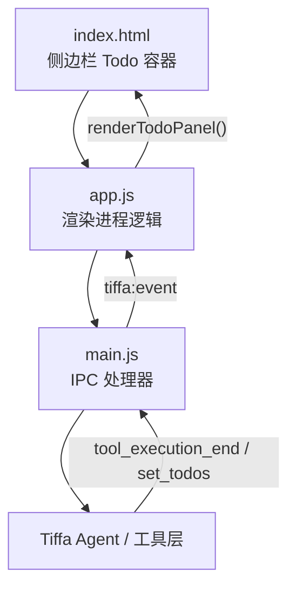
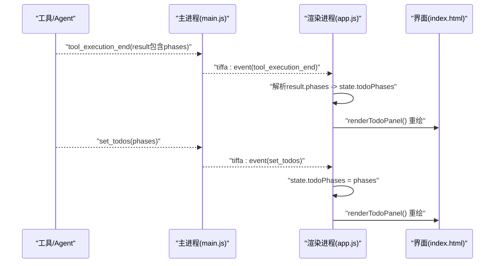
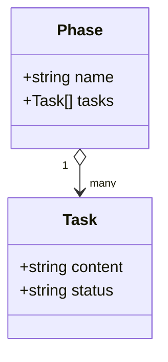
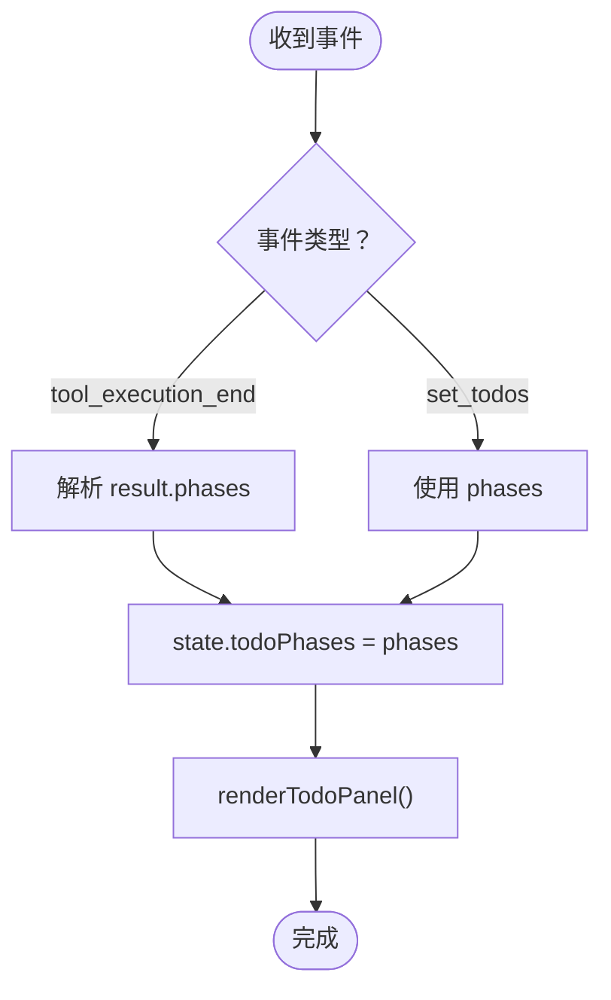
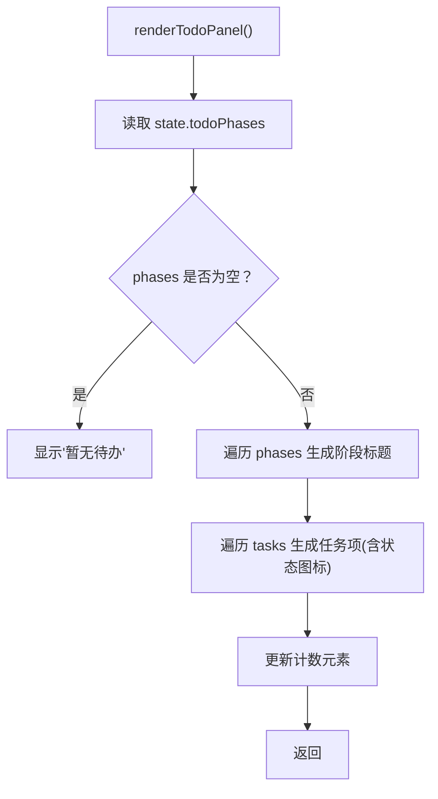
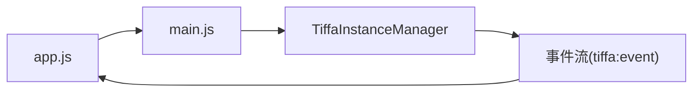

# 待办面板

<cite>
**本文引用的文件**
- [electron/renderer/app.js](file://electron/renderer/app.js)
- [electron/renderer/index.html](file://electron/renderer/index.html)
- [electron/main.js](file://electron/main.js)
</cite>

## 目录
1. [简介](#简介)
2. [项目结构](#项目结构)
3. [核心组件](#核心组件)
4. [架构总览](#架构总览)
5. [详细组件分析](#详细组件分析)
6. [依赖关系分析](#依赖关系分析)
7. [性能考量](#性能考量)
8. [故障排查指南](#故障排查指南)
9. [结论](#结论)
10. [附录：API参考与工作流集成](#附录api参考与工作流集成)

## 简介
本文件围绕“待办面板”进行系统化文档化，覆盖任务阶段管理、进度跟踪、状态同步与实时更新机制；说明待办事项的CRUD操作、批量处理与自动化流程；介绍分类、优先级、截止日期提醒与协作能力的设计要点；并给出数据持久化、冲突解决与迁移策略。最后提供面向开发者的API参考与工作流集成指南，帮助将待办管理与对话/工具链深度整合。

## 项目结构
待办面板位于侧边栏的“Todo”区域，由HTML模板定义容器与按钮，渲染进程负责事件监听、状态更新与UI重绘，后端通过IPC传递事件（如工具执行结果）驱动前端更新。

**图表来源**
- [electron/renderer/index.html:134-147](file://electron/renderer/index.html#L134-L147)
- [electron/renderer/app.js:3119-3148](file://electron/renderer/app.js#L3119-L3148)
- [electron/main.js:291-302](file://electron/main.js#L291-L302)

**章节来源**
- [electron/renderer/index.html:134-147](file://electron/renderer/index.html#L134-L147)
- [electron/renderer/app.js:3119-3148](file://electron/renderer/app.js#L3119-L3148)
- [electron/main.js:291-302](file://electron/main.js#L291-L302)

## 核心组件
- 状态存储：渲染进程维护 todoPhases 数组，表示按阶段划分的待办列表。
- 事件驱动：当工具执行结束或收到 set_todos 事件时，更新状态并重绘面板。
- 渲染逻辑：根据 phases.tasks 生成阶段标题与任务项，显示状态图标与文本。
- 交互控制：支持折叠/展开 Todo 面板，计数统计等。

关键实现位置：
- 状态字段与事件处理：[electron/renderer/app.js:145](file://electron/renderer/app.js#L145)、[electron/renderer/app.js:557-566](file://electron/renderer/app.js#L557-L566)、[electron/renderer/app.js:587-592](file://electron/renderer/app.js#L587-L592)
- 渲染函数：[electron/renderer/app.js:3119-3148](file://electron/renderer/app.js#L3119-L3148)
- 折叠交互：[electron/renderer/app.js:3108-3116](file://electron/renderer/app.js#L3108-L3116)
- HTML 容器：[electron/renderer/index.html:134-147](file://electron/renderer/index.html#L134-L147)

**章节来源**
- [electron/renderer/app.js:145](file://electron/renderer/app.js#L145)
- [electron/renderer/app.js:557-566](file://electron/renderer/app.js#L557-L566)
- [electron/renderer/app.js:587-592](file://electron/renderer/app.js#L587-L592)
- [electron/renderer/app.js:3108-3116](file://electron/renderer/app.js#L3108-L3116)
- [electron/renderer/app.js:3119-3148](file://electron/renderer/app.js#L3119-L3148)
- [electron/renderer/index.html:134-147](file://electron/renderer/index.html#L134-L147)

## 架构总览
待办面板采用“事件驱动 + 单向数据流”的轻量架构：
- 后端（Agent/工具）在执行过程中产出 phases，并通过 tool_execution_end 或 set_todos 事件上报。
- 主进程通过 IPC 转发事件到渲染进程。
- 渲染进程更新 state.todoPhases 并调用 renderTodoPanel() 刷新界面。

**图表来源**
- [electron/main.js:291-302](file://electron/main.js#L291-L302)
- [electron/renderer/app.js:557-566](file://electron/renderer/app.js#L557-L566)
- [electron/renderer/app.js:587-592](file://electron/renderer/app.js#L587-L592)
- [electron/renderer/app.js:3119-3148](file://electron/renderer/app.js#L3119-L3148)

## 详细组件分析

### 待办阶段与任务数据结构
- phases：阶段数组，每个阶段包含 name 与 tasks。
- tasks：任务对象数组，至少包含 content 与 status。
- status 映射：completed/done → 完成；in_progress/active → 进行中；blocked/failed/abandoned → 阻塞/失败；其他 → 待定。

**图表来源**
- [electron/renderer/app.js:3119-3148](file://electron/renderer/app.js#L3119-L3148)

**章节来源**
- [electron/renderer/app.js:3119-3148](file://electron/renderer/app.js#L3119-L3148)

### 事件处理与状态同步
- tool_execution_end：若 result 包含 phases，则解析并更新 state.todoPhases，触发渲染。
- set_todos：直接以 phases 替换 state.todoPhases，触发渲染。
- 多实例路由：事件带 _sessionId/_cwd，确保仅当前活跃会话更新。

**图表来源**
- [electron/renderer/app.js:557-566](file://electron/renderer/app.js#L557-L566)
- [electron/renderer/app.js:587-592](file://electron/renderer/app.js#L587-L592)

**章节来源**
- [electron/renderer/app.js:557-566](file://electron/renderer/app.js#L557-L566)
- [electron/renderer/app.js:587-592](file://electron/renderer/app.js#L587-L592)

### 渲染与交互
- 渲染：遍历 phases.tasks，为每项生成状态图标与内容文本；空阶段显示占位提示。
- 计数：计算所有阶段的任务总数，展示在计数区。
- 折叠：点击折叠按钮切换 todo-collapsed 类，箭头方向随之变化。

**图表来源**
- [electron/renderer/app.js:3119-3148](file://electron/renderer/app.js#L3119-L3148)
- [electron/renderer/app.js:3108-3116](file://electron/renderer/app.js#L3108-L3116)

**章节来源**
- [electron/renderer/app.js:3119-3148](file://electron/renderer/app.js#L3119-L3148)
- [electron/renderer/app.js:3108-3116](file://electron/renderer/app.js#L3108-L3116)

### 实时性与一致性
- 实时性：工具执行结束后立即推送 phases，渲染进程即时更新。
- 一致性：通过 sessionId/cwd 过滤事件，避免后台会话污染前台视图。
- 容错：对 JSON 解析异常进行 try/catch 保护，防止崩溃。

**章节来源**
- [electron/main.js:291-302](file://electron/main.js#L291-L302)
- [electron/renderer/app.js:557-566](file://electron/renderer/app.js#L557-L566)

## 依赖关系分析
- 渲染进程依赖主进程的 IPC 通道接收事件。
- 主进程依赖 Tiffa 实例管理器转发事件。
- 待办面板不直接访问文件系统，仅通过事件驱动更新。

**图表来源**
- [electron/main.js:291-302](file://electron/main.js#L291-L302)
- [electron/renderer/app.js:557-566](file://electron/renderer/app.js#L557-L566)

**章节来源**
- [electron/main.js:291-302](file://electron/main.js#L291-L302)
- [electron/renderer/app.js:557-566](file://electron/renderer/app.js#L557-L566)

## 性能考量
- 渲染优化：仅在 phases 变更时重绘，避免频繁 DOM 操作。
- 内存控制：todoPhases 为轻量数组，无大对象缓存。
- 事件节流：工具执行结束事件通常低频，无需额外节流。

[本节为通用指导，不涉及具体文件分析]

## 故障排查指南
- 现象：面板不更新
  - 检查是否收到 tool_execution_end 或 set_todos 事件。
  - 确认 result 中是否包含 phases，且可被正确解析。
- 现象：计数不正确
  - 检查 phases.tasks 长度累加逻辑。
- 现象：状态图标错误
  - 核对 getTodoStatusIcon 的状态映射。

**章节来源**
- [electron/renderer/app.js:557-566](file://electron/renderer/app.js#L557-L566)
- [electron/renderer/app.js:587-592](file://electron/renderer/app.js#L587-L592)
- [electron/renderer/app.js:3119-3148](file://electron/renderer/app.js#L3119-L3148)

## 结论
待办面板以极简的事件驱动模式实现了阶段化任务管理与实时可视化。通过 tool_execution_end 与 set_todos 两种事件源，保证状态一致性与低延迟更新。后续可扩展优先级、截止时间、协作共享与持久化能力，以满足更复杂的团队协作需求。

[本节为总结性内容，不涉及具体文件分析]

## 附录：API参考与工作流集成

### 事件接口
- tool_execution_end
  - 触发条件：工具执行结束
  - 载荷：result 可能包含 phases（数组），每项为阶段信息
  - 行为：渲染进程解析 phases 并更新 state.todoPhases，调用 renderTodoPanel()
- set_todos
  - 触发条件：外部系统或工具主动设置待办
  - 载荷：phases（数组）
  - 行为：直接替换 state.todoPhases，调用 renderTodoPanel()

**章节来源**
- [electron/renderer/app.js:557-566](file://electron/renderer/app.js#L557-L566)
- [electron/renderer/app.js:587-592](file://electron/renderer/app.js#L587-L592)

### 工作流集成建议
- 在工具执行的关键节点输出 phases，逐步推进任务状态。
- 对于长流程任务，分阶段提交 phases，提升用户感知进度。
- 结合 session 上下文，确保多会话隔离与正确路由。

**章节来源**
- [electron/main.js:291-302](file://electron/main.js#L291-L302)
- [electron/renderer/app.js:557-566](file://electron/renderer/app.js#L557-L566)

### 扩展方向（设计建议）
- 优先级与截止日期：在 Task 对象中增加 priority、dueDate 字段，并在渲染时展示。
- 协作功能：引入用户标识与版本戳，支持多人编辑与冲突合并。
- 持久化与迁移：将 phases 序列化至本地文件，启动时加载并进行版本兼容处理。
- 批量处理：提供批量更新接口，减少多次事件传输开销。

[本节为概念性扩展建议，不涉及具体文件分析]