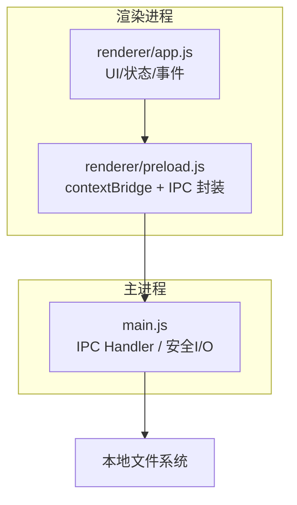
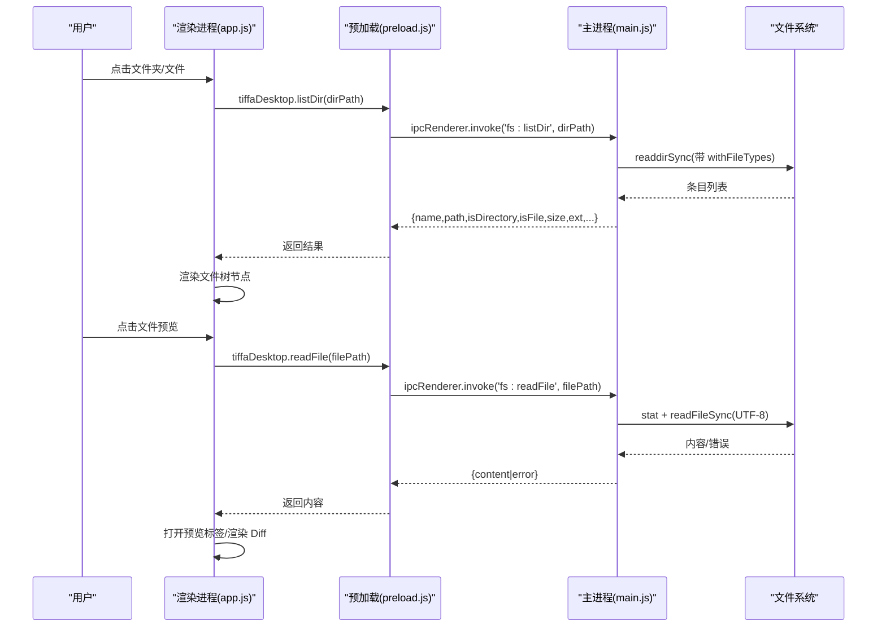
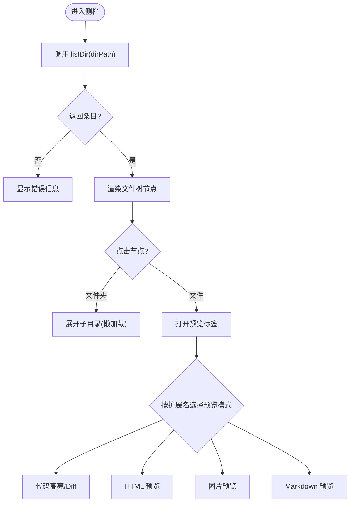
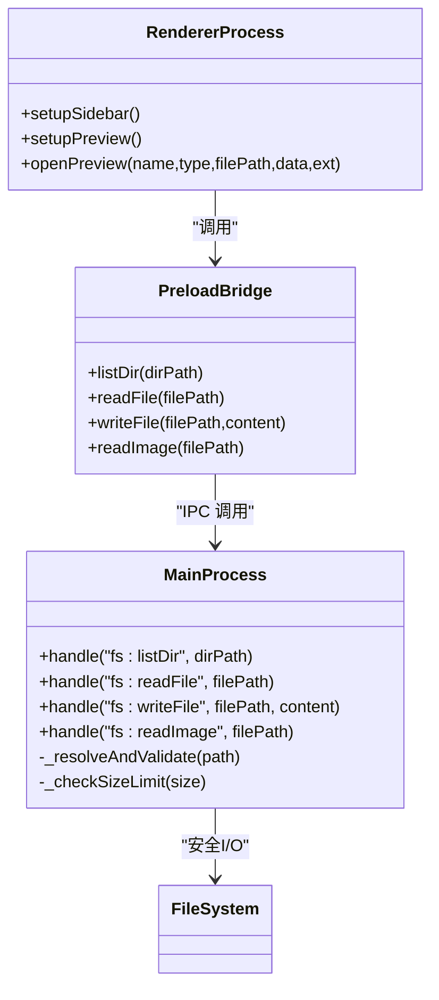

# 文件浏览器

<cite>
**本文引用的文件**   
- [electron/main.js](file://electron/main.js)
- [electron/preload.js](file://electron/preload.js)
- [electron/renderer/app.js](file://electron/renderer/app.js)
- [README.md](file://README.md)
- [AGENTS.md](file://AGENTS.md)
</cite>

## 目录
1. [简介](#简介)
2. [项目结构](#项目结构)
3. [核心组件](#核心组件)
4. [架构总览](#架构总览)
5. [详细组件分析](#详细组件分析)
6. [依赖关系分析](#依赖关系分析)
7. [性能与优化](#性能与优化)
8. [故障排查指南](#故障排查指南)
9. [结论](#结论)
10. [附录：API 参考与安全最佳实践](#附录api-参考与安全最佳实践)

## 简介
本文件浏览器是 Tiffa 桌面端（Electron）的侧栏功能，提供工作区内的文件系统树形浏览、文件读取与图片预览、以及基于主进程的安全访问控制。它通过 IPC 调用主进程的 fs:listDir、fs:readFile、fs:writeFile、fs:readImage 等接口，实现安全的本地文件访问与渲染进程展示。文档将围绕以下方面展开：
- 文件系统树形结构与懒加载
- 文件筛选与搜索（前端能力）
- 导航与预览（代码/图片/HTML/MD）
- 权限控制与安全策略（路径白名单、大小限制、写入保护）
- 错误处理机制与用户体验
- 性能优化（懒加载、缓存、渲染节流）
- API 参考与安全最佳实践

## 项目结构
Tiffa 的文件浏览器由三部分协同完成：
- 渲染进程 UI 与交互逻辑（app.js）
- 预加载桥接（preload.js）
- 主进程安全 I/O（main.js）

**图表来源** 
- [electron/renderer/app.js](file://electron/renderer/app.js)
- [electron/preload.js](file://electron/preload.js)
- [electron/main.js](file://electron/main.js)

**章节来源**
- [README.md](file://README.md)
- [AGENTS.md](file://AGENTS.md)

## 核心组件
- 渲染进程 app.js
  - 负责侧栏文件树渲染、点击导航、预览标签页管理、Diff 视图渲染、Todo 面板联动等。
  - 维护预览标签状态（名称、类型、文件路径、数据、扩展名、是否可预览、预览模式）。
- 预加载 preload.js
  - 暴露 tiffaDesktop.fs.* 方法给渲染进程，屏蔽 Node 直接访问，确保只走 IPC。
- 主进程 main.js
  - 实现 fs:listDir、fs:readFile、fs:writeFile、fs:readImage 等 IPC 处理器。
  - 执行路径解析与安全检查（仅允许在便携根或工作区内），并设置文件大小上限。

**章节来源**
- [electron/renderer/app.js](file://electron/renderer/app.js)
- [electron/preload.js](file://electron/preload.js)
- [electron/main.js](file://electron/main.js)

## 架构总览
文件浏览器的关键交互流程如下：

**图表来源** 
- [electron/renderer/app.js](file://electron/renderer/app.js)
- [electron/preload.js](file://electron/preload.js)
- [electron/main.js](file://electron/main.js)

## 详细组件分析

### 渲染进程：文件树与预览（app.js）
- 文件树渲染
  - setupSidebar() 初始化侧栏，监听刷新按钮，调用 listDir 获取目录项，递归渲染为树节点。
  - 支持折叠/展开、错误提示、空目录占位。
- 预览标签页
  - setupPreview() 管理 previewTabs 数组，新增/关闭标签，切换 activePreviewIndex。
  - 根据扩展名决定预览模式（code/html/image/md），对大文件或二进制进行保护性处理。
- Diff 对比
  - 工具卡片摘要与 diff 视图渲染，结合 ToolCard 的 summarizeToolCall、extractDiff、renderDiffView。
- Todo 面板
  - 接收 tool_execution_end 中的 todo phases，渲染待办阶段。

**图表来源** 
- [electron/renderer/app.js](file://electron/renderer/app.js)

**章节来源**
- [electron/renderer/app.js](file://electron/renderer/app.js)

### 预加载桥接（preload.js）
- 通过 contextBridge 暴露 tiffaDesktop.fs.* 方法：listDir、readFile、writeFile、readImage。
- 所有文件系统操作均通过 IPC 转发到主进程，避免渲染进程直接访问 Node 模块。

**章节来源**
- [electron/preload.js](file://electron/preload.js)

### 主进程：安全 I/O（main.js）
- fs:listDir
  - 解析路径，限定在便携根或工作区内；读取目录项，返回 name/path/isDirectory/isFile/size/ext 等字段，并按目录优先、字母序排序。
- fs:readFile
  - 解析路径，检查文件大小上限（默认 5MB），以 UTF-8 读取文本内容；超出限制返回错误。
- fs:writeFile
  - 受限于安全策略（见下文“权限控制”），通常仅在特定场景下允许写操作。
- fs:readImage
  - 用于图片预览，限制路径与大小，返回 base64 或错误。

**图表来源** 
- [electron/main.js](file://electron/main.js)
- [electron/preload.js](file://electron/preload.js)
- [electron/renderer/app.js](file://electron/renderer/app.js)

**章节来源**
- [electron/main.js](file://electron/main.js)

## 依赖关系分析
- 渲染进程依赖预加载桥接提供的 fs:* 方法，不直接访问 Node 模块。
- 主进程集中处理文件系统 I/O，统一安全校验与错误返回。
- 文件树的懒加载与预览标签的状态管理集中在渲染进程，减少不必要的 IPC 调用。

**图表来源** 
- [electron/renderer/app.js](file://electron/renderer/app.js)
- [electron/preload.js](file://electron/preload.js)
- [electron/main.js](file://electron/main.js)

**章节来源**
- [electron/main.js](file://electron/main.js)
- [electron/preload.js](file://electron/preload.js)
- [electron/renderer/app.js](file://electron/renderer/app.js)

## 性能与优化
- 懒加载
  - 文件树按需展开子目录，避免一次性加载整个工作区。
- 缓存策略
  - 渲染进程维护 previewTabs 与 sessionMessageCache，减少重复渲染与 DOM 重建。
- 渲染节流
  - 使用 requestAnimationFrame 与 MutationObserver 合并绘制，避免频繁重绘。
- 大小限制
  - 读取文件时限制最大体积（如 5MB），防止内存占用过高。
- 排序与过滤
  - 目录优先、字母序排序；前端可按扩展名或关键字快速筛选。

[本节为通用指导，无需具体文件引用]

## 故障排查指南
- 无法列出目录
  - 检查路径是否在便携根或工作区内；确认目录存在且可读。
- 读取文件失败
  - 检查文件大小是否超过限制；确认编码为 UTF-8；查看错误消息。
- 图片预览空白
  - 确认文件为支持的图片格式；检查路径是否正确；查看 readImage 返回。
- 写入被拒绝
  - 确认是否允许写操作；检查路径与权限；查看 write 相关 IPC 的错误返回。

**章节来源**
- [electron/main.js](file://electron/main.js)

## 结论
Tiffa 的文件浏览器通过清晰的三层架构（渲染进程、预加载桥接、主进程）实现了安全的本地文件访问与高效的 UI 交互。其核心优势在于：
- 安全可控：路径白名单、大小限制、写入保护
- 性能友好：懒加载、缓存、渲染节流
- 体验完善：多类型预览、Diff 对比、Todo 联动

建议在生产环境中继续强化路径校验与审计日志，并对敏感操作增加二次确认。

[本节为总结，无需具体文件引用]

## 附录：API 参考与安全最佳实践

### IPC API 参考（fs:*）
- fs:listDir(dirPath)
  - 输入：dirPath（字符串，目录路径）
  - 输出：条目数组 [{name, path, isDirectory, isFile, size, ext}] 或 {error}
  - 行为：仅允许在便携根或工作区内；目录优先、字母序排序
- fs:readFile(filePath)
  - 输入：filePath（字符串，文件路径）
  - 输出：{content} 或 {error}
  - 行为：UTF-8 读取；大小限制（默认 5MB）
- fs:writeFile(filePath, content)
  - 输入：filePath（字符串）、content（字符串）
  - 输出：{success} 或 {error}
  - 行为：受安全策略限制，需校验路径与权限
- fs:readImage(filePath)
  - 输入：filePath（字符串，图片路径）
  - 输出：{data}（base64）或 {error}
  - 行为：限制路径与大小，仅支持常见图片格式

**章节来源**
- [electron/main.js](file://electron/main.js)
- [electron/preload.js](file://electron/preload.js)

### 安全最佳实践
- 路径白名单
  - 仅允许在 PORTABLE_ROOT 或 workspace 内操作，禁止越权访问系统目录。
- 大小限制
  - 对 readFile/readImage 设置上限，避免内存溢出。
- 写入保护
  - 对配置文件与敏感目录实施拦截；必要时要求用户确认。
- 错误处理
  - 统一返回 {error}，并在 UI 中友好提示。
- 审计与日志
  - 记录危险操作与异常，便于问题定位与合规审计。

**章节来源**
- [electron/main.js](file://electron/main.js)
- [AGENTS.md](file://AGENTS.md)