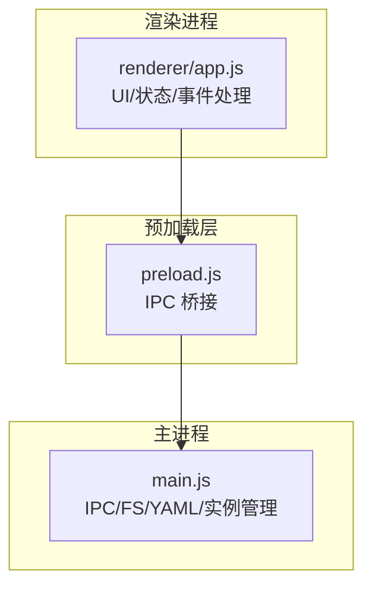
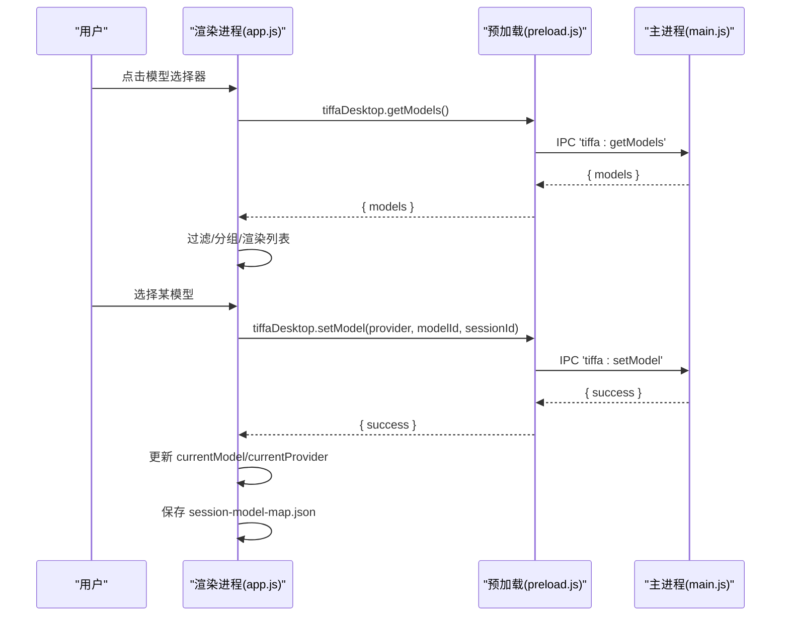
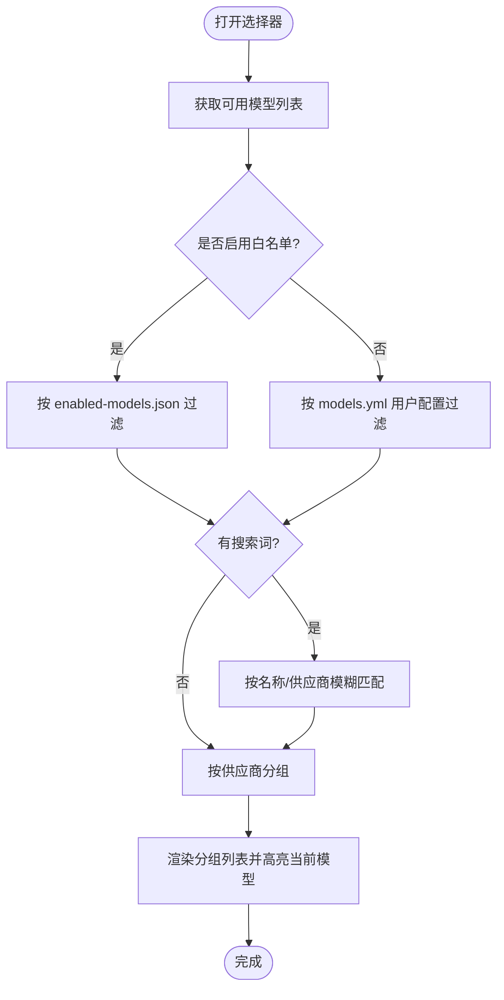
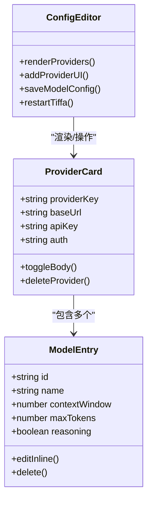
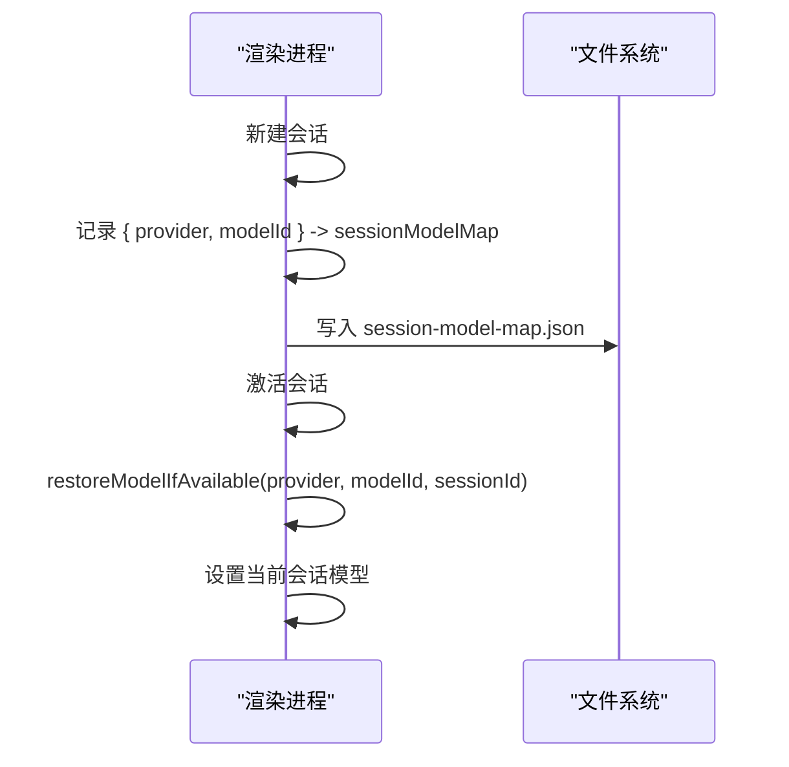
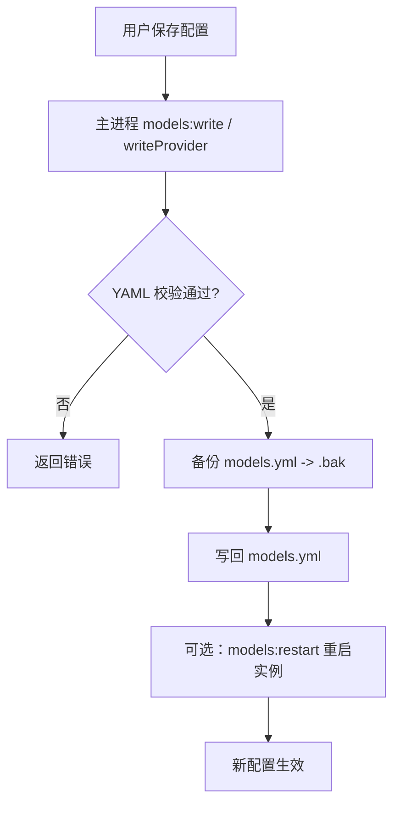
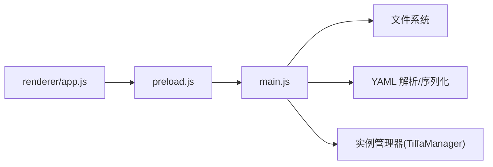

# 模型选择器

<cite>
**本文引用的文件**   
- [electron/main.js](file://electron/main.js)
- [electron/preload.js](file://electron/preload.js)
- [electron/renderer/app.js](file://electron/renderer/app.js)
</cite>

## 目录
1. [简介](#简介)
2. [项目结构](#项目结构)
3. [核心组件](#核心组件)
4. [架构总览](#架构总览)
5. [详细组件分析](#详细组件分析)
6. [依赖关系分析](#依赖关系分析)
7. [性能考量](#性能考量)
8. [故障排查指南](#故障排查指南)
9. [结论](#结论)
10. [附录：API 参考与集成指南](#附录api-参考与集成指南)

## 简介
本文件面向“模型选择器”组件，系统性阐述模型配置管理、动态加载、状态同步与错误恢复机制；详细说明模型切换的交互逻辑、性能影响与用户体验优化；介绍模型优先级设置、默认模型管理与会话级模型绑定；涵盖模型状态的持久化存储、热重载与故障转移策略；并提供模型配置的 API 参考以及自定义模型提供商的集成指南。

## 项目结构
- 渲染进程（前端）：负责 UI 展示、用户交互、本地缓存与状态同步
  - 入口与主逻辑：electron/renderer/app.js
- 预加载桥接：暴露 IPC 方法给渲染进程使用
  - electron/preload.js
- 主进程：文件系统操作、YAML 配置读写、实例生命周期管理、IPC 路由
  - electron/main.js

**图表来源** 
- [electron/renderer/app.js:4150-4349](file://electron/renderer/app.js#L4150-L4349)
- [electron/preload.js:20-35](file://electron/preload.js#L20-L35)
- [electron/main.js:950-1060](file://electron/main.js#L950-L1060)

**章节来源**
- [electron/renderer/app.js:4150-4349](file://electron/renderer/app.js#L4150-L4349)
- [electron/preload.js:20-35](file://electron/preload.js#L20-L35)
- [electron/main.js:950-1060](file://electron/main.js#L950-L1060)

## 核心组件
- 模型选择器 UI：支持搜索、分组、白名单过滤、当前选中高亮
- 模型配置编辑器：供应商预设库、添加/删除供应商与模型、从服务器拉取模型列表
- 会话级模型绑定：每个会话独立记住并恢复所选模型
- 持久化存储：enabled-models.json（白名单）、session-model-map.json（会话模型映射）
- 主进程配置读写：models.yml 的读取、写入、备份、按 provider 增量更新、重启应用以生效

**章节来源**
- [electron/renderer/app.js:4150-4349](file://electron/renderer/app.js#L4150-L4349)
- [electron/renderer/app.js:4270-4500](file://electron/renderer/app.js#L4270-L4500)
- [electron/renderer/app.js:4500-4700](file://electron/renderer/app.js#L4500-L4700)
- [electron/main.js:950-1060](file://electron/main.js#L950-L1060)

## 架构总览
模型选择器的数据流贯穿三层：
- 渲染进程：发起请求、维护 UI 状态、本地缓存
- 预加载层：封装 IPC 调用
- 主进程：访问 models.yml、校验与备份、重启实例

**图表来源** 
- [electron/renderer/app.js:4187-4204](file://electron/renderer/app.js#L4187-L4204)
- [electron/renderer/app.js:4079-4086](file://electron/renderer/app.js#L4079-L4086)
- [electron/preload.js:27](file://electron/preload.js#L27)
- [electron/main.js:741-760](file://electron/main.js#L741-L760)

## 详细组件分析

### 模型选择器 UI（搜索 + 分组 + 白名单）
- 打开/关闭：点击当前模型区域显示下拉面板，点击外部或 ESC 关闭
- 搜索过滤：输入框实时过滤名称与供应商
- 分组渲染：按供应商分组，提升可读性
- 白名单优先：若启用 enabled-models.json，则仅显示白名单中的模型；否则回退到 models.yml 中用户实际配置的模型集合
- 当前选中高亮：与 state.currentModel 匹配项高亮

**图表来源** 
- [electron/renderer/app.js:4187-4204](file://electron/renderer/app.js#L4187-L4204)
- [electron/renderer/app.js:4206-4269](file://electron/renderer/app.js#L4206-L4269)

**章节来源**
- [electron/renderer/app.js:4150-4269](file://electron/renderer/app.js#L4150-L4269)

### 模型配置编辑器（供应商与模型 CRUD）
- 供应商卡片：可折叠展开，编辑 baseUrl、apiKey、auth 等字段
- 模型条目：增删改查，支持“思考模式”标记、上下文长度、最大输出等元信息
- 从服务器拉取：根据 baseUrl 与 apiKey 拉取模型列表，去重后勾选添加
- 删除供应商：删除 models.yml 对应 provider，并清理白名单孤儿 key
- 保存与重启：保存 models.yml（带备份），提供一键重启按钮使配置生效

**图表来源** 
- [electron/renderer/app.js:4270-4500](file://electron/renderer/app.js#L4270-L4500)
- [electron/renderer/app.js:4500-4700](file://electron/renderer/app.js#L4500-L4700)

**章节来源**
- [electron/renderer/app.js:4270-4500](file://electron/renderer/app.js#L4270-L4500)
- [electron/renderer/app.js:4500-4700](file://electron/renderer/app.js#L4500-L4700)

### 会话级模型绑定与恢复
- 新建会话时继承当前模型
- 切换/恢复历史会话时，尝试恢复该会话上次使用的模型
- 模型映射持久化到 session-model-map.json，键为 sessionPath，值为 { provider, modelId }

**图表来源** 
- [electron/renderer/app.js:1512-1536](file://electron/renderer/app.js#L1512-L1536)
- [electron/renderer/app.js:1248-1283](file://electron/renderer/app.js#L1248-L1283)
- [electron/renderer/app.js:173-205](file://electron/renderer/app.js#L173-L205)

**章节来源**
- [electron/renderer/app.js:173-205](file://electron/renderer/app.js#L173-L205)
- [electron/renderer/app.js:1248-1283](file://electron/renderer/app.js#L1248-L1283)
- [electron/renderer/app.js:1512-1536](file://electron/renderer/app.js#L1512-L1536)

### 主进程配置读写与热重载
- 读取 models.yml：解析 YAML 返回 data 与 raw
- 写入 models.yml：先校验 YAML，再备份旧文件，最后写入
- 按 provider 写入：使用 parseDocument/setIn 保留注释与其他字段
- 删除 provider：删除指定 provider 节点
- 重启所有实例：关闭并重新激活各 cwd 实例，实现热重载

**图表来源** 
- [electron/main.js:954-998](file://electron/main.js#L954-L998)
- [electron/main.js:1000-1049](file://electron/main.js#L1000-L1049)

**章节来源**
- [electron/main.js:954-998](file://electron/main.js#L954-L998)
- [electron/main.js:1000-1049](file://electron/main.js#L1000-L1049)

## 依赖关系分析
- 渲染进程依赖 preload 暴露的 IPC 方法：getModels、setModel、readModelsYml、writeModelsYml、restartTiffa、fetchProviderModels、deleteTiffaProvider 等
- 主进程依赖文件系统与 YAML 解析库进行配置读写
- 实例管理器负责多实例（项目级与会话级）的生命周期与 LRU 淘汰

**图表来源** 
- [electron/preload.js:20-35](file://electron/preload.js#L20-L35)
- [electron/main.js:383-470](file://electron/main.js#L383-L470)

**章节来源**
- [electron/preload.js:20-35](file://electron/preload.js#L20-L35)
- [electron/main.js:383-470](file://electron/main.js#L383-L470)

## 性能考量
- 模型列表缓存：避免重复请求，减少网络与解析开销
- 白名单过滤在内存中进行，避免对大列表多次 I/O
- 会话消息缓存限制上限（最多 3 份），防止 DOM 缓存占用过多内存
- 首次响应超时与卡住检测：长时间无响应提示用户，降低等待焦虑
- 批量拉取模型时去重与分页展示，避免一次性渲染过多节点

[本节为通用指导，不直接分析具体文件]

## 故障排查指南
- 无法读取 models.yml：检查路径是否存在、权限是否正确；查看主进程返回的错误信息
- 写入失败：确认 YAML 格式合法；查看备份文件 .bak 是否生成
- 配置未生效：执行重启命令，确保所有实例重新加载配置
- 会话模型恢复失败：检查 session-model-map.json 是否损坏或键名变更
- 白名单为空导致看不到模型：确认 enabled-models.json 是否为空数组或未配置

**章节来源**
- [electron/main.js:954-998](file://electron/main.js#L954-L998)
- [electron/renderer/app.js:173-205](file://electron/renderer/app.js#L173-L205)

## 结论
模型选择器通过渲染进程、预加载桥接与主进程的协作，实现了完整的模型配置管理、动态加载、会话级绑定与持久化。配合白名单与用户配置的双重过滤，既保证灵活性又兼顾安全性。主进程提供的备份与重启能力，确保了配置变更的安全性与即时生效。整体设计在性能与体验上做了多项优化，适合多供应商、多会话场景下的稳定使用。

[本节为总结，不直接分析具体文件]

## 附录：API 参考与集成指南

### IPC API（渲染进程 → 主进程）
- getModels(): 获取可用模型列表
- setModel(provider, modelId, sessionId?): 设置当前会话模型
- readModelsYml(): 读取 models.yml
- writeModelsYml(yamlContent): 写入 models.yml（全量覆盖）
- writeProvider(providerId, cfg): 按 provider 增量写入（保留注释）
- deleteProvider(providerId): 删除指定 provider
- restartTiffa(): 重启所有实例
- fetchProviderModels(baseUrl, apiKey): 从远端拉取模型列表

**章节来源**
- [electron/preload.js:20-35](file://electron/preload.js#L20-L35)
- [electron/main.js:741-760](file://electron/main.js#L741-L760)
- [electron/main.js:954-998](file://electron/main.js#L954-L998)
- [electron/main.js:1000-1049](file://electron/main.js#L1000-L1049)

### 配置文件说明
- models.yml：供应商与模型定义，支持 baseUrl、apiKey、auth、models[] 等字段
- enabled-models.json：白名单，形如 ["provider/modelId", ...]
- session-model-map.json：会话级模型映射，形如 { "sessionPath": { "provider": "...", "modelId": "..." } }

**章节来源**
- [electron/renderer/app.js:4515-4554](file://electron/renderer/app.js#L4515-L4554)
- [electron/renderer/app.js:4559-4581](file://electron/renderer/app.js#L4559-L4581)
- [electron/renderer/app.js:173-205](file://electron/renderer/app.js#L173-L205)

### 自定义模型提供商集成步骤
1. 在“添加模型”向导中选择预设或自定义
2. 填写 baseUrl、apiKey（如需要）、auth 方式
3. 可选：从服务器拉取模型列表，勾选需要的模型 ID
4. 保存配置并重启实例使配置生效
5. 如需限制可见范围，编辑 enabled-models.json 加入白名单

**章节来源**
- [electron/renderer/app.js:4583-4700](file://electron/renderer/app.js#L4583-L4700)
- [electron/main.js:1000-1049](file://electron/main.js#L1000-L1049)