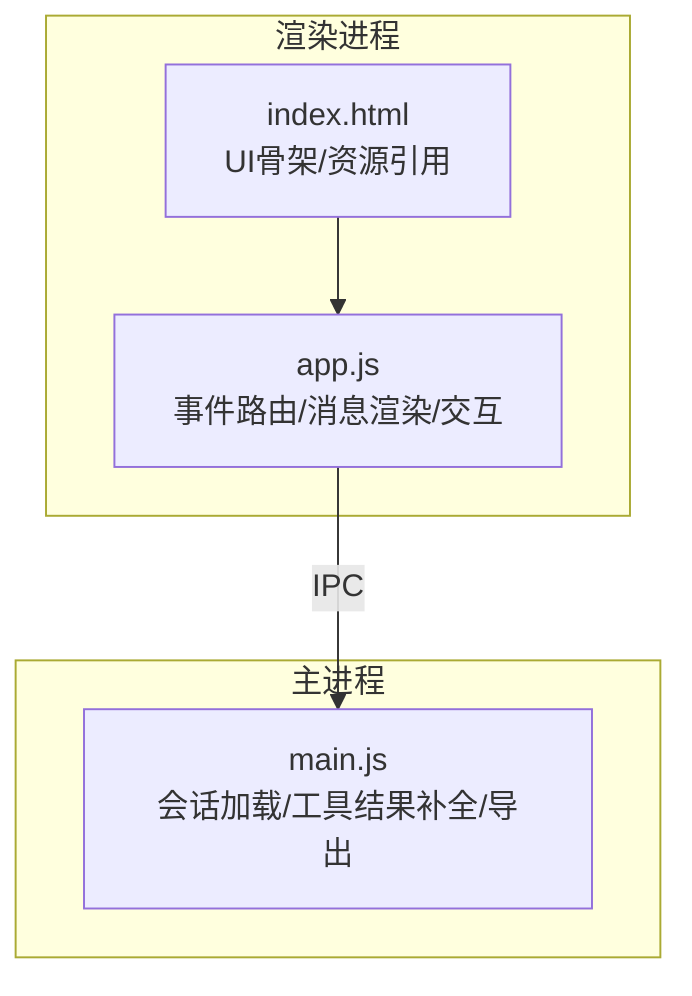
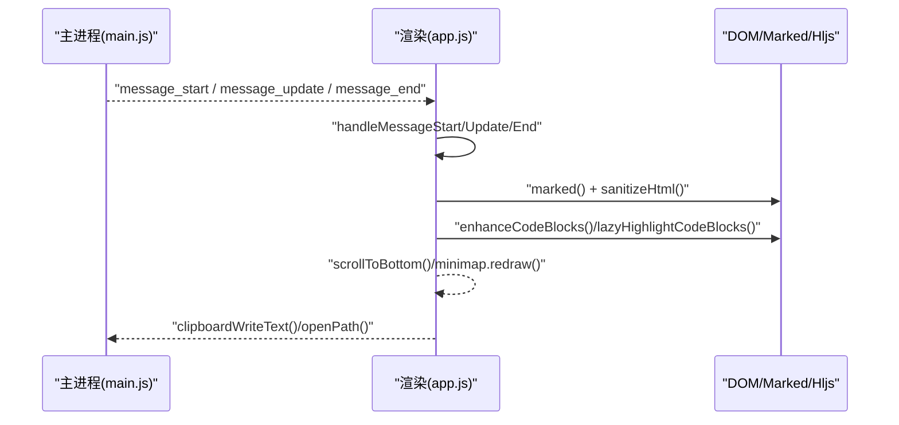
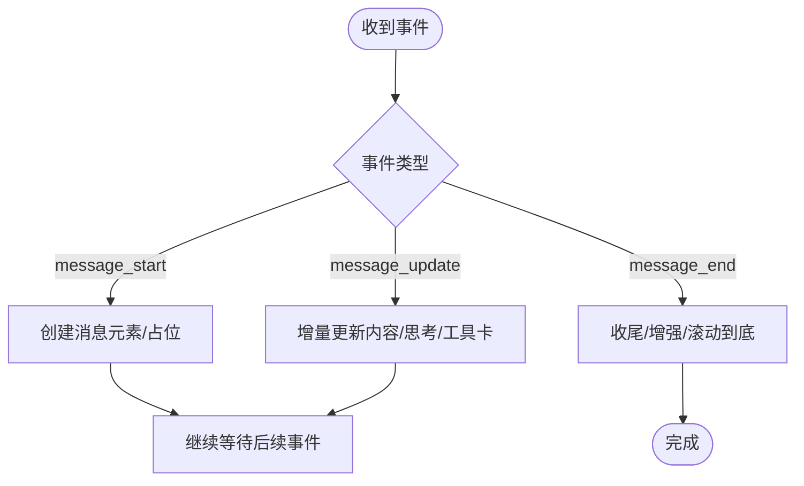
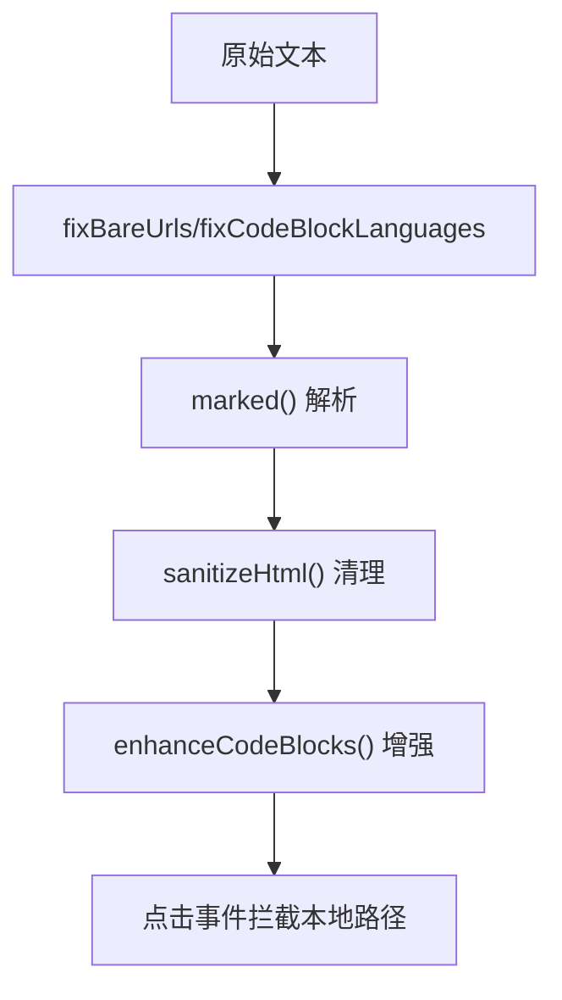
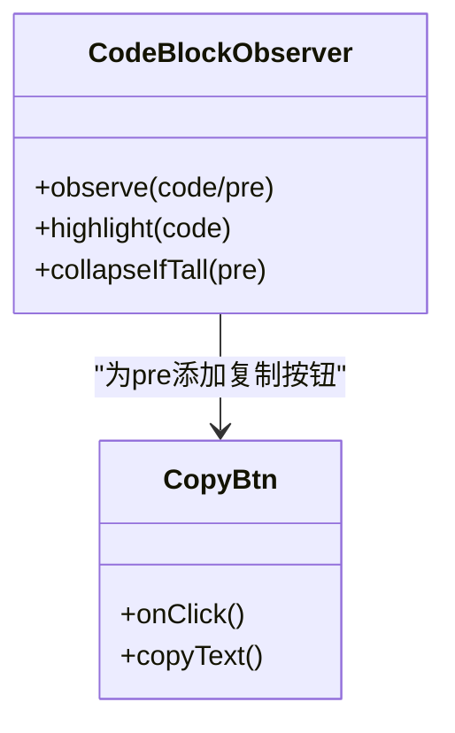
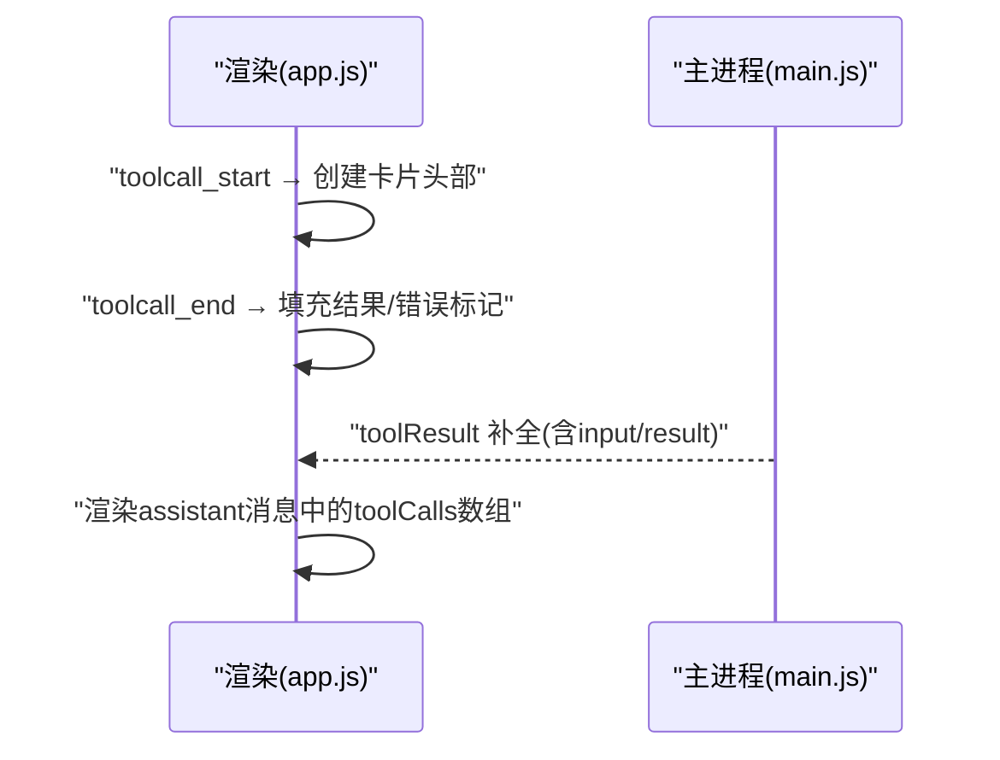
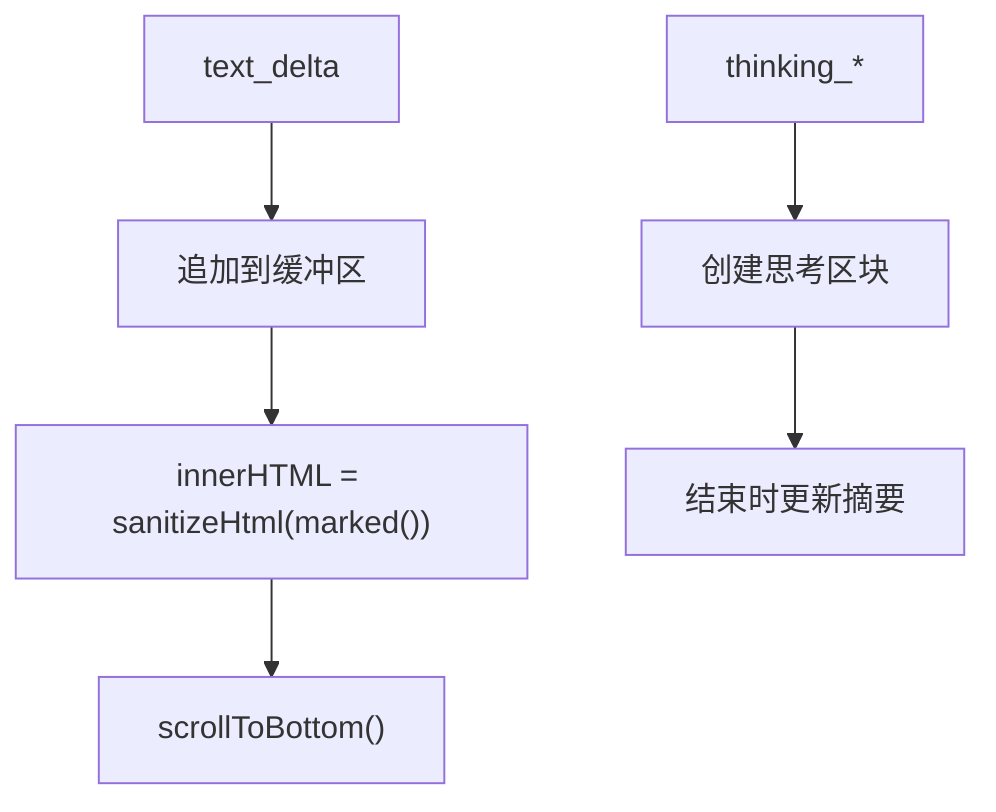
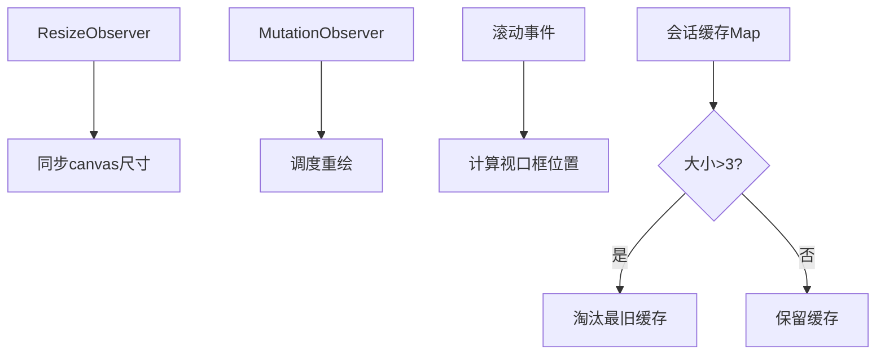

# 消息显示

<cite>
**本文引用的文件**   
- [electron/renderer/app.js](file://electron\renderer\app.js)
- [electron/renderer/index.html](file://electron\renderer\index.html)
- [electron/main.js](file://electron\main.js)
</cite>

## 目录
1. [简介](#简介)
2. [项目结构](#项目结构)
3. [核心组件](#核心组件)
4. [架构总览](#架构总览)
5. [详细组件分析](#详细组件分析)
6. [依赖关系分析](#依赖关系分析)
7. [性能考量](#性能考量)
8. [故障排查指南](#故障排查指南)
9. [结论](#结论)
10. [附录：API与主题定制参考](#附录api与主题定制参考)

## 简介
本文件面向“消息显示”子系统，系统性阐述消息渲染引擎、Markdown解析、代码高亮与链接处理机制；对比用户消息与助手消息的展示样式；说明流式输出效果与工具调用卡片；并给出滚动优化、虚拟滚动/内存管理策略以及搜索、复制、收藏等交互能力。同时提供消息格式规范、自定义渲染器与主题定制的API参考，帮助开发者快速集成与扩展。

## 项目结构
- 渲染进程入口与主逻辑集中在 electron/renderer/app.js，负责事件路由、消息生命周期、DOM构建、Markdown渲染、代码块增强、滚动与最小化导航（minimap）等。
- 页面骨架在 electron/renderer/index.html，包含聊天容器、输入区、侧边栏、预览区、设置面板等。
- 主进程在 electron/main.js，负责会话历史加载、toolResult补全、IPC导出HTML等，为渲染进程提供数据与能力。



**图表来源** 
- [electron/renderer/app.js](file://electron\renderer\app.js)
- [electron/renderer/index.html](file://electron\renderer\index.html)
- [electron/main.js](file://electron\main.js)

**章节来源**
- [electron/renderer/index.html:1-261](file://electron\renderer\index.html#L1-L261)
- [electron/renderer/app.js:1-120](file://electron\renderer\app.js#L1-L120)

## 核心组件
- 消息渲染管线：消息开始/更新/结束三阶段，分别创建元素、增量更新内容、收尾增强。
- Markdown解析与清洗：通过 tiffaDesktop.marked 解析，配合 sanitizeHtml 清理，确保安全渲染。
- 代码高亮与折叠：基于 highlight.js，懒触发 IntersectionObserver，长代码自动折叠。
- 链接处理：修复裸链接、file:/// 与 Windows 本地路径，统一转为 tiffa-local:// 协议并由点击事件打开系统路径。
- 工具调用卡片：支持 inline toolcall_start/update/end，生成可折叠卡片，头部点击切换展开/收起。
- 滚动与可视化：Minimap 右侧窄条绘制消息色块与视口框，支持拖拽跳转。
- 复制功能：消息级与代码块级复制按钮，委托事件处理，兼容缓存恢复后的 HTML。

**章节来源**
- [electron/renderer/app.js:1948-2200](file://electron\renderer\app.js#L1948-L2200)
- [electron/renderer/app.js:258-375](file://electron\renderer\app.js#L258-L375)
- [electron/renderer/app.js:34-91](file://electron\renderer\app.js#L34-L91)
- [electron/renderer/app.js:383-421](file://electron\renderer\app.js#L383-L421)
- [electron/renderer/app.js:2016-2057](file://electron\renderer\app.js#L2016-L2057)

## 架构总览
消息从后端事件驱动渲染，渲染进程根据事件类型分派到对应处理器，完成 DOM 更新与增强。



**图表来源** 
- [electron/renderer/app.js:1948-2200](file://electron\renderer\app.js#L1948-L2200)
- [electron/main.js:1805-1834](file://electron\main.js#L1805-L1834)

## 详细组件分析

### 消息渲染引擎
- 三阶段处理：
  - message_start：用户消息直接渲染；助手消息创建空容器，准备流式追加。
  - message_update：按 assistantEvent 类型处理文本增量、思考过程、工具调用等。
  - message_end：收尾助手消息，执行最终增强（如复制按钮）。
- 状态维护：currentAssistantEl、currentTextBuffer、currentThinkingEl 等用于流式拼接与定位。



**图表来源** 
- [electron/renderer/app.js:1948-2014](file://electron\renderer\app.js#L1948-L2014)

**章节来源**
- [electron/renderer/app.js:1948-2014](file://electron\renderer\app.js#L1948-L2014)

### Markdown解析与链接处理
- 解析流程：applyOutputFixes → marked → sanitizeHtml → enhanceCodeBlocks。
- 链接修复：
  - 保护已有 Markdown 链接避免重复转换。
  - file:/// 转换为 tiffa-local://，便于 Electron shell.openPath 打开。
  - 自动识别裸 URL 与 Windows 本地路径，转成可点击链接。
- 点击处理：拦截 a[href^="tiffa-local://"] 或 file:///，解码路径后调用 tiffaDesktop.openPath。



**图表来源** 
- [electron/renderer/app.js:34-91](file://electron\renderer\app.js#L34-L91)
- [electron/renderer/app.js:383-411](file://electron\renderer\app.js#L383-L411)

**章节来源**
- [electron/renderer/app.js:34-91](file://electron\renderer\app.js#L34-L91)
- [electron/renderer/app.js:383-411](file://electron\renderer\app.js#L383-L411)

### 代码高亮与折叠
- 高亮：IntersectionObserver 懒触发，仅对进入视口的 code 元素进行 hljs.highlightAuto 或指定语言高亮。
- 折叠：高度超过阈值的 pre 自动包裹 collapsible-pre-wrap，并提供“展开/收起”按钮。
- 复制：每个 pre 内嵌 copy-btn，点击复制代码文本，兼容缓存恢复后的 HTML。



**图表来源** 
- [electron/renderer/app.js:2109-2197](file://electron\renderer\app.js#L2109-L2197)

**章节来源**
- [electron/renderer/app.js:2109-2197](file://electron\renderer\app.js#L2109-L2197)

### 工具调用卡片
- 事件：toolcall_start/toolcall_end 由 handleMessageUpdate 分发，生成可折叠卡片。
- 交互：.tool-call-header 点击切换 .tool-call-body 的 collapsed 类，实现展开/收起。
- 历史加载：toolResult 在主进程侧补全参数与结果，渲染时以 assistant 消息形式呈现工具调用卡片。



**图表来源** 
- [electron/renderer/app.js:2006-2010](file://electron\renderer\app.js#L2006-L2010)
- [electron/main.js:1805-1834](file://electron\main.js#L1805-L1834)

**章节来源**
- [electron/renderer/app.js:2006-2010](file://electron\renderer\app.js#L2006-L2010)
- [electron/main.js:1805-1834](file://electron\main.js#L1805-L1834)

### 流式输出效果
- 文本增量：text_delta 累积到 currentTextBuffer，实时写入 .message-body，保持滚动到底。
- 思考过程：thinking_* 事件创建独立区块，结束后更新摘要字数。
- 平滑体验：每次更新后 scrollToBottom(true)，保证最新内容可见。



**图表来源** 
- [electron/renderer/app.js:1972-2010](file://electron\renderer\app.js#L1972-L2010)

**章节来源**
- [electron/renderer/app.js:1972-2010](file://electron\renderer\app.js#L1972-L2010)

### 滚动优化与内存管理
- Minimap：Canvas 绘制消息色块与视口框，ResizeObserver/MutationObserver 监听尺寸与内容变化，requestAnimationFrame 节流重绘。
- 会话缓存：切换会话时缓存 innerHTML 与 scrollTop，上限 3 份，防止长会话占用过多堆内存。
- 懒处理：代码高亮与折叠仅在进入视口时执行，减少首屏开销。



**图表来源** 
- [electron/renderer/app.js:258-375](file://electron\renderer\app.js#L258-L375)
- [electron/renderer/app.js:1136-1147](file://electron\renderer\app.js#L1136-L1147)

**章节来源**
- [electron/renderer/app.js:258-375](file://electron\renderer\app.js#L258-L375)
- [electron/renderer/app.js:1136-1147](file://electron\renderer\app.js#L1136-L1147)

### 交互功能：复制、收藏、搜索
- 复制：消息级与代码块级复制按钮，委托事件处理，优先使用 tiffaDesktop.clipboardWriteText，回退 navigator.clipboard。
- 收藏：当前仓库未实现“收藏”功能，可在消息元素上扩展收藏标记与列表。
- 搜索：当前仓库未内置消息搜索，可在 messages 容器上实现文本过滤与高亮匹配。

**章节来源**
- [electron/renderer/app.js:2016-2057](file://electron\renderer\app.js#L2016-L2057)

## 依赖关系分析
- 渲染依赖：marked（Markdown）、highlight.js（代码高亮）、Electron IPC（主进程通信）、Clipboard API（复制）。
- 主进程依赖：文件系统（会话读取/导出）、shell（打开本地路径）。
- 耦合点：
  - app.js 通过 tiffaDesktop.* 暴露的能力与 main.js 提供的 IPC 方法强绑定。
  - 工具调用卡片依赖主进程的 toolMeta 补全逻辑。

```mermaid
graph LR
App["app.js"] --> Marked["marked"]
App --> Hljs["highlight.js"]
App --> IPC["tiffaDesktop(IPC)"]
Main["main.js"] --> FS["fs"]
Main --> Shell["shell.openPath"]
App <- --> Main
```

**图表来源** 
- [electron/renderer/app.js:1-120](file://electron\renderer\app.js#L1-L120)
- [electron/main.js:2150-2163](file://electron\main.js#L2150-L2163)

**章节来源**
- [electron/renderer/app.js:1-120](file://electron\renderer\app.js#L1-L120)
- [electron/main.js:2150-2163](file://electron\main.js#L2150-L2163)

## 性能考量
- 首屏渲染：欢迎页与空会话快速展示，延迟加载活跃对话内容。
- 增量更新：流式文本与思考过程避免整段重排，降低布局抖动。
- 懒加载：代码高亮与折叠按需执行，IntersectionObserver 提前 300px 触发。
- 内存控制：会话缓存上限 3 份，及时淘汰最旧缓存，防止大 DOM 堆积。
- 滚动优化：Minimap 使用 Canvas 绘制，rAF 节流，避免频繁重绘。

[本节为通用指导，不直接分析具体文件]

## 故障排查指南
- 模型不可达提示：首次响应超时检测，30 秒无 agent 事件则提示。
- 代理卡住检测：2 分钟无事件且仍在运行，提示可能卡住并可停止。
- 崩溃重启：连续崩溃次数限制，超过上限停止自动重启。
- 本地路径无法打开：检查 tiffa-local:// 与 file:/// 转换是否正确，确认 shell.openPath 调用。

**章节来源**
- [electron/renderer/app.js:648-701](file://electron\renderer\app.js#L648-L701)
- [electron/renderer/app.js:703-730](file://electron\renderer\app.js#L703-L730)
- [electron/renderer/app.js:383-411](file://electron\renderer\app.js#L383-L411)

## 结论
消息显示子系统以事件驱动为核心，结合 Markdown 解析、代码高亮、链接修复与工具调用卡片，提供了流畅的流式输出与丰富的交互能力。通过 Minimap、会话缓存与懒加载策略，有效平衡了性能与用户体验。未来可扩展收藏、搜索等功能，进一步提升信息检索效率。

[本节为总结性内容，不直接分析具体文件]

## 附录：API与主题定制参考

### 消息格式规范
- 角色：user、assistant、toolResult。
- 内容结构：
  - string 或 Array<{type:'text'|'thinking'|'tool_use'|'tool_call', ...}>。
  - toolResult 需携带 toolCallId 以便主进程补全参数。
- 字段示例：role、content、timestamp、model、provider、steering、follow_up。

**章节来源**
- [electron/main.js:1805-1834](file://electron\main.js#L1805-L1834)

### 自定义渲染器
- Markdown 解析：tiffaDesktop.marked(text)
- HTML 清洗：sanitizeHtml(html)
- 代码高亮：tiffaDesktop.hljs.highlight(raw, {language}) 或 highlightAuto
- 复制接口：tiffaDesktop.clipboardWriteText(text)
- 本地路径打开：tiffaDesktop.openPath(filePath)

**章节来源**
- [electron/renderer/app.js:2097-2104](file://electron\renderer\app.js#L2097-L2104)
- [electron/renderer/app.js:2153-2197](file://electron\renderer\app.js#L2153-L2197)
- [electron/renderer/app.js:2016-2057](file://electron\renderer\app.js#L2016-L2057)
- [electron/renderer/app.js:383-411](file://electron\renderer\app.js#L383-L411)

### 主题定制
- 主题切换：index.html 引入 themes.js，动态切换 highlight.js 样式（atom-one-dark/light）。
- CSS 变量：通过 --accent-main-000、--text-400 等变量控制颜色，Minimap 与消息色块跟随主题。
- 扩展建议：在 styles.css 中定义 .message.user/.message.assistant 的差异化样式，支持深色/浅色模式。

**章节来源**
- [electron/renderer/index.html:9-10](file://electron\renderer\index.html#L9-L10)
- [electron/renderer/app.js:347-351](file://electron\renderer\app.js#L347-L351)