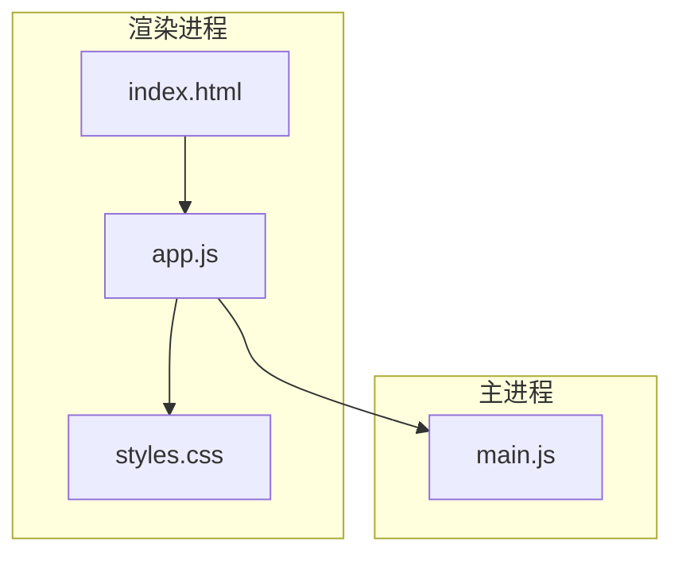
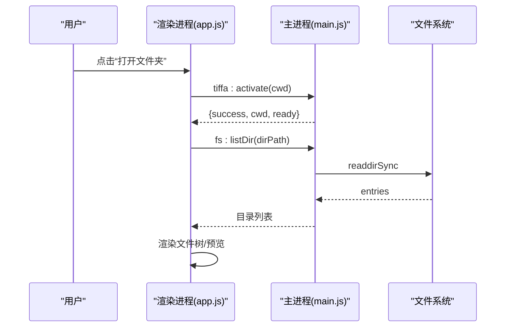
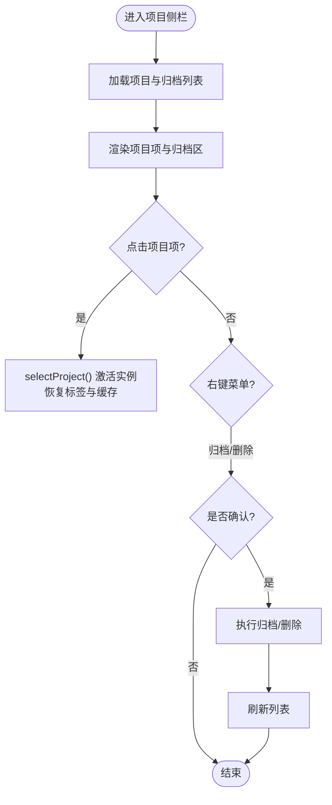
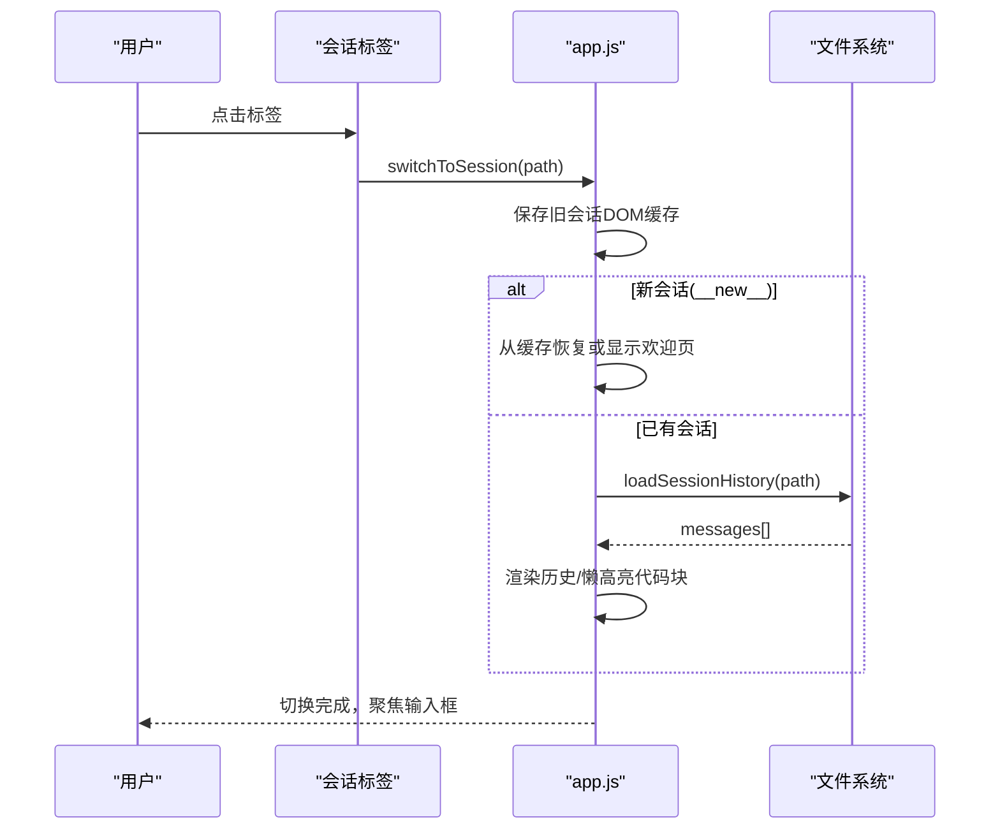
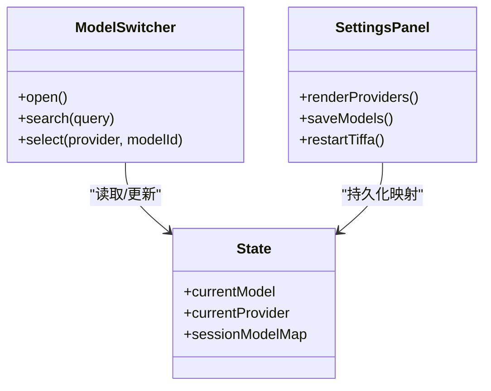
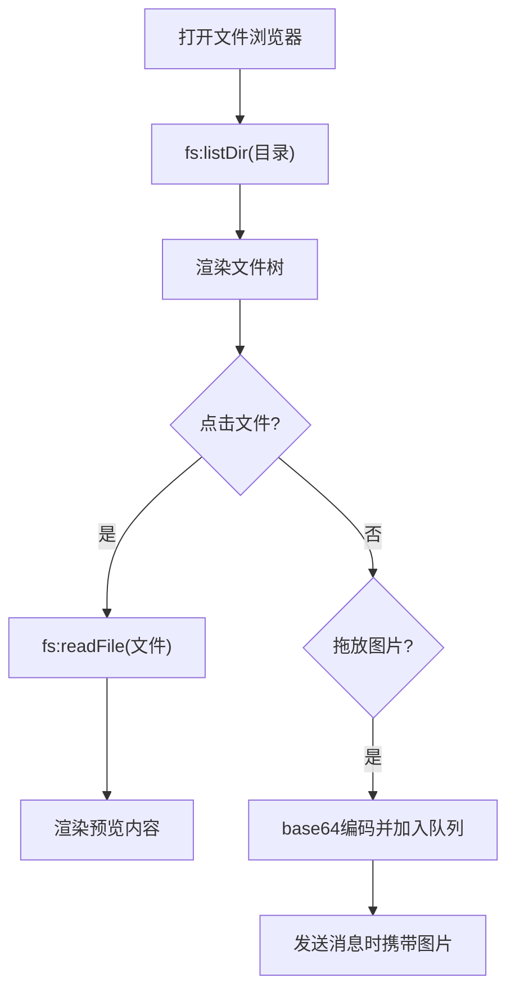
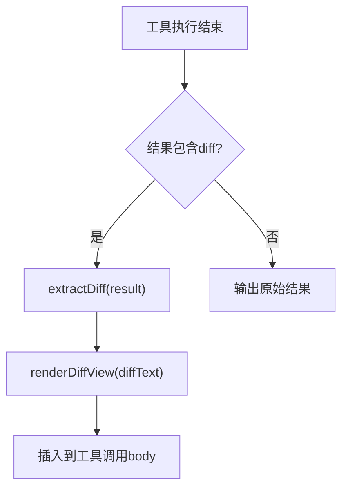
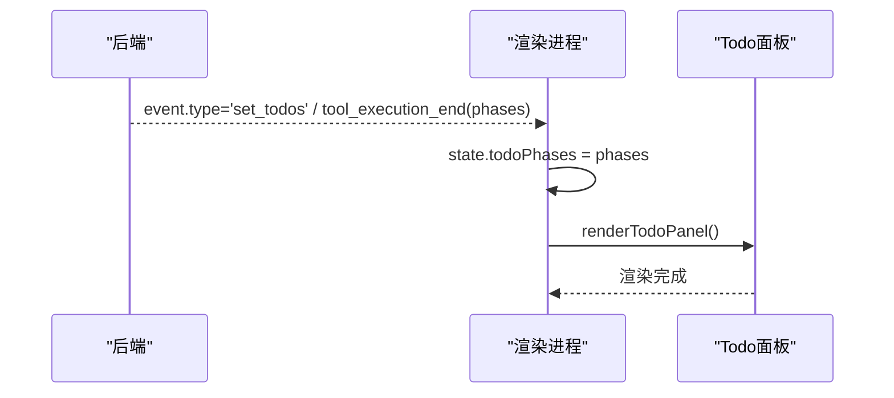
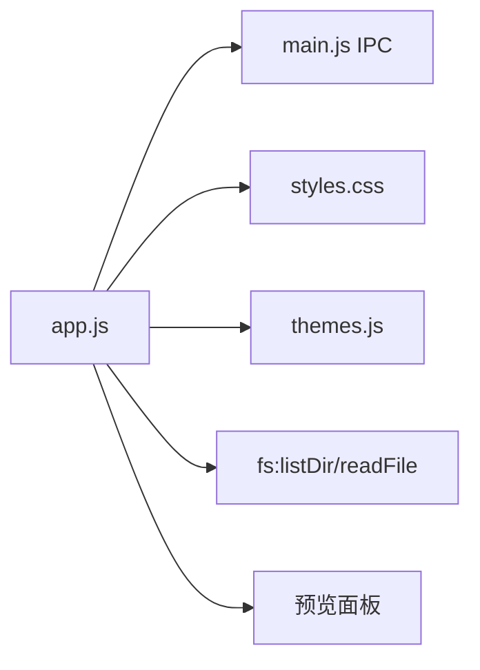

# 界面组件

<cite>
**本文引用的文件**   
- [index.html](file://electron/renderer/index.html)
- [app.js](file://electron/renderer/app.js)
- [styles.css](file://electron/renderer/styles.css)
- [main.js](file://electron/main.js)
- [README.md](file://README.md)
</cite>

## 目录
1. [简介](#简介)
2. [项目结构](#项目结构)
3. [核心组件](#核心组件)
4. [架构总览](#架构总览)
5. [详细组件分析](#详细组件分析)
6. [依赖关系分析](#依赖关系分析)
7. [性能考量](#性能考量)
8. [故障排查指南](#故障排查指南)
9. [结论](#结论)
10. [附录：API 参考与扩展指南](#附录api-参考与扩展指南)

## 简介
本文件面向开发者，系统化梳理 Tiffa 桌面端界面组件的设计与实现，覆盖项目侧栏、会话标签、模型选择器、文件浏览器、Diff 视图、Todo 面板等关键模块。文档从交互逻辑、状态管理、事件处理、用户反馈机制入手，结合布局设计、响应式适配、无障碍支持与性能优化策略，提供使用示例、API 参考与扩展指南，帮助快速理解与二次开发。

## 项目结构
Tiffa 的界面由 Electron 渲染进程承载，入口为 index.html，主逻辑集中在 app.js，样式在 styles.css；Electron 主进程通过 main.js 暴露 IPC 接口供渲染进程调用（如文件系统操作、实例/会话激活等）。

图表来源
- [index.html:1-261](file://electron/renderer/index.html#L1-L261)
- [app.js:1-800](file://electron/renderer/app.js#L1-L800)
- [styles.css:1-200](file://electron/renderer/styles.css#L1-L200)
- [main.js:563-856](file://electron/main.js#L563-L856)

章节来源
- [index.html:1-261](file://electron/renderer/index.html#L1-L261)
- [app.js:1-800](file://electron/renderer/app.js#L1-L800)
- [styles.css:1-200](file://electron/renderer/styles.css#L1-L200)
- [main.js:563-856](file://electron/main.js#L563-L856)

## 核心组件
- 项目侧栏：多工作区切换、归档管理、右键菜单、历史对话折叠区域
- 会话标签：新建/关闭/切换、持久化打开标签、消息缓存与恢复
- 模型选择器：顶栏显示与点击切换、设置面板配置、按供应商过滤
- 文件浏览器：侧边栏树形结构、刷新/折叠、拖拽上传、预览面板
- Diff 视图：工具调用结果中的 unified diff 自动识别与着色展示
- Todo 面板：接收后端 phases 数据并渲染任务阶段

章节来源
- [index.html:20-164](file://electron/renderer/index.html#L20-L164)
- [app.js:795-1599](file://electron/renderer/app.js#L795-L1599)
- [styles.css:104-600](file://electron/renderer/styles.css#L104-L600)

## 架构总览
渲染进程负责 UI 渲染与用户交互，主进程提供系统能力（窗口、文件系统、实例/会话生命周期）。IPC 采用 handle/onEvent 模式，事件驱动更新 UI。

图表来源
- [main.js:809-856](file://electron/main.js#L809-L856)
- [app.js:800-870](file://electron/renderer/app.js#L800-L870)

章节来源
- [main.js:563-856](file://electron/main.js#L563-L856)
- [app.js:800-870](file://electron/renderer/app.js#L800-L870)

## 详细组件分析

### 项目侧栏（Project Panel）
- 功能要点
  - 项目列表加载与渲染，支持归档区折叠/展开
  - 右键菜单：打开资源管理器、归档、删除（含二次确认）
  - 历史对话面板：非活跃会话列表，支持归档/删除、点击恢复到活跃标签
- 交互逻辑
  - 点击项目项 → selectProject() 激活实例、恢复会话标签与内容缓存
  - 新建对话 → 创建临时 __new__ 路径，后台异步刷新真实会话
- 状态管理
  - state.projects / state.archivedProjects / state.activeSessionPaths
  - 会话 DOM 缓存 sessionMessageCache（上限 3，防内存膨胀）
- 事件处理
  - 按钮 click、contextmenu、historyPanel 内委托事件
- 用户反馈
  - addNotice() 提示成功/错误信息
  - updateStatus() 更新顶栏状态文本

图表来源
- [app.js:853-942](file://electron/renderer/app.js#L853-L942)
- [app.js:944-1130](file://electron/renderer/app.js#L944-L1130)
- [app.js:1314-1463](file://electron/renderer/app.js#L1314-L1463)

章节来源
- [index.html:21-49](file://electron/renderer/index.html#L21-L49)
- [app.js:853-942](file://electron/renderer/app.js#L853-L942)
- [app.js:944-1130](file://electron/renderer/app.js#L944-L1130)
- [app.js:1314-1463](file://electron/renderer/app.js#L1314-L1463)
- [styles.css:104-263](file://electron/renderer/styles.css#L104-L263)

### 会话标签（Session Tabs）
- 功能要点
  - 新建/关闭/切换标签，最多保留 8 个活跃标签
  - 标签持久化到 localStorage，重启后恢复
  - 会话切换时缓存/恢复 DOM 与滚动位置
- 交互逻辑
  - 点击标签 → switchToSession() 切换并加载历史或缓存
  - 关闭标签 → 从 activeSessionPaths 移除并重新渲染
- 状态管理
  - state.sessions / state.activeSessionPaths / state.activeSessionPath
  - loadEpoch 防竞态，避免旧回调覆盖新数据
- 事件处理
  - 标签 click、close 图标 click、contextmenu
- 用户反馈
  - 切换失败时 addNotice('error', ...)
  - 顶栏状态更新

图表来源
- [app.js:1585-1771](file://electron/renderer/app.js#L1585-L1771)
- [app.js:1773-1818](file://electron/renderer/app.js#L1773-L1818)

章节来源
- [index.html:72-78](file://electron/renderer/index.html#L72-L78)
- [app.js:1585-1771](file://electron/renderer/app.js#L1585-L1771)
- [app.js:1773-1818](file://electron/renderer/app.js#L1773-L1818)
- [styles.css:569-600](file://electron/renderer/styles.css#L569-L600)

### 模型选择器（Model Switcher）
- 功能要点
  - 顶栏显示当前模型，点击弹出快速切换浮层
  - 设置面板中维护模型供应商与模型列表，保存后需重启生效
  - 支持按供应商过滤、搜索模型
- 交互逻辑
  - 点击顶栏模型名 → 打开 modelSwitcher 浮层，实时搜索
  - 选择模型 → setModel(provider, modelId, sessionId) 应用到当前会话
- 状态管理
  - state.currentModel / state.currentProvider
  - sessionModelMap 持久化每个会话的模型映射
- 事件处理
  - 顶栏 click、浮层搜索 input、设置面板保存/重启
- 用户反馈
  - 切换失败提示、重启提示

图表来源
- [index.html:229-236](file://electron/renderer/index.html#L229-L236)
- [index.html:172-227](file://electron/renderer/index.html#L172-L227)
- [app.js:172-205](file://electron/renderer/app.js#L172-L205)

章节来源
- [index.html:229-236](file://electron/renderer/index.html#L229-L236)
- [index.html:172-227](file://electron/renderer/index.html#L172-L227)
- [app.js:172-205](file://electron/renderer/app.js#L172-L205)

### 文件浏览器（File Browser）
- 功能要点
  - 右侧侧边栏文件树，支持折叠/刷新/关闭
  - 拖拽图片上传，预览面板支持多标签
  - 通过 IPC 调用 fs:listDir/fs:readFile 获取目录与文件内容
- 交互逻辑
  - 点击文件 → 预览内容（文本/图片/HTML 等）
  - 拖放图片 → 生成 base64 并加入 pendingImages
- 状态管理
  - sidebarCollapsed、previewTabs、activePreviewIndex
- 事件处理
  - 侧边栏按钮 click、拖拽事件、预览 tab 切换
- 用户反馈
  - 大文件限制提示（5MB）、错误提示

图表来源
- [main.js:826-856](file://electron/main.js#L826-L856)
- [index.html:115-162](file://electron/renderer/index.html#L115-L162)

章节来源
- [index.html:115-162](file://electron/renderer/index.html#L115-L162)
- [main.js:826-856](file://electron/main.js#L826-L856)

### Diff 视图（Diff View）
- 功能要点
  - 自动检测工具调用结果中的 unified diff（兼容多种字段名）
  - 将 diff 文本渲染为带行级着色的 HTML（新增/删除/上下文）
- 交互逻辑
  - 工具执行结束时，若结果包含 diff，则在工具调用体中插入 diff 视图
- 状态管理
  - 无额外状态，直接渲染到工具调用 body
- 事件处理
  - 工具调用结束事件触发 renderDiffView()
- 用户反馈
  - 错误时自动展开工具调用体以便查看

图表来源
- [app.js:2249-2294](file://electron/renderer/app.js#L2249-L2294)
- [app.js:2350-2375](file://electron/renderer/app.js#L2350-L2375)

章节来源
- [app.js:2249-2294](file://electron/renderer/app.js#L2249-L2294)
- [app.js:2350-2375](file://electron/renderer/app.js#L2350-L2375)

### Todo 面板（Todo Panel）
- 功能要点
  - 接收后端 set_todos/tool_execution_end 中的 phases 数据
  - 渲染任务阶段列表，支持计数与折叠
- 交互逻辑
  - 后端推送 phases → 更新 state.todoPhases → 重绘面板
- 状态管理
  - state.todoPhases
- 事件处理
  - 事件路由中处理 set_todos 与 todo 工具结果
- 用户反馈
  - 空状态提示“暂无待办”

图表来源
- [app.js:558-592](file://electron/renderer/app.js#L558-L592)
- [index.html:134-147](file://electron/renderer/index.html#L134-L147)

章节来源
- [app.js:558-592](file://electron/renderer/app.js#L558-L592)
- [index.html:134-147](file://electron/renderer/index.html#L134-L147)

## 依赖关系分析
- 渲染进程依赖主进程的 IPC 接口进行文件系统访问、实例/会话激活、消息发送等
- 样式系统基于 CSS 变量与主题预设，JS 动态注入颜色 token
- 代码块高亮与 Markdown 渲染通过 tiffaDesktop 提供的 API（marked/hljs）

图表来源
- [app.js:1-800](file://electron/renderer/app.js#L1-L800)
- [main.js:809-856](file://electron/main.js#L809-L856)
- [styles.css:1-200](file://electron/renderer/styles.css#L1-L200)

章节来源
- [app.js:1-800](file://electron/renderer/app.js#L1-L800)
- [main.js:809-856](file://electron/main.js#L809-L856)
- [styles.css:1-200](file://electron/renderer/styles.css#L1-L200)

## 性能考量
- 会话 DOM 缓存：切换会话时缓存 innerHTML 与滚动位置，上限 3 条，防止内存膨胀
- 懒高亮与懒折叠：IntersectionObserver 监听代码块进入视口再执行 hljs 高亮与折叠测量
- Minimap 密度滚动条：Canvas 绘制消息色块与视口指示框，减少重排重绘
- 批量渲染：历史消息使用 DocumentFragment 批量插入，降低 DOM 操作次数
- 首次响应超时与卡住检测：30 秒无响应与 2 分钟无事件提示，提升用户体验

章节来源
- [app.js:1136-1147](file://electron/renderer/app.js#L1136-L1147)
- [app.js:2109-2158](file://electron/renderer/app.js#L2109-L2158)
- [app.js:258-375](file://electron/renderer/app.js#L258-L375)
- [app.js:648-701](file://electron/renderer/app.js#L648-L701)

## 故障排查指南
- 常见问题
  - 切换项目失败：检查 activateInstance 返回 error，查看 addNotice 提示
  - 会话历史加载失败：loadSessionHistory 返回 error，检查路径与会话是否存在
  - 文件过大无法预览：fs:readFile 超过 5MB 限制，提示错误
  - 代理卡住：2 分钟无事件提示，可点击停止恢复
- 定位方法
  - 使用 DevTools 查看 console 日志与网络事件
  - 检查状态变量 state.agentRunning、state.tiffaReady
  - 验证 IPC 调用返回值与错误信息

章节来源
- [app.js:800-870](file://electron/renderer/app.js#L800-L870)
- [app.js:1773-1818](file://electron/renderer/app.js#L1773-L1818)
- [main.js:848-856](file://electron/main.js#L848-L856)
- [app.js:648-701](file://electron/renderer/app.js#L648-L701)

## 结论
Tiffa 界面组件以模块化、事件驱动为核心，结合 IPC 与状态缓存机制，实现了高效、可扩展的桌面端体验。通过 Diff 视图、Todo 面板、Minimap 等特性，提升了开发与协作效率。遵循本文档的扩展指南，可快速集成新功能与自定义主题。

## 附录：API 参考与扩展指南
- IPC 接口（主进程→渲染进程）
  - tiffa:activate(cwd)：激活项目实例
  - fs:listDir(dirPath)：列出目录条目
  - fs:readFile(filePath)：读取文件内容（≤5MB）
  - tiffa:command(type, payload)：通用命令通道
- 渲染进程 API（tiffaDesktop）
  - onEvent(callback)：订阅后端事件
  - marked(text)：Markdown 渲染
  - hljs.highlight(code, options)：代码高亮
  - clipboardWriteText(text)：写入剪贴板
  - openPath(path)：打开本地文件
- 扩展建议
  - 新增侧边栏模块：在 index.html 添加容器，app.js 中初始化与事件绑定
  - 自定义主题：修改 themes.js 注入 CSS 变量，保持 styles.css 变量命名一致
  - 扩展 Diff 视图：在 extractDiff() 中增加新的 diff 格式识别规则

章节来源
- [main.js:809-856](file://electron/main.js#L809-L856)
- [app.js:2109-2158](file://electron/renderer/app.js#L2109-L2158)
- [index.html:229-236](file://electron/renderer/index.html#L229-L236)