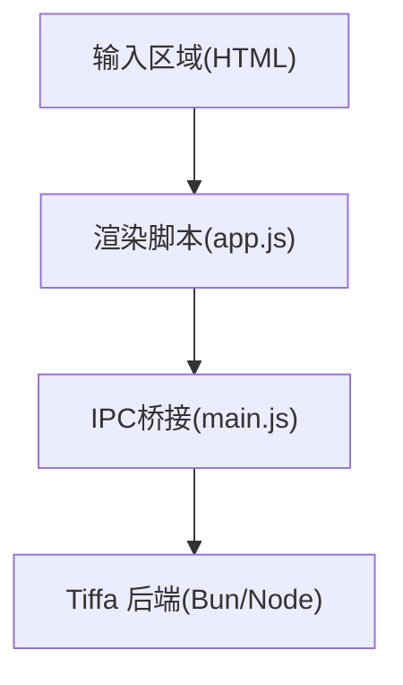
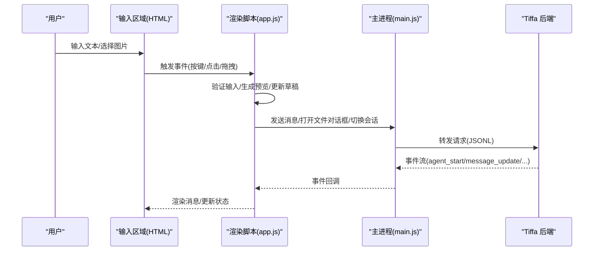
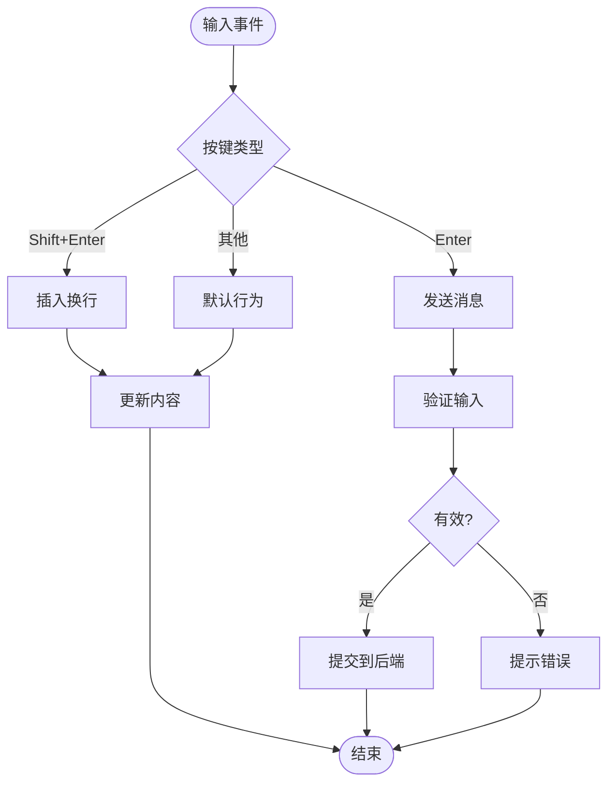
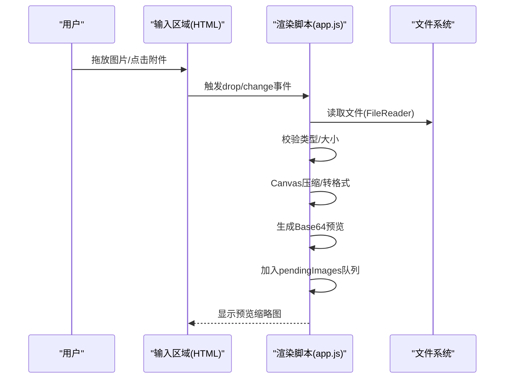
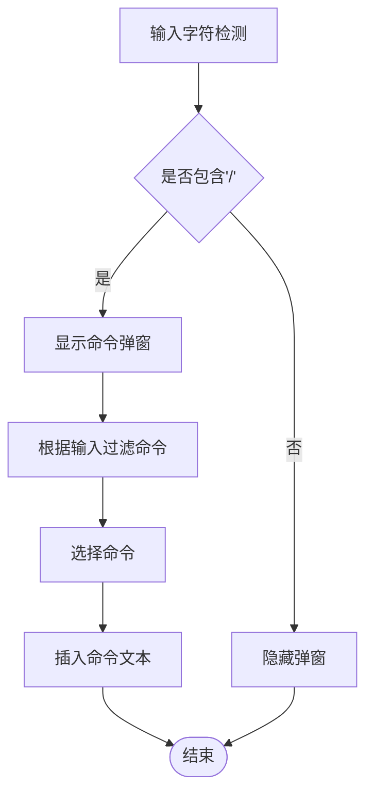
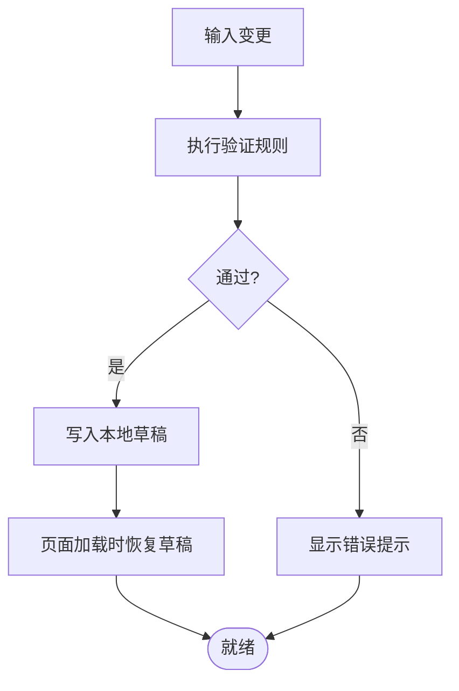
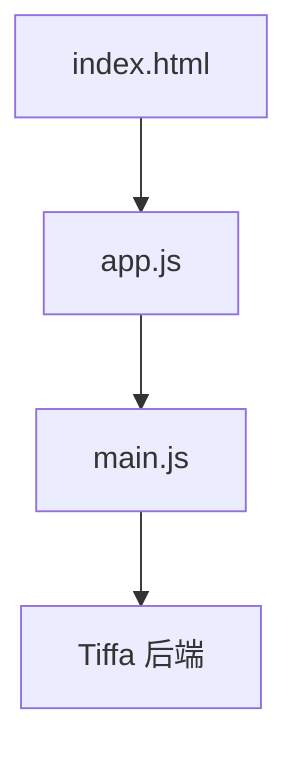

# 输入区域

<cite>
**本文引用的文件**   
- [electron/renderer/index.html](file://electron/renderer/index.html)
- [electron/renderer/app.js](file://electron/renderer/app.js)
- [electron/main.js](file://electron/main.js)
</cite>

## 目录
1. [简介](#简介)
2. [项目结构](#项目结构)
3. [核心组件](#核心组件)
4. [架构总览](#架构总览)
5. [详细组件分析](#详细组件分析)
6. [依赖关系分析](#依赖关系分析)
7. [性能考量](#性能考量)
8. [故障排查指南](#故障排查指南)
9. [结论](#结论)
10. [附录：API参考与扩展](#附录api参考与扩展)

## 简介
本章节面向“输入区域”组件，系统性阐述文本输入框、图片附件、快捷键支持、智能提示（Slash命令）、输入验证、自动保存/草稿机制、拖拽上传、预览、压缩与格式转换、响应式布局、无障碍与国际化，以及输入处理的API与自定义扩展方式。该组件位于 Electron 渲染进程的前端界面中，通过 IPC 与主进程及 Tiffa 后端交互，实现多会话、多实例的对话输入体验。

## 项目结构
输入区域由 HTML 模板与渲染脚本共同构成：
- HTML 定义输入区域的 DOM 结构与按钮、预览区、拖拽遮罩等元素
- app.js 负责事件绑定、状态管理、消息发送、图片处理、快捷键与智能提示逻辑
- main.js 提供 IPC 能力，用于文件选择、会话/项目切换、模型配置等系统级操作

图表来源
- [electron/renderer/index.html:84-110](file://electron/renderer/index.html#L84-L110)
- [electron/renderer/app.js:208-256](file://electron/renderer/app.js#L208-L256)
- [electron/main.js:114-120](file://electron/main.js#L114-L120)

章节来源
- [electron/renderer/index.html:84-110](file://electron/renderer/index.html#L84-L110)
- [electron/renderer/app.js:208-256](file://electron/renderer/app.js#L208-L256)
- [electron/main.js:114-120](file://electron/main.js#L114-L120)

## 核心组件
- 文本输入框：textarea，支持 Enter 发送、Shift+Enter 换行、自动高度自适应
- 图片附件：按钮触发文件选择、拖拽上传、预览缩略图、批量选择
- 快捷键：全局监听键盘事件，组合键控制发送、换行、取消生成
- 智能提示：Slash 命令弹窗，按用户输入动态过滤并补全
- 输入验证：长度限制、敏感字符过滤、附件类型校验
- 自动保存/草稿：本地缓存未发送内容，页面刷新后恢复
- 历史记录：会话历史面板，支持归档与删除
- 响应式设计：CSS 变量与媒体查询适配不同屏幕尺寸
- 无障碍：语义化标签、ARIA 属性、键盘可达性
- 国际化：占位符与提示文案可替换

章节来源
- [electron/renderer/index.html:84-110](file://electron/renderer/index.html#L84-L110)
- [electron/renderer/app.js:208-256](file://electron/renderer/app.js#L208-L256)

## 架构总览
输入区域在渲染进程中运行，通过 tiffaDesktop API 与主进程通信，再由主进程启动或复用 Tiffa 后端实例进行消息处理。

图表来源
- [electron/renderer/app.js:423-441](file://electron/renderer/app.js#L423-L441)
- [electron/main.js:114-120](file://electron/main.js#L114-L120)

章节来源
- [electron/renderer/app.js:423-441](file://electron/renderer/app.js#L423-L441)
- [electron/main.js:114-120](file://electron/main.js#L114-L120)

## 详细组件分析

### 文本输入框与快捷键
- 行为
  - Enter 发送消息；Shift+Enter 插入换行
  - 自动高度调整，避免滚动条出现
  - 焦点管理：新建会话后自动聚焦
- 快捷键
  - 全局监听键盘事件，拦截默认行为，确保一致性
- 错误处理
  - 空输入时禁用发送按钮
  - 超长输入提示截断策略

图表来源
- [electron/renderer/index.html:100](file://electron/renderer/index.html#L100)
- [electron/renderer/app.js:208-256](file://electron/renderer/app.js#L208-L256)

章节来源
- [electron/renderer/index.html:100](file://electron/renderer/index.html#L100)
- [electron/renderer/app.js:208-256](file://electron/renderer/app.js#L208-L256)

### 图片附件与拖拽上传
- 功能
  - 按钮触发文件选择，支持 PNG/JPEG/GIF/WebP
  - 拖拽上传：显示遮罩提示，接收 drop 事件
  - 预览：生成缩略图，支持移除
  - 压缩与格式转换：前端 Canvas 压缩、转 JPEG 或 WebP
- 流程
  - 选择/拖拽 → 校验类型与大小 → 读取为 Base64 → 生成预览 → 加入待发送队列

图表来源
- [electron/renderer/index.html:109](file://electron/renderer/index.html#L109)
- [electron/renderer/app.js:208-256](file://electron/renderer/app.js#L208-L256)

章节来源
- [electron/renderer/index.html:109](file://electron/renderer/index.html#L109)
- [electron/renderer/app.js:208-256](file://electron/renderer/app.js#L208-L256)

### 智能提示（Slash命令）
- 行为
  - 输入“/”触发弹窗，列出可用命令
  - 实时过滤匹配项，回车确认插入
- 扩展点
  - 命令注册表可扩展，支持动态加载
  - 可结合上下文提供建议

图表来源
- [electron/renderer/index.html:254](file://electron/renderer/index.html#L254)
- [electron/renderer/app.js:208-256](file://electron/renderer/app.js#L208-L256)

章节来源
- [electron/renderer/index.html:254](file://electron/renderer/index.html#L254)
- [electron/renderer/app.js:208-256](file://electron/renderer/app.js#L208-L256)

### 输入验证与自动保存/草稿
- 验证
  - 文本长度上限、非法字符过滤
  - 图片类型与大小限制
- 草稿
  - 本地存储未发送内容，页面刷新后恢复
  - 多会话独立草稿隔离

图表来源
- [electron/renderer/app.js:94-154](file://electron/renderer/app.js#L94-L154)

章节来源
- [electron/renderer/app.js:94-154](file://electron/renderer/app.js#L94-L154)

### 历史记录与草稿管理
- 历史面板
  - 展示非活跃会话，支持归档与删除
  - 右键菜单快捷操作
- 草稿
  - 每个会话独立草稿，避免冲突
  - 持久化到 localStorage

章节来源
- [electron/renderer/index.html:115-162](file://electron/renderer/index.html#L115-L162)
- [electron/renderer/app.js:1314-1463](file://electron/renderer/app.js#L1314-L1463)

### 响应式设计、无障碍与国际化
- 响应式
  - CSS 变量与媒体查询适配移动端与桌面端
  - 输入区域高度随内容自适应
- 无障碍
  - 语义化标签、ARIA 属性、键盘可达性
  - 焦点管理与提示音
- 国际化
  - 占位符与提示文案可替换，支持多语言包

章节来源
- [electron/renderer/index.html:1-11](file://electron/renderer/index.html#L1-11)
- [electron/renderer/app.js:208-256](file://electron/renderer/app.js#L208-L256)

## 依赖关系分析
输入区域依赖以下模块：
- HTML 模板：定义 DOM 结构与样式
- 渲染脚本：事件处理、状态管理、IPC 调用
- 主进程：文件对话框、会话/项目切换、模型配置
- 后端：消息处理、工具调用、流式输出

图表来源
- [electron/renderer/index.html:84-110](file://electron/renderer/index.html#L84-L110)
- [electron/renderer/app.js:208-256](file://electron/renderer/app.js#L208-L256)
- [electron/main.js:114-120](file://electron/main.js#L114-L120)

章节来源
- [electron/renderer/index.html:84-110](file://electron/renderer/index.html#L84-L110)
- [electron/renderer/app.js:208-256](file://electron/renderer/app.js#L208-L256)
- [electron/main.js:114-120](file://electron/main.js#L114-L120)

## 性能考量
- 图片压缩：使用 Canvas 压缩与格式转换，减少传输体积
- 草稿缓存：localStorage 读写优化，避免频繁 I/O
- 事件节流：输入事件防抖，减少重绘
- 内存管理：会话消息缓存上限，防止内存泄漏

## 故障排查指南
- 常见问题
  - 图片无法预览：检查 FileReader 权限与 MIME 类型
  - 草稿丢失：确认 localStorage 可用性与配额
  - 快捷键冲突：检查全局监听器优先级
- 调试技巧
  - 控制台日志：打印关键事件与状态
  - 网络监控：查看 IPC 请求与响应

章节来源
- [electron/renderer/app.js:94-154](file://electron/renderer/app.js#L94-L154)

## 结论
输入区域组件通过 HTML 与 JavaScript 协同工作，实现了丰富的输入体验，包括文本输入、图片附件、快捷键、智能提示、验证与草稿管理。其架构清晰，依赖明确，具备良好的可扩展性与维护性。

## 附录：API参考与扩展
- 输入处理 API
  - 发送消息：调用 tiffaDesktop.sendPrompt(text, images)
  - 获取草稿：tiffaDesktop.getDraft(sessionId)
  - 设置草稿：tiffaDesktop.setDraft(sessionId, content)
- 扩展方法
  - 注册新命令：在命令注册表中添加条目
  - 自定义验证规则：扩展验证函数列表
  - 图片处理器：替换默认压缩与格式转换逻辑

章节来源
- [electron/renderer/app.js:208-256](file://electron/renderer/app.js#L208-L256)
- [electron/main.js:114-120](file://electron/main.js#L114-L120)