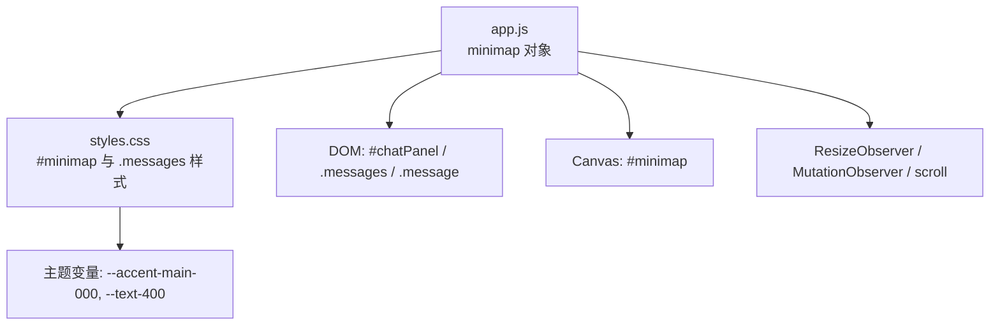
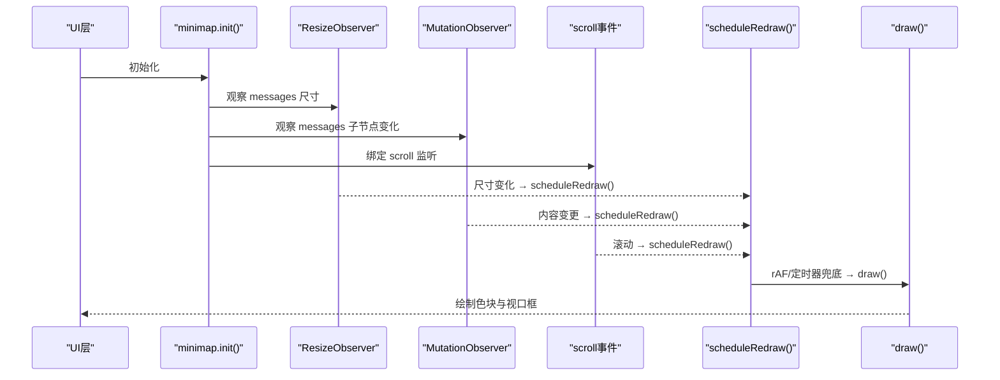
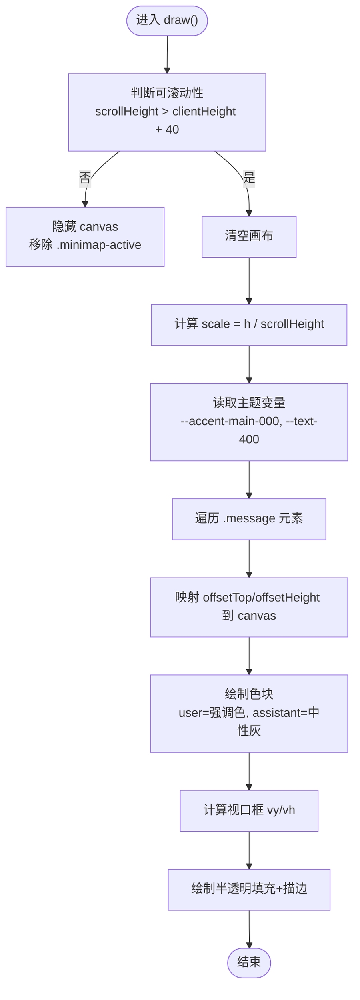
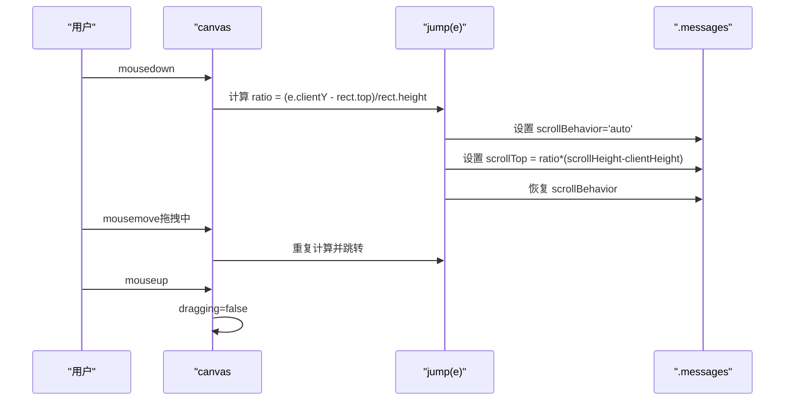
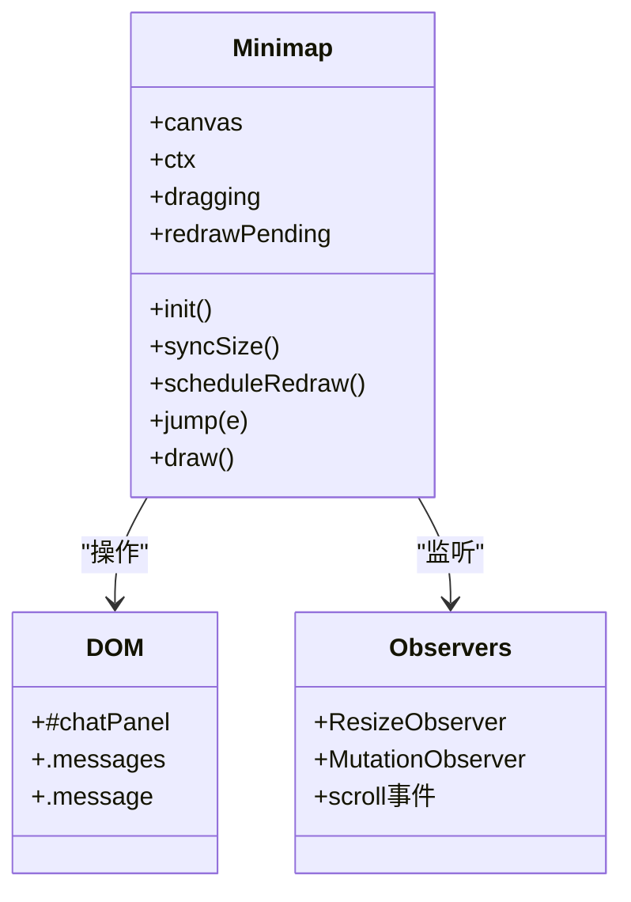

# 迷你地图

<cite>
**本文引用的文件**   
- [electron/renderer/app.js](file://electron/renderer/app.js)
- [electron/renderer/styles.css](file://electron/renderer/styles.css)
- [minimap-density-scrollbar.md](file://minimap-density-scrollbar.md)
</cite>

## 目录
1. [简介](#简介)
2. [项目结构](#项目结构)
3. [核心组件](#核心组件)
4. [架构总览](#架构总览)
5. [详细组件分析](#详细组件分析)
6. [依赖关系分析](#依赖关系分析)
7. [性能与内存优化](#性能与内存优化)
8. [交互特性与使用指南](#交互特性与使用指南)
9. [API 参考与样式配置](#api-参考与样式配置)
10. [故障排查](#故障排查)
11. [结论](#结论)

## 简介
本文件为 Tiffa 聊天消息区的“迷你地图”（Minimap）组件的完整技术文档。该组件以 Canvas 绘制引擎为核心，将消息密度可视化、视口指示与点击/拖拽跳转整合在一起，提供类似现代编辑器的“小地图”体验。它不依赖第三方库，通过 ResizeObserver、MutationObserver 和 scroll 事件驱动重绘，具备高分屏适配、主题同步、自动隐藏原生滚动条等能力。

## 项目结构
- 渲染进程主逻辑位于 electron/renderer/app.js，其中包含 minimap 对象及其初始化、尺寸同步、重绘调度、跳转与绘制实现。
- 样式定义位于 electron/renderer/styles.css，涵盖 #minimap 定位、透明度、悬停效果以及 .messages.minimap-active 对原生滚动条的隐藏策略。
- 设计说明与实现总结见 minimap-density-scrollbar.md，概述了整体架构、关键数字、边界处理与数据流时序。

图表来源 
- [electron/renderer/app.js:258-375](file://electron/renderer/app.js#L258-L375)
- [electron/renderer/styles.css:980-1020](file://electron/renderer/styles.css#L980-L1020)

章节来源
- [minimap-density-scrollbar.md:1-131](file://minimap-density-scrollbar.md#L1-L131)

## 核心组件
- minimap 对象：封装 canvas、ctx、状态标志（dragging、redrawPending），并提供 init、syncSize、scheduleRedraw、jump、draw 等方法。
- DOM 容器：#chatPanel 作为相对定位基准；.messages 为可滚动消息区；.message 为单条消息节点（区分 user/assistant）。
- Canvas 视图：#minimap 为右侧窄条画布，按消息位置/高度绘制色块，并叠加视口指示框。

章节来源
- [electron/renderer/app.js:258-375](file://electron/renderer/app.js#L258-L375)
- [electron/renderer/styles.css:980-1020](file://electron/renderer/styles.css#L980-L1020)

## 架构总览
迷你地图采用“观察者 + 事件驱动”的轻量架构：
- ResizeObserver 监听消息区尺寸变化 → 同步 canvas 尺寸与 DPR。
- MutationObserver 监听消息增删 → 触发重绘调度。
- scroll 事件监听滚动 → 更新视口指示框。
- 用户交互（mousedown/mousemove/mouseup）→ 计算比例并跳转 scrollTop。

图表来源 
- [electron/renderer/app.js:267-317](file://electron/renderer/app.js#L267-L317)
- [electron/renderer/app.js:311-317](file://electron/renderer/app.js#L311-L317)
- [electron/renderer/app.js:331-374](file://electron/renderer/app.js#L331-L374)

## 详细组件分析

### Canvas 绘制引擎
- 初始化：在 #chatPanel 内创建 canvas，设置 id="minimap"，获取 2D 上下文。
- 尺寸同步：固定宽度 14px，高度跟随 .messages.clientHeight；根据 devicePixelRatio 调整 canvas 像素尺寸，并通过 setTransform 使绘制坐标使用 CSS 像素。
- 重绘调度：使用 redrawPending 标志去重，优先 requestAnimationFrame，同时用 setTimeout(100ms) 兜底，确保后台或隐藏页也能重绘。
- 绘制流程：
  - 判定可滚动性：scrollHeight > clientHeight + 40 才显示；否则隐藏 canvas 并移除 .minimap-active。
  - 计算 scale = h / scrollHeight，读取主题变量 --accent-main-000 与 --text-400，生成用户/助手颜色。
  - 遍历 .message 元素，映射 offsetTop/offsetHeight 到 canvas 坐标，绘制色块（user 宽 8px，assistant 宽 6px，最小高度 2px）。
  - 绘制视口指示框：vy = scrollTop * scale，vh = max(clientHeight * scale, 6)，半透明填充 + 描边。

图表来源 
- [electron/renderer/app.js:331-374](file://electron/renderer/app.js#L331-L374)

章节来源
- [electron/renderer/app.js:295-309](file://electron/renderer/app.js#L295-L309)
- [electron/renderer/app.js:311-317](file://electron/renderer/app.js#L311-L317)
- [electron/renderer/app.js:331-374](file://electron/renderer/app.js#L331-L374)

### 消息密度可视化
- 角色区分：user 消息色块更宽（8px），使用强调色；assistant 消息色块较窄（6px），使用中性灰半透明。
- 密度表达：色块高度与消息实际高度成比例，短消息最小 2px，保证可见性。
- 主题同步：颜色从 CSS 变量动态读取，切换主题时无需手动刷新。

章节来源
- [electron/renderer/app.js:347-364](file://electron/renderer/app.js#L347-L364)
- [electron/renderer/styles.css:1044-1047](file://electron/renderer/styles.css#L1044-L1047)

### 视口指示与交互跳转
- 视口指示：根据 scrollTop 与 clientHeight 计算 vy/vh，实时反映当前可见区域。
- 点击跳转：mousedown 时计算鼠标 Y 坐标在 canvas 上的比例 ratio，映射到 msgs.scrollTop。
- 拖拽导航：mousemove 持续调用 jump(e)，mouseup 结束拖拽；为避免平滑滚动干扰，临时将 scrollBehavior 设为 auto，跳完恢复。

图表来源 
- [electron/renderer/app.js:283-289](file://electron/renderer/app.js#L283-L289)
- [electron/renderer/app.js:319-329](file://electron/renderer/app.js#L319-L329)

章节来源
- [electron/renderer/app.js:319-329](file://electron/renderer/app.js#L319-L329)

## 依赖关系分析
- DOM 依赖：#chatPanel（相对定位）、.messages（滚动容器）、.message（消息节点）。
- API 依赖：ResizeObserver、MutationObserver、window.devicePixelRatio、getComputedStyle。
- 样式依赖：CSS 变量 --accent-main-000、--text-400；.messages.minimap-active 控制原生滚动条显隐。

图表来源 
- [electron/renderer/app.js:258-375](file://electron/renderer/app.js#L258-L375)

章节来源
- [electron/renderer/app.js:258-375](file://electron/renderer/app.js#L258-L375)
- [electron/renderer/styles.css:980-1020](file://electron/renderer/styles.css#L980-L1020)

## 性能与内存优化
- 重绘节流：redrawPending 标志避免一帧内多次重绘；rAF 为主，setTimeout 兜底。
- 高分屏适配：根据 devicePixelRatio 缩放 canvas 像素尺寸，setTransform 保持坐标一致性。
- 隐藏后尺寸保护：缓存 cssW/cssH，避免 display:none 导致 clientWidth 为 0 的死锁。
- 观察者精准触发：仅监听 childList 变化与尺寸变化，减少无关重绘。
- 内存管理：无额外数据结构，仅维护少量状态标志；消息遍历直接基于 DOM，避免冗余缓存。

章节来源
- [electron/renderer/app.js:295-309](file://electron/renderer/app.js#L295-L309)
- [electron/renderer/app.js:311-317](file://electron/renderer/app.js#L311-L317)
- [electron/renderer/app.js:331-374](file://electron/renderer/app.js#L331-L374)

## 交互特性与使用指南
- 拖拽导航：在 #minimap 上按住鼠标拖动，实时跳转到对应位置。
- 点击跳转：单击任意位置，立即跳转到该比例对应的 scrollTop。
- 缩放适配：canvas 高度随 .messages.clientHeight 变化，自动适应输入区高度变化。
- 主题同步：颜色来自 CSS 变量，切换主题后自动更新。
- 原生滚动条互斥：当可滚动时隐藏原生滚动条，不可滚动时恢复。

章节来源
- [electron/renderer/app.js:283-289](file://electron/renderer/app.js#L283-L289)
- [electron/renderer/styles.css:1015-1019](file://electron/renderer/styles.css#L1015-L1019)

## API 参考与样式配置

### minimap API
- init(): 创建 canvas，绑定 ResizeObserver/MutationObserver/scroll，注册交互事件。
- syncSize(): 同步 canvas 尺寸与 DPR，设置 top/left 对齐，触发重绘。
- scheduleRedraw(): 节流重绘，优先 rAF，超时 100ms 兜底。
- jump(e): 根据鼠标 Y 坐标比例计算并设置 scrollTop。
- draw(): 绘制消息色块与视口指示框，处理可滚动性与主题颜色。

章节来源
- [electron/renderer/app.js:267-374](file://electron/renderer/app.js#L267-L374)

### 样式配置
- #minimap：绝对定位、右边缘 2px、z-index 5、指针样式、透明度 0.5、悬停变亮。
- .messages.minimap-active：隐藏原生滚动条（Firefox 与 WebKit）。
- 主题变量：--accent-main-000（用户强调色）、--text-400（助手中性色）。

章节来源
- [electron/renderer/styles.css:990-1020](file://electron/renderer/styles.css#L990-L1020)

## 故障排查
- 问题：minimap 不显示
  - 检查 .messages.scrollHeight 是否大于 clientHeight + 40。
  - 确认 #chatPanel 具有 position:relative。
- 问题：拖拽跳转卡顿
  - 检查 scrollBehavior 是否被其他样式覆盖；确保 jump() 中临时设置为 auto。
- 问题：高分屏模糊
  - 确认 devicePixelRatio 正确应用，canvas.width/height 已乘以 dpr。
- 问题：主题切换无效
  - 确认 getComputedStyle 能读取 --accent-main-000 与 --text-400。

章节来源
- [electron/renderer/app.js:331-374](file://electron/renderer/app.js#L331-L374)
- [electron/renderer/styles.css:980-1020](file://electron/renderer/styles.css#L980-L1020)

## 结论
Tiffa 的迷你地图组件以纯 Canvas 实现，结合观察者与事件驱动，提供了高效的消息密度可视化、视口指示与交互跳转功能。其设计简洁、零依赖、性能优异，且具备良好的主题同步与高分屏适配能力。通过合理的重绘策略与内存管理，能够在长对话场景中保持稳定表现。