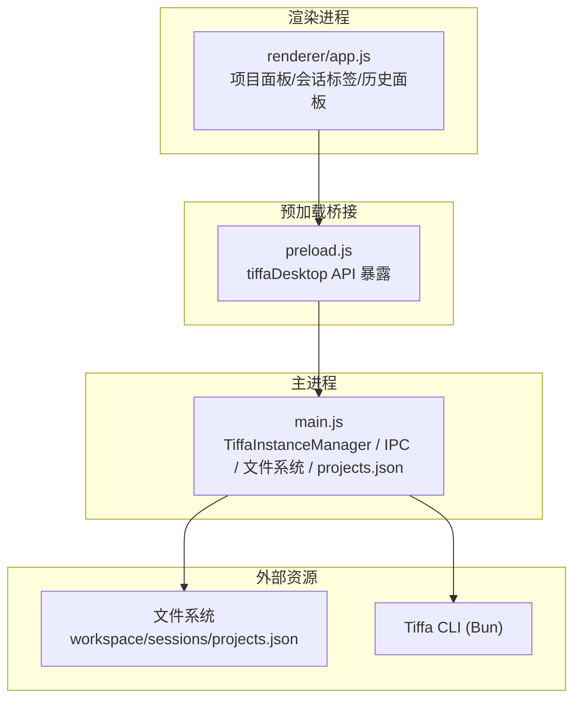
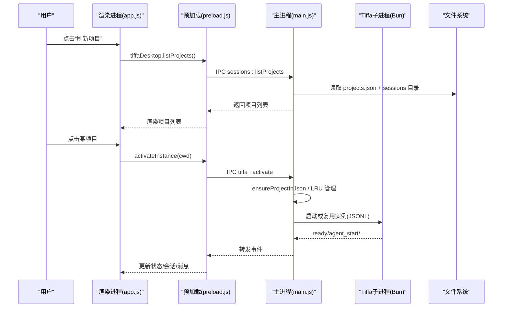
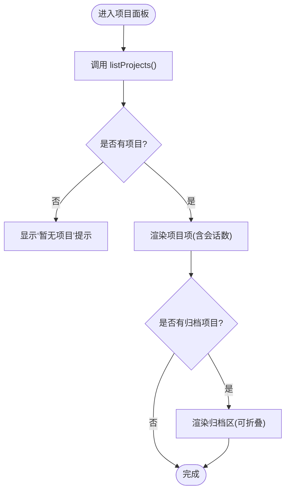
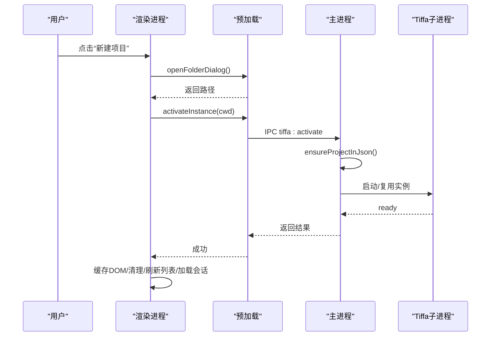
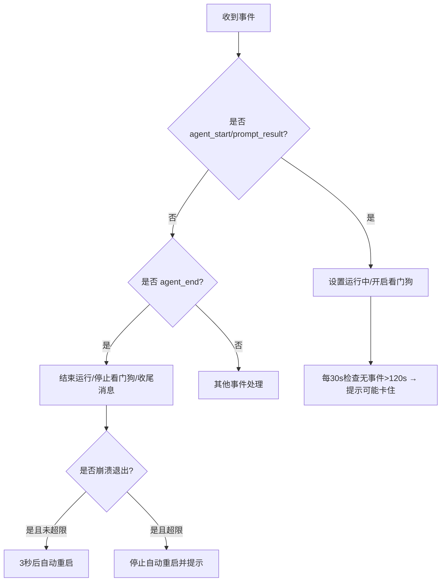
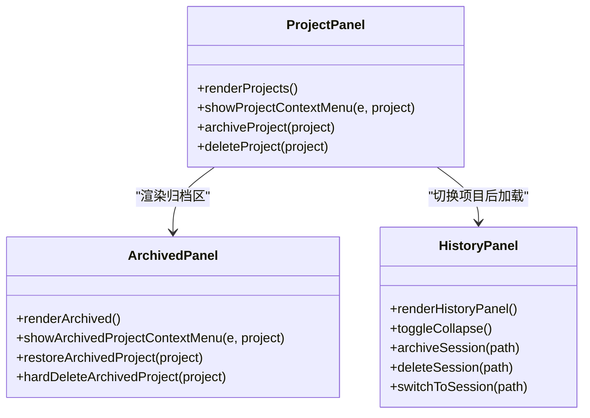
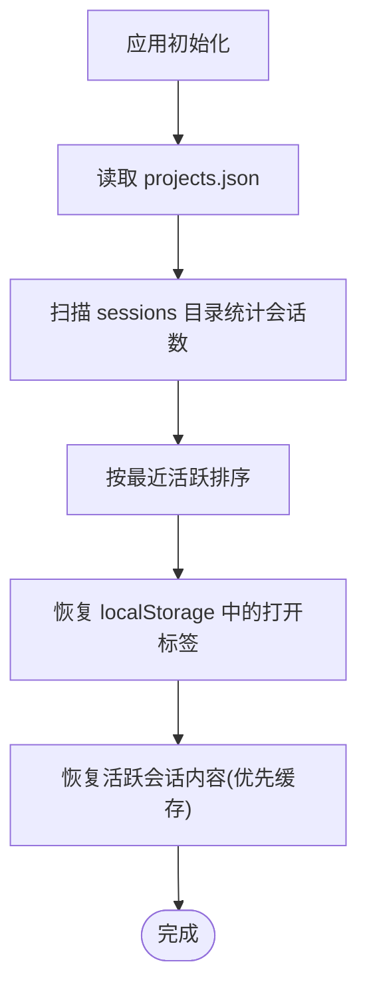
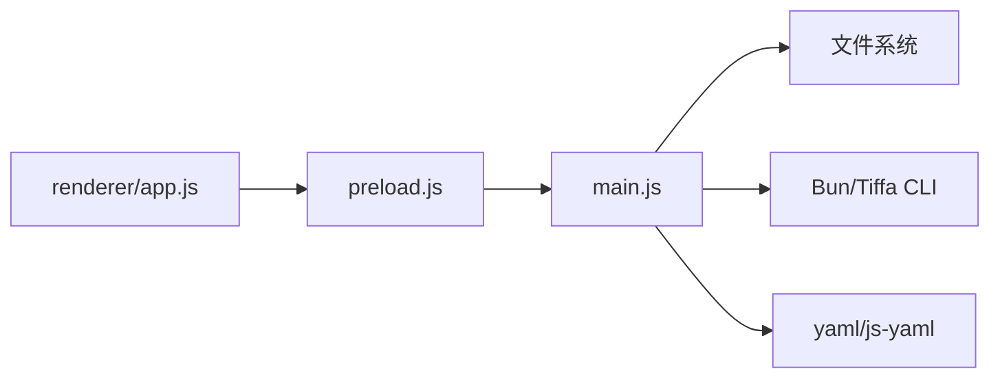

# 项目侧栏

<cite>
**本文引用的文件**   
- [README.md](file://README.md)
- [electron/main.js](file://electron/main.js)
- [electron/preload.js](file://electron/preload.js)
- [electron/renderer/app.js](file://electron/renderer/app.js)
</cite>

## 目录
1. [简介](#简介)
2. [项目结构](#项目结构)
3. [核心组件](#核心组件)
4. [架构总览](#架构总览)
5. [详细组件分析](#详细组件分析)
6. [依赖关系分析](#依赖关系分析)
7. [性能考量](#性能考量)
8. [故障排查指南](#故障排查指南)
9. [结论](#结论)
10. [附录：API参考与使用示例](#附录api参考与使用示例)

## 简介
本章节面向“项目侧栏”这一桌面端功能，系统性说明其职责、交互流程与数据流。项目侧栏负责：
- 项目列表的加载、展示与排序（按最近活跃）
- 新建/切换项目（懒启动 Tiffa 实例，LRU 淘汰）
- 项目归档与恢复、删除与防复活机制
- 会话标签管理（多对话独立进程）、历史面板折叠与操作
- 文件浏览与预览（通过主进程安全 IPC）
- 状态显示（就绪/思考中/可能卡住等）与错误提示

该能力由渲染进程 UI、预加载桥接与主进程管理器共同实现，并通过 JSONL 协议与 Tiffa 子进程通信。

**章节来源**
- [README.md:161-173](file://README.md#L161-L173)

## 项目结构
项目侧栏相关代码主要分布在三个层次：
- 渲染进程（UI 与交互）：electron/renderer/app.js
- 预加载桥接（安全 IPC 暴露）：electron/preload.js
- 主进程（实例管理、文件系统、持久化）：electron/main.js

**图表来源**
- [electron/renderer/app.js:800-1599](file://electron/renderer/app.js#L800-L1599)
- [electron/preload.js:24-104](file://electron/preload.js#L24-L104)
- [electron/main.js:325-570](file://electron/main.js#L325-L570)

**章节来源**
- [electron/renderer/app.js:800-1599](file://electron/renderer/app.js#L800-L1599)
- [electron/preload.js:24-104](file://electron/preload.js#L24-L104)
- [electron/main.js:325-570](file://electron/main.js#L325-L570)

## 核心组件
- 项目列表与归档区：渲染层渲染、右键菜单、点击选择、刷新按钮
- 会话标签与历史面板：新建对话、切换、关闭标签、归档/删除会话
- 实例管理器：TiffaInstance 生命周期、LRU 淘汰、自动重启、事件转发
- 持久化：projects.json、sessions 目录、localStorage 打开标签记忆
- 文件系统 IPC：listDir/readFile 等受限访问

**章节来源**
- [electron/renderer/app.js:853-942](file://electron/renderer/app.js#L853-L942)
- [electron/main.js:325-570](file://electron/main.js#L325-L570)
- [electron/main.js:1165-1253](file://electron/main.js#L1165-L1253)

## 架构总览
项目侧栏的数据与控制流如下：
- 渲染层发起 IPC（如 listProjects、activateInstance、listSessions）
- 主进程校验路径、注册项目、激活/复用实例、读取 sessions 目录
- 子进程通过 JSONL 事件回传（ready、agent_start/end、message_* 等）
- 渲染层根据事件更新 UI（消息、工具调用、状态）

**图表来源**
- [electron/renderer/app.js:853-871](file://electron/renderer/app.js#L853-L871)
- [electron/preload.js:62-100](file://electron/preload.js#L62-L100)
- [electron/main.js:809-823](file://electron/main.js#L809-L823)
- [electron/main.js:325-451](file://electron/main.js#L325-L451)

## 详细组件分析

### 项目列表与归档区
- 加载：调用 listProjects，同时拉取 archivedProjects；为空时显示引导提示
- 渲染：每个项目显示首字母图标、名称与会话数；归档区可折叠
- 交互：点击选择项目；右键菜单支持“在文件管理器中打开/归档/删除”
- 归档/恢复：归档后清空聊天区并显示欢迎页；恢复后重新加载项目列表

**图表来源**
- [electron/renderer/app.js:853-942](file://electron/renderer/app.js#L853-L942)

**章节来源**
- [electron/renderer/app.js:853-942](file://electron/renderer/app.js#L853-L942)

### 新建项目与切换项目
- 新建：弹出文件夹选择器，成功后切换到新 cwd，触发实例激活与项目列表刷新
- 切换：缓存当前会话 DOM（最多3份），停止旧看门狗，激活目标实例（懒启动/复用），恢复 agentRunning 状态，加载会话与标签

**图表来源**
- [electron/renderer/app.js:802-851](file://electron/renderer/app.js#L802-L851)
- [electron/main.js:809-823](file://electron/main.js#L809-L823)

**章节来源**
- [electron/renderer/app.js:802-851](file://electron/renderer/app.js#L802-L851)
- [electron/renderer/app.js:1132-1299](file://electron/renderer/app.js#L1132-L1299)
- [electron/main.js:1099-1124](file://electron/main.js#L1099-L1124)

### 项目刷新机制
- 刷新按钮直接调用 loadProjects()
- 首次加载会尝试自动选中首个项目并恢复打开标签
- 切换项目后也会重新加载会话列表与标签

**章节来源**
- [electron/renderer/app.js:853-871](file://electron/renderer/app.js#L853-L871)
- [electron/renderer/app.js:1301-1312](file://electron/renderer/app.js#L1301-L1312)

### 项目状态显示
- 就绪/思考中/可能卡住：基于事件与定时器（stall check）
- 崩溃处理：自动重启计数、达到上限后停止自动重启并提示

**图表来源**
- [electron/renderer/app.js:484-546](file://electron/renderer/app.js#L484-L546)
- [electron/renderer/app.js:648-701](file://electron/renderer/app.js#L648-L701)
- [electron/main.js:144-173](file://electron/main.js#L144-L173)

**章节来源**
- [electron/renderer/app.js:484-546](file://electron/renderer/app.js#L484-L546)
- [electron/renderer/app.js:648-701](file://electron/renderer/app.js#L648-L701)
- [electron/main.js:144-173](file://electron/main.js#L144-L173)

### 项目面板交互逻辑（选择/展开/折叠/右键菜单）
- 选择：点击项目项触发 selectProject(dirName)
- 展开/折叠：归档区头部点击切换 archiveCollapsed
- 右键菜单：自定义 context-menu，定位视口内，点击空白关闭
- 历史面板：折叠/展开、归档/删除会话、点击恢复到活跃标签

**图表来源**
- [electron/renderer/app.js:873-942](file://electron/renderer/app.js#L873-L942)
- [electron/renderer/app.js:944-1130](file://electron/renderer/app.js#L944-L1130)
- [electron/renderer/app.js:1319-1463](file://electron/renderer/app.js#L1319-L1463)

**章节来源**
- [electron/renderer/app.js:873-942](file://electron/renderer/app.js#L873-L942)
- [electron/renderer/app.js:944-1130](file://electron/renderer/app.js#L944-L1130)
- [electron/renderer/app.js:1319-1463](file://electron/renderer/app.js#L1319-L1463)

### 项目数据的加载、缓存与持久化
- 加载：listProjects 从 projects.json 读取，统计 sessions 数量并按最新活动排序
- 缓存：sessionMessageCache 缓存 DOM 与滚动位置（上限3份），避免重复加载
- 持久化：
  - projects.json：项目元信息（cwd、displayName、addedAt、lastOpenedAt、archived）
  - localStorage：每个项目的打开标签集合与活跃标签
  - session-model-map.json：会话级模型映射

**图表来源**
- [electron/main.js:1666-1702](file://electron/main.js#L1666-L1702)
- [electron/renderer/app.js:1556-1583](file://electron/renderer/app.js#L1556-L1583)
- [electron/renderer/app.js:1136-1147](file://electron/renderer/app.js#L1136-L1147)

**章节来源**
- [electron/main.js:1666-1702](file://electron/main.js#L1666-L1702)
- [electron/renderer/app.js:1556-1583](file://electron/renderer/app.js#L1556-L1583)
- [electron/renderer/app.js:1136-1147](file://electron/renderer/app.js#L1136-L1147)

### 文件浏览与预览（侧边栏）
- 通过 fs:listDir 与 fs:readFile 获取目录与文件内容（限制大小、路径白名单）
- 渲染层用于文件树与预览面板（不在本节详述具体渲染，但接口已暴露）

**章节来源**
- [electron/main.js:826-856](file://electron/main.js#L826-L856)
- [electron/preload.js:47-51](file://electron/preload.js#L47-L51)

## 依赖关系分析
- 渲染层依赖 preload 暴露的 tiffaDesktop API
- 主进程依赖 Electron 模块、fs、child_process、yaml 解析
- 子进程通过 Bun 启动 Tiffa CLI，JSONL 协议通信
- 持久化依赖文件系统（projects.json、sessions、localStorage）

**图表来源**
- [electron/preload.js:24-104](file://electron/preload.js#L24-L104)
- [electron/main.js:1-29](file://electron/main.js#L1-L29)

**章节来源**
- [electron/preload.js:24-104](file://electron/preload.js#L24-L104)
- [electron/main.js:1-29](file://electron/main.js#L1-L29)

## 性能考量
- 懒加载与缓存：会话 DOM 缓存（上限3份），避免重复渲染大文档
- 代码块懒高亮：IntersectionObserver 仅对可视区域执行 hljs
- 最小化重绘：批量插入 DocumentFragment，减少多次 DOM 操作
- 实例管理：LRU 淘汰最久未活跃实例，控制最大并发（MAX_INSTANCES=8）
- 看门狗：长时间无事件提示“可能卡住”，避免假死

[无需来源：本节为通用优化建议总结]

## 故障排查指南
- 项目无法加载：检查 projects.json 是否存在、路径是否有效；查看主进程日志
- 切换项目失败：确认路径存在且在 workspace 下；检查 ensureProjectInJson 是否创建目录
- 会话无法恢复：检查 localStorage 键名是否正确；确认 sessions 目录存在对应 .jsonl
- 子进程频繁崩溃：观察自动重启次数，超过上限后需检查模型服务/网络
- 文件读取过大：fs:readFile 限制 5MB，超大文件需分片或后端处理

**章节来源**
- [electron/main.js:1165-1253](file://electron/main.js#L1165-L1253)
- [electron/main.js:826-856](file://electron/main.js#L826-L856)
- [electron/renderer/app.js:703-730](file://electron/renderer/app.js#L703-L730)

## 结论
项目侧栏以清晰的三层架构（渲染/预加载/主进程）实现了稳定的项目管理与多会话体验。通过懒启动、LRU 淘汰、事件驱动与本地持久化，兼顾了性能与可用性。开发者可基于现有 IPC 接口扩展更多项目管理能力（如批量导入、模板化项目）。

[无需来源：本节为总结性内容]

## 附录：API参考与使用示例

### IPC API（tiffaDesktop）
- 项目与会话
  - listProjects(): Promise<Project[]>
  - listSessions(dirName): Promise<Session[]>
  - switchSession(sessionPath): Promise<void>
  - newSession(): Promise<void>
  - loadSessionHistory(sessionPath): Promise<{messages:[], error?}>
  - archiveProject(dirName): Promise<{success|error}>
  - deleteProject(dirName): Promise<{success|error}>
  - listArchivedProjects(): Promise<Project[]>
  - restoreProject(dirName): Promise<{success|error}>
  - archiveSession(sessionPath): Promise<{success|error}>
  - deleteSession(sessionPath): Promise<{success|error}>
  - renameSession(sessionPath, newTitle): Promise<{success|error}>
  - listArchivedSessions(projectDirName): Promise<Session[]>
  - restoreSession(sessionPath): Promise<{success|error}>
  - getUserEntries(sessionPath): Promise<UserEntry[]>
  - exportSessionHtml(sessionPath): Promise<string>
  - getRemovedCwds(): Promise<string[]>
  - addRemovedCwd(cwd): Promise<void>
  - removeRemovedCwd(cwd): Promise<void>
- 工作区与实例
  - openFolderDialog(): Promise<{canceled,path,error}>
  - changeWorkspace(newCwd): Promise<{success,cwd,error}>
  - activateInstance(cwd): Promise<{success,cwd,ready,error}>
  - activateSession(cwd, sessionId): Promise<{success,cwd,sessionId,ready,error}>
  - closeSession(cwd, sessionId): Promise<{success|error}>
  - getInstances(): Promise<InstanceStatus[]>
- 文件与系统
  - listDir(dirPath): Promise<FileEntry[]>
  - readFile(filePath): Promise<{content,error}>
  - writeFile(filePath, content): Promise<{success|error}>
  - readImage(filePath): Promise<{dataUrl,error}>
  - openExternal(url): Promise<void>
  - openPath(filePath): Promise<void>
  - getWorkspacePath(): Promise<string>
  - getRootPath(): Promise<string>
- 模型与配置
  - setModel(provider, modelId, sessionId): Promise<void>
  - getModels(): Promise<ModelInfo[]>
  - getState(): Promise<StateInfo>
  - isReady(): Promise<boolean>
  - diagnostics(): Promise<Diagnostics>
  - steer(message, sessionId): Promise<void>
  - followUp(message, sessionId): Promise<void>
  - extensionResponse(id, value): Promise<void>
  - compact(): Promise<void>
  - command(type, payload): Promise<any>
  - readModelsYml(): Promise<string>
  - writeModelsYml(content): Promise<{success|error}>
  - restartTiffa(): Promise<void>
  - writeTiffaProvider(providerId, cfg): Promise<{success|error}>
  - deleteTiffaProvider(providerId): Promise<{success|error}>
  - writeApprovalMode(tiffaMode): Promise<void>
  - getXmlTranslationStatus(): Promise<boolean>
  - toggleXmlTranslation(enabled): Promise<void>

**章节来源**
- [electron/preload.js:24-104](file://electron/preload.js#L24-L104)

### 使用示例（概念性）
- 刷新项目列表并自动选择第一个
  - 调用 listProjects()，若返回非空则 selectProject(projects[0].dirName)
- 新建对话并激活独立进程
  - 生成 tempSessionId，调用 activateSession(cwd, tempSessionId)，随后设置模型并聚焦输入框
- 切换项目并恢复上次打开的标签
  - 调用 activateInstance(cwd)，恢复 localStorage 中的 activeSessionPaths，优先从缓存恢复 DOM

[无需来源：本节为概念性用法说明]