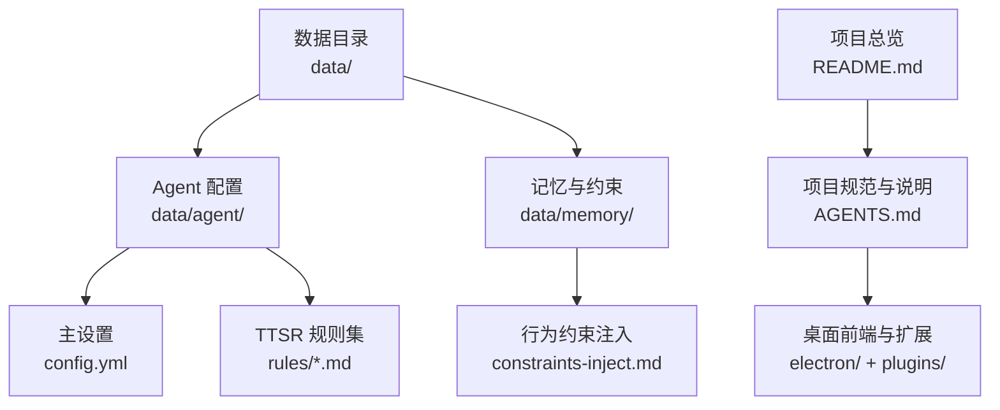
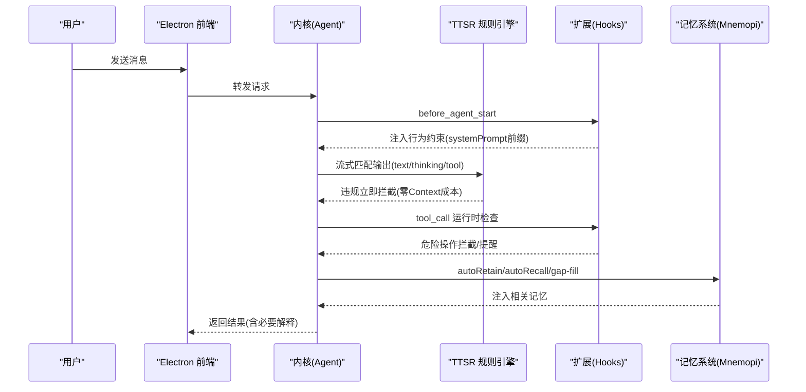
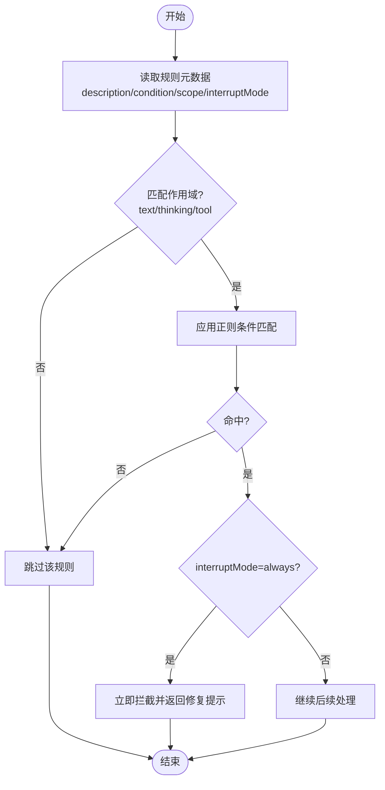
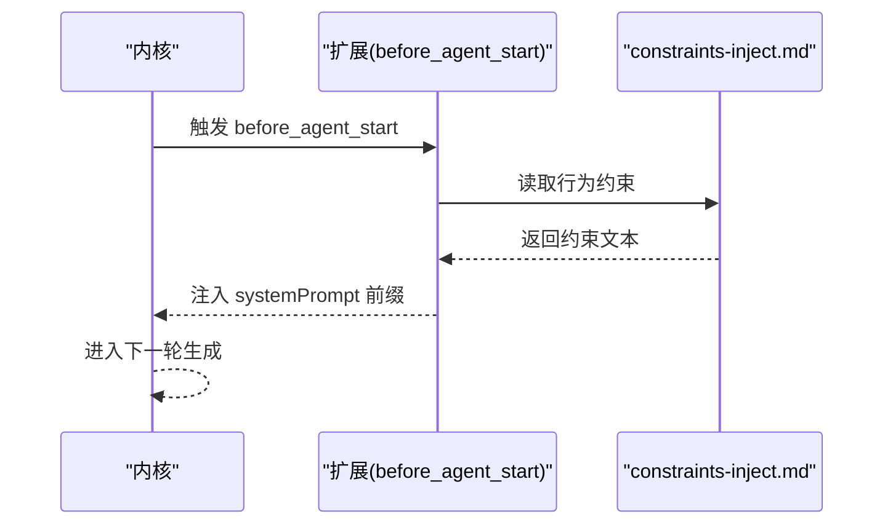
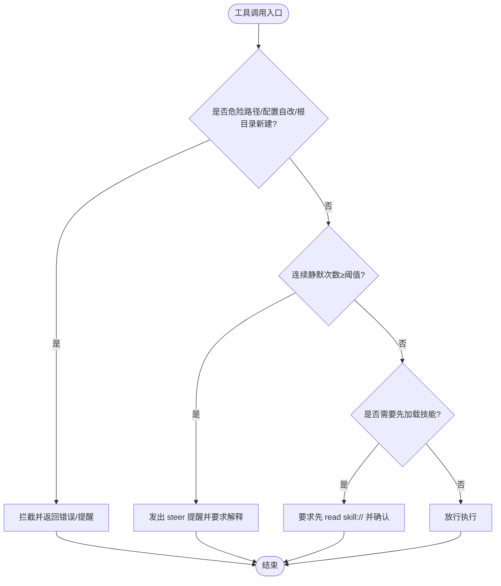
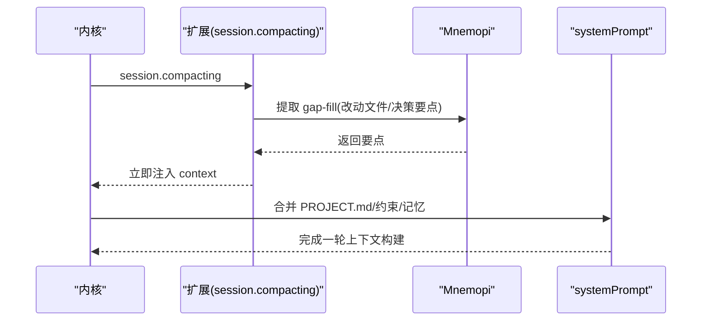
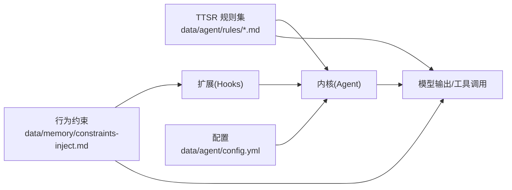

# Agent规则与安全机制

<cite>
**本文引用的文件**
- [AGENTS.md](file://AGENTS.md)
- [README.md](file://README.md)
- [config.yml](file://data/agent/config.yml)
- [no-bare-codeblock.md](file://data/agent/rules/no-bare-codeblock.md)
- [no-hardcoded-secrets.md](file://data/agent/rules/no-hardcoded-secrets.md)
- [cwd-file-placement.md](file://data/agent/rules/cwd-file-placement.md)
- [tool-call-commentary.md](file://data/agent/rules/tool-call-commentary.md)
- [no-xml-toolcall.md](file://data/agent/rules/no-xml-toolcall.md)
- [no-git-add-all.md](file://data/agent/rules/no-git-add-all.md)
- [no-md-filepath-link.md](file://data/agent/rules/no-md-filepath-link.md)
- [chinese-punctuation.md](file://data/agent/rules/chinese-punctuation.md)
- [constraints-inject.md](file://data/memory/constraints-inject.md)
</cite>

## 目录
1. [引言](#引言)
2. [项目结构](#项目结构)
3. [核心组件](#核心组件)
4. [架构总览](#架构总览)
5. [详细组件分析](#详细组件分析)
6. [依赖关系分析](#依赖关系分析)
7. [性能考量](#性能考量)
8. [故障排查指南](#故障排查指南)
9. [结论](#结论)
10. [附录](#附录)

## 引言
本文件聚焦于 Tiffa 的 Agent 规则与安全机制，系统性梳理“三层约束体系”与“TTSR 流式规则”的设计、实现与运行方式，并说明行为约束注入、工具调用拦截、记忆系统配合等关键安全点。目标是帮助开发者与使用者理解如何在零上下文成本的前提下，对模型输出进行实时拦截与纠正，确保弱模型也能稳定、安全地完成智能体任务。

## 项目结构
围绕 Agent 规则与安全机制的相关目录与文件如下：
- data/agent/rules：TTSR 规则集合（文本/工具/思考阶段匹配）
- data/memory/constraints-inject.md：before_agent_start 注入的行为约束
- data/agent/config.yml：模型角色与 Mnemopi 记忆配置
- AGENTS.md：项目规范、启动方式、扩展与技能说明
- README.md：整体介绍与七层改造概览

图表来源
- [AGENTS.md](file://AGENTS.md)
- [README.md](file://README.md)
- [config.yml](file://data/agent/config.yml)
- [constraints-inject.md](file://data/memory/constraints-inject.md)

章节来源
- [AGENTS.md](file://AGENTS.md)
- [README.md](file://README.md)
- [config.yml](file://data/agent/config.yml)

## 核心组件
- TTSR 流式规则：以 .md 为载体的规则文件，通过 condition/scope/interruptMode/repeatMode 控制匹配范围与拦截时机，不占用上下文 token。
- before_agent_start 行为约束：在每轮 agent 启动前注入 systemPrompt 前缀，覆盖语义/行为类约束。
- tool_call Hook：运行时拦截危险路径、配置文件自改、workspace 根目录新建子目录、静默工具调用检测等。
- 记忆系统（Mnemopi）：全局 RAG 与断片恢复（gap-fill），与规则/约束协同，保证长对话不断片且上下文可控。

章节来源
- [AGENTS.md](file://AGENTS.md)
- [README.md](file://README.md)

## 架构总览
下图展示从用户输入到规则拦截、行为约束注入、工具调用拦截与记忆注入的整体流程。

图表来源
- [AGENTS.md](file://AGENTS.md)
- [README.md](file://README.md)

## 详细组件分析

### TTSR 规则子系统
TTSR 规则以 Markdown 元数据驱动，支持 text、thinking、tool 等多作用域，以及 always/never 等中断模式。典型规则包括：
- no-bare-codeblock.md：代码块必须标注语言
- no-xml-toolcall.md：禁止 XML 格式工具调用
- no-md-filepath-link.md：禁止用 Markdown 链接包裹文件路径
- chinese-punctuation.md：中文正文使用全角标点
- tool-call-commentary.md：每次工具调用后必须附带中文解释
- no-git-add-all.md：禁止 git add -A/.
- no-hardcoded-secrets.md：禁止硬编码密钥
- cwd-file-placement.md：中间产物放 .temp/，严禁写到 workspace 根

图表来源
- [no-bare-codeblock.md](file://data/agent/rules/no-bare-codeblock.md)
- [no-xml-toolcall.md](file://data/agent/rules/no-xml-toolcall.md)
- [no-md-filepath-link.md](file://data/agent/rules/no-md-filepath-link.md)
- [chinese-punctuation.md](file://data/agent/rules/chinese-punctuation.md)
- [tool-call-commentary.md](file://data/agent/rules/tool-call-commentary.md)
- [no-git-add-all.md](file://data/agent/rules/no-git-add-all.md)
- [no-hardcoded-secrets.md](file://data/agent/rules/no-hardcoded-secrets.md)
- [cwd-file-placement.md](file://data/agent/rules/cwd-file-placement.md)

章节来源
- [no-bare-codeblock.md](file://data/agent/rules/no-bare-codeblock.md)
- [no-xml-toolcall.md](file://data/agent/rules/no-xml-toolcall.md)
- [no-md-filepath-link.md](file://data/agent/rules/no-md-filepath-link.md)
- [chinese-punctuation.md](file://data/agent/rules/chinese-punctuation.md)
- [tool-call-commentary.md](file://data/agent/rules/tool-call-commentary.md)
- [no-git-add-all.md](file://data/agent/rules/no-git-add-all.md)
- [no-hardcoded-secrets.md](file://data/agent/rules/no-hardcoded-secrets.md)
- [cwd-file-placement.md](file://data/agent/rules/cwd-file-placement.md)

### 行为约束注入（before_agent_start）
- 位置：data/memory/constraints-inject.md
- 内容要点：读文件规范、3次失败换方法、先计划再执行、错误先分析、最小手术、专业任务必须先 read skill:// 加载步骤、沟通规范、安全硬规（不读取敏感文件、不泄露堆栈/路径、外部输入必校验）。
- 注入时机：每轮 agent 启动前由扩展注入 systemPrompt 前缀，补充 TTSR 无法覆盖的语义/行为约束。

图表来源
- [constraints-inject.md](file://data/memory/constraints-inject.md)
- [AGENTS.md](file://AGENTS.md)

章节来源
- [constraints-inject.md](file://data/memory/constraints-inject.md)
- [AGENTS.md](file://AGENTS.md)

### 工具调用拦截（tool_call Hook）
- 危险路径拦截：System32、Windows、Program Files 等
- 配置文件自改拦截：config.yml、models.yml、扩展文件等
- workspace 根目录新建一级子目录拦截
- 静默工具调用检测：连续多次无文字说明时触发 steer 提醒
- 技能强制：调用特定脚本前必须先 read skill:// 加载步骤并询问用户

图表来源
- [AGENTS.md](file://AGENTS.md)

章节来源
- [AGENTS.md](file://AGENTS.md)

### 记忆系统与规则/约束协同
- Mnemopi 配置：scoping、autoRecall、autoRetain、retainEveryNTurns、recallLimit、injectionTokenLimit 等
- 确定性注入：PROJECT.md → before_agent_start hook
- 断片恢复：session.compacting 钩子提取 gap-fill，立即注入
- 全量积累：global 库 autoRetain，跨项目语义检索

图表来源
- [AGENTS.md](file://AGENTS.md)
- [config.yml](file://data/agent/config.yml)

章节来源
- [AGENTS.md](file://AGENTS.md)
- [config.yml](file://data/agent/config.yml)

## 依赖关系分析
- 规则文件之间相互独立，按 scope 与 interruptMode 生效，互不耦合
- constraints-inject.md 作为行为约束源，被扩展在 before_agent_start 注入
- config.yml 提供模型角色与 Mnemopi 参数，影响记忆注入策略
- AGENTS.md 与 README.md 提供总体说明与启动方式，指导扩展与前端集成

图表来源
- [AGENTS.md](file://AGENTS.md)
- [config.yml](file://data/agent/config.yml)
- [constraints-inject.md](file://data/memory/constraints-inject.md)

章节来源
- [AGENTS.md](file://AGENTS.md)
- [config.yml](file://data/agent/config.yml)
- [constraints-inject.md](file://data/memory/constraints-inject.md)

## 性能考量
- TTSR 规则采用流式匹配，零上下文成本，避免增加 token 消耗
- 记忆注入上限（如 injectionTokenLimit）防止上下文膨胀
- autoRecall/autoRetain 与 recallLimit 平衡召回质量与上下文大小
- gap-fill 仅在压缩时触发，减少常规流程开销

[本节为通用指导，无需引用具体文件]

## 故障排查指南
- 规则未生效：检查 rule 文件的 scope/interruptMode 是否与目标阶段匹配；确认 condition 正则是否正确
- 工具调用被误拦：核对危险路径/配置自改/根目录新建逻辑；查看静默调用计数阈值
- 记忆未注入：确认 settings 数据库写入是否生效（嵌套写法不生效）；检查 autoRecall/autoRetain 开关
- 技能未按步骤执行：确认是否先 read skill:// 加载 SKILL.md，再严格按步骤执行

章节来源
- [AGENTS.md](file://AGENTS.md)
- [config.yml](file://data/agent/config.yml)

## 结论
Tiffa 的 Agent 规则与安全机制通过“TTSR 流式规则 + before_agent_start 行为约束 + tool_call 运行时拦截 + 记忆系统协同”，在零上下文成本与强安全边界下，使弱模型也能稳定完成任务。建议持续完善规则集、优化记忆注入策略，并结合前端与扩展能力提升用户体验与可维护性。

[本节为总结性内容，无需引用具体文件]

## 附录
- 规则清单与作用域速查：见各 rules/*.md 文件
- 行为约束要点：见 constraints-inject.md
- 记忆配置项：见 config.yml

[本节为参考信息，无需引用具体文件]