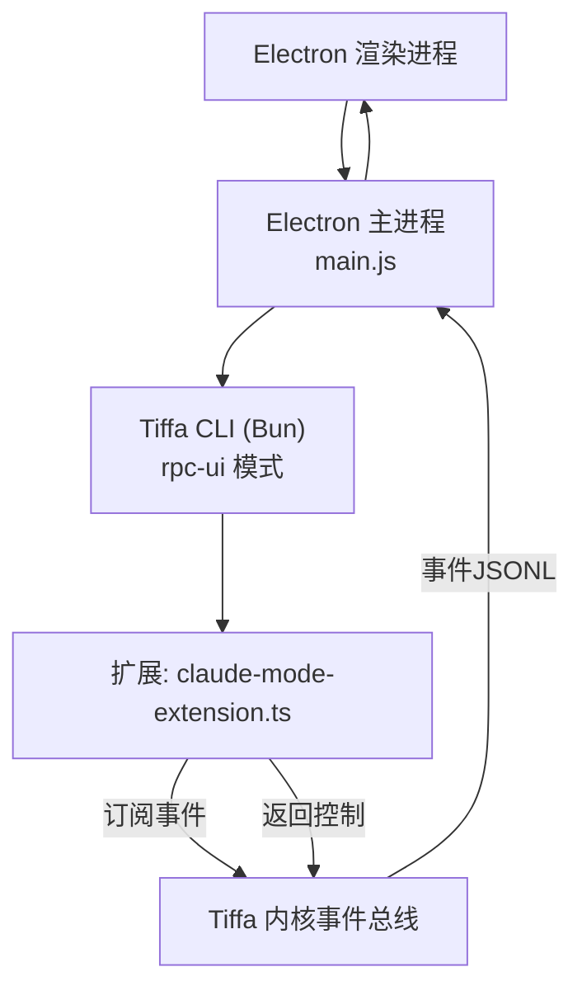
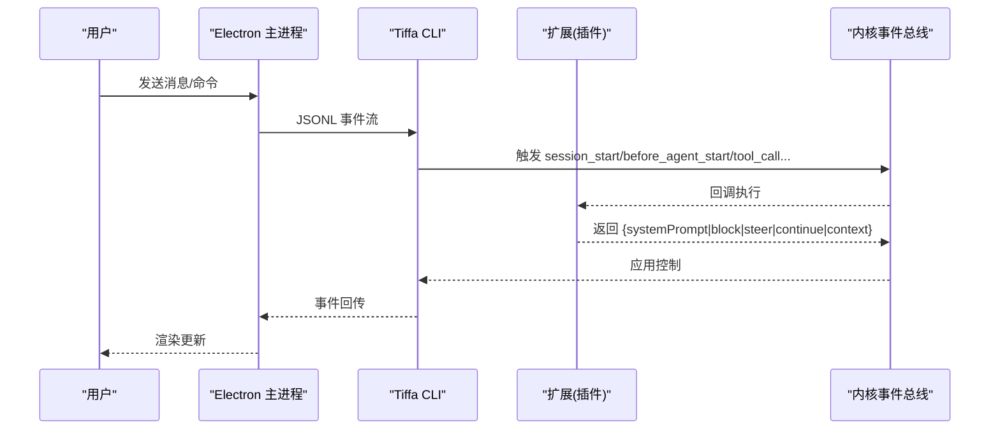
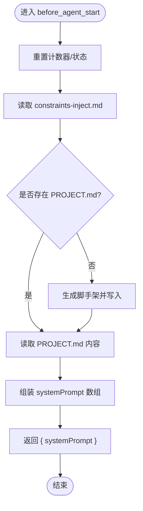
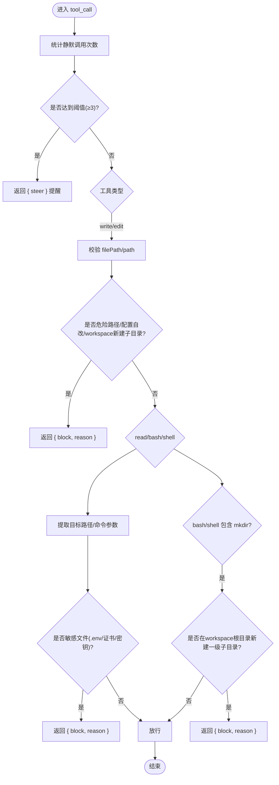

# Hook约束机制

<cite>
**本文引用的文件**   
- [plugins/claude-mode-extension.ts](file://plugins/claude-mode-extension.ts)
- [electron/main.js](file://electron/main.js)
- [AGENTS.md](file://AGENTS.md)
- [README.md](file://README.md)
- [data/agent/rules/no-xml-toolcall.md](file://data/agent/rules/no-xml-toolcall.md)
</cite>

## 目录
1. [简介](#简介)
2. [项目结构](#项目结构)
3. [核心组件](#核心组件)
4. [架构总览](#架构总览)
5. [详细组件分析](#详细组件分析)
6. [依赖关系分析](#依赖关系分析)
7. [性能考虑](#性能考虑)
8. [故障排查指南](#故障排查指南)
9. [结论](#结论)
10. [附录](#附录)

## 简介
本文件系统性阐述 Tiffa 的 Hook 约束机制，重点覆盖：
- before_agent_start Hook 的语义约束与确定性注入（PROJECT.md、行为约束）
- tool_call Hook 的危险操作拦截（路径、配置、密钥、静默调用等）
- Hook 系统的事件监听与回调处理流程
- Claude Mode Extension 的实现原理与安全策略配置
- Hook 函数的参数结构与返回值约定
- 开发最佳实践、错误处理策略与性能优化建议

## 项目结构
Tiffa 通过 Electron 主进程启动 Tiffa CLI（Bun），并以 JSONL 事件流进行通信。扩展通过 -e 参数加载，订阅内核事件（session_start、before_agent_start、tool_call、session_stop、session.compacting、tool_result），实现约束与增强。



**图表来源** 
- [electron/main.js](file://electron/main.js)
- [plugins/claude-mode-extension.ts](file://plugins/claude-mode-extension.ts)

**章节来源**
- [electron/main.js](file://electron/main.js)
- [README.md](file://README.md)

## 核心组件
- 扩展入口与事件注册：在扩展中统一注册 6 个 Hook，完成工具清理、行为约束注入、危险操作拦截、会话收尾续行、上下文压缩补救、结果审计与泄露防护。
- 安全策略与规则：TTSR 规则（零 Context 成本）+ before_agent_start（语义约束）+ tool_call（运行时拦截）。
- 记忆与确定性注入：PROJECT.md 自动生成与每轮注入；Mnemopi 语义记忆（autoRetain/manual recall）。

**章节来源**
- [plugins/claude-mode-extension.ts](file://plugins/claude-mode-extension.ts)
- [AGENTS.md](file://AGENTS.md)
- [README.md](file://README.md)

## 架构总览
Hook 系统以“事件驱动 + 可插拔回调”为核心，扩展通过 pi.on(...) 订阅事件，并在回调中返回控制指令（如 systemPrompt、block、steer、continue、context 等）影响内核行为。



**图表来源** 
- [electron/main.js](file://electron/main.js)
- [plugins/claude-mode-extension.ts](file://plugins/claude-mode-extension.ts)

## 详细组件分析

### before_agent_start Hook：语义约束与确定性注入
- 功能要点
  - 重置每轮计数（如静默工具调用计数）
  - 读取并注入行为约束文件（constraints-inject.md）
  - 首次对话时生成 PROJECT.md 脚手架，并每轮读取其内容注入 systemPrompt
  - 注入记忆工具使用提示（recall/retain/memory_edit）
  - 确保活跃工具列表（移除 eval/hub，补入记忆工具）
- 返回值约定
  - 返回 { systemPrompt: string[] } 将多段文本拼接为系统提示前缀
- 关键实现位置
  - 工具清理函数 sanitizeTools(tag)
  - before_agent_start 回调中的注入逻辑



**图表来源** 
- [plugins/claude-mode-extension.ts](file://plugins/claude-mode-extension.ts)

**章节来源**
- [plugins/claude-mode-extension.ts](file://plugins/claude-mode-extension.ts)
- [AGENTS.md](file://AGENTS.md)

### tool_call Hook：危险操作拦截与静默调用检测
- 功能要点
  - 静默工具调用检测：连续多次无文字说明 → steer 提醒
  - 写入类工具（edit/write）路径安全检查：
    - 禁止危险路径（System32、Windows、Program Files）
    - 禁止自改配置文件（config.yml/models.yml/扩展自身）
    - 禁止在 workspace 根目录新建一级子目录
  - 读取类工具（read/bash/shell）敏感文件拦截：
    - .env 系列、证书/密钥文件、含敏感词的文件名
  - bash/shell mkdir 限制：禁止在 workspace 根目录新建一级子目录
- 返回值约定
  - 返回 { block: true, reason: string } 阻止工具执行
  - 返回 { steer: string } 引导模型输出说明后再继续
- 关键实现位置
  - isDangerousPath / isSecretFilePath / hasStackLeak
  - tool_call 回调中的条件判断与拦截



**图表来源** 
- [plugins/claude-mode-extension.ts](file://plugins/claude-mode-extension.ts)

**章节来源**
- [plugins/claude-mode-extension.ts](file://plugins/claude-mode-extension.ts)
- [AGENTS.md](file://AGENTS.md)

### session_start Hook：工具清单治理
- 功能要点
  - 移除不需要的工具（eval/hub）
  - 确保记忆工具（recall/retain/reflect/memory_edit）处于活跃列表
  - 防止内核 compacting 后重新注册导致工具列表被还原
- 返回值约定
  - 通常无需返回，直接调用 pi.setActiveTools(filtered) 生效

**章节来源**
- [plugins/claude-mode-extension.ts](file://plugins/claude-mode-extension.ts)
- [AGENTS.md](file://AGENTS.md)

### session_stop Hook：错误续行一次
- 功能要点
  - 根据 last_assistant_message.stopReason 判定原因
  - error 且本轮未续行过：延迟 5 秒后返回 { continue: true, additionalContext }
  - 正常完成则重置续行标记
- 返回值约定
  - { continue: true, additionalContext: string } 触发一次自动续行

**章节来源**
- [plugins/claude-mode-extension.ts](file://plugins/claude-mode-extension.ts)

### session.compacting Hook：断片补救与立即注入
- 功能要点
  - compact dump：落盘最近 50 条消息原文
  - gap-fill 提取：改动文件、关键命令（过滤常用命令）、决策要点（正则去噪，上限 60 条）
  - 落盘 gap-fill 文件（60 分钟后清理）
  - 立即返回 { context: [gapFill内容] }，不等下轮
- 返回值约定
  - { context: string[] } 立即注入上下文

**章节来源**
- [plugins/claude-mode-extension.ts](file://plugins/claude-mode-extension.ts)

### tool_result Hook：审计日志与泄露防护
- 功能要点
  - 审计日志（JSONL）记录工具结果与错误
  - 错误结果中检测堆栈/路径泄露，若命中则替换为安全提示
- 返回值约定
  - 可返回 { content: [...], isError: true } 对内容进行清洗

**章节来源**
- [plugins/claude-mode-extension.ts](file://plugins/claude-mode-extension.ts)

## 依赖关系分析
- Electron 主进程负责进程管理、IPC、事件转发与预热策略（embedding 预热、stall 检测、崩溃重启）。
- 扩展通过 -e 参数加载，订阅内核事件，返回控制指令影响内核行为。
- TTSR 规则位于 data/agent/rules/*.md，提供零 Context 成本的格式/语法类拦截（如 no-xml-toolcall.md）。

```mermaid
graph LR
Main["electron/main.js"] --> |spawn/JSONL| CLI["Tiffa CLI"]
CLI --> |加载|-e| Ext["plugins/claude-mode-extension.ts"]
Ext --> |pi.on(...)| Core["内核事件总线"]
Core --> |规则匹配| Rules["data/agent/rules/*.md"]
```

**图表来源** 
- [electron/main.js](file://electron/main.js)
- [plugins/claude-mode-extension.ts](file://plugins/claude-mode-extension.ts)
- [data/agent/rules/no-xml-toolcall.md](file://data/agent/rules/no-xml-toolcall.md)

**章节来源**
- [electron/main.js](file://electron/main.js)
- [data/agent/rules/no-xml-toolcall.md](file://data/agent/rules/no-xml-toolcall.md)

## 性能考虑
- 最小化注入体积：before_agent_start 仅注入必要片段（constraints-inject.md、PROJECT.md、记忆工具提示），避免撑爆上下文。
- 快速失败与短路：tool_call 拦截优先检查高危路径与敏感文件，尽早返回 block，减少无效执行。
- 异步与批处理：审计日志采用追加写入，避免阻塞主流程；gap-fill 提取限制条目数量（≤60）。
- 预热与噪音过滤：Electron 主进程在 ready 后延迟预热 embedding，期间过滤噪音事件，降低冷启动开销。

[本节为通用指导，不直接分析具体文件]

## 故障排查指南
- 工具列表异常（如 eval/hub 被重新注册）
  - 现象：session_start 已移除，但后续仍可调用
  - 原因：内核 compacting 后可能重新注册全部工具
  - 解决：在 before_agent_start 中也调用 sanitizeTools，确保每轮都治理工具列表
- 静默工具调用过多
  - 现象：连续多次工具调用无文字说明
  - 处理：tool_call 检测到阈值后返回 steer 提醒，要求先说明进展再继续
- 敏感文件读取被拦截
  - 现象：read/bash/shell 读取 .env/证书/密钥文件被 block
  - 处理：确认业务必要性，必要时向用户说明并请求授权
- 错误续行未生效
  - 现象：error 后未自动续行
  - 排查：检查 session_stop 的续行标记与延迟逻辑，确认 hasContinuedAfterError 状态

**章节来源**
- [plugins/claude-mode-extension.ts](file://plugins/claude-mode-extension.ts)
- [AGENTS.md](file://AGENTS.md)

## 结论
Tiffa 的 Hook 约束机制通过“事件驱动 + 可插拔回调”实现了强约束与高可扩展性：
- before_agent_start 提供语义约束与确定性注入，保证每轮上下文一致性与项目级规范落地
- tool_call 提供运行时拦截，保护系统与用户数据免受危险操作
- 配合 TTSR 规则与记忆系统，形成“零 Context 成本 + 语义约束 + 运行时拦截”的三层体系
- 扩展设计遵循“搭内核的车”，精简职责、聚焦安全与体验增强

[本节为总结，不直接分析具体文件]

## 附录

### Hook 函数参数结构与返回值约定
- 事件参数
  - session_start：无或空对象
  - before_agent_start：event（可携带会话上下文）
  - tool_call：{ toolName, input }
  - session_stop：{ last_assistant_message, reason }
  - session.compacting：{ sessionId, messages }, ctx（可选，含 ui.notify）
  - tool_result：{ toolName, content, isError }
- 返回值
  - systemPrompt：string[]（before_agent_start）
  - block/reason：boolean/string（tool_call）
  - steer：string（tool_call）
  - continue/additionalContext：boolean/string（session_stop）
  - context：string[]（session.compacting）
  - content/isError：用于结果清洗（tool_result）

**章节来源**
- [plugins/claude-mode-extension.ts](file://plugins/claude-mode-extension.ts)
- [AGENTS.md](file://AGENTS.md)

### Claude Mode Extension 实现原理与安全策略配置
- 实现原理
  - 扩展入口导出默认函数，接收 pi 接口，注册 6 个 Hook
  - 通过 pi.getActiveTools()/setActiveTools() 治理工具列表
  - 通过 fs 模块读写 memory/inbox/log 目录，实现审计与 gap-fill
- 安全策略配置
  - TTSR 规则：data/agent/rules/*.md（如 no-xml-toolcall.md）
  - 行为约束：data/memory/constraints-inject.md（由 before_agent_start 注入）
  - 项目规范：PROJECT.md（自动生成与每轮注入）
  - 环境变量：PI_CODING_AGENT_DIR/HOME/USERPROFILE/BUN_INSTALL 等（Electron 主进程注入）

**章节来源**
- [plugins/claude-mode-extension.ts](file://plugins/claude-mode-extension.ts)
- [electron/main.js](file://electron/main.js)
- [data/agent/rules/no-xml-toolcall.md](file://data/agent/rules/no-xml-toolcall.md)
- [AGENTS.md](file://AGENTS.md)

### Hook 开发最佳实践
- 幂等与健壮性：sanitizeTools 在 session_start 与 before_agent_start 均调用，确保工具列表一致性
- 快速失败：tool_call 优先拦截高危路径与敏感文件，尽早返回 block
- 可控注入：before_agent_start 仅注入必要片段，控制 token 消耗
- 审计与可观测：tool_result 审计日志 + gap-fill 落盘，便于回溯与诊断
- 错误恢复：session_stop 支持一次续行，避免中断任务丢失上下文

**章节来源**
- [plugins/claude-mode-extension.ts](file://plugins/claude-mode-extension.ts)
- [AGENTS.md](file://AGENTS.md)