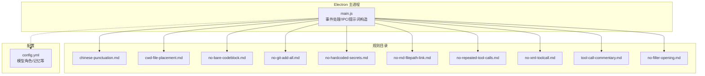
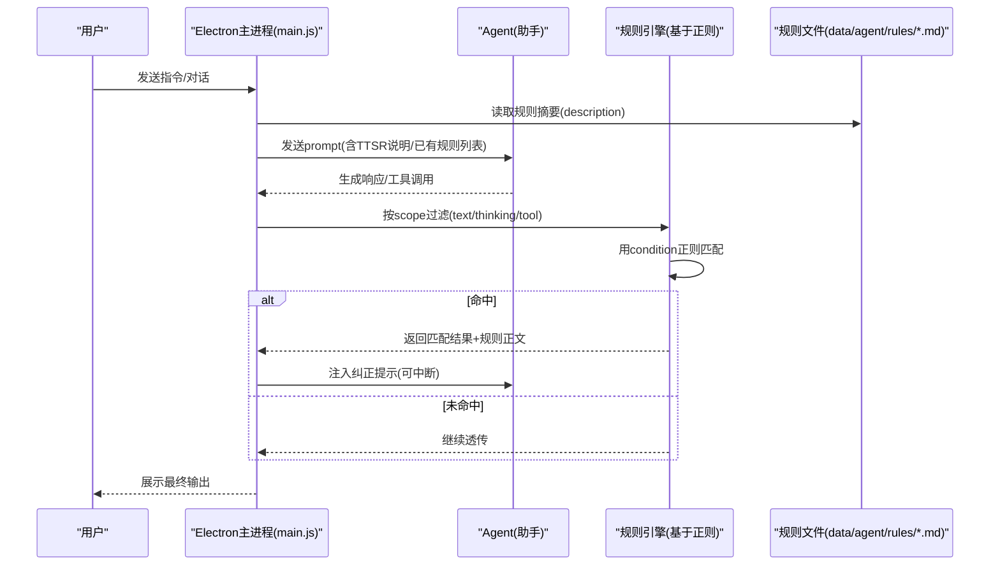
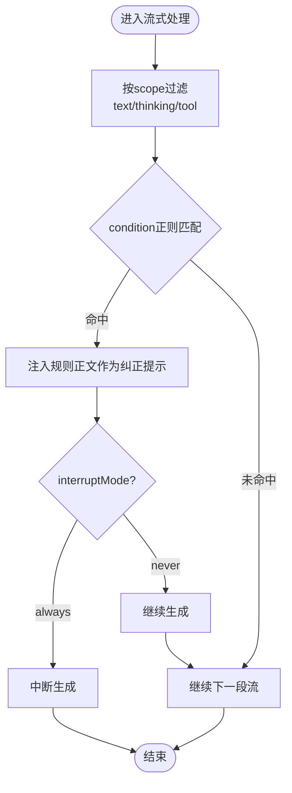
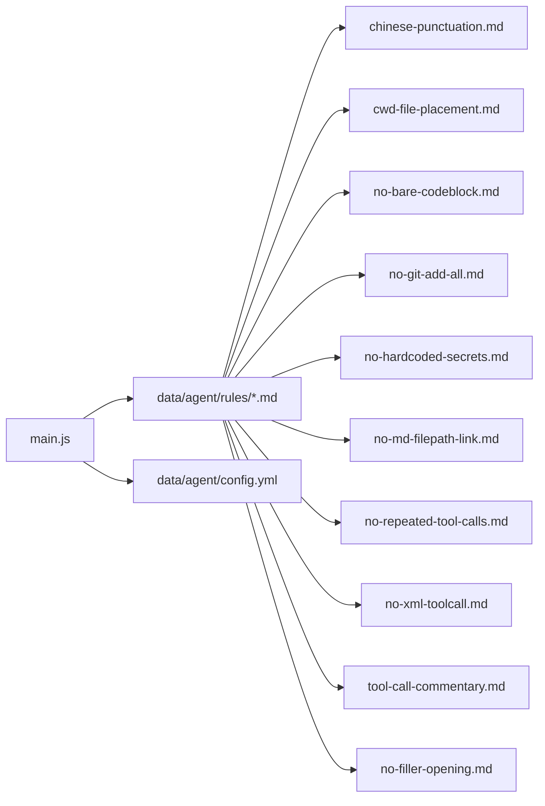

# TTSR流式规则系统

<cite>
**本文引用的文件**   
- [electron/main.js](file://electron/main.js)
- [data/agent/config.yml](file://data/agent/config.yml)
- [data/agent/rules/chinese-punctuation.md](file://data/agent/rules/chinese-punctuation.md)
- [data/agent/rules/cwd-file-placement.md](file://data/agent/rules/cwd-file-placement.md)
- [data/agent/rules/no-bare-codeblock.md](file://data/agent/rules/no-bare-codeblock.md)
- [data/agent/rules/no-git-add-all.md](file://data/agent/rules/no-git-add-all.md)
- [data/agent/rules/no-hardcoded-secrets.md](file://data/agent/rules/no-hardcoded-secrets.md)
- [data/agent/rules/no-md-filepath-link.md](file://data/agent/rules/no-md-filepath-link.md)
- [data/agent/rules/no-repeated-tool-calls.md](file://data/agent/rules/no-repeated-tool-calls.md)
- [data/agent/rules/no-xml-toolcall.md](file://data/agent/rules/no-xml-toolcall.md)
- [data/agent/rules/tool-call-commentary.md](file://data/agent/rules/tool-call-commentary.md)
- [data/agent/rules/no-filler-opening.md](file://data/agent/rules/no-filler-opening.md)
</cite>

## 目录
1. [简介](#简介)
2. [项目结构](#项目结构)
3. [核心组件](#核心组件)
4. [架构总览](#架构总览)
5. [详细组件分析](#详细组件分析)
6. [依赖关系分析](#依赖关系分析)
7. [性能考量](#性能考量)
8. [故障排查指南](#故障排查指南)
9. [结论](#结论)
10. [附录](#附录)

## 简介
TTSR（Token-Stream Streaming Rules，令牌流流式规则）是 Tiffa 的实时规则匹配与干预机制。其核心目标是“零Context成本”的流式拦截：在助手输出流（文本、思考摘要、工具参数）到达时，按作用域与正则条件即时匹配，命中后注入纠正提示并可选择中断生成。该机制通过 Markdown + YAML frontmatter 的规则文件驱动，无需维护额外上下文状态，即可实现低开销、高可组合的流式控制。

本文件面向两类读者：
- 初学者：理解 TTSR 的概念、YAML 头部字段、作用域与正则匹配的基本用法。
- 高级用户：掌握内置规则的匹配逻辑、扩展自定义规则、调试与性能优化方法。

## 项目结构
TTSR 规则以 Markdown 文件形式存放在 data/agent/rules 目录下，每条规则一个文件；主进程 electron/main.js 负责读取规则摘要、构建提示词、并在需要时触发规则生成流程。配置入口 data/agent/config.yml 用于模型角色、记忆系统等全局设置，与 TTSR 无直接耦合，但影响整体 Agent 行为。



图表来源
- [electron/main.js:640-700](file://electron/main.js#L640-L700)
- [data/agent/config.yml:1-30](file://data/agent/config.yml#L1-L30)

章节来源
- [electron/main.js:640-700](file://electron/main.js#L640-L700)
- [data/agent/config.yml:1-30](file://data/agent/config.yml#L1-L30)

## 核心组件
- 规则文件（Markdown + YAML frontmatter）
  - description：一句话描述规则目的
  - condition：JavaScript 正则表达式或数组（对助手流进行匹配）
  - scope：作用域白名单，如 text、thinking、tool，以及 tool:<name>(<glob>) 精确到工具名与路径模式
  - interruptMode：always 立即中断生成；never 仅注入警告不中断
  - repeatMode（可选）：once（默认会话内一次）、after-gap（间隔N条消息后再次触发）
- 主进程处理
  - 读取规则目录，提取 description 摘要
  - 根据用户反馈构造“生成新规则”的提示词
  - 将生成的规则写入 data/agent/rules
- 流式匹配与干预
  - 在助手输出流中按 scope 过滤，使用 condition 的正则匹配
  - 命中后注入 markdown 正文作为纠正指导，并根据 interruptMode 决定是否中断

章节来源
- [electron/main.js:640-700](file://electron/main.js#L640-L700)
- [data/agent/rules/chinese-punctuation.md:1-19](file://data/agent/rules/chinese-punctuation.md#L1-L19)
- [data/agent/rules/cwd-file-placement.md:1-35](file://data/agent/rules/cwd-file-placement.md#L1-L35)
- [data/agent/rules/no-bare-codeblock.md:1-10](file://data/agent/rules/no-bare-codeblock.md#L1-L10)
- [data/agent/rules/no-git-add-all.md:1-15](file://data/agent/rules/no-git-add-all.md#L1-L15)
- [data/agent/rules/no-hardcoded-secrets.md:1-16](file://data/agent/rules/no-hardcoded-secrets.md#L1-L16)
- [data/agent/rules/no-md-filepath-link.md:1-15](file://data/agent/rules/no-md-filepath-link.md#L1-L15)
- [data/agent/rules/no-repeated-tool-calls.md:1-26](file://data/agent/rules/no-repeated-tool-calls.md#L1-L26)
- [data/agent/rules/no-xml-toolcall.md:1-10](file://data/agent/rules/no-xml-toolcall.md#L1-L10)
- [data/agent/rules/tool-call-commentary.md:1-10](file://data/agent/rules/tool-call-commentary.md#L1-L10)
- [data/agent/rules/no-filler-opening.md:1-10](file://data/agent/rules/no-filler-opening.md#L1-L10)

## 架构总览
TTSR 的运行时由“主进程提示词构造 + 规则文件解析 + 流式匹配与干预”组成。下图展示了从用户输入到规则生效的关键交互。



图表来源
- [electron/main.js:640-700](file://electron/main.js#L640-L700)
- [data/agent/rules/cwd-file-placement.md:1-35](file://data/agent/rules/cwd-file-placement.md#L1-L35)

## 详细组件分析

### 内置规则详解（10条）
以下逐条说明每条规则的语法结构、条件表达式、匹配逻辑、作用域与使用场景。为避免泄露具体代码内容，此处以“片段路径”引用对应文件。

1) 中文标点规范（chinese-punctuation.md）
- 作用域：text
- 条件：检测中文与 ASCII 标点混用的情况
- 匹配逻辑：当中文文本中出现英文标点，或在英文标点后紧跟中文时触发
- 使用场景：保证中文正文使用全角中文标点，提升可读性与一致性
- 片段路径
  - [data/agent/rules/chinese-punctuation.md:1-19](file://data/agent/rules/chinese-punctuation.md#L1-L19)

2) 工作目录文件放置（cwd-file-placement.md）
- 作用域：tool:write(*), tool:edit(*), tool:bash(*)
- 条件：多条正则覆盖 Windows 绝对路径、临时文件命名、workspace 根禁止写入等
- 匹配逻辑：识别中间产物写到 cwd 根或 workspace 根的行为，强制放入 .temp/
- 使用场景：防止污染项目根目录，确保中间产物与最终产物分离
- 片段路径
  - [data/agent/rules/cwd-file-placement.md:1-35](file://data/agent/rules/cwd-file-placement.md#L1-L35)

3) 代码块语言标签（no-bare-codeblock.md）
- 作用域：text
- 条件：检测未指定语言的代码块起始
- 匹配逻辑：遇到 ``` 后无语言标签即触发
- 使用场景：要求所有代码块必须标注语言，便于渲染与语法高亮
- 片段路径
  - [data/agent/rules/no-bare-codeblock.md:1-10](file://data/agent/rules/no-bare-codeblock.md#L1-L10)

4) Git 安全提交（no-git-add-all.md）
- 作用域：tool
- 条件：匹配 git add -A / --all / .
- 匹配逻辑：阻止一次性暂存全部变更，避免误提交敏感信息
- 使用场景：强制显式暂存特定文件或使用交互式暂存
- 片段路径
  - [data/agent/rules/no-git-add-all.md:1-15](file://data/agent/rules/no-git-add-all.md#L1-L15)

5) 禁止硬编码密钥（no-hardcoded-secrets.md）
- 作用域：tool:write(*), tool:edit(*)
- 条件：匹配常见密钥变量名与赋值模式
- 匹配逻辑：在写入/编辑源码时检测硬编码 API Key、密码、Token 等
- 使用场景：P0 安全规则，强制使用环境变量或密钥管理
- 片段路径
  - [data/agent/rules/no-hardcoded-secrets.md:1-16](file://data/agent/rules/no-hardcoded-secrets.md#L1-L16)

6) 文件路径链接格式（no-md-filepath-link.md）
- 作用域：text
- 条件：检测 Markdown 链接包裹 Windows 路径的模式
- 匹配逻辑：前端会自动将裸路径渲染为可点击链接，禁止使用 [xxx](path)
- 使用场景：统一输出裸路径，提升前端渲染一致性与可访问性
- 片段路径
  - [data/agent/rules/no-md-filepath-link.md:1-15](file://data/agent/rules/no-md-filepath-link.md#L1-L15)

7) 连续工具调用限制（no-repeated-tool-calls.md）
- 作用域：tool
- 条件：检测连续多次工具调用而无文字说明
- 匹配逻辑：超过阈值（例如 8 次）触发，要求插入中文解释与合理拆分
- 使用场景：避免纯工具流，提高可观测性与可控性
- 片段路径
  - [data/agent/rules/no-repeated-tool-calls.md:1-26](file://data/agent/rules/no-repeated-tool-calls.md#L1-L26)

8) 禁止 XML 工具调用（no-xml-toolcall.md）
- 作用域：text, thinking
- 条件：匹配 <function=...> 等 XML 风格调用
- 匹配逻辑：系统不支持 XML 工具调用，需使用标准函数调用格式
- 使用场景：减少无效 token 消耗，统一调用格式
- 片段路径
  - [data/agent/rules/no-xml-toolcall.md:1-10](file://data/agent/rules/no-xml-toolcall.md#L1-L10)

9) 工具调用后必须附带中文说明（tool-call-commentary.md）
- 作用域：tool
- 条件：检测工具调用后缺少中文说明的情况（当前条件示例与代码块相关，实际应结合上下文调整）
- 匹配逻辑：每次工具调用后必须跟一段中文总结
- 使用场景：增强可解释性与可审计性
- 片段路径
  - [data/agent/rules/tool-call-commentary.md:1-10](file://data/agent/rules/tool-call-commentary.md#L1-L10)

10) 禁止填充式开场（no-filler-opening.md）
- 作用域：text
- 条件：匹配常见的填充式开场短语
- 匹配逻辑：检测到此类开头即触发，要求直接进入主题
- 使用场景：提升回答效率与信息密度
- 片段路径
  - [data/agent/rules/no-filler-opening.md:1-10](file://data/agent/rules/no-filler-opening.md#L1-L10)

章节来源
- [data/agent/rules/chinese-punctuation.md:1-19](file://data/agent/rules/chinese-punctuation.md#L1-L19)
- [data/agent/rules/cwd-file-placement.md:1-35](file://data/agent/rules/cwd-file-placement.md#L1-L35)
- [data/agent/rules/no-bare-codeblock.md:1-10](file://data/agent/rules/no-bare-codeblock.md#L1-L10)
- [data/agent/rules/no-git-add-all.md:1-15](file://data/agent/rules/no-git-add-all.md#L1-L15)
- [data/agent/rules/no-hardcoded-secrets.md:1-16](file://data/agent/rules/no-hardcoded-secrets.md#L1-L16)
- [data/agent/rules/no-md-filepath-link.md:1-15](file://data/agent/rules/no-md-filepath-link.md#L1-L15)
- [data/agent/rules/no-repeated-tool-calls.md:1-26](file://data/agent/rules/no-repeated-tool-calls.md#L1-L26)
- [data/agent/rules/no-xml-toolcall.md:1-10](file://data/agent/rules/no-xml-toolcall.md#L1-L10)
- [data/agent/rules/tool-call-commentary.md:1-10](file://data/agent/rules/tool-call-commentary.md#L1-L10)
- [data/agent/rules/no-filler-opening.md:1-10](file://data/agent/rules/no-filler-opening.md#L1-L10)

### 规则文件的 YAML 头部配置
- description：规则的一句话说明，便于快速浏览与检索
- condition：JavaScript 正则表达式或数组，针对流式输出进行匹配
- scope：允许的作用域白名单
  - text：助手正文
  - thinking：隐藏推理摘要
  - tool：工具参数（支持 tool:<name>(<glob>) 限定工具名与路径模式）
- interruptMode：always（立即中断生成）或 never（仅注入警告）
- repeatMode（可选）：once（会话内仅触发一次）、after-gap（间隔若干消息后再次触发）

章节来源
- [electron/main.js:652-696](file://electron/main.js#L652-L696)

### 正则表达式匹配模式
- 规则中的 condition 使用 JavaScript 正则表达式，需在 YAML 中正确转义反斜杠
- 工具参数可能在流式序列化过程中包含转义字符，条件设计应容忍 JSON 转义
- 建议将 scope 尽量收窄，避免宽泛匹配导致误报

章节来源
- [electron/main.js:683-687](file://electron/main.js#L683-L687)

### 文本作用域的处理方式
- text：仅对助手正文进行匹配，适合语言风格、标点、格式类规则
- thinking：对隐藏推理摘要进行匹配，适合约束内部表达与调用格式
- tool：对工具参数进行匹配，适合安全与合规类规则（如密钥、Git命令）
- tool:<name>(<glob>)：限定特定工具与路径模式，精准定位问题

章节来源
- [electron/main.js:660-667](file://electron/main.js#L660-L667)

### 流式匹配与干预流程


图表来源
- [electron/main.js:660-667](file://electron/main.js#L660-L667)

## 依赖关系分析
- 主进程依赖规则目录扫描与 frontmatter 解析，用于生成“创建/修复规则”的提示词
- 规则文件之间相互独立，无直接导入关系，降低耦合度
- config.yml 主要影响模型角色与记忆系统，与 TTSR 解耦，但会影响 Agent 的整体行为



图表来源
- [electron/main.js:640-700](file://electron/main.js#L640-L700)
- [data/agent/config.yml:1-30](file://data/agent/config.yml#L1-L30)

章节来源
- [electron/main.js:640-700](file://electron/main.js#L640-L700)
- [data/agent/config.yml:1-30](file://data/agent/config.yml#L1-L30)

## 性能考量
- 零Context成本：规则匹配基于正则与简单作用域过滤，不维护历史上下文，内存占用极低
- 作用域最小化：将 scope 限制到必要范围，减少正则匹配次数
- 正则优化：避免回溯爆炸，优先使用确定性前缀与原子组
- 重复触发控制：使用 repeatMode 避免频繁重复触发造成干扰
- 工具参数序列化：条件设计需容忍 JSON 转义，避免因序列化差异导致误判

[本节为通用指导，不直接分析具体文件]

## 故障排查指南
- 规则未生效
  - 检查 scope 是否正确（text/thinking/tool）
  - 确认 condition 正则是否匹配目标流片段
  - 验证 interruptMode 是否符合预期
- 误报过多
  - 收紧 scope，避免 broad catch-all
  - 细化正则，增加边界与上下文限定
- 工具参数匹配失败
  - 考虑流式序列化中的转义字符，条件需兼容 JSON 转义
- 重复触发干扰
  - 使用 repeatMode 控制触发频率

章节来源
- [electron/main.js:683-687](file://electron/main.js#L683-L687)
- [data/agent/rules/no-repeated-tool-calls.md:1-26](file://data/agent/rules/no-repeated-tool-calls.md#L1-L26)

## 结论
TTSR 通过“Markdown + YAML frontmatter + 正则匹配”的组合，实现了零Context成本的流式规则干预。内置的 10 条规则覆盖了语言风格、代码格式、安全合规、工具调用等多个维度，既可作为日常使用的基线，也可作为扩展自定义规则的参考模板。通过合理设计 scope 与 condition，并结合 repeatMode 与 interruptMode，可以在保证性能的同时获得稳定的行为控制效果。

[本节为总结性内容，不直接分析具体文件]

## 附录

### 自定义规则编写指南
- 文件命名：kebab-case 且以 .md 结尾（如 no-hardcoded-secrets.md）
- YAML 头部：
  - description：一句话说明规则目的
  - condition：JavaScript 正则或数组，务必精确匹配目标行为
  - scope：尽量窄，避免同时使用 tool,text 除非确有共同问题
  - interruptMode：always/never
  - repeatMode：once/after-gap（可选）
- 正则注意事项：
  - YAML 中转义反斜杠只需一次
  - 工具参数可能包含 JSON 转义，条件需兼容
- 正文部分：
  - 提供清晰的纠正指导与最佳实践示例

章节来源
- [electron/main.js:683-687](file://electron/main.js#L683-L687)

### 规则调试方法
- 逐步缩小 scope，先锁定 text/thinking/tool 再细化到 tool:<name>(<glob>)
- 使用最小化的 condition 验证匹配，再逐步加入上下文限定
- 观察 interruptMode 的效果，必要时切换为 never 仅注入警告
- 利用 repeatMode 控制触发频率，避免频繁打断

章节来源
- [electron/main.js:660-667](file://electron/main.js#L660-L667)

### 性能优化建议
- 正则避免回溯爆炸，优先使用确定性前缀
- 将高频规则的条件前置，减少不必要的匹配
- 合理使用 repeatMode，避免重复触发带来的开销
- 保持规则文件简洁，避免冗长正文影响加载与解析

[本节为通用指导，不直接分析具体文件]