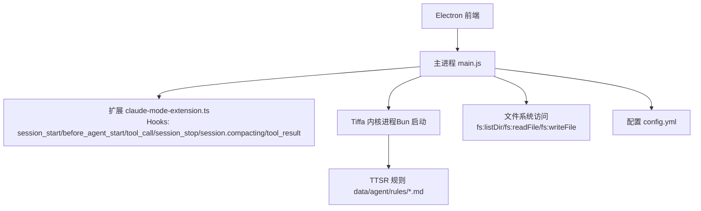
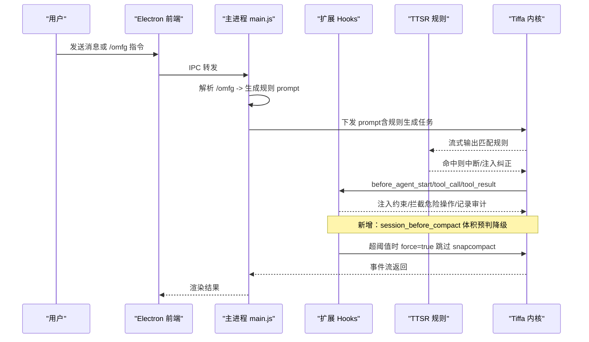
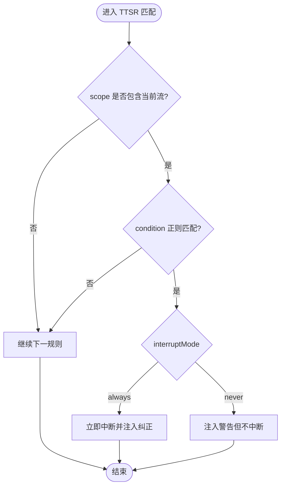
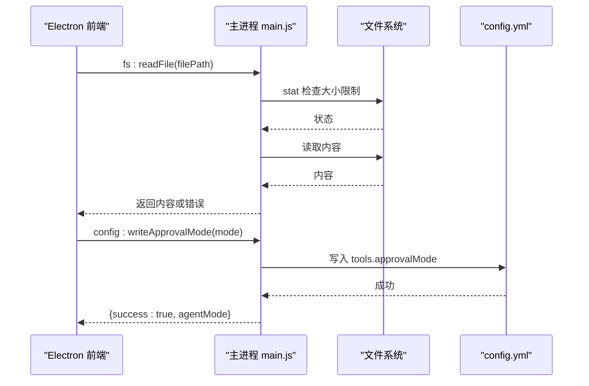
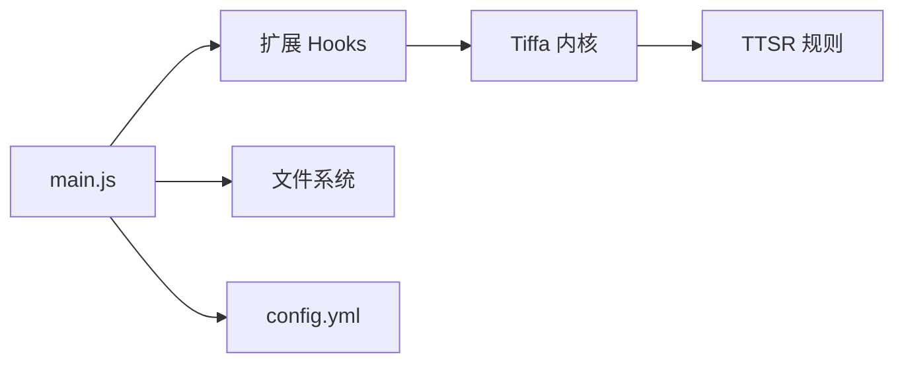

# 安全策略与配置

<cite>
**本文引用的文件**   
- [AGENTS.md](file://AGENTS.md)
- [electron/main.js](file://electron/main.js)
- [data/agent/config.yml](file://data/agent/config.yml)
- [data/agent/rules/no-hardcoded-secrets.md](file://data/agent/rules/no-hardcoded-secrets.md)
- [data/agent/rules/no-git-add-all.md](file://data/agent/rules/no-git-add-all.md)
- [data/agent/rules/no-git-push-force.md](file://data/agent/rules/no-git-push-force.md)
- [data/agent/rules/no-xml-toolcall.md](file://data/agent/rules/no-xml-toolcall.md)
- [plugins/computer-use-extension.ts](file://plugins/computer-use-extension.ts)
</cite>

## 更新摘要
**变更内容**   
- 新增压缩阈值校准机制（TIFFA_COMPACT_SNAP_MAX_CHARS 设置为 130,000 字符）的性能优化说明
- 新增体积预测降级逻辑的安全保障机制
- 更新压缩路由选择的安全策略
- 增强性能与安全平衡的配置指导

## 目录
1. [引言](#引言)
2. [项目结构](#项目结构)
3. [核心组件](#核心组件)
4. [架构总览](#架构总览)
5. [详细组件分析](#详细组件分析)
6. [依赖关系分析](#依赖关系分析)
7. [性能考量](#性能考量)
8. [故障排查指南](#故障排查指南)
9. [结论](#结论)
10. [附录](#附录)

## 引言
本文件面向管理员与安全工程师，系统化阐述 Tiffa 的安全策略与配置体系。围绕"三重约束"（TTSR 规则层、Hook 约束层、工具拦截层）展开，解释其协同工作机制、权限控制与访问限制、危险操作识别与拦截、敏感信息保护、审计与日志记录，并提供最佳实践、威胁防护与安全测试方法，帮助管理员定制策略、帮助用户理解限制原因与解决方案。

**更新** 新增了压缩阈值校准和体积预测降级逻辑的安全保障机制，确保在高性能优化的同时维持严格的安全标准。

## 项目结构
Tiffa 的安全能力由"规则 + Hook + 工具拦截"三层构成，并辅以 Electron 主进程对文件系统与配置的受控访问。关键路径如下：
- 规则目录：data/agent/rules/*.md（TTSR 流式匹配规则）
- 记忆与约束注入：data/memory/constraints-inject.md（语义约束，通过 before_agent_start 注入）
- 扩展与 Hook：plugins/claude-mode-extension.ts（tool_call 等 Hook 实现危险操作拦截与审计）
- 主进程入口：electron/main.js（IPC 处理、配置写入、会话管理、/omfg 命令拦截）
- 全局配置：data/agent/config.yml（模型角色、记忆系统、工具审批模式等）

**图表来源** 
- [AGENTS.md](file://AGENTS.md)
- [electron/main.js](file://electron/main.js)
- [data/agent/config.yml](file://data/agent/config.yml)

章节来源
- [AGENTS.md](file://AGENTS.md)

## 核心组件
- TTSR 规则层（零 Context 成本）
  - 位置：data/agent/rules/*.md
  - 机制：在模型输出流中实时正则匹配，命中即按 scope 与 interruptMode 进行拦截或提示
  - 典型规则：禁止硬编码密钥、禁止 git add -A / push --force、禁止 XML 工具调用、代码块语言标注、中文标点规范等
- Hook 约束层（语义约束）
  - 位置：data/memory/constraints-inject.md（注入点），扩展 hooks 负责执行
  - 机制：before_agent_start 注入 systemPrompt 前缀；tool_call 运行时拦截危险路径/配置文件自改/workspace 根目录新建子目录；静默工具调用检测（连续多次无文字说明触发 steer）
- 工具拦截层（危险操作拦截）
  - 位置：扩展 tool_call hook
  - 机制：对高危命令与路径进行白名单/黑名单校验，必要时阻断或要求用户确认

**更新** 新增压缩阈值校准机制，通过 TIFFA_COMPACT_SNAP_MAX_CHARS 环境变量设置 130,000 字符阈值，实现智能的体积预测降级逻辑。

章节来源
- [AGENTS.md](file://AGENTS.md)
- [data/agent/rules/no-hardcoded-secrets.md](file://data/agent/rules/no-hardcoded-secrets.md)
- [data/agent/rules/no-git-add-all.md](file://data/agent/rules/no-git-add-all.md)
- [data/agent/rules/no-git-push-force.md](file://data/agent/rules/no-git-push-force.md)
- [data/agent/rules/no-xml-toolcall.md](file://data/agent/rules/no-xml-toolcall.md)

## 架构总览
Tiffa 的"三重约束"贯穿请求生命周期：
- 输入阶段：/omfg 命令在主进程被拦截并转换为 TTSR 规则生成 prompt，模型直接写规则文件即时生效
- 运行阶段：TTSR 规则在输出流中实时拦截；Hook 在 agent 启动前注入行为约束，并在 tool_call 时进行危险操作拦截
- 输出阶段：tool_result 钩子记录审计日志（JSONL），便于事后追溯

**更新** 新增压缩阶段的智能降级机制，在压缩入口通过 session_before_compact 钩子进行体积预判，超过阈值的对话自动降级为纯文本压缩，避免 RPC 上限溢出。

**图表来源** 
- [electron/main.js](file://electron/main.js)
- [AGENTS.md](file://AGENTS.md)

## 详细组件分析

### TTSR 规则层（第一重约束）
- 设计目标：以最小上下文开销实现强约束，避免弱模型被冗长提示词拖垮
- 匹配范围：text/thinking/tool 三类流；支持 tool:<name>(<glob>) 精确到工具与路径
- 动作模式：interruptMode=always 立即中止；never 仅注入警告不中断
- 典型规则
  - no-hardcoded-secrets.md：禁止在源码中硬编码密钥，引导使用环境变量或密钥管理
  - no-git-add-all.md：禁止 git add -A/--all/.，强制显式暂存具体文件
  - no-git-push-force.md：禁止 git push --force，除非用户明确要求
  - no-xml-toolcall.md：禁止 XML 格式工具调用，强制标准函数调用

**图表来源** 
- [data/agent/rules/no-hardcoded-secrets.md](file://data/agent/rules/no-hardcoded-secrets.md)
- [data/agent/rules/no-git-add-all.md](file://data/agent/rules/no-git-add-all.md)
- [data/agent/rules/no-git-push-force.md](file://data/agent/rules/no-git-push-force.md)
- [data/agent/rules/no-xml-toolcall.md](file://data/agent/rules/no-xml-toolcall.md)

章节来源
- [AGENTS.md](file://AGENTS.md)
- [data/agent/rules/no-hardcoded-secrets.md](file://data/agent/rules/no-hardcoded-secrets.md)
- [data/agent/rules/no-git-add-all.md](file://data/agent/rules/no-git-add-all.md)
- [data/agent/rules/no-git-push-force.md](file://data/agent/rules/no-git-push-force.md)
- [data/agent/rules/no-xml-toolcall.md](file://data/agent/rules/no-xml-toolcall.md)

### Hook 约束层（第二重约束）
- before_agent_start：注入行为约束（读文件规范、任务计划、失败换法、skill 铁律、沟通风格、安全铁律）
- tool_call：运行时拦截
  - 危险路径：System32、Windows、Program Files 等
  - 配置文件自改：config.yml、models.yml、扩展文件等
  - workspace 根目录新建一级子目录：拦截
  - 静默工具调用检测：连续多次无文字说明 → steer 提醒
- **新增** session_before_compact：压缩入口体积预判
  - 默认阈值：2MB（可通过 TIFFA_COMPACT_SNAP_MAX_MB 环境变量调整）
  - 超阈值时自动 force=true，跳过 snapcompact 守卫，直降旁路结构化总结
  - 安全保障：无论走哪条路径都是纯文本压缩，不会再生成图片帧撞 RPC 上限
- session.compacting：gap-fill 断片补救，提取关键决策与改动，压缩后即时注入上下文
- tool_result：审计日志（JSONL）

**更新** 新增的体积预测降级逻辑确保了在大对话场景下的安全性和稳定性，避免了因 CJK 帧渲染产物过大导致的 RPC 上限溢出问题。

章节来源
- [AGENTS.md](file://AGENTS.md)

### 工具拦截层（第三重约束）
- 拦截点：扩展 tool_call hook
- 策略：基于路径/命令白名单与黑名单组合，结合上下文判断是否放行或阻断
- 联动：与 TTSR 规则互补，前者偏语义与行为，后者偏语法与输出流

章节来源
- [AGENTS.md](file://AGENTS.md)

### 主进程安全边界（Electron 主进程）
- 文件系统访问：提供 fs:listDir、fs:readFile、fs:writeFile、fs:readImage，内置大小限制与路径校验
- 配置写入：提供 config:writeApprovalMode，将前端模式映射为内核 approvalMode（normal/auto/yolo）
- /omfg 命令拦截：将用户投诉转化为 TTSR 规则生成 prompt，模型直接写规则文件即时生效

**图表来源** 
- [electron/main.js](file://electron/main.js)
- [data/agent/config.yml](file://data/agent/config.yml)

章节来源
- [electron/main.js](file://electron/main.js)
- [data/agent/config.yml](file://data/agent/config.yml)

## 依赖关系分析
- 主进程依赖扩展与内核进程通信（stdin/stdout JSONL）
- 扩展依赖 Hook 事件（session_start、before_agent_start、tool_call、session_stop、session.compacting、tool_result）
- 规则层独立于上下文，零 token 消耗，但需与 Hook 层配合覆盖更广泛场景
- 配置层通过主进程统一写入，确保一致性

**图表来源** 
- [AGENTS.md](file://AGENTS.md)
- [electron/main.js](file://electron/main.js)

章节来源
- [AGENTS.md](file://AGENTS.md)
- [electron/main.js](file://electron/main.js)

## 性能考量
- TTSR 规则匹配在流式输出中进行，零 context 成本，适合弱模型环境
- Hook 层仅在关键事件触发，避免过度干预
- 审计日志采用 JSONL 追加写入，低开销且易解析
- **新增** 压缩阈值校准机制：
  - TIFFA_COMPACT_SNAP_MAX_CHARS 设置为 130,000 字符，优化大对话处理性能
  - 体积预测降级逻辑避免 RPC 上限溢出，提升整体响应速度
  - 智能路由选择：小对话走 snapcompact，大对话走旁路结构化总结
- 建议：规则正则尽量精确，减少误报；Hook 逻辑保持轻量，避免阻塞

**更新** 性能优化主要体现在压缩阶段的智能降级机制，通过预设阈值和预测算法，在保证安全性的前提下显著提升处理效率。

## 故障排查指南
- 规则未生效
  - 检查规则文件命名与 frontmatter 字段是否正确
  - 确认 scope 与 condition 是否匹配实际输出流
  - 查看 /omfg 生成的规则是否被写入 rules 目录
- 危险操作未被拦截
  - 确认扩展已加载，tool_call hook 是否注册
  - 检查路径/命令是否在拦截白名单/黑名单内
- 配置写入失败
  - 检查 config.yml 权限与路径
  - 确认前端模式到内核 approvalMode 的映射正确
- 审计日志缺失
  - 确认 tool_result hook 正常触发
  - 检查日志目录与写入权限
- **新增** 压缩相关故障
  - 检查 TIFFA_COMPACT_SNAP_MAX_MB 环境变量设置
  - 验证 last-compact-route.json 是否为 claude-route（非 snapcompact）
  - 查看 claude-mode.log 中的压缩降级日志

章节来源
- [AGENTS.md](file://AGENTS.md)
- [electron/main.js](file://electron/main.js)

## 结论
Tiffa 的"三重约束"体系以 TTSR 规则层实现零上下文成本的强约束，Hook 约束层提供语义与行为级保障，工具拦截层兜底危险操作。配合主进程的安全边界与审计日志，形成从输入到输出的全链路安全防护。**更新** 新增的压缩阈值校准和体积预测降级机制进一步增强了系统在高性能场景下的安全性与稳定性。管理员可据此定制策略，用户可理解限制原因并获得改进建议。

## 附录

### 安全策略配置选项与权限控制
- 工具审批模式（tools.approvalMode）
  - 值域：yolo（默认）、auto、always-ask
  - 作用：控制工具调用的审批粒度，影响危险操作的拦截强度
  - 配置入口：主进程 config:writeApprovalMode，写入 data/agent/config.yml
- 模型角色（modelRoles）
  - 作用：为不同任务分配不同模型，平衡性能与安全
- 记忆系统（mnemopi）
  - scoping/global：跨项目共享语义库
  - autoRetain/autoRecall/injectionTokenLimit：控制记忆注入与召回策略
- **新增** 压缩阈值配置
  - TIFFA_COMPACT_SNAP_MAX_CHARS：130,000 字符（默认）
  - TIFFA_COMPACT_SNAP_MAX_MB：2MB（默认，用于 MB 级别判断）
  - 作用：控制压缩时的体积预测降级阈值

章节来源
- [data/agent/config.yml](file://data/agent/config.yml)
- [electron/main.js](file://electron/main.js)

### 危险操作识别与拦截逻辑
- Git 危险命令：git add -A/--all/.、git push --force
- 敏感信息：硬编码密钥、密码、token 等
- 危险路径：System32、Windows、Program Files 等
- 配置文件自改：config.yml、models.yml、扩展文件
- 工作区根目录新建子目录：防止破坏项目结构
- **新增** 压缩安全策略
  - 超阈值对话自动降级为纯文本压缩
  - 避免生成大量图片帧导致 RPC 上限溢出
  - 智能路由选择最优压缩路径

章节来源
- [data/agent/rules/no-git-add-all.md](file://data/agent/rules/no-git-add-all.md)
- [data/agent/rules/no-git-push-force.md](file://data/agent/rules/no-git-push-force.md)
- [data/agent/rules/no-hardcoded-secrets.md](file://data/agent/rules/no-hardcoded-secrets.md)
- [AGENTS.md](file://AGENTS.md)

### 敏感信息保护机制
- TTSR 规则禁止硬编码密钥，引导使用环境变量或密钥管理
- Hook 层在 tool_call 时检测敏感路径与配置自改
- 审计日志记录工具调用与结果，便于事后溯源
- **新增** 压缩过程中的敏感信息保护
  - 体积预测降级避免泄露大量上下文数据
  - 纯文本压缩确保敏感信息不被编码为图片帧

章节来源
- [data/agent/rules/no-hardcoded-secrets.md](file://data/agent/rules/no-hardcoded-secrets.md)
- [AGENTS.md](file://AGENTS.md)

### 安全审计与日志记录
- tool_result hook 记录 JSONL 审计日志
- 日志包含工具名称、参数、结果摘要，便于问题定位与合规审查
- **新增** 压缩审计日志
  - 记录压缩路由选择（snapcompact vs claude-route）
  - 记录体积预测结果和降级决策
  - 便于性能分析和安全审计

章节来源
- [AGENTS.md](file://AGENTS.md)

### 安全配置最佳实践
- 启用严格的 approvalMode（如 always-ask）用于高敏环境
- 精简 TTSR 规则，避免宽泛匹配导致误报
- 定期审查 Hook 拦截策略，更新危险路径与命令清单
- 启用 mnemopi autoRetain 与合理 recallLimit，保证语义记忆可用性与上下文可控
- **新增** 压缩性能优化配置
  - 根据实际业务需求调整 TIFFA_COMPACT_SNAP_MAX_CHARS 阈值
  - 监控 last-compact-route.json 了解压缩路由分布
  - 定期分析 claude-mode.log 中的压缩性能指标

章节来源
- [data/agent/config.yml](file://data/agent/config.yml)
- [AGENTS.md](file://AGENTS.md)

### 常见安全威胁与防护措施
- 凭据泄露：通过 TTSR 规则与 Hook 双重拦截，强制使用环境变量或密钥管理
- 数据外泄：限制文件系统访问范围，禁止向不受信任路径写入
- 恶意命令执行：Git 危险命令与系统路径拦截，结合用户确认流程
- 配置篡改：配置文件自改拦截，变更需经审批流程
- **新增** 压缩安全风险防护
  - 防止大对话导致的内存溢出攻击
  - 避免 RPC 超限引发的服务不可用
  - 智能降级确保服务稳定性

章节来源
- [data/agent/rules/no-hardcoded-secrets.md](file://data/agent/rules/no-hardcoded-secrets.md)
- [data/agent/rules/no-git-add-all.md](file://data/agent/rules/no-git-add-all.md)
- [data/agent/rules/no-git-push-force.md](file://data/agent/rules/no-git-push-force.md)
- [AGENTS.md](file://AGENTS.md)

### 安全测试方法
- 规则覆盖率测试：构造违规输入验证 TTSR 规则命中与拦截效果
- Hook 拦截测试：模拟危险路径/命令调用，验证拦截与提示
- 配置变更测试：修改 approvalMode 与模型角色，观察行为变化
- 审计日志验证：检查 tool_result 日志完整性与准确性
- **新增** 压缩性能测试
  - 构造不同大小的对话验证阈值触发准确性
  - 测试体积预测降级逻辑的正确性
  - 验证压缩路由选择的合理性

### 管理员定制指导
- 新增规则：通过 /omfg 命令生成规则文件或手动编辑 data/agent/rules/*.md
- 调整 Hook：在扩展中补充 tool_call 拦截逻辑，更新危险路径与命令清单
- 配置审批：通过主进程接口写入 config.yml，设置合适的 approvalMode
- 审计策略：调整日志级别与保留策略，满足合规需求
- **新增** 压缩策略定制
  - 根据业务场景调整压缩阈值参数
  - 监控和分析压缩性能指标
  - 优化压缩路由选择策略

章节来源
- [AGENTS.md](file://AGENTS.md)
- [electron/main.js](file://electron/main.js)

### 用户解释与解决方案
- 为什么被拦截：TTSR 规则与 Hook 检测到潜在风险，保护系统与数据安全
- 如何绕过：在明确授权下，通过审批流程或替换为安全替代方案
- 如何反馈：使用 /omfg 命令描述问题，自动生成规则或优化现有规则
- **新增** 压缩相关问题
  - 压缩延迟：可能是大对话触发了降级逻辑，属于正常现象
  - 压缩质量：降级后的纯文本压缩可能丢失部分视觉信息，但保证了安全性
  - 性能优化：可通过调整阈值参数获得更好的性能表现

章节来源
- [AGENTS.md](file://AGENTS.md)
- [electron/main.js](file://electron/main.js)