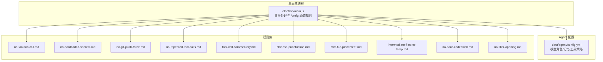
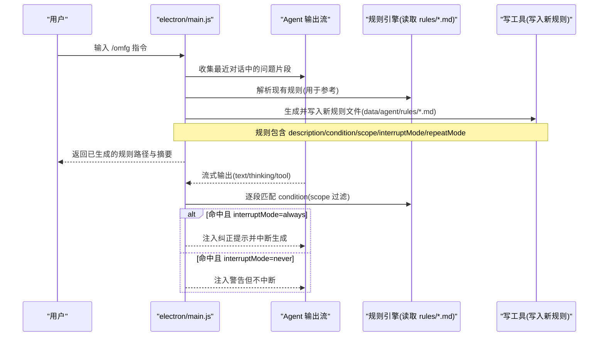
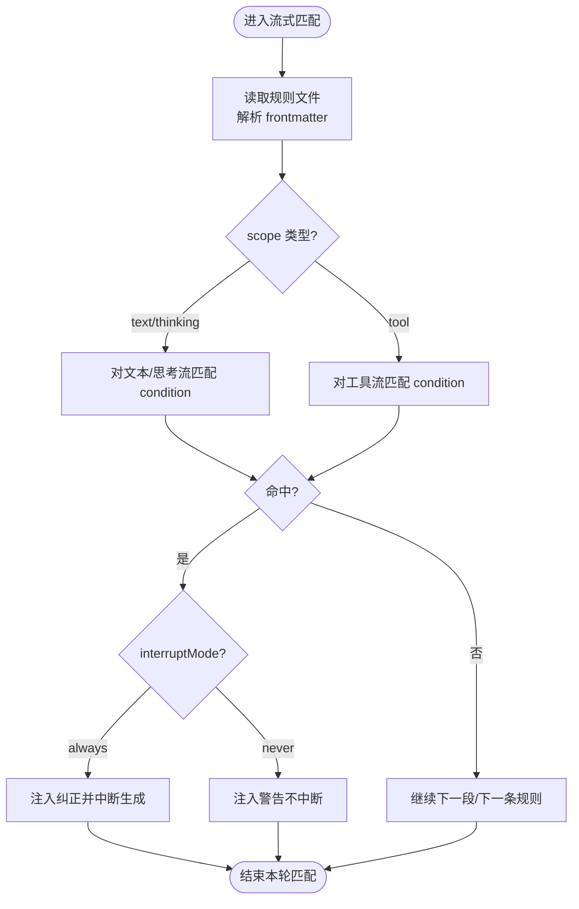
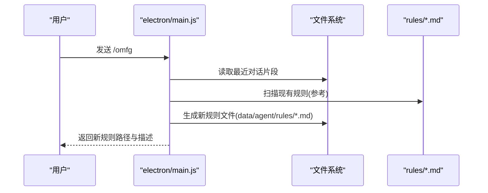
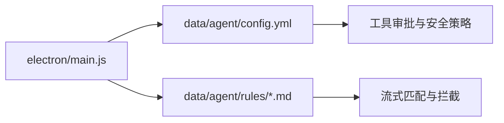

# 约束系统

<cite>
**本文引用的文件**   
- [electron/main.js](file://electron/main.js)
- [data/agent/config.yml](file://data/agent/config.yml)
- [data/agent/rules/no-xml-toolcall.md](file://data/agent/rules/no-xml-toolcall.md)
- [data/agent/rules/no-hardcoded-secrets.md](file://data/agent/rules/no-hardcoded-secrets.md)
- [data/agent/rules/no-git-push-force.md](file://data/agent/rules/no-git-push-force.md)
- [data/agent/rules/no-repeated-tool-calls.md](file://data/agent/rules/no-repeated-tool-calls.md)
- [data/agent/rules/tool-call-commentary.md](file://data/agent/rules/tool-call-commentary.md)
- [data/agent/rules/chinese-punctuation.md](file://data/agent/rules/chinese-punctuation.md)
- [data/agent/rules/cwd-file-placement.md](file://data/agent/rules/cwd-file-placement.md)
- [data/agent/rules/intermediate-files-to-temp.md](file://data/agent/rules/intermediate-files-to-temp.md)
- [data/agent/rules/no-bare-codeblock.md](file://data/agent/rules/no-bare-codeblock.md)
- [data/agent/rules/no-filler-opening.md](file://data/agent/rules/no-filler-opening.md)
</cite>

## 目录
1. [简介](#简介)
2. [项目结构](#项目结构)
3. [核心组件](#核心组件)
4. [架构总览](#架构总览)
5. [详细组件分析](#详细组件分析)
6. [依赖关系分析](#依赖关系分析)
7. [性能考虑](#性能考虑)
8. [故障排查指南](#故障排查指南)
9. [结论](#结论)
10. [附录](#附录)

## 简介
本文件系统化阐述 Tiffa 的“三重约束系统”，覆盖：
- 第一重：TTSR 流式规则（零 Context 成本）——在助手输出流中按条件实时匹配并注入纠正提示，必要时中断生成。
- 第二重：before_agent_start Hook（语义约束）——在 Agent 启动前注入全局策略与行为边界。
- 第三重：tool_call Hook（危险操作拦截）——对工具调用进行安全校验与拦截。

同时说明 10 条内置规则的语法、匹配机制，/omfg 命令的动态规则生成流程，以及安全策略配置要点，并提供最佳实践、性能优化与调试技巧。

## 项目结构
与约束系统直接相关的代码与规则位于以下位置：
- 主进程与事件转发：electron/main.js
- 全局配置（含工具审批模式等）：data/agent/config.yml
- 规则集（Markdown + YAML frontmatter）：data/agent/rules/*.md

图表来源
- [electron/main.js:644-687](file://electron/main.js#L644-L687)
- [data/agent/config.yml:1-30](file://data/agent/config.yml#L1-L30)

章节来源
- [electron/main.js:644-687](file://electron/main.js#L644-L687)
- [data/agent/config.yml:1-30](file://data/agent/config.yml#L1-L30)

## 核心组件
- TTSR（Time Traveling Stream Rule）流式规则
  - 以 Markdown + YAML frontmatter 定义，包含 description、condition、scope、interruptMode、repeatMode 等字段。
  - condition 为 JavaScript 正则表达式，针对 assistant 的 text/thinking/tool 三类流进行匹配。
  - scope 支持文本流、思考流、工具流及 tool:<name>(<glob>) 精确到工具名与路径模式。
  - interruptMode 控制是否立即中断生成；repeatMode 控制触发频率（once/after-gap）。
- before_agent_start Hook（语义约束）
  - 通过全局配置与规则体系在 Agent 启动前注入约束，确保后续执行遵循策略。
- tool_call Hook（危险操作拦截）
  - 对工具调用参数进行匹配与拦截，防止危险操作（如强制推送、全量暂存、硬编码密钥等）。

章节来源
- [data/agent/rules/no-xml-toolcall.md:1-10](file://data/agent/rules/no-xml-toolcall.md#L1-L10)
- [data/agent/rules/no-hardcoded-secrets.md:1-16](file://data/agent/rules/no-hardcoded-secrets.md#L1-L16)
- [data/agent/rules/no-git-push-force.md:1-15](file://data/agent/rules/no-git-push-force.md#L1-L15)
- [data/agent/rules/no-repeated-tool-calls.md:1-26](file://data/agent/rules/no-repeated-tool-calls.md#L1-L26)
- [data/agent/rules/tool-call-commentary.md:1-10](file://data/agent/rules/tool-call-commentary.md#L1-L10)
- [data/agent/rules/chinese-punctuation.md:1-19](file://data/agent/rules/chinese-punctuation.md#L1-L19)
- [data/agent/rules/cwd-file-placement.md:1-35](file://data/agent/rules/cwd-file-placement.md#L1-L35)
- [data/agent/rules/intermediate-files-to-temp.md:1-41](file://data/agent/rules/intermediate-files-to-temp.md#L1-L41)
- [data/agent/rules/no-bare-codeblock.md:1-10](file://data/agent/rules/no-bare-codeblock.md#L1-L10)
- [data/agent/rules/no-filler-opening.md:1-10](file://data/agent/rules/no-filler-opening.md#L1-L10)

## 架构总览
TTSR 流式规则在助手输出流上运行，无需额外上下文，实现“零 Context 成本”的实时约束。/omfg 命令可基于用户反馈自动生成一条 TTSR 规则文件，快速补齐约束缺口。

图表来源
- [electron/main.js:644-687](file://electron/main.js#L644-L687)

章节来源
- [electron/main.js:644-687](file://electron/main.js#L644-L687)

## 详细组件分析

### 第一重：TTSR 流式规则（零 Context 成本）
- 规则文件格式
  - YAML frontmatter 字段：description、condition、scope、interruptMode、repeatMode。
  - Markdown 正文：纠正指导内容，命中后注入给助手。
- 匹配机制
  - condition：JavaScript 正则，支持字符串或数组（多模式）。
  - scope：text/thinking/tool，或 tool:<name>(<glob>) 限定工具与路径。
  - 流式匹配：对 assistant 的 text/thinking/tool 三段分别匹配，命中即按 interruptMode 处理。
- 触发与重复
  - interruptMode：always（立即中断）、never（仅警告不中断）。
  - repeatMode：once（会话内一次）、after-gap（间隔 N 条消息后再次触发）。

图表来源
- [data/agent/rules/no-xml-toolcall.md:1-10](file://data/agent/rules/no-xml-toolcall.md#L1-L10)
- [data/agent/rules/no-hardcoded-secrets.md:1-16](file://data/agent/rules/no-hardcoded-secrets.md#L1-L16)
- [data/agent/rules/no-git-push-force.md:1-15](file://data/agent/rules/no-git-push-force.md#L1-L15)
- [data/agent/rules/no-repeated-tool-calls.md:1-26](file://data/agent/rules/no-repeated-tool-calls.md#L1-L26)
- [data/agent/rules/tool-call-commentary.md:1-10](file://data/agent/rules/tool-call-commentary.md#L1-L10)
- [data/agent/rules/chinese-punctuation.md:1-19](file://data/agent/rules/chinese-punctuation.md#L1-L19)
- [data/agent/rules/cwd-file-placement.md:1-35](file://data/agent/rules/cwd-file-placement.md#L1-L35)
- [data/agent/rules/intermediate-files-to-temp.md:1-41](file://data/agent/rules/intermediate-files-to-temp.md#L1-L41)
- [data/agent/rules/no-bare-codeblock.md:1-10](file://data/agent/rules/no-bare-codeblock.md#L1-L10)
- [data/agent/rules/no-filler-opening.md:1-10](file://data/agent/rules/no-filler-opening.md#L1-L10)

章节来源
- [data/agent/rules/no-xml-toolcall.md:1-10](file://data/agent/rules/no-xml-toolcall.md#L1-L10)
- [data/agent/rules/no-hardcoded-secrets.md:1-16](file://data/agent/rules/no-hardcoded-secrets.md#L1-L16)
- [data/agent/rules/no-git-push-force.md:1-15](file://data/agent/rules/no-git-push-force.md#L1-L15)
- [data/agent/rules/no-repeated-tool-calls.md:1-26](file://data/agent/rules/no-repeated-tool-calls.md#L1-L26)
- [data/agent/rules/tool-call-commentary.md:1-10](file://data/agent/rules/tool-call-commentary.md#L1-L10)
- [data/agent/rules/chinese-punctuation.md:1-19](file://data/agent/rules/chinese-punctuation.md#L1-L19)
- [data/agent/rules/cwd-file-placement.md:1-35](file://data/agent/rules/cwd-file-placement.md#L1-L35)
- [data/agent/rules/intermediate-files-to-temp.md:1-41](file://data/agent/rules/intermediate-files-to-temp.md#L1-L41)
- [data/agent/rules/no-bare-codeblock.md:1-10](file://data/agent/rules/no-bare-codeblock.md#L1-L10)
- [data/agent/rules/no-filler-opening.md:1-10](file://data/agent/rules/no-filler-opening.md#L1-L10)

### 第二重：before_agent_start Hook（语义约束）
- 作用时机：Agent 启动前，注入全局策略与行为边界。
- 配置入口：data/agent/config.yml 中的 tools.approvalMode 等字段影响工具调用策略。
- 与规则协同：结合 rules/*.md 的语义约束，确保 Agent 从启动阶段就遵循规范。

章节来源
- [data/agent/config.yml:1-30](file://data/agent/config.yml#L1-L30)

### 第三重：tool_call Hook（危险操作拦截）
- 目标：在工具调用层拦截高风险操作（如 git push --force、git add -A、硬编码密钥等）。
- 匹配方式：通过 rule 的 scope 指定 tool:<name>(<glob>)，并结合 condition 精准匹配参数。
- 处置策略：根据 interruptMode 决定是否中断生成，并在 Markdown 正文给出纠正指导。

章节来源
- [data/agent/rules/no-git-push-force.md:1-15](file://data/agent/rules/no-git-push-force.md#L1-L15)
- [data/agent/rules/no-git-add-all.md:1-15](file://data/agent/rules/no-git-add-all.md#L1-L15)
- [data/agent/rules/no-hardcoded-secrets.md:1-16](file://data/agent/rules/no-hardcoded-secrets.md#L1-L16)

### /omfg 命令的动态规则生成
- 触发：用户在 UI 中输入 /omfg 指令。
- 流程：
  - 主进程收集最近对话中的问题片段。
  - 解析现有规则作为参考。
  - 生成一条新的 TTSR 规则文件（Markdown + YAML frontmatter），使用写工具保存到 data/agent/rules/。
  - 返回规则路径与摘要。
- 关键要点：
  - condition 必须精确匹配本次问题片段，避免宽泛捕获。
  - scope 尽量窄化，优先限定具体工具与路径。
  - 注意 YAML 中转义反斜杠的规则。

图表来源
- [electron/main.js:644-687](file://electron/main.js#L644-L687)

章节来源
- [electron/main.js:644-687](file://electron/main.js#L644-L687)

### 内置规则详解（10 条）
- no-xml-toolcall.md：禁止 XML 格式工具调用，要求使用标准函数调用。
- no-hardcoded-secrets.md：禁止在源码中硬编码密钥，引导使用环境变量或密钥管理。
- no-git-push-force.md：禁止无明确请求的 git push --force，建议使用更安全的替代方案。
- no-repeated-tool-calls.md：限制连续工具调用次数，要求每次调用后有中文说明。
- tool-call-commentary.md：每次工具调用后必须附带中文解释。
- chinese-punctuation.md：中文正文必须使用全角标点，代码块等例外。
- cwd-file-placement.md：中间产物放入 .temp/，最终产物放项目根，禁止写到 workspace 根。
- intermediate-files-to-temp.md：中间产物必须写入 .temp/ 目录。
- no-bare-codeblock.md：代码块必须声明语言标签。
- no-filler-opening.md：禁止以客套语开头，直接回答或行动。

章节来源
- [data/agent/rules/no-xml-toolcall.md:1-10](file://data/agent/rules/no-xml-toolcall.md#L1-L10)
- [data/agent/rules/no-hardcoded-secrets.md:1-16](file://data/agent/rules/no-hardcoded-secrets.md#L1-L16)
- [data/agent/rules/no-git-push-force.md:1-15](file://data/agent/rules/no-git-push-force.md#L1-L15)
- [data/agent/rules/no-repeated-tool-calls.md:1-26](file://data/agent/rules/no-repeated-tool-calls.md#L1-L26)
- [data/agent/rules/tool-call-commentary.md:1-10](file://data/agent/rules/tool-call-commentary.md#L1-L10)
- [data/agent/rules/chinese-punctuation.md:1-19](file://data/agent/rules/chinese-punctuation.md#L1-L19)
- [data/agent/rules/cwd-file-placement.md:1-35](file://data/agent/rules/cwd-file-placement.md#L1-L35)
- [data/agent/rules/intermediate-files-to-temp.md:1-41](file://data/agent/rules/intermediate-files-to-temp.md#L1-L41)
- [data/agent/rules/no-bare-codeblock.md:1-10](file://data/agent/rules/no-bare-codeblock.md#L1-L10)
- [data/agent/rules/no-filler-opening.md:1-10](file://data/agent/rules/no-filler-opening.md#L1-L10)

## 依赖关系分析
- electron/main.js 负责事件转发、/omfg 动态规则生成、与规则文件的读写交互。
- data/agent/config.yml 提供全局策略（如 tools.approvalMode），影响工具调用与 Agent 行为。
- data/agent/rules/*.md 提供具体的匹配与纠正逻辑，被主进程在流式匹配时加载与评估。

图表来源
- [electron/main.js:644-687](file://electron/main.js#L644-L687)
- [data/agent/config.yml:1-30](file://data/agent/config.yml#L1-L30)

章节来源
- [electron/main.js:644-687](file://electron/main.js#L644-L687)
- [data/agent/config.yml:1-30](file://data/agent/config.yml#L1-L30)

## 性能考虑
- 零 Context 成本：TTSR 直接在流上匹配，不引入额外上下文，降低延迟。
- 规则粒度：将 scope 限定到具体工具与路径，减少不必要的匹配开销。
- 正则效率：避免过于宽泛的 pattern，优先使用锚点与最小匹配集合。
- 触发频率：合理使用 repeatMode，避免频繁重复触发造成干扰。
- 文件 I/O：/omfg 生成规则时批量写入，避免频繁小文件操作。

[本节为通用建议，不直接分析具体文件]

## 故障排查指南
- 规则未生效
  - 检查 scope 是否正确限定 text/thinking/tool 或 tool:<name>(<glob>)。
  - 确认 condition 的正则在对应流中可匹配到实际输出。
  - 查看 interruptMode 是否为 always（需要中断）或 never（仅警告）。
- 误报过多
  - 收紧 condition，增加锚点与上下文限定。
  - 缩小 scope，仅对必要工具或路径生效。
- /omfg 生成的规则无效
  - 核对 YAML frontmatter 字段是否完整（description/condition/scope/interruptMode）。
  - 注意 YAML 中转义反斜杠的方式，避免正则失效。
- 工具调用未被拦截
  - 确认 rule 的 scope 包含该工具名与路径 glob。
  - 检查 condition 是否能匹配工具参数序列化后的形式。

章节来源
- [electron/main.js:644-687](file://electron/main.js#L644-L687)
- [data/agent/rules/no-xml-toolcall.md:1-10](file://data/agent/rules/no-xml-toolcall.md#L1-L10)
- [data/agent/rules/no-hardcoded-secrets.md:1-16](file://data/agent/rules/no-hardcoded-secrets.md#L1-L16)
- [data/agent/rules/no-git-push-force.md:1-15](file://data/agent/rules/no-git-push-force.md#L1-L15)
- [data/agent/rules/no-repeated-tool-calls.md:1-26](file://data/agent/rules/no-repeated-tool-calls.md#L1-L26)
- [data/agent/rules/tool-call-commentary.md:1-10](file://data/agent/rules/tool-call-commentary.md#L1-L10)
- [data/agent/rules/chinese-punctuation.md:1-19](file://data/agent/rules/chinese-punctuation.md#L1-L19)
- [data/agent/rules/cwd-file-placement.md:1-35](file://data/agent/rules/cwd-file-placement.md#L1-L35)
- [data/agent/rules/intermediate-files-to-temp.md:1-41](file://data/agent/rules/intermediate-files-to-temp.md#L1-L41)
- [data/agent/rules/no-bare-codeblock.md:1-10](file://data/agent/rules/no-bare-codeblock.md#L1-L10)
- [data/agent/rules/no-filler-opening.md:1-10](file://data/agent/rules/no-filler-opening.md#L1-L10)

## 结论
Tiffa 的三重约束系统通过“流式规则 + 启动前语义约束 + 工具调用拦截”形成闭环，既保证低延迟与高可控性，又提供灵活的扩展能力。/omfg 命令使团队能够快速沉淀经验为规则，持续完善约束体系。建议在实践中遵循“精确匹配、最小范围、清晰纠正”的原则，配合合理的配置与调试手段，构建稳定可靠的 Agent 行为边界。

[本节为总结性内容，不直接分析具体文件]

## 附录
- 规则编写最佳实践
  - 使用精确的 condition，避免宽泛捕获。
  - 将 scope 限定到必要的工具与路径，减少误报。
  - 在 Markdown 正文提供清晰的纠正指导与示例。
  - 合理设置 interruptMode 与 repeatMode，平衡体验与安全性。
- 安全策略配置
  - 在 config.yml 中调整 tools.approvalMode 等选项，影响工具调用审批策略。
  - 结合 rules/*.md 对高危操作进行前置拦截与纠正。

[本节为补充信息，不直接分析具体文件]