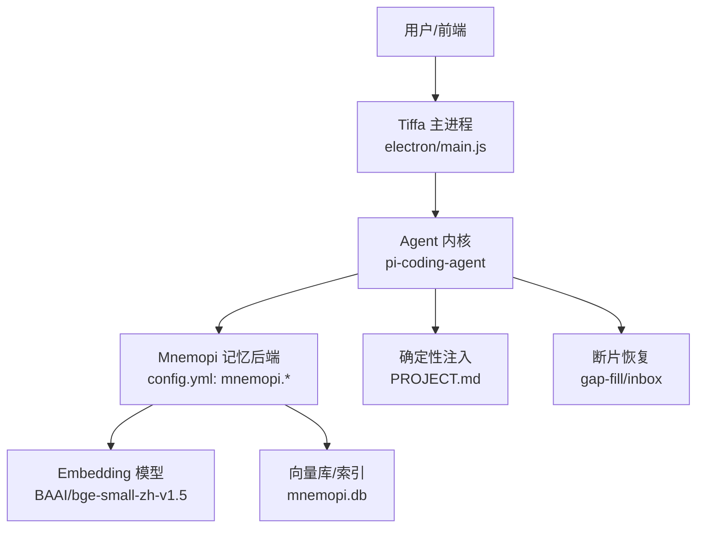
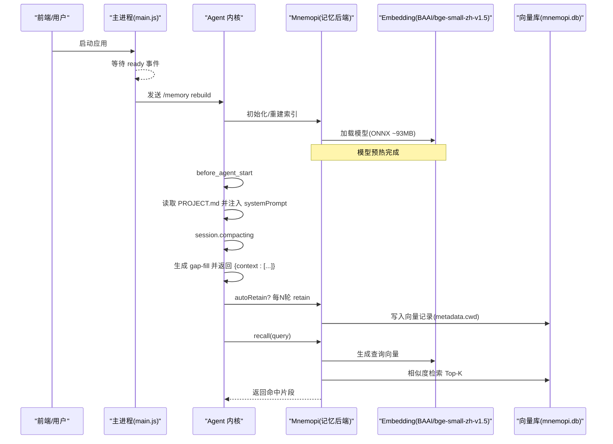
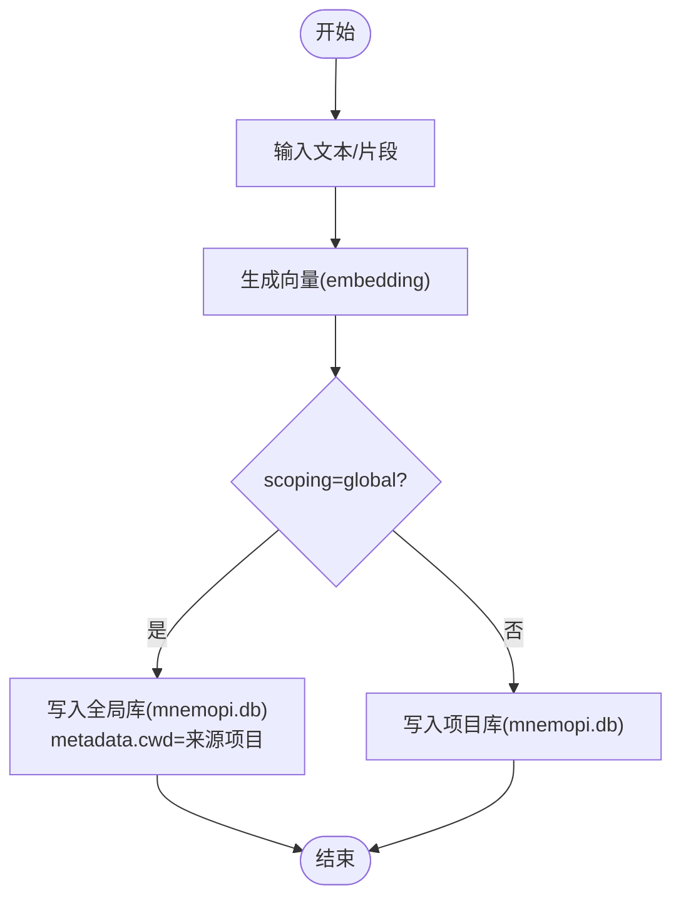
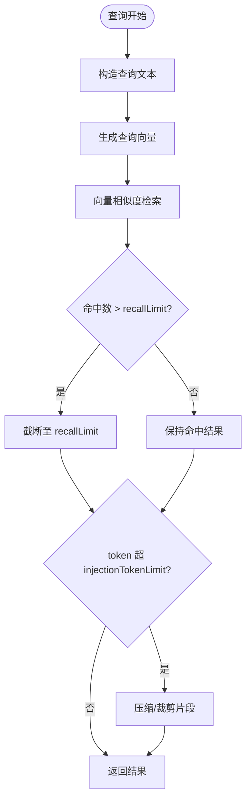
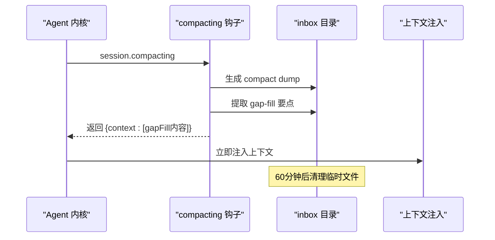
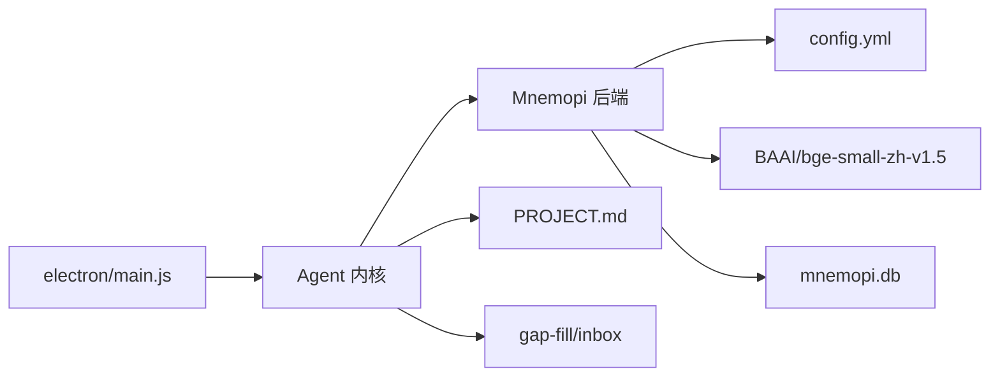

# Mnemopi语义记忆

<cite>
**本文引用的文件**   
- [AGENTS.md](file://AGENTS.md)
- [README.md](file://README.md)
- [config.yml](file://data/agent/config.yml)
- [main.js](file://electron/main.js)
- [test_embed.js](file://test_embed.js)
- [SKILL.md](file://data/agent/managed-skills/memory-manager/SKILL.md)
- [MEMORY.md](file://data/memory/MEMORY.md)
</cite>

## 目录
1. [简介](#简介)
2. [项目结构](#项目结构)
3. [核心组件](#核心组件)
4. [架构总览](#架构总览)
5. [详细组件分析](#详细组件分析)
6. [依赖关系分析](#依赖关系分析)
7. [性能考量](#性能考量)
8. [故障排查指南](#故障排查指南)
9. [结论](#结论)
10. [附录](#附录)

## 简介
本技术文档面向 Mnemopi v6.1 语义记忆系统，围绕以下目标展开：
- embedding 模型配置（BAAI/bge-small-zh-v1.5）与本地向量索引构建
- 语义搜索算法与召回策略
- autoRecall 自动召回、autoRetain 自动保留、retainEveryNTurns 保留频率等配置项的工作原理
- 跨项目 RAG 检索机制、上下文压缩时的断片恢复策略
- injectionTokenLimit 的内存管理与注入上限控制
- 向量数据库操作、相似度计算与性能优化建议

Mnemopi 在本项目中作为长期记忆后端，提供“全量积累 + 语义检索”的能力，并与确定性注入（PROJECT.md）、断片恢复（gap-fill）共同构成三层记忆体系。

## 项目结构
从仓库视角看，Mnemopi 相关能力分布在如下位置：
- 配置层：data/agent/config.yml 中定义 mnemopi.* 参数
- 运行时预热：electron/main.js 在进程就绪后触发 /memory rebuild 以预热 embedding 模型
- 测试与诊断：test_embed.js 用于验证 BAAI/bge-small-zh-v1.5 的可用性与 embed 调用
- 使用规范：data/agent/managed-skills/memory-manager/SKILL.md 描述 memory_save/search/get 的使用方式
- 全局记忆：data/memory/MEMORY.md 存放全局事实条目
- 项目规范与说明：AGENTS.md、README.md 对 Mnemopi 的配置与分层策略进行说明

图表来源
- [config.yml:1-30](file://data/agent/config.yml#L1-L30)
- [main.js:250-270](file://electron/main.js#L250-L270)
- [test_embed.js:1-73](file://test_embed.js#L1-L73)

章节来源
- [config.yml:1-30](file://data/agent/config.yml#L1-L30)
- [main.js:250-270](file://electron/main.js#L250-L270)
- [test_embed.js:1-73](file://test_embed.js#L1-L73)
- [SKILL.md:1-90](file://data/agent/managed-skills/memory-manager/SKILL.md#L1-L90)
- [MEMORY.md:1-18](file://data/memory/MEMORY.md#L1-L18)
- [AGENTS.md:60-76](file://AGENTS.md#L60-L76)
- [README.md:59-69](file://README.md#L59-L69)

## 核心组件
- Embedding 模型与缓存
  - 模型名：BAAI/bge-small-zh-v1.5（fast-bge-small-zh-v1.5）
  - 本地缓存路径：~/.omp/cache/fastembed/{model}/model_optimized.onnx
  - 可用性检测：available()、currentEmbeddingModel()、isApiModel()、embeddingsDisabled()
- 向量索引与数据库
  - 存储：mnemopi.db（按项目或全局库组织）
  - scoping=global 时，所有项目共享同一库，每条记录带 metadata.cwd 标记来源
- 配置开关
  - autoRecall：是否开启自动召回
  - autoRetain：是否在 agent_end 自动 retain
  - retainEveryNTurns：每 N 轮执行一次 retain
  - recallLimit：单次召回最大条数
  - injectionTokenLimit：注入到上下文的 token 上限
- 工具与接口
  - memory_save、memory_search、memory_get（由 memory-manager skill 描述）
  - 通过 Agent 内核暴露给上层调用

章节来源
- [test_embed.js:1-73](file://test_embed.js#L1-L73)
- [config.yml:18-28](file://data/agent/config.yml#L18-L28)
- [AGENTS.md:60-76](file://AGENTS.md#L60-L76)
- [SKILL.md:1-90](file://data/agent/managed-skills/memory-manager/SKILL.md#L1-L90)

## 架构总览
Mnemopi 在本系统中的整体交互如下：
- 启动阶段：主进程检测到 ready 事件后，延迟触发 /memory rebuild，预热 embedding 模型，避免首次消息冷加载导致的超时
- 会话阶段：
  - 确定性注入：PROJECT.md 在 before_agent_start 钩子生成并注入 system prompt
  - 断片恢复：session.compacting 钩子提取 gap-fill 并立即注入 context
  - 语义记忆：根据 autoRetain 与 retainEveryNTurns 将对话片段写入向量库；必要时进行 recall 检索
- 注入控制：injectionTokenLimit 限制注入到上下文的 token 总量，防止上下文膨胀

图表来源
- [main.js:250-270](file://electron/main.js#L250-L270)
- [config.yml:18-28](file://data/agent/config.yml#L18-L28)
- [AGENTS.md:273-300](file://AGENTS.md#L273-L300)

## 详细组件分析

### Embedding 模型配置与可用性
- 模型名称与环境变量
  - 模型名：BAAI/bge-small-zh-v1.5（fast-bge-small-zh-v1.5）
  - 环境变量：MNEMOPI_EMBEDDING_MODEL、MNEMOPI_EMBEDDINGS_VIA_API、MNEMOPI_NO_EMBEDDINGS、MNEMOPI_EMBEDDING_API_KEY
- 可用性检查
  - available()：检测本地/远程 embedding 是否可用
  - currentEmbeddingModel()：当前生效模型
  - isApiModel(model)：是否为 API 模型
  - embeddingsDisabled()：是否禁用 embedding
- 本地缓存
  - 路径：~/.omp/cache/fastembed/{model}/model_optimized.onnx
  - 大小约 93MB，首次加载较慢，需预热

章节来源
- [test_embed.js:1-73](file://test_embed.js#L1-L73)

### 向量索引构建与数据库操作
- 存储介质：mnememi.db（SQLite 风格），按 scoping 决定库范围
- scoping=global：所有项目共享同一库，每条记录包含 metadata.cwd 标识来源
- 写入流程：
  - 文本片段 → embedding → 向量入库（附带元数据：时间戳、cwd、会话ID等）
- 读取流程：
  - 查询文本 → embedding → 向量相似度检索 → 返回 Top-K 片段

图表来源
- [config.yml:18-28](file://data/agent/config.yml#L18-L28)

章节来源
- [config.yml:18-28](file://data/agent/config.yml#L18-L28)

### 语义搜索算法与召回策略
- 相似度计算：基于向量余弦相似度（默认）
- 召回策略：
  - recallLimit：限制单次召回数量
  - autoRecall：关闭时由 PROJECT.md 做确定性注入；开启时可自动召回
  - scoping：global 模式下支持跨项目检索
- 注入控制：
  - injectionTokenLimit：限制注入到上下文的 token 总量，避免上下文膨胀

图表来源
- [config.yml:18-28](file://data/agent/config.yml#L18-L28)
- [AGENTS.md:60-76](file://AGENTS.md#L60-L76)

章节来源
- [config.yml:18-28](file://data/agent/config.yml#L18-L28)
- [AGENTS.md:60-76](file://AGENTS.md#L60-L76)

### autoRecall 自动召回
- 作用：在对话过程中自动根据上下文进行语义检索，补充相关信息
- 当前配置：autoRecall=false，改为由 PROJECT.md 做确定性注入
- 影响：关闭后不会自动召回，但可通过手动 recall 工具进行跨项目检索

章节来源
- [AGENTS.md:60-76](file://AGENTS.md#L60-L76)
- [config.yml:18-28](file://data/agent/config.yml#L18-L28)

### autoRetain 自动保留与 retainEveryNTurns 保留频率
- autoRetain=true：每次 agent_end 自动 retain 到 global 库
- retainEveryNTurns=2：每 2 轮进行一次 retain，降低写入频率
- 效果：全量积累语义信息，便于后续 recall 跨项目检索

章节来源
- [AGENTS.md:60-76](file://AGENTS.md#L60-L76)
- [config.yml:18-28](file://data/agent/config.yml#L18-L28)

### 跨项目 RAG 检索机制
- scoping=global：所有项目共享同一向量库，每条记录带 metadata.cwd
- 检索范围：可跨项目检索历史记忆，适合“之前/上次/其他项目做过”的场景
- 结合确定性注入：PROJECT.md 提供项目级规范与决策，弥补 autoRecall 关闭后的空白

章节来源
- [AGENTS.md:60-76](file://AGENTS.md#L60-L76)
- [SKILL.md:1-90](file://data/agent/managed-skills/memory-manager/SKILL.md#L1-L90)

### 上下文压缩时的断片恢复策略（gap-fill）
- 触发时机：session.compacting 钩子
- 提取内容：改动文件、关键命令（排除 ls/cd/echo 等）、决策要点（正则去噪，上限 60 条）
- 落盘路径：
  - compact dump：data/memory/inbox/compact-{sessionId}-{ts}.txt
  - gap-fill：data/memory/inbox/gap-fill-{sessionId}.md
- 注入方式：压缩后立即返回 {context:[gapFill内容]}，不等下轮
- 清理策略：60 分钟后自动删除（跨 session）

图表来源
- [AGENTS.md:273-300](file://AGENTS.md#L273-L300)

章节来源
- [AGENTS.md:273-300](file://AGENTS.md#L273-L300)

### injectionTokenLimit 的内存管理
- 作用：限制注入到上下文的 token 总量，防止上下文膨胀导致响应缓慢或失败
- 当前值：2000 token
- 策略：当召回结果超过限制时，进行压缩/裁剪，优先保留高相关性片段

章节来源
- [AGENTS.md:60-76](file://AGENTS.md#L60-L76)
- [config.yml:18-28](file://data/agent/config.yml#L18-L28)

## 依赖关系分析
Mnemopi 在本系统中的依赖关系如下：
- 主进程（electron/main.js）负责启动与预热
- Agent 内核协调记忆后端与钩子
- Mnemopi 后端依赖 embedding 模型与向量库
- 配置文件（config.yml）驱动行为开关

图表来源
- [main.js:250-270](file://electron/main.js#L250-L270)
- [config.yml:18-28](file://data/agent/config.yml#L18-L28)

章节来源
- [main.js:250-270](file://electron/main.js#L250-L270)
- [config.yml:18-28](file://data/agent/config.yml#L18-L28)

## 性能考量
- 模型预热：首次加载 ONNX 模型约 93MB，建议在 ready 后触发 /memory rebuild 预热
- 写入频率：通过 retainEveryNTurns 控制写入间隔，避免频繁 I/O
- 召回限制：recallLimit 与 injectionTokenLimit 共同控制检索与注入规模
- 向量库维护：定期清理 inbox 中的临时文件，避免磁盘占用增长
- 相似度计算：建议使用本地向量库的近似最近邻搜索（ANN）以提升检索速度

[本节为通用指导，不直接分析具体文件]

## 故障排查指南
- Embedding 不可用
  - 检查环境变量：MNEMOPI_EMBEDDING_MODEL、MNEMOPI_EMBEDDINGS_VIA_API、MNEMOPI_NO_EMBEDDINGS
  - 检查缓存目录：~/.omp/cache/fastembed/{model}/model_optimized.onnx
  - 运行 test_embed.js 进行诊断
- 模型加载失败
  - 确认 /memory rebuild 已执行
  - 检查主进程日志，确认预热是否成功
- 向量库异常
  - 检查 mnemopi.db 是否存在且可写
  - 确认 scoping 配置是否正确
- 注入超限
  - 调整 injectionTokenLimit
  - 优化 recallLimit 与片段裁剪策略

章节来源
- [test_embed.js:1-73](file://test_embed.js#L1-L73)
- [main.js:250-270](file://electron/main.js#L250-L270)
- [config.yml:18-28](file://data/agent/config.yml#L18-L28)

## 结论
Mnemopi v6.1 在本系统中提供了强大的语义记忆能力，通过 embedding 模型、向量索引与智能召回策略，实现了跨项目的知识检索与积累。结合确定性注入（PROJECT.md）与断片恢复（gap-fill），形成了完整的三层记忆体系。合理配置 autoRecall、autoRetain、retainEveryNTurns 与 injectionTokenLimit，可在保证性能的同时提升记忆质量与检索准确性。

[本节为总结性内容，不直接分析具体文件]

## 附录
- 全局记忆示例：data/memory/MEMORY.md
- 记忆管理技能：data/agent/managed-skills/memory-manager/SKILL.md
- 项目规范与配置说明：AGENTS.md、README.md

章节来源
- [MEMORY.md:1-18](file://data/memory/MEMORY.md#L1-L18)
- [SKILL.md:1-90](file://data/agent/managed-skills/memory-manager/SKILL.md#L1-L90)
- [AGENTS.md:60-76](file://AGENTS.md#L60-L76)
- [README.md:59-69](file://README.md#L59-L69)