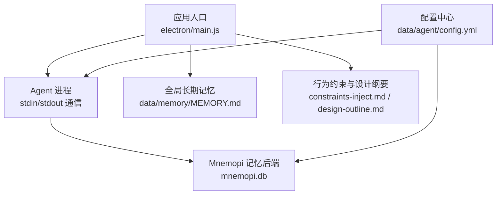
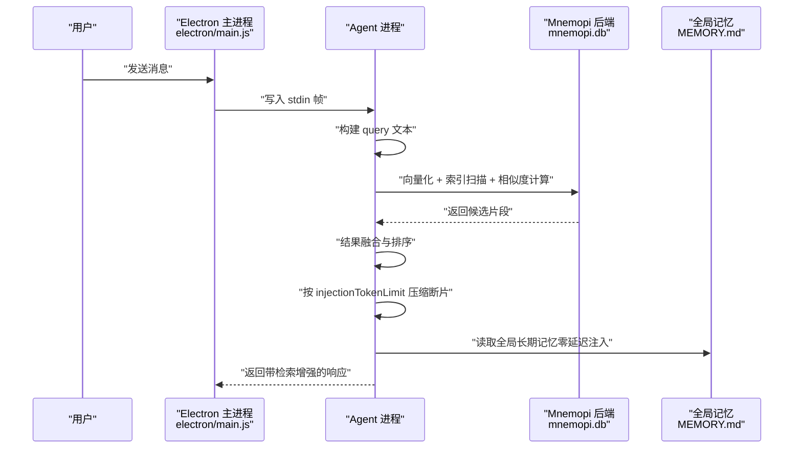
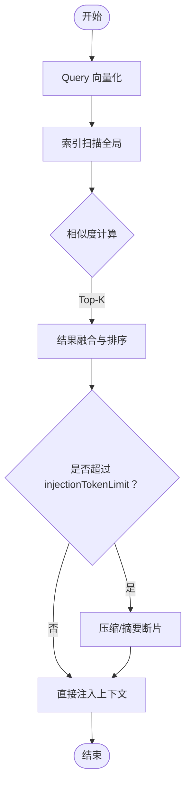
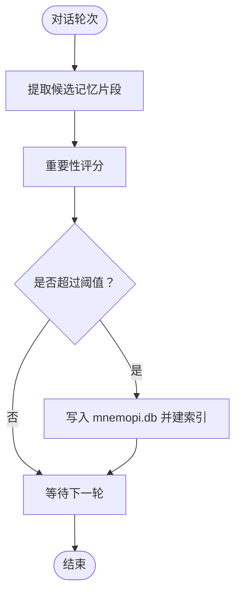
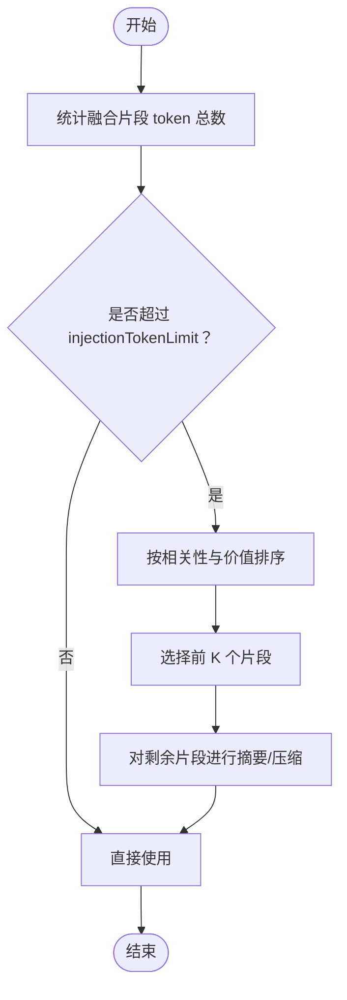
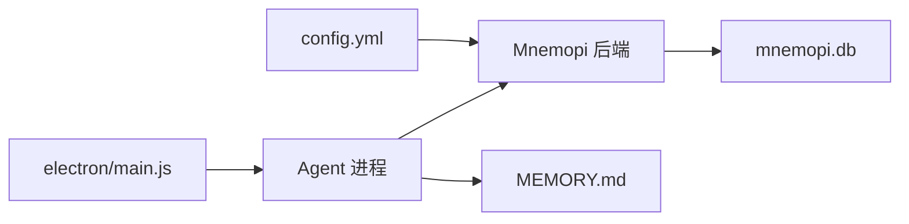

# RAG检索机制

<cite>
**本文引用的文件**   
- [config.yml](file://data/agent/config.yml)
- [MEMORY.md](file://data/memory/MEMORY.md)
- [constraints-inject.md](file://data/memory/constraints-inject.md)
- [design-outline.md](file://data/memory/design-outline.md)
- [main.js](file://electron/main.js)
</cite>

## 目录
1. [引言](#引言)
2. [项目结构](#项目结构)
3. [核心组件](#核心组件)
4. [架构总览](#架构总览)
5. [详细组件分析](#详细组件分析)
6. [依赖分析](#依赖分析)
7. [性能考虑](#性能考虑)
8. [故障排查指南](#故障排查指南)
9. [结论](#结论)
10. [附录](#附录)

## 引言
本技术文档聚焦 Mnemopi RAG（检索增强生成）检索机制，围绕跨项目检索的工作流程、自动保留（autoRetain）、保留频率（retainEveryNTurns）、注入令牌限制（injectionTokenLimit）等关键能力进行系统化说明。文档同时给出检索效果评估方法与性能调优建议，帮助读者在工程实践中优化检索质量、控制延迟与资源占用。

## 项目结构
Mnemopi RAG 在本仓库中的落地体现为：
- 配置层：通过主配置文件声明记忆后端与 Mnemopi 参数（嵌入模型、作用域、自动召回/保留、保留频率、召回上限、注入令牌限制）。
- 记忆层：全局长期记忆以 Markdown 形式维护，作为零延迟注入的 L2 记忆源；行为约束与设计纲要文件用于引导 Agent 行为与复杂任务设计。
- 运行层：Electron 主进程负责启动并预热 Mnemopi 的 embedding 模型，确保首次检索不冷启动。

**图示来源** 
- [main.js:250-270](file://electron/main.js#L250-L270)
- [config.yml:18-27](file://data/agent/config.yml#L18-L27)

**章节来源**
- [config.yml:18-27](file://data/agent/config.yml#L18-L27)
- [MEMORY.md:1-18](file://data/memory/MEMORY.md#L1-L18)
- [constraints-inject.md:1-45](file://data/memory/constraints-inject.md#L1-L45)
- [design-outline.md:1-35](file://data/memory/design-outline.md#L1-L35)
- [main.js:250-270](file://electron/main.js#L250-L270)

## 核心组件
- 配置项（Mnemopi）
  - embeddingModel：向量嵌入模型选择（如中文轻量模型）。
  - scoping：检索作用域（global 表示跨项目语义检索）。
  - autoRecall：是否自动触发召回（当前关闭）。
  - autoRetain：是否开启自动保留（当前开启）。
  - retainEveryNTurns：自动保留的频率（每 N 轮对话执行一次）。
  - recallLimit：单次召回返回的最大片段数。
  - injectionTokenLimit：注入到上下文的 token 预算上限。
- 记忆存储
  - mnemopi.db：SQLite 数据库，承载向量索引与元数据。
  - MEMORY.md：全局长期记忆，零延迟注入。
- 运行时预热
  - Electron 主进程在就绪后延迟发送 /memory rebuild 指令，触发 embedding 模型加载，避免冷启动导致的超时或失败。

**章节来源**
- [config.yml:18-27](file://data/agent/config.yml#L18-L27)
- [main.js:250-270](file://electron/main.js#L250-L270)

## 架构总览
下图展示从用户输入到 RAG 检索结果注入的整体流程，包括向量化、索引扫描、相似度计算、结果融合与上下文压缩。

**图示来源** 
- [main.js:240-270](file://electron/main.js#L240-L270)
- [config.yml:18-27](file://data/agent/config.yml#L18-L27)

## 详细组件分析

### 跨项目 RAG 检索工作流
- Query 向量化
  - 使用配置的 embeddingModel 将用户查询转换为向量。
  - 若模型未加载，Electron 主进程会在就绪后触发 /memory rebuild 预热。
- 索引扫描
  - 基于 mnemopi.db 的向量索引进行全库扫描（scoping=global），实现跨项目语义检索。
- 相似度计算
  - 计算 query 向量与索引中各条目的相似度（如余弦相似度），并按分数排序。
- 结果融合
  - 对多来源片段进行去重、排序与合并，结合全局记忆（MEMORY.md）提升相关性。
- 上下文压缩
  - 根据 injectionTokenLimit 对融合后的片段进行截断或摘要，确保不超过预算。

**图示来源** 
- [config.yml:18-27](file://data/agent/config.yml#L18-L27)
- [main.js:250-270](file://electron/main.js#L250-L270)

**章节来源**
- [config.yml:18-27](file://data/agent/config.yml#L18-L27)
- [main.js:250-270](file://electron/main.js#L250-L270)

### autoRetain 自动保留功能
- 记忆提取算法
  - 在对话轮次中，系统自动识别关键信息（如事实、规则、决策点），将其转化为可检索的记忆片段。
- 重要性评估
  - 依据内容新颖性、重复度、领域相关性与用户反馈信号进行评分，优先保留高价值片段。
- 存储策略
  - 将高价值片段持久化至 mnemopi.db，并建立向量索引以便后续检索。
- 触发条件
  - 由 retainEveryNTurns 控制保留频率，达到阈值时执行一次自动保留。

**图示来源** 
- [config.yml:18-27](file://data/agent/config.yml#L18-L27)

**章节来源**
- [config.yml:18-27](file://data/agent/config.yml#L18-L27)

### retainEveryNTurns 保留频率配置
- 作用机制
  - 设定每 N 轮对话进行一次自动保留，平衡检索质量与系统开销。
- 优化建议
  - 高频交互场景（N 较小）：提高更新频率，保证记忆时效性。
  - 低频交互场景（N 较大）：降低频率，减少不必要的写入与索引重建。
  - 监控指标：观察每次保留的片段数量与平均评分，动态调整 N。

**章节来源**
- [config.yml:18-27](file://data/agent/config.yml#L18-L27)

### injectionTokenLimit 内存管理机制
- 上下文压缩
  - 当融合后的片段总 token 数超过 injectionTokenLimit，系统对片段进行截断或摘要，优先保留高相关性与高价值内容。
- 断片恢复策略
  - 对于被压缩的片段，可在需要时按需恢复原始内容（例如在工具调用或深度推理阶段）。
- Token 预算分配
  - 合理分配预算给不同来源（如全局记忆、项目记忆、RAG 片段），确保关键信息不被过度压缩。

**图示来源** 
- [config.yml:18-27](file://data/agent/config.yml#L18-L27)

**章节来源**
- [config.yml:18-27](file://data/agent/config.yml#L18-L27)

## 依赖分析
- 配置依赖
  - config.yml 提供 Mnemopi 的核心参数，影响检索范围、自动保留与上下文预算。
- 运行时依赖
  - electron/main.js 负责进程管理与 embedding 模型预热，确保检索链路稳定。
- 数据依赖
  - mnemopi.db 存储向量索引与元数据；MEMORY.md 提供全局长期记忆。

**图示来源** 
- [config.yml:18-27](file://data/agent/config.yml#L18-L27)
- [main.js:250-270](file://electron/main.js#L250-L270)

**章节来源**
- [config.yml:18-27](file://data/agent/config.yml#L18-L27)
- [main.js:250-270](file://electron/main.js#L250-L270)

## 性能考虑
- 模型预热
  - 通过 /memory rebuild 提前加载 embedding 模型，避免首次检索冷启动延迟。
- 索引优化
  - 定期重建索引，清理低价值片段，提升扫描效率。
- 压缩策略
  - 精细控制 injectionTokenLimit，结合摘要算法减少上下文体积。
- 并发控制
  - 限制同时进行的检索与保留任务数量，避免资源争用。

[本节为通用指导，无需特定文件引用]

## 故障排查指南
- 常见问题
  - 首次检索超时：检查 embedding 模型是否已预热。
  - 检索结果不相关：调整 recallLimit 与 scoping，优化记忆片段质量。
  - 上下文溢出：降低 injectionTokenLimit 或改进压缩策略。
- 诊断步骤
  - 查看日志输出，确认 /memory rebuild 是否成功。
  - 检查 mnemopi.db 索引状态与片段数量。
  - 验证 MEMORY.md 内容是否与业务需求一致。

**章节来源**
- [main.js:250-270](file://electron/main.js#L250-L270)

## 结论
Mnemopi RAG 在本仓库中通过配置驱动、全局记忆与向量索引实现了跨项目语义检索。autoRetain 与 retainEveryNTurns 提供了灵活的自动保留机制，injectionTokenLimit 确保了上下文预算可控。通过模型预热、索引优化与压缩策略，可在保证检索质量的同时控制延迟与资源占用。

[本节为总结性内容，无需特定文件引用]

## 附录
- 行为约束与设计纲要
  - constraints-inject.md：定义 Agent 行为铁律与技能加载规范。
  - design-outline.md：提供复杂任务的设计文档模板与流程。

**章节来源**
- [constraints-inject.md:1-45](file://data/memory/constraints-inject.md#L1-L45)
- [design-outline.md:1-35](file://data/memory/design-outline.md#L1-L35)