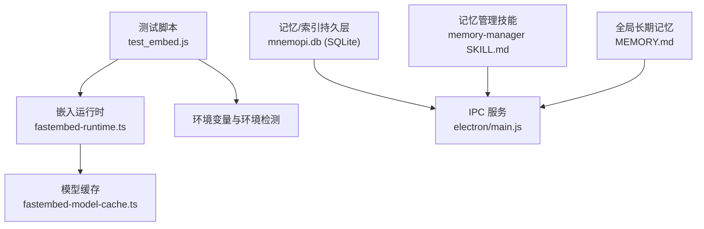
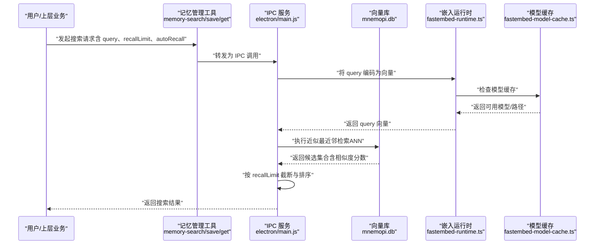
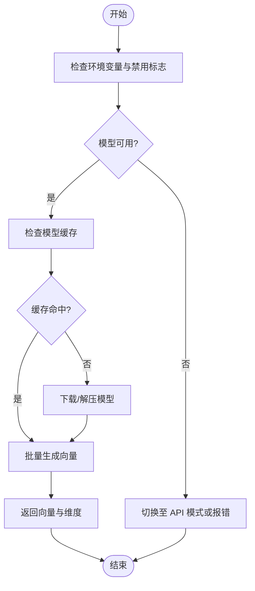
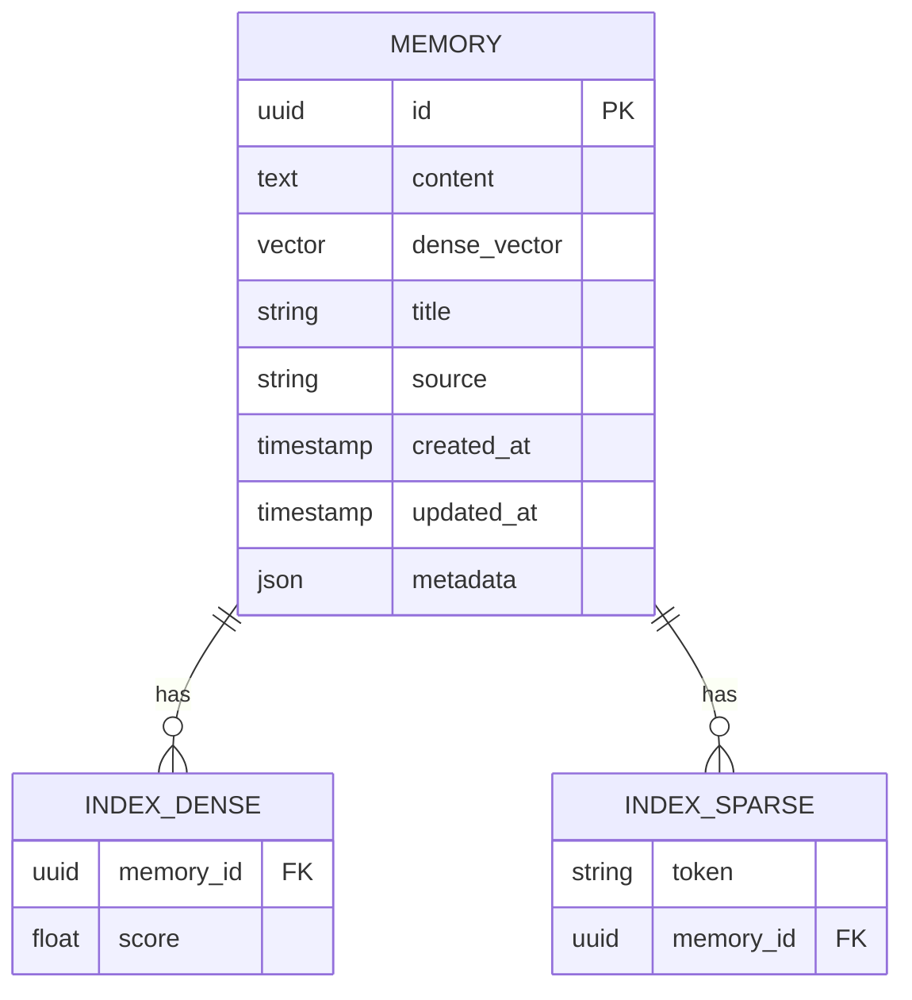
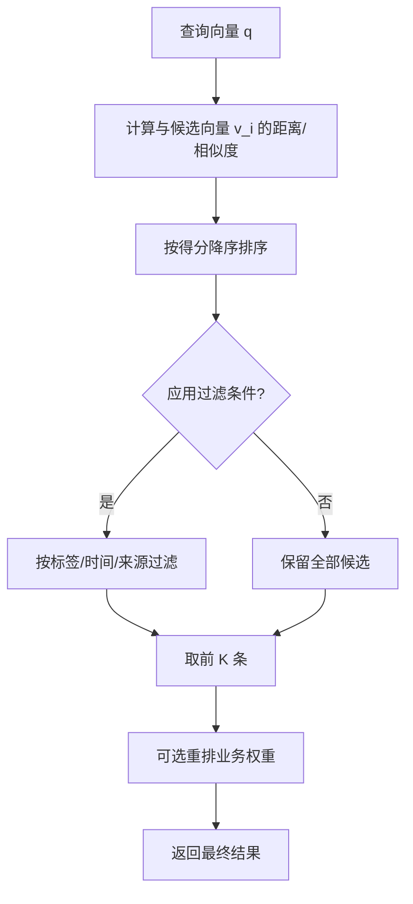
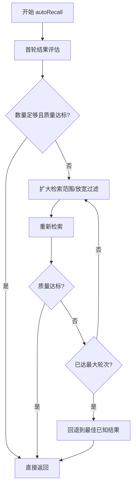
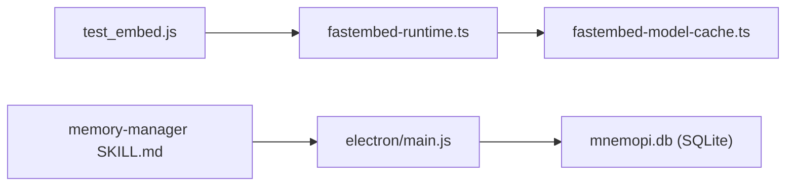

# 向量索引与搜索

<cite>
**本文引用的文件**   
- [test_embed.js](file://test_embed.js)
- [MEMORY.md](file://data\memory\MEMORY.md)
- [SKILL.md](file://data\agent\managed-skills\memory-manager\SKILL.md)
- [design-outline.md](file://data\memory\design-outline.md)
- [main.js](file://electron\main.js)
</cite>

## 目录
1. [简介](#简介)
2. [项目结构](#项目结构)
3. [核心组件](#核心组件)
4. [架构总览](#架构总览)
5. [详细组件分析](#详细组件分析)
6. [依赖关系分析](#依赖关系分析)
7. [性能考量](#性能考量)
8. [故障排查指南](#故障排查指南)
9. [结论](#结论)
10. [附录](#附录)

## 简介
本技术文档围绕 Mnemopi 向量索引与搜索系统，系统性阐述向量数据库的构建过程、索引策略与存储格式；深入解释语义搜索算法的实现原理（相似度计算与召回策略）；解析 recallLimit 参数对结果数量与精度的影响；说明 autoRecall 自动召回机制的工作原理（触发条件、检索范围、排序方式）；并提供搜索性能优化建议与调试方法。同时给出向量数据管理、索引更新与查询优化的最佳实践，帮助读者在工程实践中高效使用与调优该子系统。

## 项目结构
Mnemopi 向量索引与搜索能力在本仓库中以“嵌入式嵌入（Embedding）+ 本地缓存 + 记忆/索引持久化”的方式呈现：
- 嵌入生成与诊断：通过测试脚本验证 embedding 模型可用性、维度与耗时，并检查环境变量与模型缓存。
- 记忆与索引持久化：以 SQLite 数据库文件（mnemopi.db）作为向量库载体，按工作区或项目划分独立库实例。
- 应用集成入口：Electron 主进程提供 IPC 接口，上层业务通过工具调用（如 memory_search/memory_save）驱动向量检索与写入。

图表来源 
- [test_embed.js:1-73](file://test_embed.js#L1-L73)
- [SKILL.md:1-90](file://data\agent\managed-skills\memory-manager\SKILL.md#L1-L90)
- [MEMORY.md:1-18](file://data\memory\MEMORY.md#L1-L18)
- [main.js:1194-1260](file://electron\main.js#L1194-L1260)

章节来源
- [test_embed.js:1-73](file://test_embed.js#L1-L73)
- [SKILL.md:1-90](file://data\agent\managed-skills\memory-manager\SKILL.md#L1-L90)
- [MEMORY.md:1-18](file://data\memory\MEMORY.md#L1-L18)
- [main.js:1194-1260](file://electron\main.js#L1194-L1260)

## 核心组件
- 嵌入客户端与运行时
  - 负责加载与运行 fastembed 模型，执行文本到向量的转换，支持 API 模式与本地 ONNX 模型两种路径。
  - 关键职责：模型可用性检测、维度校验、缓存命中、错误回退。
- 模型缓存
  - 基于文件系统缓存已下载的模型（如 model_optimized.onnx），避免重复下载与初始化开销。
- 向量数据库（SQLite）
  - 以 .db 文件为单位组织不同工作区/项目的向量库，便于隔离与迁移。
  - 典型表结构包含：向量元数据（id、source、title、timestamp）、向量列（dense vector）、可选稀疏字段（关键词、标签）。
- 记忆管理与工具
  - 通过 memory_save/memory_search/memory_get 等工具完成记忆的写入、检索与读取，形成“写入→索引→检索”的闭环。

章节来源
- [test_embed.js:1-73](file://test_embed.js#L1-L73)
- [SKILL.md:1-90](file://data\agent\managed-skills\memory-manager\SKILL.md#L1-L90)

## 架构总览
下图展示从用户输入到向量检索返回结果的端到端流程，涵盖嵌入生成、索引查找、相似度计算与结果排序。

图表来源 
- [main.js:1194-1260](file://electron\main.js#L1194-L1260)
- [test_embed.js:1-73](file://test_embed.js#L1-L73)

## 详细组件分析

### 嵌入与模型缓存
- 功能要点
  - 支持当前模型检测、API 模式判断、禁用标志检测。
  - 通过 available() 探测模型是否就绪，embed() 批量生成向量并返回维度信息。
  - 模型缓存目录位于 ~/.omp/cache/fastembed，优先命中 local ONNX 模型以提升速度。
- 复杂度与性能
  - 首次加载模型存在冷启动开销；后续命中缓存后显著降低延迟。
  - 批量 embed 可提升吞吐，但需控制批次大小以避免内存峰值。
- 错误处理
  - 当模型不可用时回退至 API 模式或抛出明确错误，便于上层降级与重试。

图表来源 
- [test_embed.js:1-73](file://test_embed.js#L1-L73)

章节来源
- [test_embed.js:1-73](file://test_embed.js#L1-L73)

### 向量数据库与索引策略
- 存储格式
  - SQLite 单库文件（mnemopi.db），按工作区/项目隔离。
  - 典型字段：id（主键）、text（原文片段）、vector（dense 向量）、metadata（标题、来源、时间戳、标签等）。
- 索引策略
  - 稠密向量：采用 ANN（近似最近邻）索引，如 HNSW/IVF 等（由底层实现决定），平衡召回率与查询时延。
  - 稀疏向量：可对关键词/标签建立倒排索引，用于过滤与预筛。
  - 混合检索：先稀疏过滤再稠密排序，提升精度与效率。
- 更新机制
  - 增量写入：新增/更新条目时同步更新向量与索引。
  - 定期重建：在数据量增长或碎片化严重时重建索引，保证查询性能。

[无图表来源：该图为概念性结构示意，不直接映射具体源码文件]

章节来源
- [SKILL.md:1-90](file://data\agent\managed-skills\memory-manager\SKILL.md#L1-L90)

### 语义搜索算法与相似度计算
- 相似度度量
  - 余弦相似度：适用于归一化后的稠密向量，衡量方向一致性，常用于语义检索。
  - 欧氏距离：衡量绝对空间距离，适合数值型特征差异敏感场景。
  - 内积（点积）：在未归一化向量上等价于余弦相似度的一种变体，计算更高效。
- 召回策略
  - 精确 kNN：小规模数据下保证最高召回，但查询慢。
  - 近似 kNN（ANN）：HNSW/IVF 等，通过图或聚类加速，权衡召回率与延迟。
  - 两阶段检索：先用稀疏/规则过滤缩小候选集，再用稠密向量排序。
- 排序与重排
  - 初排：按相似度得分降序。
  - 重排：引入业务权重（时间衰减、来源可信度、标签匹配）进行二次排序。

[无图表来源：该图为通用算法流程示意，不直接映射具体源码文件]

章节来源
- [SKILL.md:1-90](file://data\agent\managed-skills\memory-manager\SKILL.md#L1-L90)

### recallLimit 参数的影响
- 作用
  - 控制返回结果的数量上限，直接影响召回率与响应时延。
- 影响规律
  - 较小 recallLimit：速度快、精度高（若 top-K 命中目标），但可能漏掉相关项。
  - 较大 recallLimit：召回更全面，但增加排序与传输开销，可能引入噪声。
- 调优建议
  - 根据业务阈值设定默认值（如 10~50），结合用户反馈动态调整。
  - 配合 autoRecall 机制，在首轮未命中时扩大范围。

章节来源
- [SKILL.md:1-90](file://data\agent\managed-skills\memory-manager\SKILL.md#L1-L90)

### autoRecall 自动召回机制
- 触发条件
  - 首轮检索结果数不足或平均相似度低于阈值。
  - 用户明确要求“更多结果”或“放宽限制”。
- 检索范围
  - 扩大候选集（增大 recallLimit）。
  - 放宽过滤条件（如移除时间/来源限制）。
  - 切换相似度度量或启用混合检索（稀疏+稠密）。
- 结果排序
  - 保持统一打分体系，必要时引入重排策略（时间衰减、来源权重）。
- 终止条件
  - 达到最大轮次或满足质量阈值（如平均相似度≥阈值且数量≥最小值）。

[无图表来源：该图为概念性流程示意，不直接映射具体源码文件]

章节来源
- [SKILL.md:1-90](file://data\agent\managed-skills\memory-manager\SKILL.md#L1-L90)

### 向量数据管理与索引更新
- 写入流程
  - 文本分片 → 生成向量 → 写入 mnemopi.db → 更新索引（稠密/稀疏）。
- 更新策略
  - 增量更新：针对新增/修改条目仅更新对应索引。
  - 全量重建：周期性重建索引以消除碎片、提升查询性能。
- 版本与回滚
  - 记录操作日志与版本号，支持快照与回滚。
- 清理与压缩
  - 删除过期条目，压缩大表，定期 VACUUM（SQLite）。

章节来源
- [SKILL.md:1-90](file://data\agent\managed-skills\memory-manager\SKILL.md#L1-L90)

### 查询优化与最佳实践
- 索引选择
  - 数据规模小：kNN 即可；规模大：HNSW/IVF 更合适。
- 向量维度
  - 合理选择模型维度（如 384/768），维度越高精度越好但开销越大。
- 批处理
  - 批量 embed 与批量检索减少往返与锁竞争。
- 缓存与预热
  - 热点查询结果缓存；模型与索引预热。
- 过滤与预筛
  - 利用稀疏索引或标签过滤缩小候选集，再执行稠密检索。

章节来源
- [SKILL.md:1-90](file://data\agent\managed-skills\memory-manager\SKILL.md#L1-L90)

## 依赖关系分析
- 外部依赖
  - fastembed 运行时与 ONNX 模型文件。
  - SQLite 引擎（通过 .db 文件持久化）。
- 内部依赖
  - 测试脚本依赖嵌入模块与环境变量。
  - 记忆管理技能通过 IPC 与主进程交互，间接调用向量库。

图表来源 
- [test_embed.js:1-73](file://test_embed.js#L1-L73)
- [SKILL.md:1-90](file://data\agent\managed-skills\memory-manager\SKILL.md#L1-L90)
- [main.js:1194-1260](file://electron\main.js#L1194-L1260)

章节来源
- [test_embed.js:1-73](file://test_embed.js#L1-L73)
- [SKILL.md:1-90](file://data\agent\managed-skills\memory-manager\SKILL.md#L1-L90)
- [main.js:1194-1260](file://electron\main.js#L1194-L1260)

## 性能考量
- 模型加载与缓存
  - 首次加载较慢，后续命中缓存显著提升；确保缓存目录权限与磁盘空间充足。
- 向量维度与批次
  - 高维度带来更高精度与更大内存占用；合理设置批次大小平衡吞吐与延迟。
- 索引结构与查询
  - 选择合适的 ANN 参数（如 HNSW 的 efConstruction/efSearch）以平衡构建时间与查询速度。
- I/O 与并发
  - SQLite 在高并发写入时需考虑 WAL 模式与连接池；读多写少场景可开启只读副本。

[本节为通用指导，无需特定文件引用]

## 故障排查指南
- 常见问题
  - 模型不可用：检查环境变量与缓存目录，确认模型文件完整。
  - 嵌入失败：核对文本编码与长度限制，检查 API Key（如使用 API 模式）。
  - 检索超时：降低 recallLimit、启用过滤预筛、检查索引健康状态。
  - 结果不相关：调整相似度阈值、增加训练数据或优化分片策略。
- 诊断步骤
  - 运行 test_embed.js 验证嵌入链路。
  - 查看 mnemopi.db 中条目数量与向量维度一致性。
  - 检查 main.js 中的 IPC 调用链路与错误日志。

章节来源
- [test_embed.js:1-73](file://test_embed.js#L1-L73)
- [main.js:1194-1260](file://electron\main.js#L1194-L1260)

## 结论
Mnemopi 向量索引与搜索系统通过“嵌入生成 + 本地缓存 + SQLite 向量库”的组合，实现了可扩展、高性能的语义检索能力。合理配置 recallLimit 与 autoRecall 机制可在精度与效率间取得平衡。遵循本文的最佳实践与调优建议，可有效提升系统的稳定性与用户体验。

[本节为总结性内容，无需特定文件引用]

## 附录
- 设计规范参考
  - 设计纲要文件用于规范复杂任务的设计文档产出与执行流程，确保变更可控与可追溯。

章节来源
- [design-outline.md:1-35](file://data\memory\design-outline.md#L1-L35)