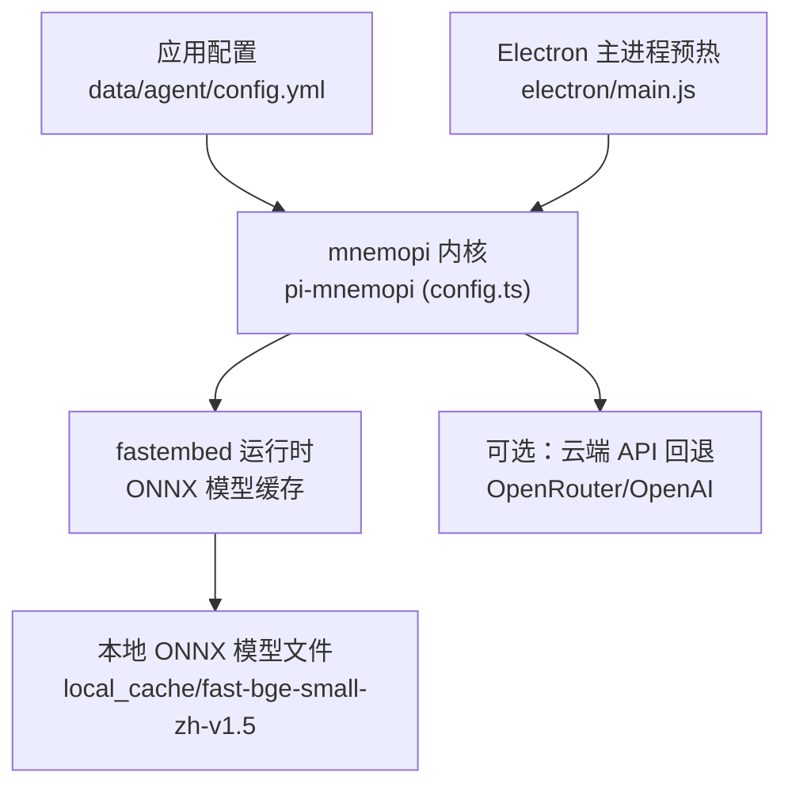
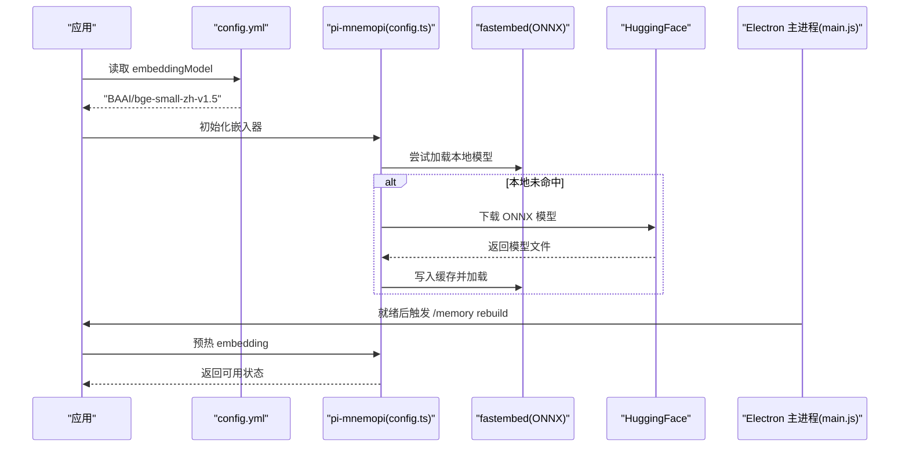
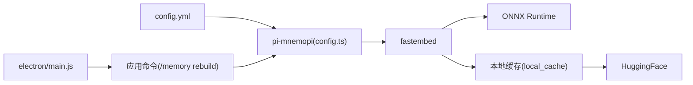

# 嵌入模型配置

<cite>
**本文引用的文件**   
- [README.md](file://README.md)
- [config.yml](file://data/agent/config.yml)
- [main.js](file://electron/main.js)
- [config.json（fast-bge-small-zh-v1.5）](file://local_cache/fast-bge-small-zh-v1.5/config.json)
- [test_embed.js](file://test_embed.js)
- [pi-mnemopi 配置源码 config.ts](file://npm-global/node_modules/@oh-my-pi/pi-coding-agent/node_modules/@oh-my-pi/pi-mnemopi/src/config.ts)
</cite>

## 目录
1. [简介](#简介)
2. [项目结构](#项目结构)
3. [核心组件](#核心组件)
4. [架构总览](#架构总览)
5. [详细组件分析](#详细组件分析)
6. [依赖关系分析](#依赖关系分析)
7. [性能考量](#性能考量)
8. [故障排除指南](#故障排除指南)
9. [结论](#结论)
10. [附录](#附录)

## 简介
本文件聚焦 Mnemopi 的嵌入模型配置，围绕 BAAI/bge-small-zh-v1.5 中文嵌入模型的选择原因、性能特点与适用场景展开。文档同时覆盖 embeddingModel 配置参数设置方法、模型下载与缓存机制、不同嵌入模型的对比分析（向量维度、推理速度、内存占用等）、模型切换最佳实践与故障排除，以及本地部署、网络请求优化与性能调优建议。

## 项目结构
Mnemopi 嵌入能力由“配置层 + 运行时层 + 缓存/模型层”构成：
- 配置层：通过 data/agent/config.yml 指定 mnemopi.embeddingModel；环境变量可覆盖默认行为。
- 运行时层：@oh-my-pi/pi-mnemopi 提供 embedding 加载、缓存、自动下载、API 回退等逻辑。
- 缓存/模型层：fastembed 将 ONNX 模型下载到用户缓存目录，首次使用自动拉取并缓存。

图表来源
- [config.yml:18-27](file://data/agent/config.yml#L18-L27)
- [config.ts:72-80](file://npm-global/node_modules/@oh-my-pi/pi-coding-agent/node_modules/@oh-my-pi/pi-mnemopi/src/config.ts#L72-L80)
- [main.js:260-268](file://electron/main.js#L260-L268)

章节来源
- [config.yml:18-27](file://data/agent/config.yml#L18-L27)
- [config.ts:72-80](file://npm-global/node_modules/@oh-my-pi/pi-coding-agent/node_modules/@oh-my-pi/pi-mnemopi/src/config.ts#L72-L80)
- [main.js:260-268](file://electron/main.js#L260-L268)

## 核心组件
- 配置项 embeddingModel：在 data/agent/config.yml 中设置为 "BAAI/bge-small-zh-v1.5"，用于选择中文嵌入模型。
- 运行时解析：pi-mnemopi 从环境变量 MNEMOPI_EMBEDDING_MODEL 或内置默认值读取模型名，并据此确定向量维度与后端策略。
- fastembed 缓存：首次调用时根据模型名自动下载 ONNX 模型到缓存目录，后续直接加载。
- Electron 预热：启动后延迟触发 /memory rebuild，预加载 embedding 模型，避免首条消息冷启动超时。

章节来源
- [config.yml:20-21](file://data/agent/config.yml#L20-L21)
- [config.ts:72-80](file://npm-global/node_modules/@oh-my-pi/pi-coding-agent/node_modules/@oh-my-pi/pi-mnemopi/src/config.ts#L72-L80)
- [main.js:260-268](file://electron/main.js#L260-L268)

## 架构总览
嵌入流程的关键路径如下：
- 应用读取 config.yml 中的 embeddingModel。
- pi-mnemopi 解析模型名，决定向量维度与是否走本地 fastembed 或云端 API。
- fastembed 检查本地缓存，不存在则从 HuggingFace 拉取 ONNX 模型。
- Electron 主进程在就绪后预热 embedding，缩短首条消息响应时间。

图表来源
- [config.yml:20-21](file://data/agent/config.yml#L20-L21)
- [config.ts:72-80](file://npm-global/node_modules/@oh-my-pi/pi-coding-agent/node_modules/@oh-my-pi/pi-mnemopi/src/config.ts#L72-L80)
- [main.js:260-268](file://electron/main.js#L260-L268)

## 详细组件分析

### 为什么选择 BAAI/bge-small-zh-v1.5
- 语言适配：该模型为中文优化，适合中文文本语义检索与记忆增强。
- 资源友好：small 系列体积较小，适合桌面端本地运行，降低内存与磁盘占用。
- 无需 API：本地 ONNX 推理，不依赖外部服务，离线可用。
- 集成成熟：pi-mnemopi 内置对该模型的支持与映射，开箱即用。

章节来源
- [README.md:68-71](file://README.md#L68-L71)
- [config.yml:20-21](file://data/agent/config.yml#L20-L21)
- [config.ts:32-50](file://npm-global/node_modules/@oh-my-pi/pi-coding-agent/node_modules/@oh-my-pi/pi-mnemopi/src/config.ts#L32-L50)

### embeddingModel 配置参数说明
- 配置文件位置：data/agent/config.yml
- 字段名称：mnemopi.embeddingModel
- 推荐值："BAAI/bge-small-zh-v1.5"
- 覆盖方式：可通过环境变量 MNEMOPI_EMBEDDING_MODEL 覆盖默认值
- 向量维度：由模型名解析得到，bge-small-zh-v1.5 对应 512 维

章节来源
- [config.yml:20-21](file://data/agent/config.yml#L20-L21)
- [config.ts:72-80](file://npm-global/node_modules/@oh-my-pi/pi-coding-agent/node_modules/@oh-my-pi/pi-mnemopi/src/config.ts#L72-L80)
- [config.ts:32-50](file://npm-global/node_modules/@oh-my-pi/pi-coding-agent/node_modules/@oh-my-pi/pi-mnemopi/src/config.ts#L32-L50)

### 模型下载与缓存机制
- 首次调用：若本地缓存缺失，fastembed 会从 HuggingFace 拉取模型文件（如 config.json、tokenizer.json 等）。
- 缓存目录：用户家目录下 .omp/cache/fastembed（Windows 下通常为 home/.omp/cache/fastembed）。
- 模型文件：ONNX 模型约 90MB，存放于 local_cache/fast-bge-small-zh-v1.5。
- 损坏恢复：若 ONNX 文件损坏，系统会将其隔离并重试加载。

章节来源
- [config.ts:72-80](file://npm-global/node_modules/@oh-my-pi/pi-coding-agent/node_modules/@oh-my-pi/pi-mnemopi/src/config.ts#L72-L80)
- [config.json（fast-bge-small-zh-v1.5）:1-33](file://local_cache/fast-bge-small-zh-v1.5/config.json#L1-L33)

### 不同嵌入模型对比分析
- 向量维度
  - BAAI/bge-small-zh-v1.5：512 维
  - BAAI/bge-base-zh-v1.5：768 维
  - BAAI/bge-large-zh-v1.5：1024 维
  - intfloat/multilingual-e5-large：1024 维
  - openai/text-embedding-3-small/large：1536/3072 维
- 推理速度与内存占用
  - small 系列更快、内存更低，适合桌面端与弱模型环境
  - base/large 系列精度更高但更慢、内存更大
  - OpenAI 云端 API 速度快但需网络与密钥
- 适用场景
  - 中文本地 RAG：优先 bge-small-zh-v1.5
  - 多语言通用：multilingual-e5 系列
  - 高维需求：openai text-embedding-3 系列（云端）

章节来源
- [config.ts:32-50](file://npm-global/node_modules/@oh-my-pi/pi-coding-agent/node_modules/@oh-my-pi/pi-mnemopi/src/config.ts#L32-L50)
- [README.md:68-71](file://README.md#L68-L71)

### 模型切换最佳实践
- 统一使用 HuggingFace 全名（如 "BAAI/bge-small-zh-v1.5"），不要使用 fastembed 短名，否则内核映射表无法识别。
- 切换模型后，重启应用以重建索引与缓存。
- 如需云端回退，配置 MNEMOPI_EMBEDDING_API_URL 与密钥，并确保非 OpenRouter 域名或已配置密钥。

章节来源
- [config.yml:20-21](file://data/agent/config.yml#L20-L21)
- [config.ts:94-128](file://npm-global/node_modules/@oh-my-pi/pi-coding-agent/node_modules/@oh-my-pi/pi-mnemopi/src/config.ts#L94-L128)

### 故障排除指南
- 症状：embedding 完全不工作且无错误日志
  - 根因：config.yml 中使用了 fastembed 短名而非 HuggingFace 全名
  - 解决：改为 "BAAI/bge-small-zh-v1.5"
- 症状：首次调用超时或失败
  - 原因：模型未缓存或网络问题
  - 解决：确保网络连接正常，等待下载完成；或使用 /memory rebuild 预热
- 症状：ONNX 模型损坏
  - 现象：加载时报错 Protobuf 解析失败
  - 解决：系统会自动隔离损坏文件并重试；必要时清理缓存目录重新下载

章节来源
- [config.yml:20-21](file://data/agent/config.yml#L20-L21)
- [config.ts:72-80](file://npm-global/node_modules/@oh-my-pi/pi-coding-agent/node_modules/@oh-my-pi/pi-mnemopi/src/config.ts#L72-L80)

## 依赖关系分析
- 配置依赖：data/agent/config.yml → pi-mnemopi 配置解析
- 运行时依赖：pi-mnemopi → fastembed → ONNX Runtime
- 缓存依赖：用户家目录缓存 → HuggingFace 模型仓库
- 预热依赖：Electron 主进程 → 应用命令 → embedding 预热

图表来源
- [config.yml:20-21](file://data/agent/config.yml#L20-L21)
- [config.ts:72-80](file://npm-global/node_modules/@oh-my-pi/pi-coding-agent/node_modules/@oh-my-pi/pi-mnemopi/src/config.ts#L72-L80)
- [main.js:260-268](file://electron/main.js#L260-L268)

章节来源
- [config.yml:20-21](file://data/agent/config.yml#L20-L21)
- [config.ts:72-80](file://npm-global/node_modules/@oh-my-pi/pi-coding-agent/node_modules/@oh-my-pi/pi-mnemopi/src/config.ts#L72-L80)
- [main.js:260-268](file://electron/main.js#L260-L268)

## 性能考量
- 模型选择：small 系列更适合桌面端，平衡精度与资源占用
- 缓存命中：首次下载后后续调用显著加速
- 预热策略：启动后预热 embedding，减少首条消息延迟
- 输入截断：超长文本会被截断至最大字符数，避免超出上下文窗口
- 量化存储：支持 float32/int8/bit 向量类型，节省存储空间

章节来源
- [config.ts:118-120](file://npm-global/node_modules/@oh-my-pi/pi-coding-agent/node_modules/@oh-my-pi/pi-mnemopi/src/config.ts#L118-L120)
- [main.js:260-268](file://electron/main.js#L260-L268)

## 故障排除指南
- 检查配置：确认 config.yml 中 embeddingModel 使用 HuggingFace 全名
- 验证缓存：查看 local_cache/fast-bge-small-zh-v1.5 是否存在 ONNX 文件
- 测试接口：使用 test_embed.js 诊断 embedding 是否正常工作
- 网络问题：确保能访问 HuggingFace 或配置合适的代理
- 权限问题：确保对缓存目录有读写权限

章节来源
- [config.yml:20-21](file://data/agent/config.yml#L20-L21)
- [test_embed.js:1-73](file://test_embed.js#L1-L73)

## 结论
BAAI/bge-small-zh-v1.5 是 Tiffa 中 Mnemopi 记忆系统的理想选择，兼顾中文语义理解与本地运行效率。通过合理的配置、缓存管理与预热策略，可在桌面端实现稳定高效的语义检索与记忆增强。遇到问题时，应优先检查配置正确性、缓存完整性与网络连通性。

## 附录
- 环境变量参考：
  - MNEMOPI_EMBEDDING_MODEL：覆盖默认模型
  - MNEMOPI_EMBEDDING_API_URL：云端 API 地址
  - MNEMOPI_EMBEDDING_API_KEY：云端 API 密钥
  - MNEMOPI_NO_EMBEDDINGS：禁用嵌入功能
- 缓存路径：home/.omp/cache/fastembed
- 模型文件：local_cache/fast-bge-small-zh-v1.5

章节来源
- [config.ts:72-80](file://npm-global/node_modules/@oh-my-pi/pi-coding-agent/node_modules/@oh-my-pi/pi-mnemopi/src/config.ts#L72-L80)
- [config.json（fast-bge-small-zh-v1.5）:1-33](file://local_cache/fast-bge-small-zh-v1.5/config.json#L1-L33)