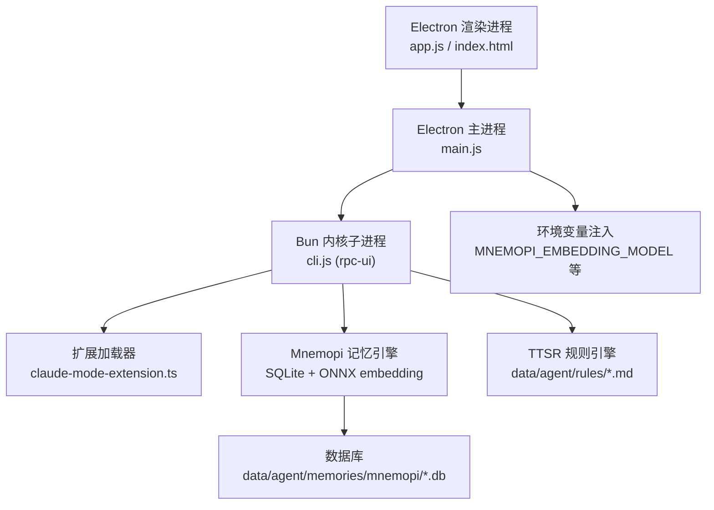
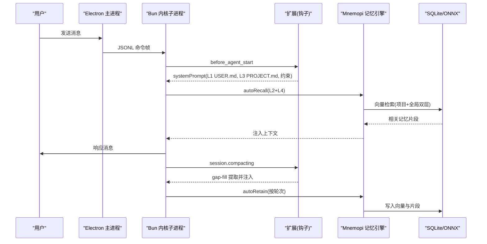
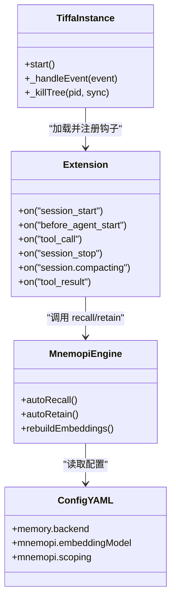

# 五层记忆架构

<cite>
**本文引用的文件**   
- [README.md](file://README.md)
- [开发文档.md](file://开发文档.md)
- [electron/main.js](file://electron/main.js)
- [plugins/claude-mode-extension.ts](file://plugins/claude-mode-extension.ts)
- [data/agent/config.yml](file://data/agent/config.yml)
- [test_memory_system.ts](file://test_memory_system.ts)
- [test_live_memory.ts](file://test_live_memory.ts)
- [AGENTS.md](file://AGENTS.md)
- [skills/memory-manager/SKILL.md](file://skills/memory-manager/SKILL.md)
- [data/agent/rules/no-direct-mnemopi-inspection.md](file://data/agent/rules/no-direct-mnemopi-inspection.md)
</cite>

## 目录
1. [引言](#引言)
2. [项目结构](#项目结构)
3. [核心组件](#核心组件)
4. [架构总览](#架构总览)
5. [详细组件分析](#详细组件分析)
6. [依赖关系分析](#依赖关系分析)
7. [性能考量](#性能考量)
8. [故障排查指南](#故障排查指南)
9. [结论](#结论)
10. [附录](#附录)

## 引言
本文件系统化阐述 Tiffa 的“五层记忆架构”，从设计目标、数据流、实现机制到配置与排障，帮助读者快速理解并正确使用该体系。五层记忆覆盖从永久到瞬间的不同时间尺度：L1 用户偏好、L2 全局语义库、L3 项目纲领、L4 项目语义库、L5 对话断片补救。配合三重约束（TTSR、before_agent_start、tool_call）与 Mnemopi 语义记忆，使弱模型也能稳定完成智能体任务。

## 项目结构
- Electron 桌面壳负责进程管理、窗口与主题、IPC 事件分发；通过 JSONL over stdin/stdout 与 Bun 内核子进程通信。
- Bun 内核子进程承载 Agent 核心、Mnemopi 记忆引擎、TTSR 规则引擎与扩展加载器。
- 记忆系统由配置文件、扩展钩子、技能说明与规则共同驱动，持久化在 data 目录中。

图表来源
- [electron/main.js:142-178](file://electron/main.js#L142-L178)
- [开发文档.md:8-27](file://开发文档.md#L8-L27)

章节来源
- [开发文档.md:8-27](file://开发文档.md#L8-L27)
- [electron/main.js:142-178](file://electron/main.js#L142-L178)

## 核心组件
- L1 用户偏好（USER.md）：每会话全文注入，零延迟，用于身份与偏好。
- L2 全局 bank（mnemopi）：跨项目语义检索，自动积累与召回。
- L3 项目纲领（PROJECT.md）：人工维护的项目级规范与铁律，首次对话自动生成脚手架并注入。
- L4 项目 bank（mnemopi per-project-tagged）：项目近期进度，优先于全局召回。
- L5 断片补救（gap-fill）：会话压缩时提取关键信息即时注入，60 分钟后清理。

章节来源
- [README.md:45-82](file://README.md#L45-L82)
- [开发文档.md:59-99](file://开发文档.md#L59-L99)

## 架构总览
五层记忆与三重约束协同工作：
- 注入阶段：L1/L3 确定性注入（before_agent_start），L2/L4 语义召回（autoRecall）。
- 写入阶段：L2/L4 自动 retain（autoRetain），按轮次阈值累积。
- 压缩阶段：L5 gap-fill 提取关键上下文，立即注入，随后定时清理。
- 约束阶段：TTSR 实时拦截违规输出；before_agent_start 注入行为约束；tool_call 拦截危险操作。

图表来源
- [plugins/claude-mode-extension.ts:236-393](file://plugins/claude-mode-extension.ts#L236-L393)
- [plugins/claude-mode-extension.ts:527-600](file://plugins/claude-mode-extension.ts#L527-L600)
- [开发文档.md:59-99](file://开发文档.md#L59-L99)

## 详细组件分析

### L1 用户偏好（USER.md）
- 作用：每次会话开头注入用户身份与偏好，确保模型“知道跟谁说话”。
- 注入点：扩展 before_agent_start 读取 data/memory/USER.md 并拼入 systemPrompt。
- 验证：测试脚本检查文件存在、内容非空、包含用户称呼与扩展注入逻辑。

章节来源
- [plugins/claude-mode-extension.ts:262-270](file://plugins/claude-mode-extension.ts#L262-L270)
- [test_memory_system.ts:17-29](file://test_memory_system.ts#L17-L29)

### L2 全局 bank（mnemopi）
- 作用：跨项目使用历史，语义召回，永久积累。
- 存储：SQLite 数据库 memory_embeddings 与 episodic_memory 表，embedding 模型为 BAAI/bge-small-zh-v1.5（本地 ONNX）。
- 配置：settings 表控制 scoping、autoRecall、autoRetain、recallLimit、injectionTokenLimit 等。
- 验证：测试脚本检查数据库存在、向量与片段数量、模型名称。

章节来源
- [开发文档.md:69-86](file://开发文档.md#L69-L86)
- [test_memory_system.ts:31-46](file://test_memory_system.ts#L31-L46)

### L3 项目纲领（PROJECT.md）
- 作用：项目级规范与铁律，人工维护，必要时自动生成脚手架。
- 生成与注入：before_agent_start 检测项目根目录是否存在 PROJECT.md，不存在则生成模板（含版本标记与路径约定），并读入注入 systemPrompt。
- 写入规则：仅允许写入项目目标、里程碑进展与用户明确指令的铁律；日常决策与踩坑由 mnemopi 记录。

章节来源
- [plugins/claude-mode-extension.ts:272-358](file://plugins/claude-mode-extension.ts#L272-L358)
- [开发文档.md:59-99](file://开发文档.md#L59-L99)

### L4 项目 bank（per-project-tagged）
- 作用：项目近期进度，语义召回且优先于全局。
- 策略：scoping=per-project-tagged，写入项目 bank 并打标签，召回时并行搜索项目与全局，项目结果优先。
- 配置：settings 表控制 recallLimit、injectionTokenLimit、retainEveryNTurns 等。

章节来源
- [开发文档.md:69-86](file://开发文档.md#L69-L86)
- [test_memory_system.ts:59-75](file://test_memory_system.ts#L59-L75)

### L5 断片补救（gap-fill）
- 触发：session.compacting hook。
- 处理：最近 50 条消息原文落盘 compact dump；提取改动文件、关键命令、决策要点生成 gap-fill 文件；立即返回 context 注入；60 分钟后自动清理。
- 验证：测试脚本检查 hook 注册、提取逻辑与清理策略。

章节来源
- [plugins/claude-mode-extension.ts:527-600](file://plugins/claude-mode-extension.ts#L527-L600)
- [test_memory_system.ts:77-82](file://test_memory_system.ts#L77-L82)

### 三重约束机制
- 第一重：TTSR 流式规则（零 Context 成本），data/agent/rules/*.md，违规实时拦截。
- 第二重：before_agent_start Hook 注入 constraints-inject.md，行为/语义类约束专属。
- 第三重：tool_call Hook 拦截危险路径、配置文件自改、workspace 根目录新建、静默工具调用检测。

章节来源
- [README.md:83-133](file://README.md#L83-L133)
- [data/agent/rules/no-direct-mnemopi-inspection.md:1-21](file://data/agent/rules/no-direct-mnemopi-inspection.md#L1-L21)
- [plugins/claude-mode-extension.ts:395-525](file://plugins/claude-mode-extension.ts#L395-L525)

### 启动流程与环境保障
- 双阶段等待：阶段 1 轮询 isReady()，最长 20 秒；阶段 2 固定等 6 秒预热记忆系统。
- 环境变量：PORTABLE_ROOT、PI_CODING_AGENT_DIR、HOME/USERPROFILE、MNEMOPI_EMBEDDING_MODEL 由 main.js 注入。
- 端到端验证：test_live_memory.ts 启动 CLI，发送 prompt，捕获 ready/response/agent_end 事件与日志。

章节来源
- [开发文档.md:134-147](file://开发文档.md#L134-L147)
- [electron/main.js:146-164](file://electron/main.js#L146-L164)
- [test_live_memory.ts:1-79](file://test_live_memory.ts#L1-L79)

## 依赖关系分析
- Electron 主进程通过 child_process.spawn 启动 Bun 内核子进程，传递 --mode rpc-ui 与 -e 扩展参数。
- 扩展通过 pi.on 注册多个钩子（session_start、before_agent_start、tool_call、session_stop、session.compacting、tool_result）。
- Mnemopi 依赖 SQLite 与 ONNX embedding（fastembed），配置来源于 config.yml 顶层 mnemopi 节。

图表来源
- [electron/main.js:142-178](file://electron/main.js#L142-L178)
- [plugins/claude-mode-extension.ts:217-393](file://plugins/claude-mode-extension.ts#L217-L393)
- [data/agent/config.yml:1-29](file://data/agent/config.yml#L1-L29)

章节来源
- [electron/main.js:142-178](file://electron/main.js#L142-L178)
- [plugins/claude-mode-extension.ts:217-393](file://plugins/claude-mode-extension.ts#L217-L393)
- [data/agent/config.yml:1-29](file://data/agent/config.yml#L1-L29)

## 性能考量
- 注入上限：单次注入 token 限制（如 2000），避免上下文膨胀。
- 召回限制：单次最多召回 10 条，减少检索开销。
- 自动累积：每 N 轮写入一次，平衡频率与负载。
- 清理策略：gap-fill 文件 60 分钟清理，防止磁盘增长。
- 首事件延迟：前端 30 秒超时启发式可能误报，需关注后端依赖加载耗时。

章节来源
- [开发文档.md:69-86](file://开发文档.md#L69-L86)
- [test_memory_system.ts:59-75](file://test_memory_system.ts#L59-L75)
- [AGENTS.md:287-310](file://AGENTS.md#L287-L310)

## 故障排查指南
- embedding 未生效：检查 config.yml 顶层 mnemopi 节是否正确；确认 fastembed 依赖就绪；查看内核日志 rebuild 状态。
- 无跨项目记忆：确认 scoping=per-project-tagged 或 global；检查 autoRecall/autoRetain 开关。
- 直接查询数据库被拦：遵循 no-direct-mnemopi-inspection.md 规则，使用 recall 工具诊断。
- 首条回复延迟：排查 fastembed on-demand install；优化依赖预装。

章节来源
- [data/agent/config.yml:13-27](file://data/agent/config.yml#L13-L27)
- [data/agent/rules/no-direct-mnemopi-inspection.md:1-21](file://data/agent/rules/no-direct-mnemopi-inspection.md#L1-L21)
- [AGENTS.md:287-310](file://AGENTS.md#L287-L310)

## 结论
五层记忆架构通过分层存储与语义检索，结合三重约束与扩展钩子，实现了从永久到瞬间的全生命周期记忆管理。配合 Electron 与 Bun 内核的稳健通信机制，使弱模型也能稳定执行智能体任务。建议在生产环境中严格遵循配置与规则，定期清理临时文件，监控首事件延迟与 embedding 健康度。

## 附录
- 技能系统：memory-manager SKILL.md 提供跨会话记忆管理工具（memory_save/search/get），适用于用户显式记忆需求。
- 启动方式：GUI、TUI、WebUI/RPC 三种模式，均支持环境变量注入与便携部署。

章节来源
- [skills/memory-manager/SKILL.md:1-56](file://skills/memory-manager/SKILL.md#L1-L56)
- [开发文档.md:149-175](file://开发文档.md#L149-L175)