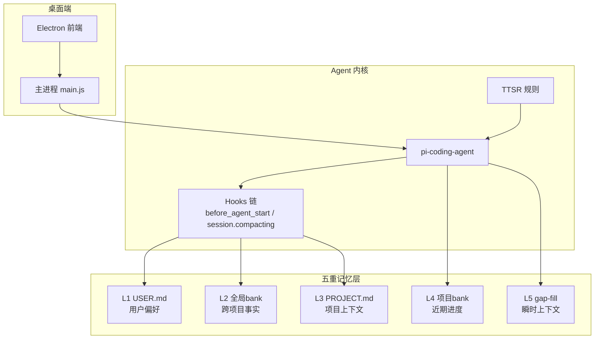
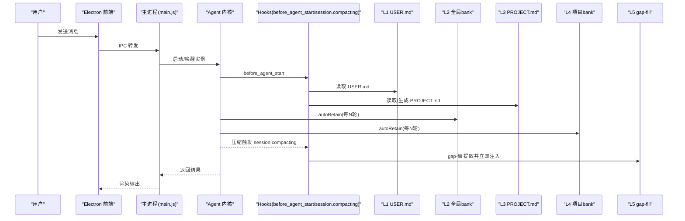
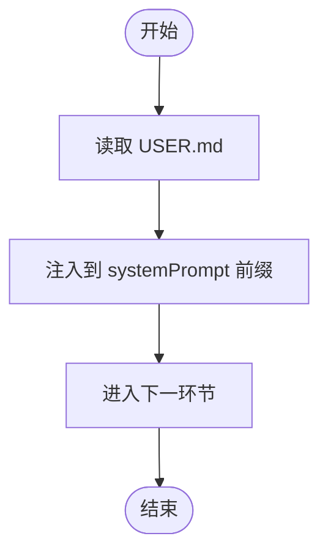
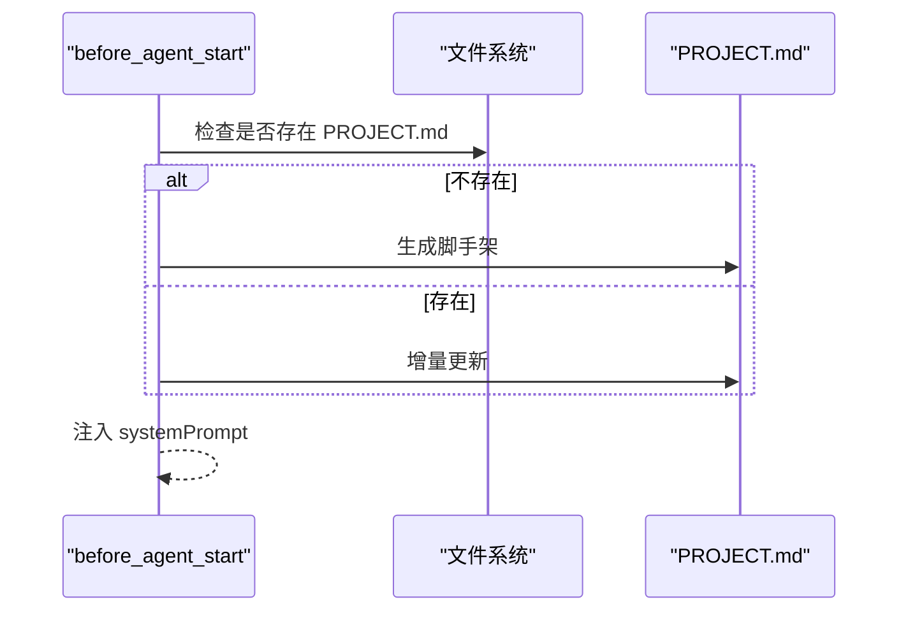
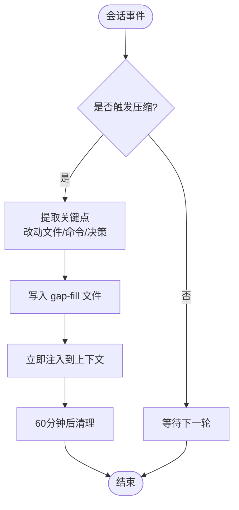
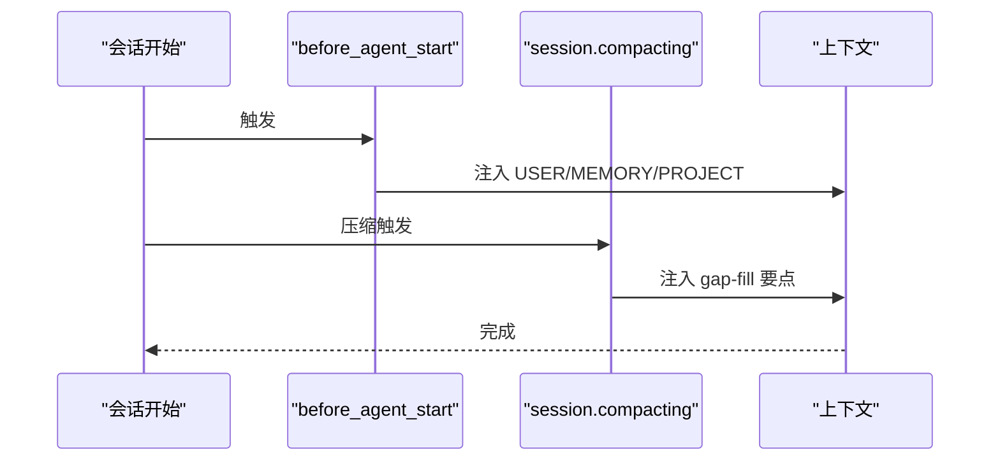
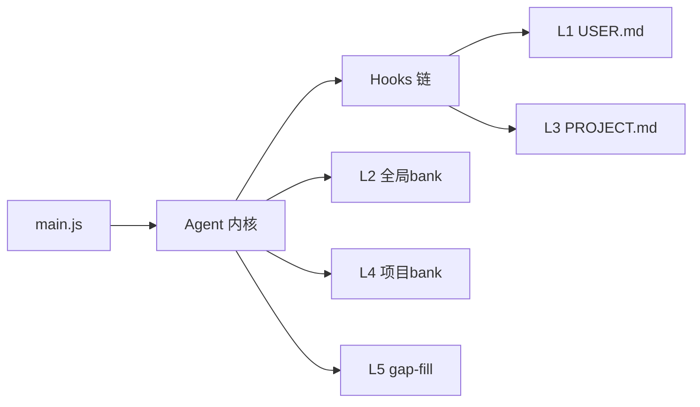

# 五重记忆架构概览

<cite>
**本文引用的文件**   
- [README.md](file://README.md)
- [AGENTS.md](file://AGENTS.md)
- [config.yml](file://data/agent/config.yml)
- [main.js](file://electron/main.js)
- [开发文档.md](file://开发文档.md)
</cite>

## 更新摘要
**变更内容**   
- 将四重记忆架构升级为五层架构（L1-L5）
- 更新Mnemopi scoping配置从global改为per-project-tagged
- 新增L4项目bank和L5 gap-fill层的详细说明
- 更新架构图和数据流向以反映新的分层设计
- 修正配置说明和注入机制描述

## 目录
1. [引言](#引言)
2. [项目结构](#项目结构)
3. [核心组件](#核心组件)
4. [架构总览](#架构总览)
5. [详细组件分析](#详细组件分析)
6. [依赖关系分析](#依赖关系分析)
7. [性能考量](#性能考量)
8. [故障排查指南](#故障排查指南)
9. [结论](#结论)
10. [附录](#附录)

## 引言
本文件面向 Tiffa 的五重记忆系统，系统性阐述 L1 USER.md（用户偏好）、L2 全局bank（跨项目事实）、L3 PROJECT.md（项目上下文）、L4 项目bank（近期进度）与 L5 gap-fill（瞬时上下文）的分层设计理念、职责分工、存储位置、访问优先级、注入时机与性能特征。同时解释"零延迟注入"机制的设计原理，以及五层记忆如何协同工作为智能体提供完整上下文支持。文档包含记忆层次图与数据流向说明，帮助读者快速理解并正确使用该体系。

## 项目结构
Tiffa 的记忆系统由"确定性注入 + 语义检索"双通道组成：
- 确定性注入：USER.md、MEMORY.md、PROJECT.md 在会话或任务关键阶段被即时读取并注入，不占用额外 token 的检索开销，实现"零延迟"。
- 语义检索：Mnemopi 作为双层 RAG 库（项目bank + 全局bank），自动累积对话片段，按需召回并限制注入长度，避免上下文爆炸。

**图表来源** 
- [main.js:240-278](file://electron/main.js#L240-L278)
- [AGENTS.md:113-156](file://AGENTS.md#L113-L156)

**章节来源**
- [README.md:45-74](file://README.md#L45-L74)
- [AGENTS.md:61-77](file://AGENTS.md#L61-L77)

## 核心组件
- L1 USER.md（用户偏好）
  - 存储位置：`data/memory/USER.md`
  - 职责：记录用户身份、语言、量化偏好等个性化信息
  - 注入时机：每轮对话前（zero-latency），确保每次推理都具备用户画像
  - 访问优先级：最高（首轮必读）
  - 性能特征：纯文本直读，无网络与模型加载，毫秒级

- L2 全局bank（跨项目事实）
  - 存储位置：`data/agent/memories/mnemopi/mnemopi.db`（全局bank）
  - 职责：跨项目共享的全局事实索引（如硬件环境、服务管理方式）
  - 注入时机：autoRetain 每 N 轮写入；manual recall 或 autoRecall 时注入
  - 访问优先级：中（语义检索，按相关性排序）
  - 性能特征：embedding 模型本地运行；冷启动预热可避免首次超时

- L3 PROJECT.md（项目上下文）
  - 存储位置：当前项目根目录 `workspace/<proj>/PROJECT.md`
  - 职责：当前项目的架构、决策、约束与规范
  - 注入时机：before_agent_start 钩子中生成/更新并注入；按 cwd 隔离
  - 访问优先级：中高（项目级确定性上下文）
  - 性能特征：首次生成可能耗时，后续增量更新；注入上限受控

- L4 项目bank（近期进度）
  - 存储位置：`data/agent/memories/mnemopi/banks/<project-id>/mnemopi.db`
  - 职责：项目近期的对话片段和进度跟踪
  - 注入时机：autoRetain 每 N 轮写入；recall 时优先于全局bank
  - 访问优先级：高（项目相关记忆优先召回）
  - 性能特征：与全局bank并行检索，项目结果优先

- L5 gap-fill（瞬时上下文）
  - 存储位置：`data/memory/inbox/gap-fill-{sessionId}.md`
  - 职责：本次对话的瞬时上下文，压缩时提取关键点
  - 注入时机：session.compacting 时立即注入，60分钟后自动清理
  - 访问优先级：临时性，仅当前会话有效
  - 性能特征：轻量文本文件，压缩时实时生成

**章节来源**
- [README.md:45-74](file://README.md#L45-L74)
- [AGENTS.md:275-310](file://AGENTS.md#L275-L310)
- [config.yml:13-27](file://data/agent/config.yml#L13-L27)
- [开发文档.md:59-97](file://开发文档.md#L59-L97)

## 架构总览
五重记忆通过"确定性注入 + 语义检索"协作，形成低延迟、强一致、可扩展的上下文供给体系。

**图表来源** 
- [main.js:240-278](file://electron/main.js#L240-L278)
- [AGENTS.md:113-156](file://AGENTS.md#L113-L156)
- [AGENTS.md:275-310](file://AGENTS.md#L275-L310)

## 详细组件分析

### L1 USER.md（用户偏好）
- 设计目标：以最小成本提供稳定的用户画像，确保每次推理都"认识你"
- 存储与访问：`data/memory/USER.md`，纯文本；每轮对话前读取
- 注入策略：确定性注入，零延迟，优先于其他记忆层
- 性能特征：无 I/O 阻塞风险（小文件），无模型调用，响应时间稳定

**章节来源**
- [README.md:45-63](file://README.md#L45-L63)

### L2 全局bank（跨项目事实）
- 设计目标：跨项目共享的关键事实索引，避免重复描述
- 存储与访问：`data/agent/memories/mnemopi/mnemopi.db`，SQLite数据库
- 注入策略：autoRetain 每2轮写入，autoRecall 首条消息自动召回
- 性能特征：轻量embedding检索，适合高频复用

**章节来源**
- [README.md:54-63](file://README.md#L54-L63)

### L3 PROJECT.md（项目上下文）
- 设计目标：为当前项目提供结构化、可演进的上下文（架构、决策、约束）
- 存储与访问：项目根目录 `workspace/<proj>/PROJECT.md`，按 cwd 隔离；首次对话自动生成脚手架
- 注入策略：before_agent_start 钩子中生成/更新并注入；确定性注入
- 性能特征：首次生成可能较慢，后续增量更新；注入上限受控

**图表来源** 
- [AGENTS.md:113-156](file://AGENTS.md#L113-L156)

**章节来源**
- [AGENTS.md:113-156](file://AGENTS.md#L113-L156)

### L4 项目bank（近期进度）
- 设计目标：项目级别的近期对话积累，提供项目相关的语义检索
- 存储与访问：`data/agent/memories/mnemopi/banks/<project-id>/mnemopi.db`
- 注入策略：autoRetain 每2轮写入，recall 时优先于全局bank
- 性能特征：与全局bank并行检索，项目结果优先排序

**章节来源**
- [开发文档.md:59-97](file://开发文档.md#L59-L97)

### L5 gap-fill（瞬时上下文）
- 设计目标：本次对话的瞬时上下文，防止长对话中断片
- 存储与访问：`data/memory/inbox/gap-fill-{sessionId}.md`，60分钟后自动清理
- 注入策略：session.compacting 时提取关键点并立即注入
- 性能特征：轻量文本文件，压缩时实时生成，临时性使用

**图表来源** 
- [AGENTS.md:134-141](file://AGENTS.md#L134-L141)

**章节来源**
- [AGENTS.md:134-141](file://AGENTS.md#L134-L141)

### Mnemopi 语义记忆配置
- **embedding 模型**：`BAAI/bge-small-zh-v1.5`（本地 ONNX 运行，512 维，无需 API）
- **存储策略**：`scoping: per-project-tagged`——记忆写入项目 bank 并打标签，召回时**并行搜索项目 + 全局双层**，项目结果优先
- **自动积累**：`autoRetain: true`，每 2 轮自动写入
- **自动召回**：`autoRecall: true`，每次会话首条消息自动注入相关记忆
- **防膨胀**：单次最多召回 10 条、注入上限 2000 token、旧记忆自动退化压缩

**章节来源**
- [config.yml:13-27](file://data/agent/config.yml#L13-L27)
- [开发文档.md:69-86](file://开发文档.md#L69-L86)

### 零延迟注入机制
- 设计原理：将最关键的三层记忆（USER/MEMORY/PROJECT）以确定性方式在关键钩子中直接读取并注入，避免检索与模型加载带来的延迟
- 触发点：
  - before_agent_start：注入 USER/MEMORY/PROJECT
  - session.compacting：gap-fill 立即注入，不等下轮
- 效果：首句即可获得完整上下文，提升弱模型可用性

**图表来源** 
- [AGENTS.md:113-156](file://AGENTS.md#L113-L156)

**章节来源**
- [AGENTS.md:113-156](file://AGENTS.md#L113-L156)

## 依赖关系分析
- Electron 主进程负责实例生命周期管理与预热（embedding 模型加载）
- Agent 内核通过 Hooks 链协调记忆注入与工具调用拦截
- 记忆层分为确定性注入（L1/L3）与语义检索（L2/L4/L5），两者互补

**图表来源** 
- [main.js:240-278](file://electron/main.js#L240-L278)
- [AGENTS.md:113-156](file://AGENTS.md#L113-L156)

**章节来源**
- [main.js:240-278](file://electron/main.js#L240-L278)
- [AGENTS.md:113-156](file://AGENTS.md#L113-L156)

## 性能考量
- 零延迟注入：L1/L3 为纯文本直读，无检索与模型加载，响应时间稳定
- 语义检索：L2/L4 使用本地 embedding 模型，需预热以避免首次冷加载超时
- 双层召回：L2/L4 并行检索，项目bank结果优先，提升相关性和速度
- 注入上限：L2/L4 注入 token 上限 2000，防止上下文爆炸
- 预热策略：主进程在就绪后延迟触发 /memory rebuild，提前加载 embedding 模型

**章节来源**
- [main.js:240-278](file://electron/main.js#L240-L278)
- [config.yml:13-27](file://data/agent/config.yml#L13-L27)

## 故障排查指南
- 首次消息超时或失败
  - 现象：embedding 冷加载导致超时
  - 处理：确认主进程已执行 /memory rebuild 预热；检查 embedding 模型路径与权限
- 记忆未注入
  - 现象：USER/PROJECT 未生效
  - 处理：检查 before_agent_start 钩子是否触发；确认文件存在且可读
- 注入内容过多
  - 现象：上下文过长影响弱模型
  - 处理：调整 recallLimit 与 injectionTokenLimit；精简 MEMORY.md 条目
- 双层召回问题
  - 现象：项目记忆与全局记忆混淆
  - 处理：检查 scoping 配置是否为 per-project-tagged；确认项目bank和全局bank分离

**章节来源**
- [main.js:240-278](file://electron/main.js#L240-L278)
- [AGENTS.md:275-310](file://AGENTS.md#L275-L310)

## 结论
Tiffa 的五重记忆系统通过"确定性注入 + 语义检索"的双通道设计，实现了低延迟、强一致、可扩展的上下文供给。L1/L3 保障关键信息的即时可用，L2/L4 提供跨项目和项目级的语义检索能力，L5 保证长对话中间不断片。配合主进程的预热策略与注入上限控制，整体系统在弱模型场景下依然表现稳健。

## 附录
- 配置参考：mnemopi 参数通过 settings 数据库写入，config.yml 嵌套写法不生效
- 技能加载：通过 read skill://<name> 协议加载 SKILL.md
- 环境变量：PI_CODING_AGENT_DIR、HOME/USERPROFILE、KIMI_API_KEY、PORTABLE_ROOT
- 数据库位置：`data/agent/memories/mnemopi/mnemopi.db`（全局bank），项目bank在 `banks/` 子目录

**章节来源**
- [AGENTS.md:61-77](file://AGENTS.md#L61-77)
- [AGENTS.md:144-156](file://AGENTS.md#L144-L156)
- [AGENTS.md:256-264](file://AGENTS.md#L256-L264)
- [开发文档.md:86](file://开发文档.md#L86)