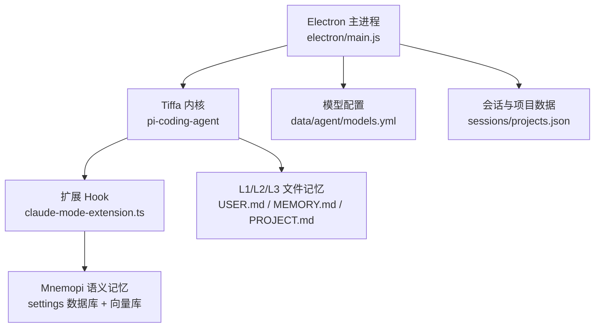
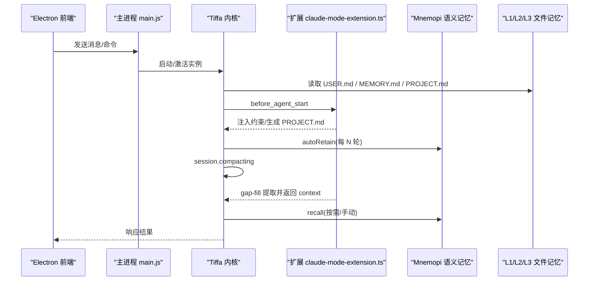
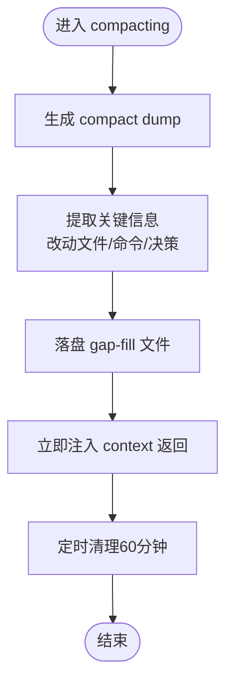
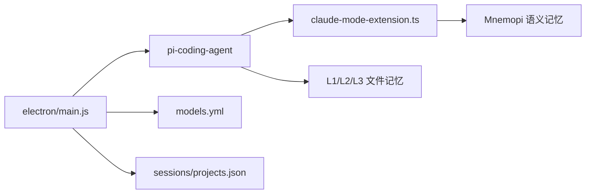

# 记忆系统

<cite>
**本文引用的文件**
- [README.md](file://README.md)
- [AGENTS.md](file://AGENTS.md)
- [config.yml](file://data/agent/config.yml)
- [models.yml](file://data/agent/models.yml)
- [main.js](file://electron/main.js)
- [test_memory_system.ts](file://test_memory_system.ts)
</cite>

## 更新摘要
**已进行的更改**
- 更新了 Mnemopi 配置章节，反映 scoping 从 global 改为 per-project-tagged
- 更新了 autoRecall 配置，从 false 改为 true
- 新增了双层召回机制的详细说明
- 更新了配置生效方式的说明
- 完善了五层记忆分层架构的描述

## 目录
1. [引言](#引言)
2. [项目结构](#项目结构)
3. [核心组件](#核心组件)
4. [架构总览](#架构总览)
5. [详细组件分析](#详细组件分析)
6. [依赖关系分析](#依赖关系分析)
7. [性能考量](#性能考量)
8. [故障排查指南](#故障排查指南)
9. [结论](#结论)
10. [附录](#附录)

## 引言
本文件系统化阐述 Tiffa 四重记忆系统的分层架构与实现要点，重点覆盖：
- L1 USER.md（用户偏好）
- L2 MEMORY.md（全局事实）
- L3 PROJECT.md（项目上下文）
- L4 Mnemopi 语义记忆（RAG）

并深入说明 Mnemopi v6.1 的语义记忆实现：embedding 模型配置、召回策略、向量索引与语义搜索；记忆注入机制；上下文压缩时的断片补救策略；以及跨会话、跨项目的记忆持久化。同时给出配置选项、性能优化建议与常见问题解决方案。

## 项目结构
Tiffa 的记忆系统由"内核原生加载 + 扩展 Hook + 外部 Mnemopi 库"共同构成，关键路径如下：
- 内核与扩展
  - 内核：npm-global\node_modules\@oh-my-pi\pi-coding-agent\（v17.0.7）
  - 扩展：plugins/claude-mode-extension.ts（v6.2），通过 -e 参数加载
- 配置与记忆
  - data/agent/config.yml：memory.backend=mnemopi，mnemopi.* 配置项
  - data/memory/constraints-inject.md：行为约束（before_agent_start 注入）
  - data/memory/inbox/*：compact/gap-fill 等中间产物
- 桌面进程
  - electron/main.js：主进程管理实例、IPC、预热 embedding、启动后自动触发 /memory rebuild

**图表来源**
- [main.js:29-31](file://electron/main.js#L29-L31)
- [config.yml:13-27](file://data/agent/config.yml#L13-L27)
- [AGENTS.md:113-153](file://AGENTS.md#L113-L153)

**章节来源**
- [README.md:45-74](file://README.md#L45-L74)
- [AGENTS.md:113-153](file://AGENTS.md#L113-L153)
- [config.yml:13-27](file://data/agent/config.yml#L13-L27)

## 核心组件
- 四层记忆
  - L1 USER.md：用户身份与偏好，零延迟注入，每轮必读
  - L2 MEMORY.md：全局事实索引，零延迟注入，跨项目共享
  - L3 PROJECT.md：当前项目架构/决策，零延迟注入，按 cwd 隔离
  - L4 Mnemopi：全局 RAG，跨项目语义检索 + 压缩断片恢复
- 注入与触发
  - before_agent_start：确定性注入（PROJECT.md）
  - session.compacting：gap-fill 断片补救，立即返回 context
  - agent_end：autoRetain 写入 Mnemopi
- 配置入口
  - config.yml：memory.backend=mnemopi，mnemopi.* 参数
  - settings 数据库：v6.1 生效方式（覆盖嵌套写法不生效的问题）

**章节来源**
- [README.md:45-74](file://README.md#L45-L74)
- [AGENTS.md:273-308](file://AGENTS.md#L273-L308)
- [config.yml:13-27](file://data/agent/config.yml#L13-L27)

## 架构总览
下图展示从 Electron 主进程到内核、扩展、Mnemopi 的调用链，以及三层文件记忆的注入点。

**图表来源**
- [main.js:255-268](file://electron/main.js#L255-L268)
- [AGENTS.md:123-153](file://AGENTS.md#L123-153)
- [config.yml:13-27](file://data/agent/config.yml#L13-L27)

## 详细组件分析

### L1 USER.md（用户偏好）
- 作用：记录用户身份、语言偏好、工具使用习惯等，零延迟注入，每轮必读
- 注入时机：内核启动时随 systemPrompt 一并注入
- 维护方式：用户直接编辑或让模型通过 write 工具更新

**章节来源**
- [README.md:45-74](file://README.md#L45-L74)

### L2 MEMORY.md（全局事实）
- 作用：跨项目共享的全局事实索引，控制在合理条目数内
- 注入时机：内核启动时随 systemPrompt 一并注入
- 维护方式：用户/模型协作维护，避免过度膨胀

**章节来源**
- [README.md:45-74](file://README.md#L45-L74)

### L3 PROJECT.md（项目上下文）
- 作用：当前项目的架构、决策、约束等，按 cwd 隔离
- 注入时机：before_agent_start 钩子中确定性注入；首次对话可自动生成脚手架
- 维护方式：扩展根据规则生成/更新，确保精简且高相关度

**章节来源**
- [AGENTS.md:113-153](file://AGENTS.md#L113-L153)
- [AGENTS.md:273-308](file://AGENTS.md#L273-L308)

### L4 Mnemopi 语义记忆（v6.1）
- 目标：将三层记忆内容向量化，提供跨项目语义检索与压缩断片恢复
- 关键能力
  - embedding 模型：BAAI/bge-small-zh-v1.5（本地运行，无需 API）
  - **更新** 召回策略：autoRecall=true（开启自动召回），manual recall 可控；autoRetain=true（每次 agent_end 自动 retain）
  - 保留频率：retainEveryNTurns=2（每 2 轮 retain 一次）
  - 注入上限：injectionTokenLimit=2000（防止撑爆上下文）
  - **更新** scoping：per-project-tagged（双层召回：项目bank + 全局bank，项目优先）
  - recallLimit：最多召回 10 条
- 向量索引与检索
  - 基于 Mnemopi 内部向量库（SQLite + 向量表），支持相似度检索
  - 通过 metadata 过滤（如 cwd、session_id）实现跨项目/会话筛选
- 断片补救（gap-fill）
  - 触发：session.compacting
  - 过程：compact dump → 提取改动文件/关键命令/决策要点 → 落盘 → 立即注入 context
  - 清理：60 分钟后自动删除（跨 session）

**图表来源**
- [AGENTS.md:134-153](file://AGENTS.md#L134-L153)
- [AGENTS.md:273-308](file://AGENTS.md#L273-L308)

**章节来源**
- [README.md:67-74](file://README.md#L67-L74)
- [AGENTS.md:273-308](file://AGENTS.md#L273-L308)
- [config.yml:13-27](file://data/agent/config.yml#L13-L27)

### 记忆注入机制与上下文压缩
- 确定性注入
  - before_agent_start：PROJECT.md 生成与注入，保证项目级规范稳定可用
- 断片补救
  - session.compacting：gap-fill 提取并立即返回 context，避免压缩导致的信息丢失
- 全量积累
  - autoRetain：每次 agent_end 自动写入 Mnemopi global 库，供后续 recall 使用

**章节来源**
- [AGENTS.md:123-153](file://AGENTS.md#L123-L153)
- [AGENTS.md:273-308](file://AGENTS.md#L273-L308)

### 跨会话、跨项目的记忆持久化
- 跨会话
  - sessions/*.jsonl 持久化对话历史
  - gap-fill 与 compact dump 以 sessionId 为维度组织，便于恢复
- 跨项目
  - projects.json 管理项目元数据与路径迁移
  - Mnemopi scoping=per-project-tagged，通过 metadata.cwd 区分来源，实现跨项目语义检索

**章节来源**
- [main.js:1129-1253](file://electron/main.js#L1129-L1253)
- [AGENTS.md:273-308](file://AGENTS.md#L273-L308)

### 配置选项与生效方式
- config.yml
  - memory.backend=mnemopi
  - mnemopi.embeddingModel=BAAI/bge-small-zh-v1.5
  - **更新** mnemopi.scoping=per-project-tagged（双层召回模式）
  - **更新** mnemopi.autoRecall=true（自动召回功能）
  - mnemopi.autoRetain=true
  - mnemopi.retainEveryNTurns=2
  - mnemopi.recallLimit=10
  - mnemopi.injectionTokenLimit=2000
- settings 数据库
  - v6.1 配置值通过 settings 数据库写入生效（覆盖 config.yml 嵌套写法不生效问题）
  - **重要**：config.yml 嵌套写法（memory.mnemopi.scoping: global）不生效，必须通过 settings 数据库直接写入

**章节来源**
- [config.yml:13-27](file://data/agent/config.yml#L13-L27)
- [AGENTS.md:61-77](file://AGENTS.md#L61-L77)

### 预热与启动流程
- 启动后预热 embedding
  - 主进程在 ready 事件后延迟 3 秒发送 /memory rebuild，触发 retain→embed 路径加载模型
  - 避免首次发送消息时 embedding 冷加载导致超时/失败

**章节来源**
- [main.js:255-268](file://electron/main.js#L255-L268)

## 依赖关系分析
- 组件耦合
  - Electron 主进程负责实例生命周期、IPC、预热与路径迁移
  - 内核负责消息流、Hook 调度、文件记忆加载
  - 扩展负责行为约束、gap-fill、PROJECT.md 生成
  - Mnemopi 负责向量存储与检索
- 外部依赖
  - models.yml：多 Provider 模型配置（本地/云端）
  - Bun/Node/Python：运行时环境
- 潜在循环依赖
  - 无直接循环；扩展与内核通过 Hook 解耦，Mnemopi 作为独立服务

**图表来源**
- [main.js:29-31](file://electron/main.js#L29-L31)
- [config.yml:13-27](file://data/agent/config.yml#L13-L27)
- [AGENTS.md:113-153](file://AGENTS.md#L113-L153)

**章节来源**
- [AGENTS.md:113-153](file://AGENTS.md#L113-L153)
- [main.js:1129-1253](file://electron/main.js#L1129-L1253)

## 性能考量
- embedding 预热
  - fastembed ONNX 模型约 93MB，启动后预热避免冷加载延迟
- 注入上限
  - injectionTokenLimit=2000，控制上下文大小，避免弱模型过载
- 召回限制
  - recallLimit=10，限制检索结果数量，降低 token 消耗
- 保留频率
  - retainEveryNTurns=2，平衡写入频率与检索效果
- 路径迁移与去重
  - projects.json 读写包含去重与盘符变化处理，减少无效 I/O
- **更新** 双层召回优化
  - per-project-tagged 模式在项目 bank 和全局 bank 间智能选择，提升召回精度

**章节来源**
- [main.js:255-268](file://electron/main.js#L255-L268)
- [config.yml:13-27](file://data/agent/config.yml#L13-L27)
- [main.js:1129-1253](file://electron/main.js#L1129-L1253)

## 故障排查指南
- 中文乱码
  - 根因：Windows 控制台默认 CP936（GBK），与 UTF-8 不一致
  - 解决：主进程注入 LANG/LC_ALL/PYTHONIOENCODING 等环境变量强制 UTF-8
- embedding 冷加载超时
  - 现象：首次发送消息时 embedding 加载慢或失败
  - 解决：启动后预热 /memory rebuild，等待模型加载完成
- 配置不生效
  - 现象：config.yml 嵌套写法不生效
  - 解决：使用 settings 数据库写入配置（v6.1）
  - **注意**：必须使用顶层 mnemopi.* 键名，而非 memory.mnemopi.* 嵌套格式
- 项目路径变化
  - 现象：换电脑/盘符变化导致项目丢失
  - 解决：主进程启动时执行路径迁移，合并孤儿目录并更新 projects.json
- **新增** 双层召回问题
  - 现象：per-project-tagged 模式下召回结果不准确
  - 解决：检查项目 bank 和全局 bank 的数据完整性，确认 metadata.cwd 标签正确

**章节来源**
- [main.js:50-66](file://electron/main.js#L50-L66)
- [main.js:255-268](file://electron/main.js#L255-L268)
- [AGENTS.md:61-77](file://AGENTS.md#L61-L77)
- [main.js:1426-1550](file://electron/main.js#L1426-L1550)

## 结论
Tiffa 的四重记忆系统通过"文件记忆 + 语义记忆"的分层设计，实现了跨会话、跨项目的持久化与智能检索。Mnemopi v6.1 的引入使系统在弱模型环境下仍能提供稳定的上下文增强与断片恢复能力。**最新的 per-project-tagged 双层召回模式和 autoRecall 自动召回功能进一步提升了记忆系统的智能化水平**。配合 Electron 主进程的预热、路径迁移与 IPC 管理，整体架构具备高可用性与可移植性。

## 附录
- 快速参考
  - 四层记忆职责与注入点见 README 与 AGENTS 文档
  - Mnemopi 配置项见 config.yml 与 settings 数据库
  - 启动预热与路径迁移逻辑见 electron/main.js
- **新增** 配置验证
  - 使用 test_memory_system.ts 脚本验证配置是否正确生效
  - 重点关注 scoping=per-project-tagged 和 autoRecall=true 的设置

**章节来源**
- [README.md:45-74](file://README.md#L45-L74)
- [AGENTS.md:61-77](file://AGENTS.md#L61-L77)
- [config.yml:13-27](file://data/agent/config.yml#L13-L27)
- [main.js:255-268](file://electron/main.js#L255-L268)
- [main.js:1426-1550](file://electron/main.js#L1426-L1550)
- [test_memory_system.ts:67-87](file://test_memory_system.ts#L67-L87)