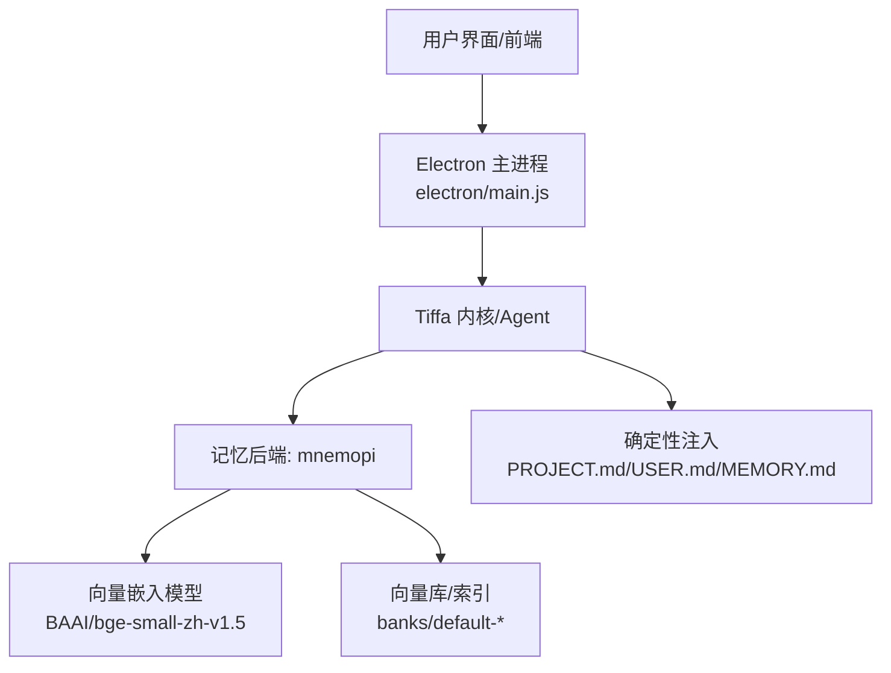
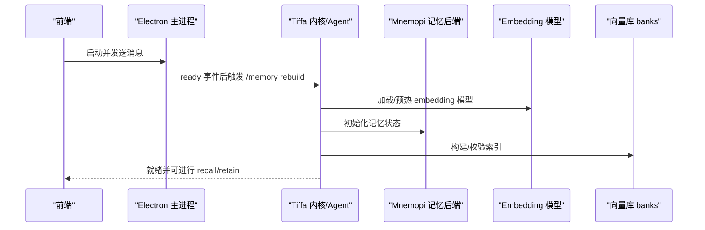
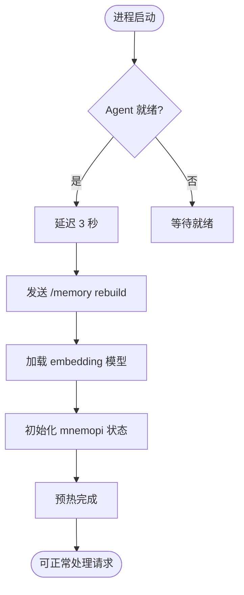
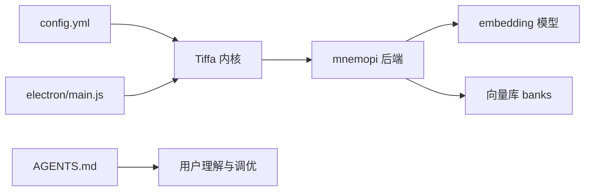

# 记忆配置与优化

<cite>
**本文引用的文件**   
- [config.yml](file://data/agent/config.yml)
- [electron/main.js](file://electron/main.js)
- [AGENTS.md](file://AGENTS.md)
</cite>

## 目录
1. [简介](#简介)
2. [项目结构](#项目结构)
3. [核心组件](#核心组件)
4. [架构总览](#架构总览)
5. [详细组件分析](#详细组件分析)
6. [依赖关系分析](#依赖关系分析)
7. [性能考量](#性能考量)
8. [故障排查指南](#故障排查指南)
9. [结论](#结论)
10. [附录](#附录)

## 简介
本指南聚焦于 config.yml 中的 memory 与 mnemopi 相关配置项，系统说明其含义、调优方法与最佳实践。内容涵盖：
- 记忆分层与注入机制（USER.md/MEMORY.md/PROJECT.md + mnemopi RAG）
- 内存使用优化（embedding 模型选择与预热）
- 检索性能调优（召回数量、注入上限、轮次策略）
- 缓存策略（fastembed 模型缓存与运行时依赖）
- 常见问题诊断（记忆丢失、检索不准确、性能瓶颈）
- 监控指标、日志分析与调试技巧

## 项目结构
记忆系统与配置的关键位置：
- 配置文件：data/agent/config.yml（memory.backend、mnemopi.*）
- 启动与预热：electron/main.js（进程就绪后自动触发 /memory rebuild 以加载 embedding 模型）
- 行为与规范：AGENTS.md（记录 mnemopi 参数生效方式与三层约束体系）

图表来源
- [config.yml:13-27](file://data/agent/config.yml#L13-L27)
- [electron/main.js:255-268](file://electron/main.js#L255-L268)

章节来源
- [config.yml:13-27](file://data/agent/config.yml#L13-L27)
- [electron/main.js:255-268](file://electron/main.js#L255-L268)

## 核心组件
- memory.backend：选择记忆后端，当前设置为 mnemopi
- mnemopi.embeddingModel：向量嵌入模型名称（需使用 HuggingFace 全名）
- mnemopi.scoping：记忆作用域（global 表示跨项目共享库）
- mnemopi.autoRecall：是否自动召回（false 时由 PROJECT.md 做确定性注入）
- mnemopi.autoRetain：是否在 agent_end 自动 retain（true 开启）
- mnemopi.retainEveryNTurns：每 N 轮执行一次 retain（默认 2）
- mnemopi.recallLimit：单次召回最多返回条目数（默认 10）
- mnemopi.injectionTokenLimit：注入到上下文的 token 上限（默认 2000）

章节来源
- [config.yml:13-27](file://data/agent/config.yml#L13-L27)
- [AGENTS.md:69-71](file://AGENTS.md#L69-L71)
- [AGENTS.md:281-283](file://AGENTS.md#L281-L283)

## 架构总览
记忆系统采用“三重记忆 + RAG”的混合方案：
- L1/L2/L3 确定性注入：USER.md（用户偏好）、MEMORY.md（全局事实）、PROJECT.md（项目级规范），在会话开头零延迟注入
- mnemopi 全局 RAG：语义检索跨项目历史记忆，支持压缩断片恢复

图表来源
- [electron/main.js:255-268](file://electron/main.js#L255-L268)
- [config.yml:13-27](file://data/agent/config.yml#L13-L27)

## 详细组件分析

### 配置项详解与调优建议
- embeddingModel
  - 必须使用 HuggingFace 全名（如 BAAI/bge-small-zh-v1.5），短名会导致映射失败且无错误提示
  - 中文场景推荐 bge-small-zh-v1.5；如需更高精度可替换为更大模型但会增加内存占用
- scoping
  - global：所有项目共享同一库，每条记忆带 metadata.cwd 标记来源
  - 若需隔离不同项目的记忆，可考虑按项目划分 bank（需结合实现）
- autoRecall
  - false：关闭自动召回，依赖 PROJECT.md 确定性注入，减少无关上下文噪声
  - true：每次对话自动召回，可能提升相关性但增加 token 消耗
- autoRetain
  - true：每次 agent_end 自动将重要信息写入全局库
  - 配合 retainEveryNTurns 控制频率，避免频繁写入
- retainEveryNTurns
  - 默认 2：每 2 轮进行一次 retain，平衡写入成本与信息保留
- recallLimit
  - 默认 10：限制单次召回条目数，防止上下文膨胀
- injectionTokenLimit
  - 默认 2000：控制注入到上下文的 token 上限，避免超出模型限制

章节来源
- [config.yml:13-27](file://data/agent/config.yml#L13-L27)
- [AGENTS.md:69-71](file://AGENTS.md#L69-L71)
- [AGENTS.md:281-283](file://AGENTS.md#L281-L283)

### 启动预热与模型加载流程
- Electron 主进程在 agent 就绪后延迟 3 秒自动发送 /memory rebuild
- 该命令触发 mnemopi 的 retain→embed 路径，加载 embedding 模型（约 93MB onnx）
- 预热标志位 30 秒后清除，避免首次消息冷加载超时

图表来源
- [electron/main.js:255-268](file://electron/main.js#L255-L268)

章节来源
- [electron/main.js:255-268](file://electron/main.js#L255-L268)

### 记忆分层与注入机制
- USER.md：用户身份与偏好，零延迟注入
- MEMORY.md：全局事实索引，零延迟注入
- PROJECT.md：项目级记忆，每会话开头确定性注入
- mnemopi：全局 RAG，跨项目语义检索 + 压缩断片恢复

章节来源
- [config.yml:13-17](file://data/agent/config.yml#L13-L17)
- [AGENTS.md:285-293](file://AGENTS.md#L285-L293)

### 工具链与自动 retain/recall
- retain 工具：主动记住重要事实/决策，供未来 recall 检索
- recall 工具：语义检索历史记忆（跨项目）
- autoRetain=true 时，agent_end 自动调用 retain
- autoRecall=false 时，由 PROJECT.md 做确定性注入，不自动召回

章节来源
- [AGENTS.md:237-247](file://AGENTS.md#L237-L247)

## 依赖关系分析
- electron/main.js 负责进程管理与 IPC，触发记忆预热
- config.yml 提供 memory/mnemopi 配置
- AGENTS.md 记录 mnemopi 参数生效方式与三层约束体系

图表来源
- [config.yml:13-27](file://data/agent/config.yml#L13-L27)
- [electron/main.js:255-268](file://electron/main.js#L255-L268)
- [AGENTS.md:69-71](file://AGENTS.md#L69-L71)

章节来源
- [config.yml:13-27](file://data/agent/config.yml#L13-L27)
- [electron/main.js:255-268](file://electron/main.js#L255-L268)
- [AGENTS.md:69-71](file://AGENTS.md#L69-L71)

## 性能考量
- 内存使用优化
  - 选择合适的 embedding 模型：bge-small-zh-v1.5 平衡精度与内存
  - 启用预热避免冷加载开销
  - 控制 recallLimit 与 injectionTokenLimit 防止上下文膨胀
- 检索性能调优
  - 调整 retainEveryNTurns 平衡写入频率与信息保留
  - 使用 global scoping 共享库减少重复索引
- 缓存策略
  - fastembed 模型缓存位于 home/.omp/cache/fastembed/
  - fastembed 运行时依赖位于 home/.omp/cache/fastembed-runtime/

章节来源
- [config.yml:20-27](file://data/agent/config.yml#L20-L27)
- [AGENTS.md:281-283](file://AGENTS.md#L281-L283)

## 故障排查指南
- 记忆丢失
  - 检查 autoRetain 是否为 true
  - 确认 retainEveryNTurns 设置合理
  - 验证 banking 数据库位置与权限
- 检索不准确
  - 检查 embeddingModel 是否为 HuggingFace 全名
  - 调整 recallLimit 与 injectionTokenLimit
  - 确保 PROJECT.md 内容准确反映项目规范
- 性能瓶颈
  - 监控 embedding 模型加载时间
  - 检查向量库索引大小与查询延迟
  - 评估 autoRecall 对 token 消耗的影响

章节来源
- [config.yml:20-27](file://data/agent/config.yml#L20-L27)
- [AGENTS.md:69-71](file://AGENTS.md#L69-L71)

## 结论
通过合理配置 memory 与 mnemopi 参数，可实现高效、准确的记忆系统。建议：
- 使用 HuggingFace 全名指定 embeddingModel
- 启用 autoRetain 并调整 retainEveryNTurns
- 根据需求调整 autoRecall、recallLimit 与 injectionTokenLimit
- 利用 PROJECT.md 做确定性注入，减少无关上下文噪声

## 附录
- 关键路径参考
  - 配置文件：data/agent/config.yml
  - 启动脚本：electron/main.js
  - 行为规范：AGENTS.md
- 常用命令
  - /memory rebuild：触发记忆重建与模型预热
  - retain/recall：手动管理记忆内容

章节来源
- [config.yml:13-27](file://data/agent/config.yml#L13-L27)
- [electron/main.js:255-268](file://electron/main.js#L255-L268)
- [AGENTS.md:69-71](file://AGENTS.md#L69-L71)