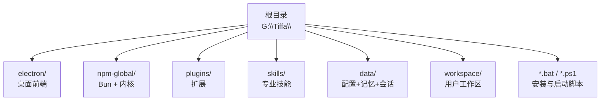
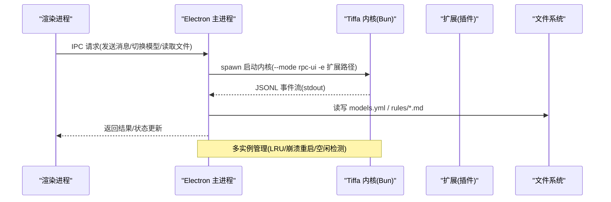
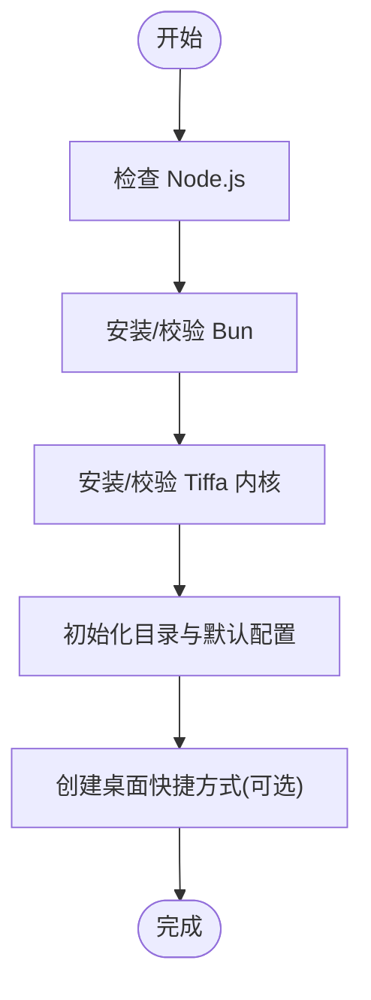
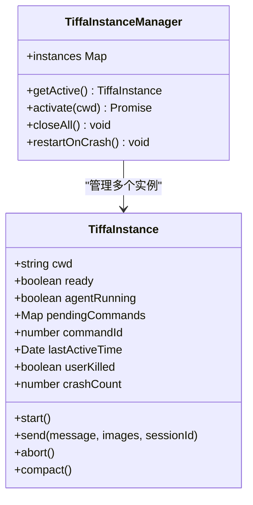
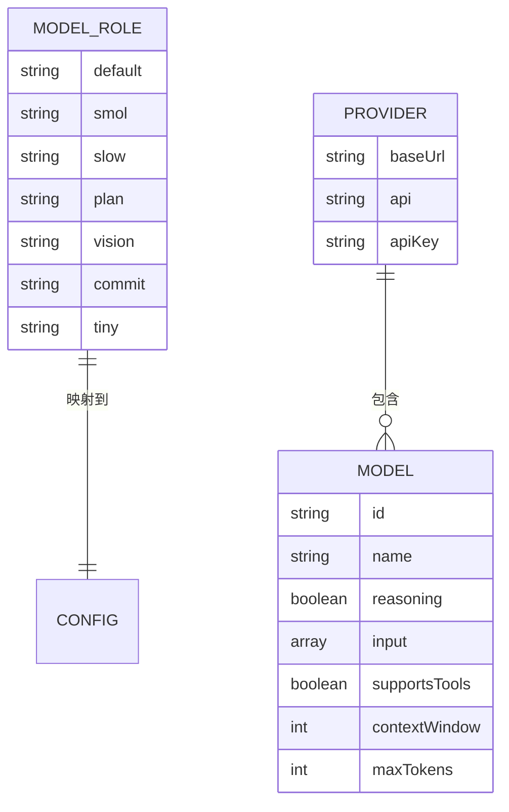
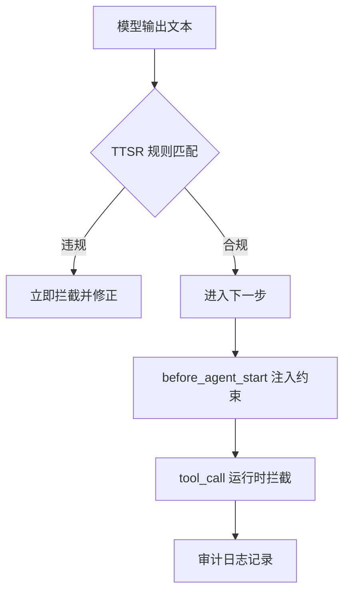
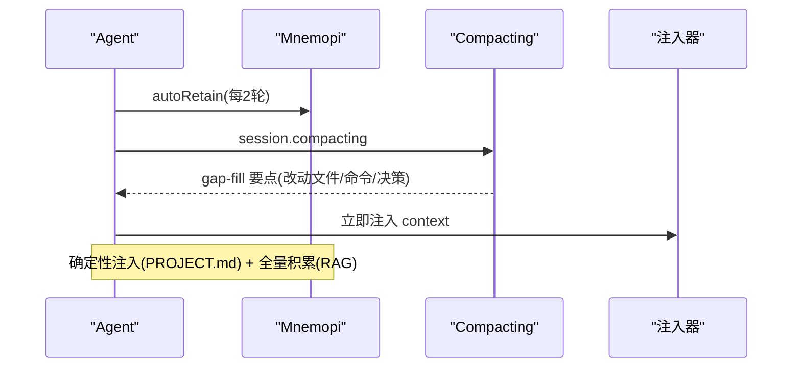
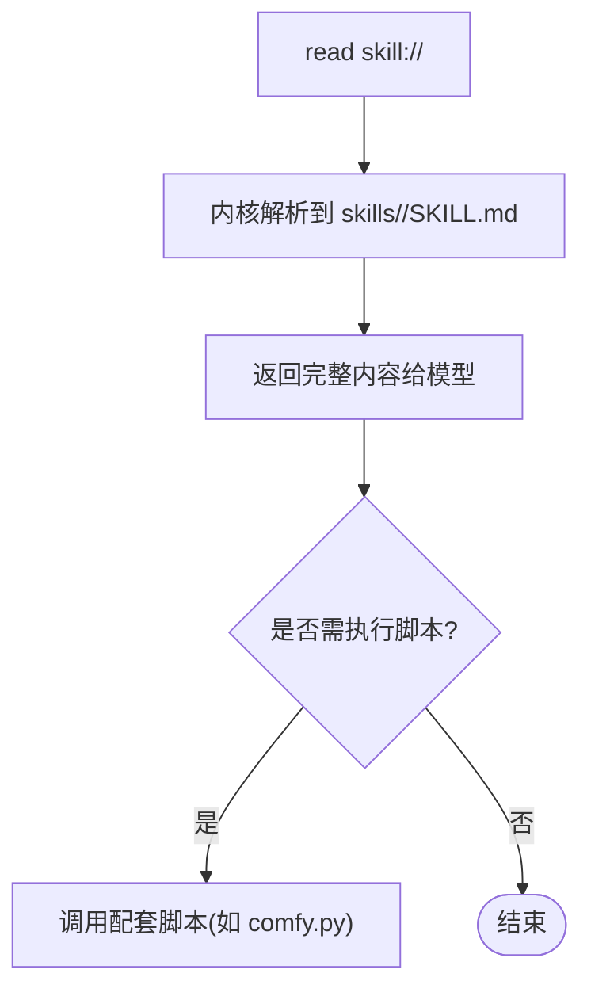
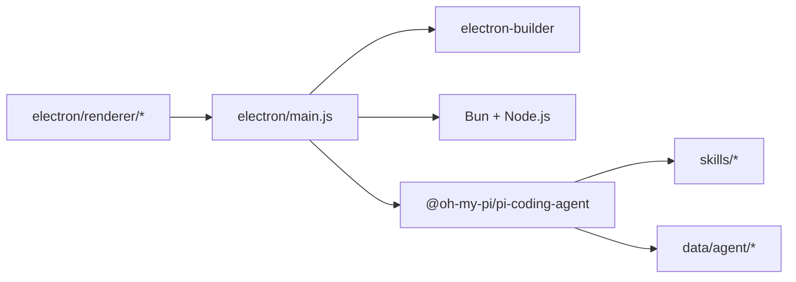

# 贡献指南

<cite>
**本文引用的文件**   
- [README.md](file://README.md)
- [AGENTS.md](file://AGENTS.md)
- [install.bat](file://install.bat)
- [install.ps1](file://install.ps1)
- [start-tiffa.bat](file://start-tiffa.bat)
- [start-desktop.bat](file://start-desktop.bat)
- [electron/package.json](file://electron/package.json)
- [data/agent/config.yml](file://data/agent/config.yml)
- [data/agent/models.yml](file://data/agent/models.yml)
- [electron/main.js](file://electron/main.js)
</cite>

## 目录
1. [简介](#简介)
2. [项目结构](#项目结构)
3. [核心组件](#核心组件)
4. [架构总览](#架构总览)
5. [详细组件分析](#详细组件分析)
6. [依赖关系分析](#依赖关系分析)
7. [性能与可维护性建议](#性能与可维护性建议)
8. [故障排查指南](#故障排查指南)
9. [结论](#结论)
10. [附录：开发工作流与规范](#附录开发工作流与规范)

## 简介
本指南面向希望参与 Tiffa 开发与贡献的开发者，涵盖环境搭建、依赖安装、编译与运行、代码规范、提交流程、版本发布以及问题反馈与社区协作方式。Tiffa 是一个基于 @oh-my-pi/pi-coding-agent v17.0.7 的便携 AI 编程助手，采用 Electron 桌面壳，强调本地优先、弱模型可用、记忆持久与跨项目上下文管理。

## 项目结构
- 根目录为便携包根，包含 Electron 前端、内核（Bun + pi-coding-agent）、插件、技能、数据与配置等。
- 启动脚本提供多种模式：桌面 GUI、TUI、WebUI/RPC。
- 配置文件集中在 data/agent 下，包括主设置与模型提供者配置。

**章节来源**
- [README.md:190-214](file://README.md#L190-L214)
- [AGENTS.md:9-25](file://AGENTS.md#L9-L25)

## 核心组件
- 内核：@oh-my-pi/pi-coding-agent（通过 Bun 运行）
- 前端：Electron 主进程与渲染进程，负责窗口、IPC、实例管理与 UI
- 扩展：plugins/claude-mode-extension.ts（v6.2），注入 Hooks 与行为约束
- 技能：skills/* 下的 SKILL.md 与配套脚本，按 read skill:// 协议加载
- 配置：data/agent/config.yml（角色与记忆后端）、models.yml（模型提供者）

**章节来源**
- [AGENTS.md:113-156](file://AGENTS.md#L113-L156)
- [AGENTS.md:158-208](file://AGENTS.md#L158-L208)
- [data/agent/config.yml:1-30](file://data/agent/config.yml#L1-L30)
- [data/agent/models.yml:1-242](file://data/agent/models.yml#L1-L242)

## 架构总览
Tiffa 由 Electron 主进程启动并管理多个 Tiffa 内核实例，通过 JSONL over stdin/stdout 通信；渲染进程通过 IPC 调用主进程能力，主进程再转发到内核 RPC 模式。

**图表来源**
- [electron/main.js:94-120](file://electron/main.js#L94-L120)
- [electron/main.js:614-699](file://electron/main.js#L614-L699)
- [electron/package.json:6-10](file://electron/package.json#L6-L10)

**章节来源**
- [AGENTS.md:178-208](file://AGENTS.md#L178-L208)
- [electron/package.json:1-21](file://electron/package.json#L1-L21)

## 详细组件分析

### 环境与安装
- 一键安装：双击 install.bat 或运行 install.ps1，自动设置国内镜像源、检查 Node.js、安装 Bun 与内核、初始化目录与默认配置、创建桌面快捷方式。
- 启动方式：
  - 桌面模式：tiffa-desktop.exe 或 start-desktop.bat
  - 终端/TUI/WebUI/RPC：start-tiffa.bat --tui/--web/--rpc

**图表来源**
- [install.ps1:28-186](file://install.ps1#L28-L186)
- [install.bat:1-11](file://install.bat#L1-L11)

**章节来源**
- [install.ps1:1-186](file://install.ps1#L1-L186)
- [install.bat:1-11](file://install.bat#L1-L11)
- [start-tiffa.bat:1-151](file://start-tiffa.bat#L1-L151)
- [start-desktop.bat:1-25](file://start-desktop.bat#L1-L25)

### 启动流程与多实例管理
- Electron 主进程解析 PORTABLE_ROOT，定位 Bun 与内核 CLI，设置环境变量（PI_CODING_AGENT_DIR、HOME、USERPROFILE 等）。
- 以 --mode rpc-ui 启动内核，并通过扩展参数加载插件。
- 使用 readline 逐行解析 JSONL 事件流，实现命令路由与响应处理。
- 多实例管理器支持 LRU 淘汰、stall 检测、崩溃自动重启。

**图表来源**
- [electron/main.js:82-120](file://electron/main.js#L82-L120)
- [electron/main.js:614-699](file://electron/main.js#L614-L699)

**章节来源**
- [electron/main.js:17-31](file://electron/main.js#L17-L31)
- [electron/main.js:94-120](file://electron/main.js#L94-L120)
- [electron/main.js:614-699](file://electron/main.js#L614-L699)

### 配置系统
- config.yml：定义模型角色（default/smol/slow/plan/vision/commit/tiny）与记忆后端（mnemopi）。
- models.yml：定义各 Provider（kimi/xiaomi/qwen/minimax/opencode-zen/volcengine）及其模型元信息（id/name/contextWindow/maxTokens/supportsTools 等）。
- 首次运行会自动从模板生成 models.yml 并提示填写 API Key。

**图表来源**
- [data/agent/config.yml:1-30](file://data/agent/config.yml#L1-L30)
- [data/agent/models.yml:1-242](file://data/agent/models.yml#L1-L242)

**章节来源**
- [data/agent/config.yml:1-30](file://data/agent/config.yml#L1-L30)
- [data/agent/models.yml:1-242](file://data/agent/models.yml#L1-L242)
- [start-tiffa.bat:49-60](file://start-tiffa.bat#L49-L60)

### 规则系统与约束
- TTSR 规则位于 data/agent/rules/*.md，流式匹配，零 Context 成本拦截违规输出。
- before_agent_start Hook 注入语义约束（读文件规范、任务计划、skill 铁律等）。
- tool_call Hook 实现危险路径/配置文件自改/workspace mkdir 拦截与静默工具调用检测。

**图表来源**
- [AGENTS.md:79-111](file://AGENTS.md#L79-L111)

**章节来源**
- [AGENTS.md:79-111](file://AGENTS.md#L79-L111)

### 记忆系统（Mnemopi）
- 三层记忆：USER.md（用户偏好）、MEMORY.md（全局事实）、PROJECT.md（项目级决策）。
- Mnemopi 全局 RAG：autoRetain 每 N 轮写入，manual recall 跨项目检索；压缩时 gap-fill 提取关键信息并立即注入。
- 当前生效参数通过 settings 数据库写入（scoping/global、autoRecall/false、autoRetain/true、retainEveryNTurns/2、recallLimit/10、injectionTokenLimit/2000）。

**图表来源**
- [AGENTS.md:275-310](file://AGENTS.md#L275-L310)

**章节来源**
- [AGENTS.md:275-310](file://AGENTS.md#L275-L310)

### 技能系统（Skills）
- 技能通过内核原生 read skill://<name> 协议加载，对应 skills/<name>/SKILL.md。
- 部分技能附带 Python/JS 脚本（如 comfyui-image-gen/comfy.py），通过环境变量配置服务地址与输出目录。

**图表来源**
- [AGENTS.md:144-151](file://AGENTS.md#L144-L151)
- [data/agent/managed-skills/comfyui-image-gen/comfy.py:1-34](file://data/agent/managed-skills/comfyui-image-gen/comfy.py#L1-L34)

**章节来源**
- [AGENTS.md:144-151](file://AGENTS.md#L144-L151)
- [data/agent/managed-skills/comfyui-image-gen/comfy.py:1-34](file://data/agent/managed-skills/comfyui-image-gen/comfy.py#L1-L34)

## 依赖关系分析
- 前端依赖：electron、highlight.js、marked、yaml
- 构建依赖：electron-builder（打包为 portable exe）
- 运行时依赖：Bun、Node.js（便携或系统）、Python（技能脚本）
- 内核依赖：@oh-my-pi/pi-coding-agent（通过 npm 安装）

**图表来源**
- [electron/package.json:16-21](file://electron/package.json#L16-L21)
- [electron/package.json:22-74](file://electron/package.json#L22-L74)

**章节来源**
- [electron/package.json:1-75](file://electron/package.json#L1-L75)

## 性能与可维护性建议
- 控制注入 token 上限（injectionTokenLimit=2000），避免撑爆上下文。
- 合理使用 TTSR 规则减少无效输出，降低 token 消耗。
- 对长耗时操作（如 ComfyUI 生图）设置超时与重试策略。
- 保持技能文档（SKILL.md）与脚本一致性，便于模型理解与调用。

[本节为通用建议，不直接分析具体文件]

## 故障排查指南
- 未找到 Bun/内核：请确认 install.ps1 已执行成功，且路径存在。
- 中文乱码：主进程会注入 UTF-8 相关环境变量（LANG/LC_ALL/PYTHONIOENCODING 等）。
- 模型不可用：检查 models.yml 中 baseUrl/apiKey 是否正确，必要时重启实例。
- 规则不生效：确认 data/agent/rules/*.md 语法正确，必要时使用 /omfg 命令生成修复规则。

**章节来源**
- [electron/main.js:50-60](file://electron/main.js#L50-L60)
- [start-tiffa.bat:35-47](file://start-tiffa.bat#L35-L47)
- [AGENTS.md:152-156](file://AGENTS.md#L152-L156)

## 结论
Tiffa 通过“内核 + 扩展 + 技能 + 记忆”的分层架构，在弱模型条件下依然能稳定完成任务。贡献者应遵循本指南的环境搭建、配置与规范，确保代码质量与用户体验一致。

[本节为总结，不直接分析具体文件]

## 附录：开发工作流与规范

### 开发环境搭建
- 前置条件：Windows 环境，具备 PowerShell 执行权限。
- 步骤：
  1) 运行 install.bat 或 install.ps1 完成依赖安装与初始化。
  2) 编辑 data/agent/models.yml 填入 API Key。
  3) 使用 start-desktop.bat 或 start-tiffa.bat 启动。

**章节来源**
- [install.ps1:1-186](file://install.ps1#L1-L186)
- [start-tiffa.bat:1-151](file://start-tiffa.bat#L1-L151)

### 代码编译与测试
- 前端构建：cd electron && npm run build（生成 portable exe）。
- 开发模式：cd electron && npm start（或 npm run dev）。
- 测试：目前仓库未提供统一测试入口，建议在各自模块内验证（如技能脚本独立运行）。

**章节来源**
- [electron/package.json:6-10](file://electron/package.json#L6-L10)

### 代码规范与标准
- 命名约定：变量与函数使用小驼峰，常量使用大写加下划线；文件名使用小写与短横线。
- 文件组织：功能按模块划分，配置集中存放于 data/agent，技能集中于 skills。
- 注释规范：公共接口与复杂逻辑需添加说明注释；错误分支需记录原因与恢复策略。
- 安全规范：禁止硬编码密钥，敏感信息通过环境变量或 models.yml 管理。

[本节为通用规范，不直接分析具体文件]

### 提交流程与代码审查
- 分支策略：feature/* 用于新功能，fix/* 用于缺陷修复，main 为稳定分支。
- 提交信息：简洁明确，包含变更范围与动机。
- 代码审查：至少一名维护者审查，关注安全性、可维护性与性能。

[本节为通用流程，不直接分析具体文件]

### 版本发布
- 版本号：遵循语义化版本（主.次.修订）。
- 构建产物：electron-builder 生成 tiffa-portable-<version>.exe。
- 发布说明：列出新增功能、修复项与已知问题。

**章节来源**
- [electron/package.json:22-34](file://electron/package.json#L22-L34)

### 问题报告与新功能请求
- 问题报告：提供复现步骤、期望行为与实际行为、日志片段与环境信息。
- 新功能请求：描述需求背景、目标与预期效果，附相关示例或参考链接。
- 社区讨论：在 Issues/讨论区发起，保持友好与建设性。

[本节为通用指导，不直接分析具体文件]