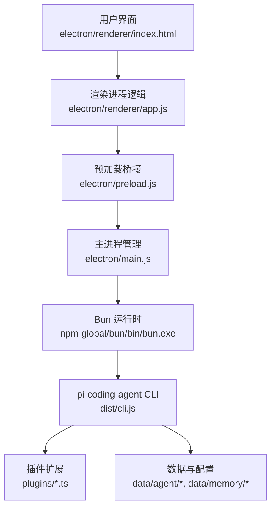
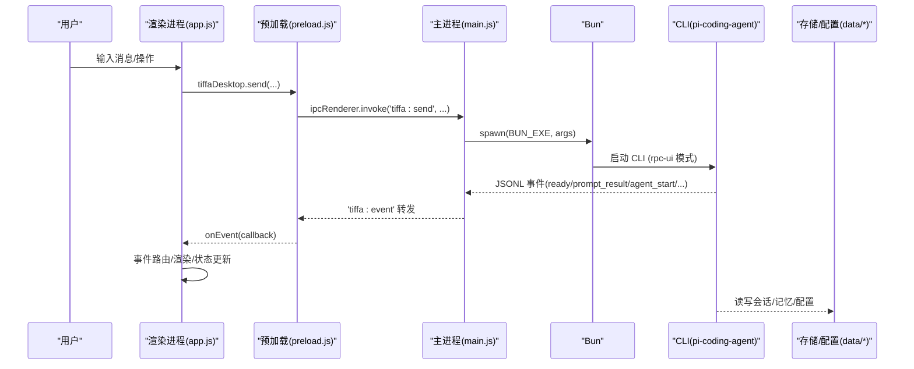
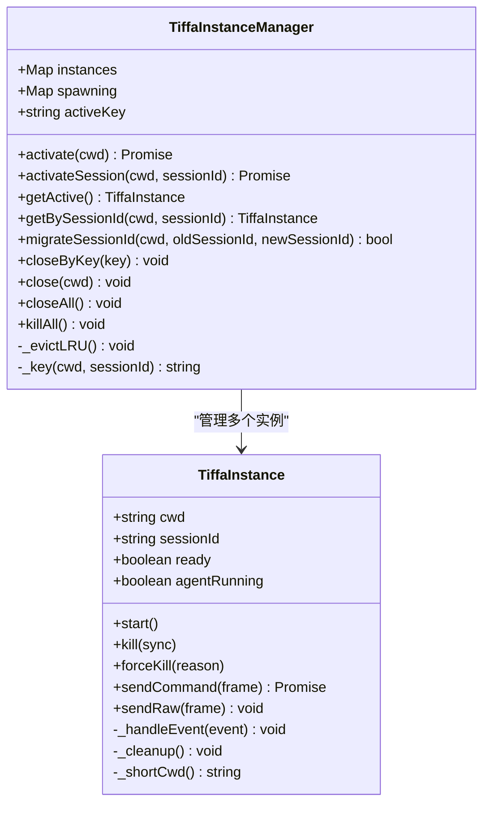
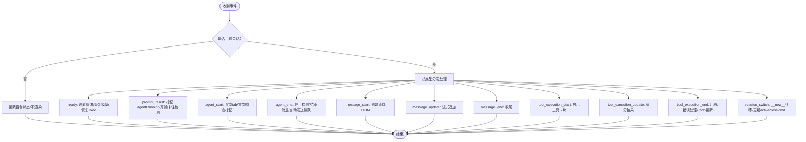
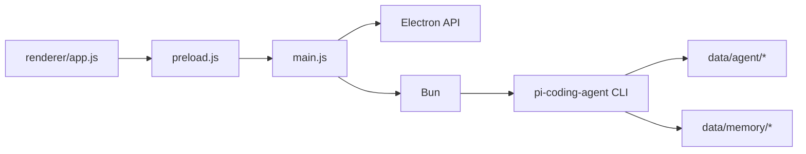

# 开发文档

<cite>
**本文引用的文件**   
- [README.md](file://README.md)
- [AGENTS.md](file://AGENTS.md)
- [electron/main.js](file://electron/main.js)
- [electron/preload.js](file://electron/preload.js)
- [electron/renderer/index.html](file://electron/renderer/index.html)
- [electron/renderer/app.js](file://electron/renderer/app.js)
- [data/agent/config.yml](file://data/agent/config.yml)
- [data/agent/models.yml](file://data/agent/models.yml)
- [start-desktop.bat](file://start-desktop.bat)
</cite>

## 目录
1. [简介](#简介)
2. [项目结构](#项目结构)
3. [核心组件](#核心组件)
4. [架构总览](#架构总览)
5. [详细组件分析](#详细组件分析)
6. [依赖关系分析](#依赖关系分析)
7. [性能考量](#性能考量)
8. [故障排查指南](#故障排查指南)
9. [结论](#结论)
10. [附录](#附录)

## 简介
Tiffa 是一个基于 @oh-my-pi/pi-coding-agent v17.0.7 的便携 AI 助手，通过 Electron 桌面壳提供图形化交互。其核心目标是让弱模型（如 Q1_0 量化）也能稳定完成智能体任务，依靠“五重记忆”“三重约束”“七层改造”等基础设施增强能力，实现本地优先、离线可用、跨会话持久记忆与多技能编排。

## 项目结构
- 前端：Electron 主进程 + 渲染进程，提供项目侧栏、会话标签、文件抽屉、主题系统等
- 内核：Bun 运行 pi-coding-agent CLI，JSONL over stdin/stdout 通信
- 配置：config.yml、models.yml、规则与记忆文件位于 data/agent 与 data/memory
- 启动脚本：start-desktop.bat 负责设置环境变量并启动 Electron

**图表来源**
- [electron/main.js:1-120](file://electron/main.js#L1-L120)
- [electron/preload.js:1-134](file://electron/preload.js#L1-L134)
- [electron/renderer/index.html:1-200](file://electron/renderer/index.html#L1-L200)
- [electron/renderer/app.js:1-120](file://electron/renderer/app.js#L1-L120)

**章节来源**
- [README.md:1-120](file://README.md#L1-L120)
- [AGENTS.md:1-120](file://AGENTS.md#L1-L120)

## 核心组件
- TiffaInstance：封装单个 Tiffa 子进程的生命周期、事件解析、命令发送、崩溃重启与上下文恢复
- TiffaInstanceManager：多实例管理（懒启动、LRU 淘汰、活跃实例跟踪、按 cwd/sessionId 路由）
- IPC 桥接：preload.js 暴露受控 API，渲染进程通过 ipcRenderer.invoke/on 与主进程通信
- 渲染应用：app.js 处理事件路由、会话状态、UI 更新、最小化滚动条（minimap）、工具卡片摘要与 Diff 视图
- 配置系统：config.yml 定义模型角色与 mnemopi 参数；models.yml 定义各 Provider 与模型元信息

**章节来源**
- [electron/main.js:120-440](file://electron/main.js#L120-L440)
- [electron/main.js:440-770](file://electron/main.js#L440-L770)
- [electron/preload.js:24-106](file://electron/preload.js#L24-L106)
- [electron/renderer/app.js:94-160](file://electron/renderer/app.js#L94-L160)
- [data/agent/config.yml:1-30](file://data/agent/config.yml#L1-L30)
- [data/agent/models.yml:1-120](file://data/agent/models.yml#L1-L120)

## 架构总览
Tiffa 采用“主进程管理 + 渲染进程 UI + JSONL 事件流”的分层架构。主进程负责：
- 启动/管理多个 Tiffa 子进程（项目级与会话级）
- 事件转发与过滤（预热、上下文恢复、会话迁移）
- 文件系统与外部调用（shell.openPath、openExternal）
- 会话与项目管理（列表、切换、归档、历史加载）

渲染进程负责：
- 事件路由（按 _sessionId 区分前台/后台实例）
- 消息渲染与后处理（URL 修复、代码语言推断、工具卡片摘要）
- 会话与项目状态维护（Tab、模型映射、Todo、记忆搜索）
- 主题系统与 UI 交互

**图表来源**
- [electron/main.js:169-240](file://electron/main.js#L169-L240)
- [electron/preload.js:24-45](file://electron/preload.js#L24-L45)
- [electron/renderer/app.js:437-464](file://electron/renderer/app.js#L437-L464)

## 详细组件分析

### 主进程：TiffaInstance 与 TiffaInstanceManager
- TiffaInstance
  - 生命周期：start() 启动子进程，readline 逐行解析 stdout，stderr 输出日志，exit/error 事件处理
  - 命令发送：sendCommand() 返回 Promise，支持超时与 pending 队列；sendRaw() 用于非命令事件
  - 事件处理：_handleEvent() 处理 ready、prompt_result、agent_start/end、session_switch、response 等
  - 崩溃重启：非用户 kill 且未达上限则 3 秒后重启；embedding 预热期间过滤噪音
  - 上下文恢复：崩溃重启后通过 switch_session 恢复 JSONL 历史
- TiffaInstanceManager
  - 实例键：cwd#sessionId，支持项目级与会话级实例
  - 激活策略：activate(cwd)/activateSession(cwd, sessionId)，懒启动、等待 ready、LRU 淘汰
  - 会话迁移：migrateSessionId() 在 CLI 分配真实 sessionId 后迁移 key，避免丢上下文
  - 资源清理：closeByKey()/close()/closeAll()/killAll() 确保进程树被杀、定时器清理、pending 拒绝

**图表来源**
- [electron/main.js:121-437](file://electron/main.js#L121-L437)
- [electron/main.js:443-770](file://electron/main.js#L443-L770)

**章节来源**
- [electron/main.js:121-437](file://electron/main.js#L121-L437)
- [electron/main.js:443-770](file://electron/main.js#L443-L770)

### 渲染进程：事件路由与 UI 状态
- 事件路由：根据 event._sessionId 区分前台/后台实例，仅当前会话渲染 DOM，后台实例仅更新状态
- 会话切换：__new__ tab 迁移到真实 sessionPath，迁移 sessionModelMap、sessionAgentRunning、缓存等
- 输出后处理：fixBareUrls、fixCodeBlockLanguages、applyOutputFixes
- 工具卡片：summarizeToolCall、extractDiff、renderDiffView
- 卡住检测：STALL_TIMEOUT_MS=120s，FIRST_RESPONSE_TIMEOUT_MS=30s
- 最小化滚动条：minimap 使用 Canvas 绘制消息色块与视口框，支持点击/拖拽跳转

**图表来源**
- [electron/renderer/app.js:437-746](file://electron/renderer/app.js#L437-L746)

**章节来源**
- [electron/renderer/app.js:94-160](file://electron/renderer/app.js#L94-L160)
- [electron/renderer/app.js:437-746](file://electron/renderer/app.js#L437-L746)
- [electron/renderer/app.js:749-800](file://electron/renderer/app.js#L749-L800)

### 预加载桥接：安全 IPC API
- 暴露 tiffaDesktop 对象，包含：
  - Tiffa 代理命令：send、abort、setModel、getModels、getState、isReady、diagnostics、steer、followUp、extensionResponse、compact、command
  - 事件监听：onEvent、onExited
  - 文件系统：listDir、readFile、writeFile、readImage
  - 外部调用：openExternal、openPath
  - 路径工具：getWorkspacePath、getRootPath
  - 会话/项目管理：listProjects、listSessions、switchSession、newSession、loadSessionHistory、archive/delete/restore 等
  - 模型配置：readModelsYml、writeModelsYml、restartTiffa、writeProvider、deleteProvider
  - 渲染库：marked、hljs、clipboardWriteText、getPathForFile

**章节来源**
- [electron/preload.js:24-134](file://electron/preload.js#L24-L134)

### 配置与模型
- config.yml：定义 modelRoles（default/smol/slow/plan/vision/commit/tiny）与 mnemopi 参数（embeddingModel、scoping、autoRecall/autoRetain、retainEveryNTurns、recallLimit、injectionTokenLimit），tools.approvalMode
- models.yml：providers（kimi/xiaomi/qwen/qwen-remote/volcengine/opencode-zen/minimax），每个 provider 包含 baseUrl、api、apiKey、models 列表（id/name/reasoning/input/supportsTools/contextWindow/maxTokens/cost）

**章节来源**
- [data/agent/config.yml:1-30](file://data/agent/config.yml#L1-L30)
- [data/agent/models.yml:1-120](file://data/agent/models.yml#L1-L120)

### 启动流程
- start-desktop.bat：设置 chcp 65001、PORTABLE_ROOT、检查 electron.exe 存在，启动 electron . --portable-root="..."
- main.js：读取 PORTABLE_ROOT（CLI 参数 > 环境变量 > __dirname 父目录），计算 BUN_EXE、TIFFA_CLI、EXTENSION_PATH、DEFAULT_WORKSPACE_DIR
- 窗口创建：BrowserWindow 配置 preload、contextIsolation、nodeIntegration=false、sandbox=false，加载 renderer/index.html

**章节来源**
- [start-desktop.bat:1-25](file://start-desktop.bat#L1-L25)
- [electron/main.js:17-31](file://electron/main.js#L17-L31)
- [electron/main.js:777-800](file://electron/main.js#L777-L800)

## 依赖关系分析
- 主进程依赖 Electron 模块（app、BrowserWindow、ipcMain、shell、dialog）、child_process、yaml 解析、fs、path
- 渲染进程依赖 marked、highlight.js、localStorage、DOM API
- 预加载桥接依赖 contextBridge、ipcRenderer、clipboard、webUtils
- 内核依赖 Bun 运行 pi-coding-agent CLI，通过 JSONL 协议通信

**图表来源**
- [electron/main.js:1-15](file://electron/main.js#L1-L15)
- [electron/preload.js:1-23](file://electron/preload.js#L1-L23)
- [electron/renderer/app.js:1-30](file://electron/renderer/app.js#L1-L30)

**章节来源**
- [electron/main.js:1-15](file://electron/main.js#L1-L15)
- [electron/preload.js:1-23](file://electron/preload.js#L1-L23)
- [electron/renderer/app.js:1-30](file://electron/renderer/app.js#L1-L30)

## 性能考量
- 事件流处理：readline 逐行解析，避免 buffer 拼接开销；stderr 单独监听
- 内存管理：LRU 淘汰最久未活跃实例，限制 MAX_INSTANCES=8
- 崩溃恢复：非用户 kill 自动重启，最多 3 次；上下文恢复通过 switch_session 重放 JSONL
- 预热优化：embedding 模型冷加载延迟 3 秒，用户交互优先级更高，预热期间过滤噪音
- 渲染优化：minimap 使用 Canvas 一次绘制，MutationObserver 与 ResizeObserver 联动；历史加载禁用 hljs 高亮避免卡顿

[本节为通用指导，无需特定文件引用]

## 故障排查指南
- 中文乱码：主进程注入 UTF-8 环境变量（LANG/LC_ALL/PYTHONIOENCODING/PYTHONUTF8/PYTHONLEGACYWINDOWSSTDIO/NO_COLOR）
- 进程退出：检查 exit code/signal，userKilled 标志，crashCount 计数；pendingCommands 全部 reject
- 会话丢失：确认 session_switch 事件触发，migrateSessionId 是否正确迁移 key；崩溃重启后 sessionFilePath 是否存在
- 模型不可达：首次响应超时 30 秒提示；检查 models.yml 中 baseUrl/apiKey 配置
- 文件路径链接：fixBareUrls 将 file:/// 与 Windows 路径转换为 tiffa-local://，点击由 shell.openPath 打开

**章节来源**
- [electron/main.js:95-111](file://electron/main.js#L95-L111)
- [electron/main.js:203-234](file://electron/main.js#L203-L234)
- [electron/main.js:389-402](file://electron/main.js#L389-L402)
- [electron/renderer/app.js:34-60](file://electron/renderer/app.js#L34-L60)
- [electron/renderer/app.js:778-795](file://electron/renderer/app.js#L778-L795)

## 结论
Tiffa 通过分层记忆、三重约束与七层改造，使弱模型也能稳定执行智能体任务。Electron 桌面端提供丰富的交互体验，主进程的多实例管理与 JSONL 事件流确保了可靠性与可扩展性。配置系统灵活，支持多 Provider 与模型角色，便于在不同场景下选择合适的模型。整体架构清晰，易于维护与扩展。

[本节为总结，无需特定文件引用]

## 附录
- 启动方式：双击 tiffa-desktop.exe / VBS 启动器 / start-desktop.bat / start-tiffa.bat（TUI/WebUI/RPC）
- 环境变量：PI_CODING_AGENT_DIR、HOME/USERPROFILE、KIMI_API_KEY、PORTABLE_ROOT
- Windows 注意事项：行尾符 \r\n、regex 单行模式 (?s)、UTF-8 无 BOM、PowerShell shebang 不可用

**章节来源**
- [AGENTS.md:256-272](file://AGENTS.md#L256-L272)
- [start-desktop.bat:1-25](file://start-desktop.bat#L1-L25)