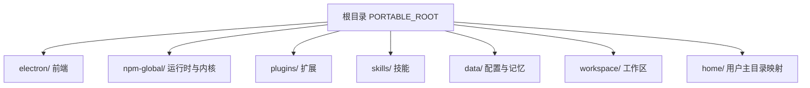
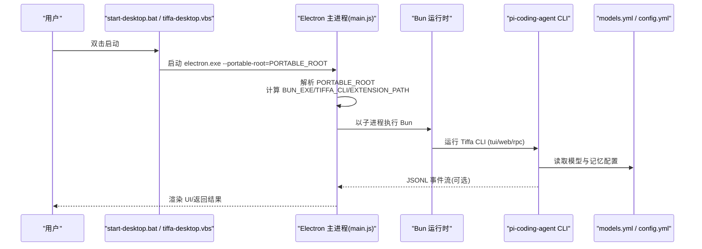
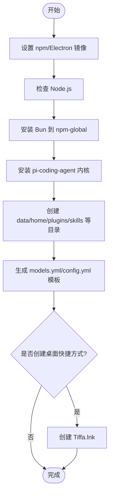
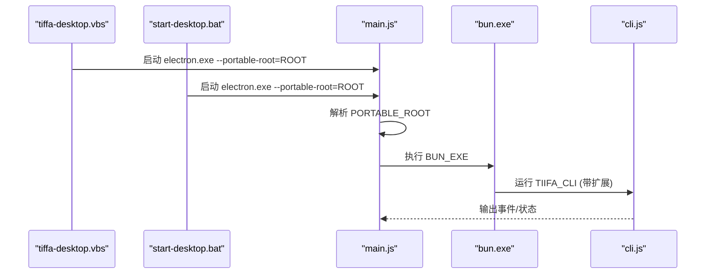
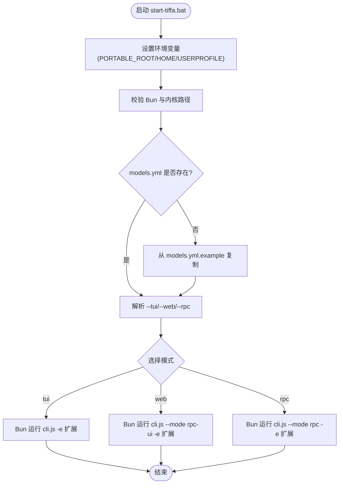
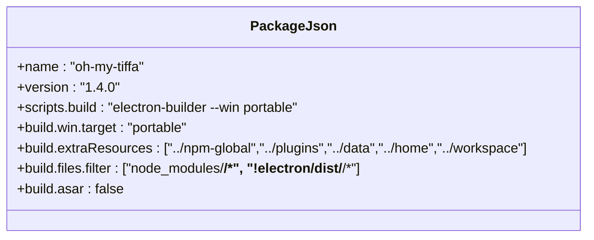

# 部署和分发

<cite>
**本文引用的文件**   
- [README.md](file://README.md)
- [install.bat](file://install.bat)
- [install.ps1](file://install.ps1)
- [start-desktop.bat](file://start-desktop.bat)
- [start-tiffa.bat](file://start-tiffa.bat)
- [tiffa-desktop.vbs](file://tiffa-desktop.vbs)
- [electron/package.json](file://electron/package.json)
- [electron/main.js](file://electron/main.js)
- [data/agent/config.yml](file://data/agent/config.yml)
- [data/agent/models.yml](file://data/agent/models.yml)
</cite>

## 目录
1. [简介](#简介)
2. [项目结构](#项目结构)
3. [核心组件](#核心组件)
4. [架构总览](#架构总览)
5. [详细组件分析](#详细组件分析)
6. [依赖与打包配置](#依赖与打包配置)
7. [自动化部署与CI/CD集成](#自动化部署与cicd集成)
8. [版本管理策略](#版本管理策略)
9. [多平台部署指南](#多平台部署指南)
10. [性能与可移植性优化](#性能与可移植性优化)
11. [故障排查](#故障排查)
12. [结论](#结论)

## 简介
本文件面向 Tiffa 的部署与分发，覆盖便携包制作、单文件夹部署、U盘分发与企业环境部署方案。重点说明打包配置、依赖管理与环境隔离的实现，并提供自动化脚本使用、CI/CD集成与版本管理策略，以及不同平台的最佳实践。

## 项目结构
Tiffa 采用“单文件夹便携”设计：整个应用位于一个根目录下，包含 Electron 前端、Bun 运行时、内核、插件、技能与数据目录。启动脚本通过环境变量与参数将运行路径锁定到该根目录，实现无注册表、无全局依赖的“即拷即用”。

图表来源
- [electron/package.json:22-73](file://electron/package.json#L22-L73)
- [start-tiffa.bat:11-33](file://start-tiffa.bat#L11-L33)
- [start-desktop.bat:7-22](file://start-desktop.bat#L7-L22)

章节来源
- [README.md:175-208](file://README.md#L175-L208)

## 核心组件
- 安装器与初始化：Windows PowerShell 脚本负责设置镜像源、检测 Node/Bun、安装内核、创建目录与默认配置、生成桌面快捷方式。
- 启动器：
  - 桌面模式：bat/vbs 启动 Electron 并传入 --portable-root，确保资源路径相对根目录。
  - 终端模式：bat 脚本注入环境变量（PI_CODING_AGENT_DIR、HOME、USERPROFILE），定位 Bun 与内核 CLI，支持 tui/web/rpc 三种模式。
- 前端主进程：Electron main.js 解析 --portable-root，构造 BUN_EXE/TIFFA_CLI/EXTENSION_PATH，并以子进程方式运行 RPC-UI，提供 IPC 接口读写 models.yml 等配置。
- 配置中心：config.yml 定义模型角色与记忆后端；models.yml 定义各提供商模型端点、密钥与能力。

章节来源
- [install.ps1:28-186](file://install.ps1#L28-L186)
- [start-desktop.bat:1-25](file://start-desktop.bat#L1-L25)
- [tiffa-desktop.vbs:1-23](file://tiffa-desktop.vbs#L1-L23)
- [start-tiffa.bat:1-151](file://start-tiffa.bat#L1-L151)
- [electron/main.js:17-28](file://electron/main.js#L17-L28)
- [data/agent/config.yml:1-30](file://data/agent/config.yml#L1-L30)
- [data/agent/models.yml:1-242](file://data/agent/models.yml#L1-L242)

## 架构总览
下图展示从双击入口到 Electron 主进程、再到 Bun 内核的运行链路，以及关键配置文件的作用域。

图表来源
- [start-desktop.bat:10-22](file://start-desktop.bat#L10-L22)
- [tiffa-desktop.vbs:11-23](file://tiffa-desktop.vbs#L11-L23)
- [electron/main.js:17-28](file://electron/main.js#L17-L28)
- [start-tiffa.bat:20-47](file://start-tiffa.bat#L20-L47)
- [data/agent/models.yml:1-242](file://data/agent/models.yml#L1-L242)
- [data/agent/config.yml:1-30](file://data/agent/config.yml#L1-L30)

## 详细组件分析

### 安装与初始化流程（install.ps1）
- 设置 npm/Electron 国内镜像，提升下载稳定性。
- 检测 Node.js（优先便携 node，其次系统 node）。
- 在 npm-global 目录安装 Bun 与 @oh-my-pi/pi-coding-agent 内核。
- 初始化 data 目录结构与默认 models.yml/config.yml。
- 可选创建桌面快捷方式。

图表来源
- [install.ps1:28-186](file://install.ps1#L28-L186)

章节来源
- [install.ps1:28-186](file://install.ps1#L28-L186)

### 桌面版启动链（start-desktop.bat / tiffa-desktop.vbs / main.js）
- bat/vbs 负责定位 electron.exe 并传入 --portable-root。
- main.js 解析参数与环境变量，确定 PORTABLE_ROOT，再拼接 BUN_EXE/TIFFA_CLI/EXTENSION_PATH。
- 主进程以子进程方式启动 Bun 与 CLI，并通过 IPC 暴露路径与配置读取能力。

图表来源
- [tiffa-desktop.vbs:11-23](file://tiffa-desktop.vbs#L11-L23)
- [start-desktop.bat:10-22](file://start-desktop.bat#L10-L22)
- [electron/main.js:17-28](file://electron/main.js#L17-L28)

章节来源
- [start-desktop.bat:1-25](file://start-desktop.bat#L1-L25)
- [tiffa-desktop.vbs:1-23](file://tiffa-desktop.vbs#L1-L23)
- [electron/main.js:17-28](file://electron/main.js#L17-L28)

### 终端模式启动链（start-tiffa.bat）
- 注入 PI_CODING_AGENT_DIR、HOME、USERPROFILE 指向便携包内目录，实现环境隔离。
- 校验 Bun 与内核存在，自动从模板复制 models.yml（若缺失）。
- 解析 --tui/--web/--rpc 参数，调用对应模式。

图表来源
- [start-tiffa.bat:11-47](file://start-tiffa.bat#L11-L47)
- [start-tiffa.bat:49-77](file://start-tiffa.bat#L49-L77)
- [start-tiffa.bat:79-148](file://start-tiffa.bat#L79-L148)

章节来源
- [start-tiffa.bat:1-151](file://start-tiffa.bat#L1-L151)

### 打包与构建（electron/package.json）
- 使用 electron-builder 构建 Windows portable 产物。
- extraResources 将 npm-global、plugins、data、home、workspace 打入包内，保持单文件夹便携。
- files 过滤掉不必要的缓存与 electron 自身 dist，减小体积。
- asar 关闭以便直接访问资源与脚本。

图表来源
- [electron/package.json:1-75](file://electron/package.json#L1-L75)

章节来源
- [electron/package.json:1-75](file://electron/package.json#L1-L75)

## 依赖与打包配置
- 运行时依赖
  - Node.js：用于安装阶段（优先便携 node，其次系统 node）。
  - Bun：作为 JS/TS 运行时，位于 npm-global/node_modules/bun/bin/bun.exe。
  - Electron：桌面前端框架，位于 electron/node_modules/electron。
  - 内核：@oh-my-pi/pi-coding-agent，位于 npm-global/node_modules/@oh-my-pi/pi-coding-agent。
- 打包配置
  - electron-builder 目标为 portable，产物名称含版本号。
  - extraResources 将运行时、插件、数据、工作区与用户目录一并打包。
  - 过滤规则排除开发缓存与 electron 自身 dist，减少体积。
- 环境隔离
  - 通过环境变量 HOME/USERPROFILE/PI_CODING_AGENT_DIR 重定向至便携包内目录。
  - 所有路径基于 PORTABLE_ROOT 动态计算，避免硬编码绝对路径。

章节来源
- [install.ps1:36-99](file://install.ps1#L36-L99)
- [start-tiffa.bat:15-33](file://start-tiffa.bat#L15-L33)
- [electron/package.json:22-73](file://electron/package.json#L22-L73)

## 自动化部署与CI/CD集成
- 本地一键安装
  - 双击 install.bat 或 powershell -ExecutionPolicy Bypass -File install.ps1。
  - 脚本自动设置镜像源、安装依赖、初始化目录与配置、创建快捷方式。
- CI/CD 建议
  - 步骤1：准备 Node.js（可使用内置便携 node）。
  - 步骤2：执行 install.ps1 安装 Bun 与内核。
  - 步骤3：进入 electron 目录执行 npm run build，产出 portable exe。
  - 步骤4：将产物上传至制品库，附带 models.yml.example 与 README。
  - 步骤5：发布时可选择跳过桌面快捷方式创建（SkipDesktop）。
- 企业环境部署
  - 预置 models.yml/config.yml 于 data/agent，统一 API Key 与模型路由。
  - 通过组策略或软件分发工具将完整 PORTABLE_ROOT 目录下发到目标机器。
  - 使用 tiffa-desktop.vbs 或 start-desktop.bat 作为标准启动入口。

章节来源
- [install.bat:1-11](file://install.bat#L1-L11)
- [install.ps1:1-186](file://install.ps1#L1-L186)
- [electron/package.json:6-10](file://electron/package.json#L6-L10)

## 版本管理策略
- 应用版本
  - electron/package.json 中 version 字段控制前端版本。
  - 构建产物命名包含版本号（artifactName 含 ${version}）。
- 内核版本
  - 由 install.ps1 安装的 @oh-my-pi/pi-coding-agent 决定内核版本。
  - 可通过固定 npm 版本或锁文件确保一致性。
- 配置版本
  - models.yml/config.yml 应纳入版本控制，按环境区分（示例/生产）。
  - 首次运行自动从模板复制 models.yml.example，便于基线管理。

章节来源
- [electron/package.json:1-10](file://electron/package.json#L1-L10)
- [install.ps1:80-99](file://install.ps1#L80-L99)
- [start-tiffa.bat:49-60](file://start-tiffa.bat#L49-L60)

## 多平台部署指南
- Windows（推荐）
  - 使用 install.ps1 一键安装；通过 start-desktop.bat 或 tiffa-desktop.vbs 启动桌面版；通过 start-tiffa.bat 启动终端模式。
  - 构建产物为 portable exe，无需安装即可运行。
- Linux/macOS（概念性指导）
  - 需准备 Node.js 与 Bun 运行时，复制 npm-global 与 electron 依赖。
  - 将 start-tiffa.bat 改写为 shell 脚本，设置 PORTABLE_ROOT 与 PATH，调用 bun 运行 cli.js。
  - 使用 electron-builder 的相应 target 构建跨平台产物（当前仓库仅显式配置 win portable）。

[本节为通用指导，不直接分析具体文件]

## 性能与可移植性优化
- 依赖瘦身
  - 通过 electron-builder 的 files 过滤排除 electron 自身 dist 与缓存，降低包体。
- 网络加速
  - 安装阶段强制使用国内镜像源，提高依赖下载成功率。
- 运行时隔离
  - 通过环境变量重定向 HOME/USERPROFILE/PI_CODING_AGENT_DIR，避免污染系统目录。
- 启动速度
  - 使用 Bun 作为运行时，减少冷启动开销；CLI 直连内核，避免额外中间层。

章节来源
- [electron/package.json:35-43](file://electron/package.json#L35-L43)
- [install.ps1:28-34](file://install.ps1#L28-L34)
- [start-tiffa.bat:15-33](file://start-tiffa.bat#L15-L33)

## 故障排查
- 未找到 Electron
  - 现象：启动时报错未找到 electron.exe。
  - 处理：确认 electron/node_modules/electron/dist/electron.exe 存在；重新运行 install.ps1。
- 未找到 Bun 或内核
  - 现象：终端模式报错未找到 Bun 或 Tiffa 内核。
  - 处理：运行 install.ps1 安装依赖；检查 npm-global 目录结构。
- models.yml 缺失
  - 现象：首次运行提示未找到 models.yml。
  - 处理：脚本会自动从 models.yml.example 复制；如仍失败，手动创建并填写 API Key。
- 端口与网络问题
  - 现象：远程模型无法连接。
  - 处理：检查 models.yml 中的 baseUrl 与 apiKey；确认防火墙与代理设置。

章节来源
- [start-desktop.bat:13-18](file://start-desktop.bat#L13-L18)
- [start-tiffa.bat:35-47](file://start-tiffa.bat#L35-L47)
- [start-tiffa.bat:49-60](file://start-tiffa.bat#L49-L60)
- [data/agent/models.yml:1-242](file://data/agent/models.yml#L1-L242)

## 结论
Tiffa 的部署与分发围绕“单文件夹便携”展开：通过安装脚本完成依赖与配置初始化，通过启动脚本与环境变量实现严格的路径隔离，通过 electron-builder 将运行时、插件与数据打包成可分发的 portable 包。结合 CI/CD 与版本管理策略，可在个人、U盘与企业环境中稳定交付与升级。