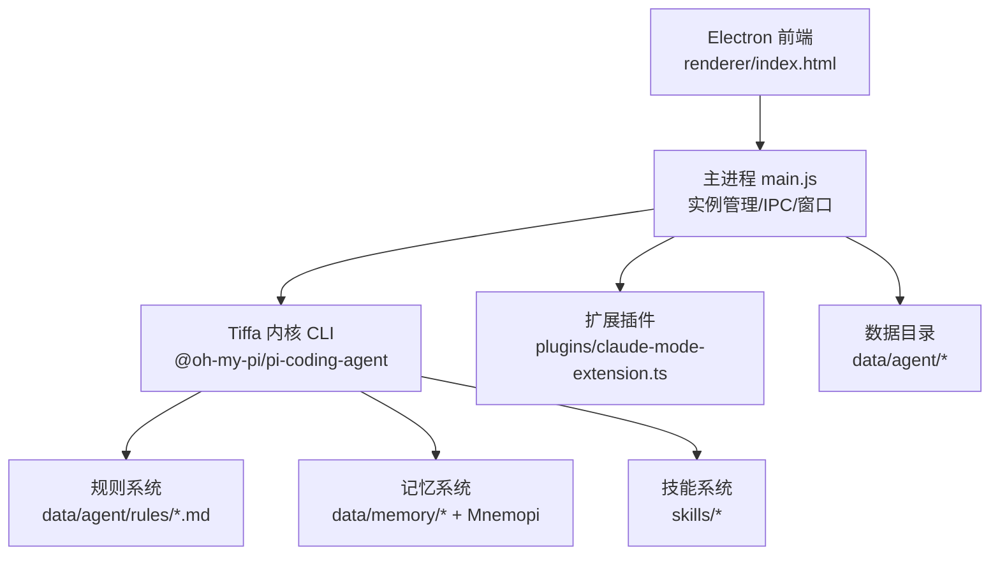
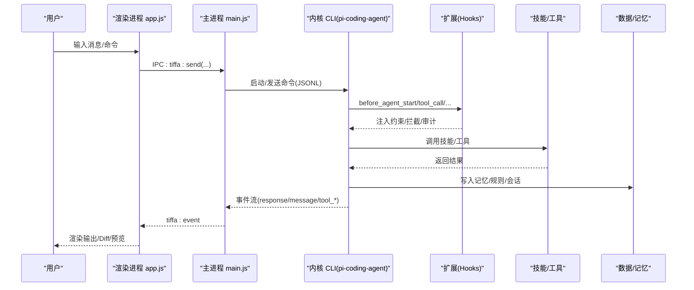
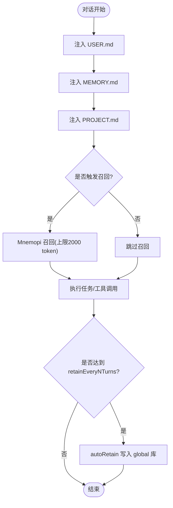
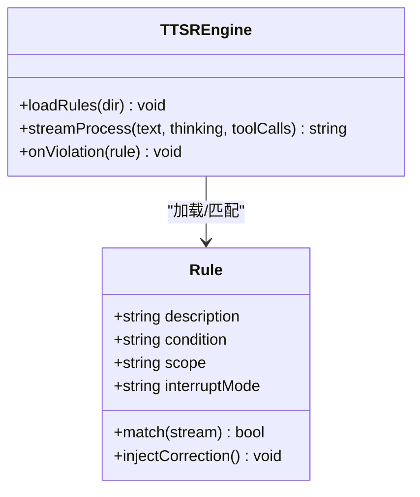
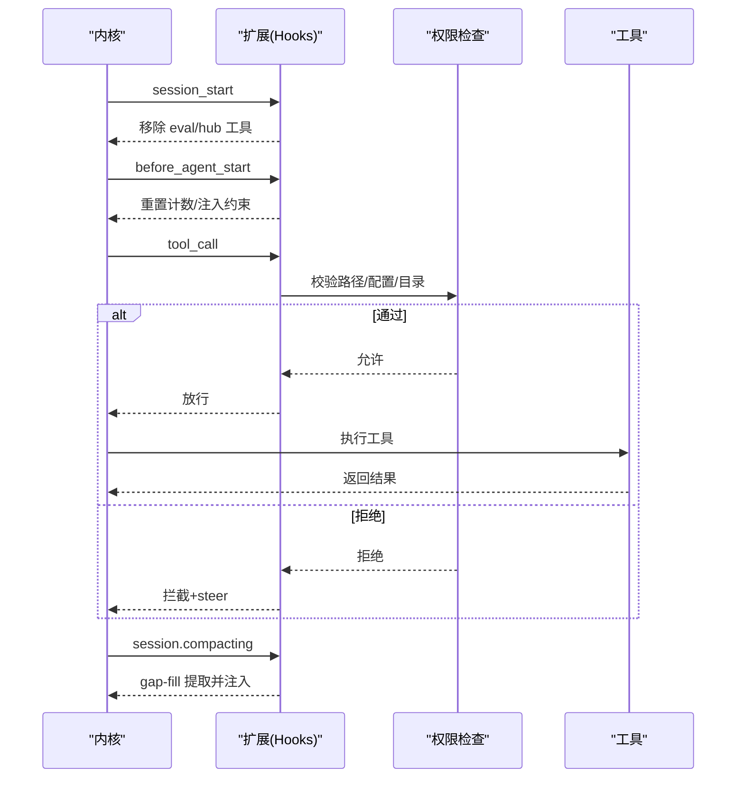
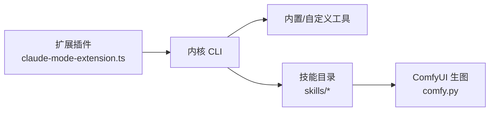
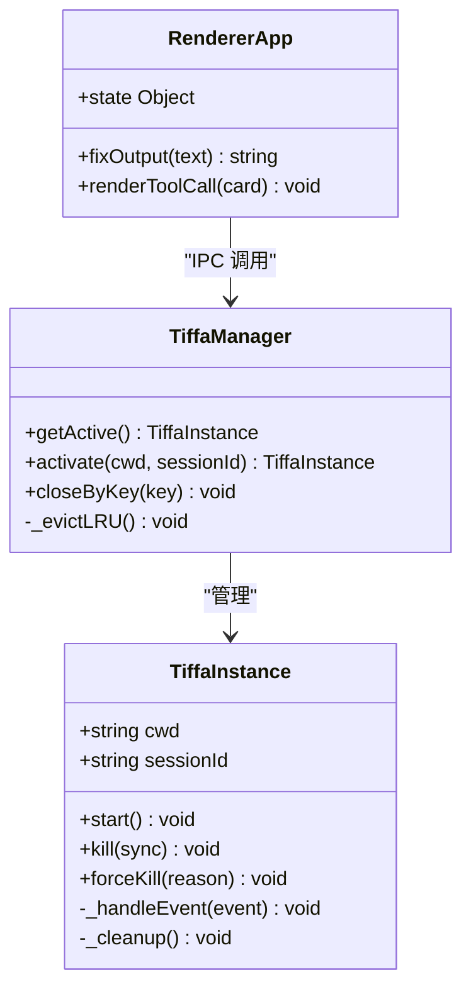
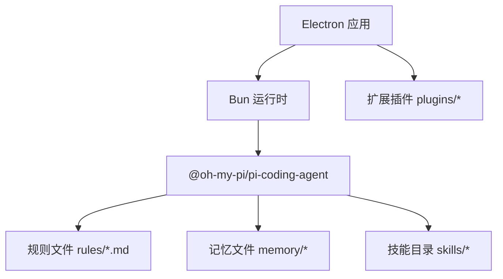

# 项目概述

<cite>
**本文引用的文件**   
- [README.md](file://README.md)
- [AGENTS.md](file://AGENTS.md)
- [config.yml](file://data/agent/config.yml)
- [main.js](file://electron/main.js)
- [app.js](file://electron/renderer/app.js)
- [no-xml-toolcall.md](file://data/agent/rules/no-xml-toolcall.md)
- [comfy.py](file://data/agent/managed-skills/comfyui-image-gen/comfy.py)
</cite>

## 目录
1. [引言](#引言)
2. [项目结构](#项目结构)
3. [核心组件](#核心组件)
4. [架构总览](#架构总览)
5. [详细组件分析](#详细组件分析)
6. [依赖关系分析](#依赖关系分析)
7. [性能考量](#性能考量)
8. [故障排查指南](#故障排查指南)
9. [结论](#结论)
10. [附录](#附录)

## 引言
Tiffa 是基于 @oh-my-pi/pi-coding-agent v17.0.7 的便携 AI 助手，定位为“本地优先、弱模可战、记忆永续”的工作台。它通过七层架构改造（驱动指令、权限系统、Hooks 链、规则系统、记忆系统、插件系统、技能系统），让一个 3.5GB 的 Q1_0 极限量化模型也能稳定完成智能体任务。与传统云端 AI 助手（如 Cursor/Copilot）相比，Tiffa 强调四重记忆持久化、本地模型优先、离线可用与便携部署，适合对隐私、成本与可控性有更高要求的开发者与团队。

**章节来源**
- [README.md:23-42](file://README.md#L23-L42)

## 项目结构
Tiffa 采用“Electron 桌面壳 + 内核进程 + 数据与技能分层”的组织方式：
- electron：桌面前端（主进程、渲染进程、主题与 IPC）
- plugins：扩展（Claude 化扩展等 Hooks 注入点）
- skills：专业技能（文档、PPT、PDF、生图等）
- data/agent：配置、规则、记忆与会话数据
- 启动脚本：tiffa-desktop.exe / .vbs / .bat/.ps1

**图表来源**
- [main.js:16-31](file://electron/main.js#L16-L31)
- [AGENTS.md:156-205](file://AGENTS.md#L156-L205)

**章节来源**
- [AGENTS.md:156-205](file://AGENTS.md#L156-L205)

## 核心组件
- 驱动指令：通过 Electron 主进程拦截命令（如 /omfg），将用户反馈转化为 TTSR 规则文件，即时生效
- 权限系统：工具调用 Hook 拦截危险路径、配置文件自改、workspace 根目录新建子目录等
- Hooks 链：session_start/before_agent_start/tool_call/session_stop/session.compacting/tool_result 六类钩子，贯穿会话生命周期
- 规则系统：TTSR 流式规则（零 Context 成本），在输出时实时检测并拦截违规
- 记忆系统：四重记忆（USER/MEMORY/PROJECT + Mnemopi RAG），支持 autoRetain/autoRecall/gap-fill
- 插件系统：扩展以 -e 参数加载，提供自定义工具与行为约束
- 技能系统：18 个内置 Skill，覆盖文档、PPT、PDF、生图、研究等场景

**章节来源**
- [AGENTS.md:79-154](file://AGENTS.md#L79-L154)
- [AGENTS.md:208-252](file://AGENTS.md#L208-L252)

## 架构总览
Tiffa 的整体运行流程如下：Electron 主进程启动 Tiffa 内核子进程，通过 JSONL over stdin/stdout 通信；渲染进程通过 IPC 与主进程交互；内核根据配置与规则执行工具调用，并通过 Hooks 与记忆系统进行上下文增强与约束。

**图表来源**
- [main.js:627-665](file://electron/main.js#L627-L665)
- [AGENTS.md:123-154](file://AGENTS.md#L123-L154)

**章节来源**
- [main.js:627-665](file://electron/main.js#L627-L665)

## 详细组件分析

### 记忆系统（四重记忆 + Mnemopi RAG）
- L1 USER.md：用户身份与偏好，零延迟注入，每轮必读
- L2 MEMORY.md：全局事实索引，跨项目共享
- L3 PROJECT.md：当前项目的架构/决策，按 cwd 隔离
- L4 Mnemopi：语义记忆（embedding + 召回），autoRetain 积累，manual recall 检索

**图表来源**
- [config.yml:18-27](file://data/agent/config.yml#L18-L27)
- [AGENTS.md:61-77](file://AGENTS.md#L61-L77)

**章节来源**
- [config.yml:18-27](file://data/agent/config.yml#L18-L27)
- [AGENTS.md:61-77](file://AGENTS.md#L61-L77)

### 规则系统（TTSR 流式规则）
- 规则以 .md 文件存放，包含 YAML frontmatter（description/condition/scope/interruptMode）
- 流式匹配：模型输出时实时检测，违规立即拦截，不占 token
- 典型规则：禁止 XML 工具调用、禁止废话开头、禁止硬编码密钥等

**图表来源**
- [no-xml-toolcall.md:1-10](file://data/agent/rules/no-xml-toolcall.md#L1-L10)
- [AGENTS.md:81-97](file://AGENTS.md#L81-L97)

**章节来源**
- [no-xml-toolcall.md:1-10](file://data/agent/rules/no-xml-toolcall.md#L1-L10)
- [AGENTS.md:81-97](file://AGENTS.md#L81-L97)

### Hooks 链与权限系统
- 六类 Hook：session_start、before_agent_start、tool_call、session_stop、session.compacting、tool_result
- 权限拦截：危险路径（System32/Windows/Program Files）、配置文件自改、workspace 根目录新建子目录
- 静默工具调用检测：连续 3 次无文字说明 → steer 提醒

**图表来源**
- [AGENTS.md:123-154](file://AGENTS.md#L123-L154)

**章节来源**
- [AGENTS.md:123-154](file://AGENTS.md#L123-L154)

### 插件系统与技能系统
- 插件：通过 -e 参数加载扩展，提供自定义工具（如 skill 列表）与行为约束
- 技能：18 个内置 Skill，涵盖文档、PPT、PDF、生图、研究等；ComfyUI 生图管线支持多模式

**图表来源**
- [AGENTS.md:113-154](file://AGENTS.md#L113-L154)
- [comfy.py:175-198](file://data/agent/managed-skills/comfyui-image-gen/comfy.py#L175-L198)

**章节来源**
- [AGENTS.md:113-154](file://AGENTS.md#L113-L154)
- [comfy.py:175-198](file://data/agent/managed-skills/comfyui-image-gen/comfy.py#L175-L198)

### 桌面前端（Electron）
- 主进程：TiffaInstanceManager 管理多实例、IPC 路由、窗口生命周期
- 渲染进程：会话标签、模型选择器、文件浏览器、Diff 视图、Todo 面板
- 主题系统：7 套预设 × light/dark/system，HSL Token 动态注入

**图表来源**
- [main.js:76-179](file://electron/main.js#L76-L179)
- [app.js:94-154](file://electron/renderer/app.js#L94-L154)

**章节来源**
- [main.js:76-179](file://electron/main.js#L76-L179)
- [app.js:94-154](file://electron/renderer/app.js#L94-L154)

## 依赖关系分析
- 运行时依赖：Bun（npm-global/node_modules/bun/bin/bun.exe）、Node.js、Python
- 内核依赖：@oh-my-pi/pi-coding-agent v17.0.7
- 扩展依赖：plugins/claude-mode-extension.ts（-e 参数加载）
- 数据依赖：data/agent/config.yml、rules/*.md、memory/*、sessions/*

**图表来源**
- [AGENTS.md:9-25](file://AGENTS.md#L9-L25)

**章节来源**
- [AGENTS.md:9-25](file://AGENTS.md#L9-L25)

## 性能考量
- 规则系统零 Context 成本：TTSR 流式匹配不占用一轮 token，节省约 500 token/轮
- 记忆注入上限：Mnemopi 每次最多 2000 token，避免撑爆上下文
- 实例管理：LRU 淘汰、stall 检测（3 分钟无事件 → abort + steer）、崩溃自动重启（最多 3 次）
- 输出后处理：修复裸链接、代码块语言推断，减少渲染开销

**章节来源**
- [AGENTS.md:148-159](file://AGENTS.md#L148-L159)
- [main.js:535-567](file://electron/main.js#L535-L567)
- [app.js:32-91](file://electron/renderer/app.js#L32-L91)

## 故障排查指南
- 中文乱码：主进程注入 UTF-8 环境变量（LANG/LC_ALL/PYTHONIOENCODING 等）
- 进程崩溃：非用户 kill 且退出码非 0 → 3 秒后自动重启，最多 3 次
- 会话卡住：3 分钟无事件 → abort + steer；再 30 秒未恢复 → forceKill
- 规则冲突：使用 /omfg 生成或修复 TTSR 规则，即时生效

**章节来源**
- [main.js:50-66](file://electron/main.js#L50-L66)
- [main.js:155-164](file://electron/main.js#L155-L164)
- [AGENTS.md:150-154](file://AGENTS.md#L150-L154)

## 结论
Tiffa 通过“本地优先、弱模可战、记忆永续”的设计理念，结合七层架构改造，成功让 3.5GB 的 Q1_0 极限量化模型稳定运行。其四重记忆持久化、离线可用与便携部署特性，为开发者提供了比传统云端 AI 助手更可控、更经济、更隐私友好的工作体验。

## 附录
- 启动方式：tiffa-desktop.exe / .vbs / start-desktop.bat / start-tiffa.bat
- 模型配置：models.yml（云端模型）、config.yml（角色映射）
- 环境变量：PI_CODING_AGENT_DIR、HOME/USERPROFILE、PORTABLE_ROOT

**章节来源**
- [README.md:198-207](file://README.md#L198-L207)
- [AGENTS.md:36-58](file://AGENTS.md#L36-L58)
- [AGENTS.md:254-262](file://AGENTS.md#L254-L262)