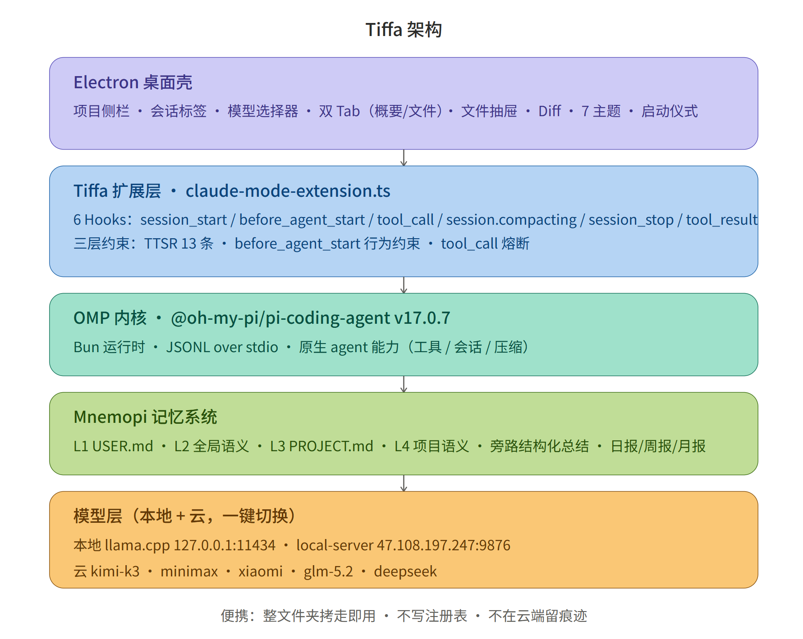
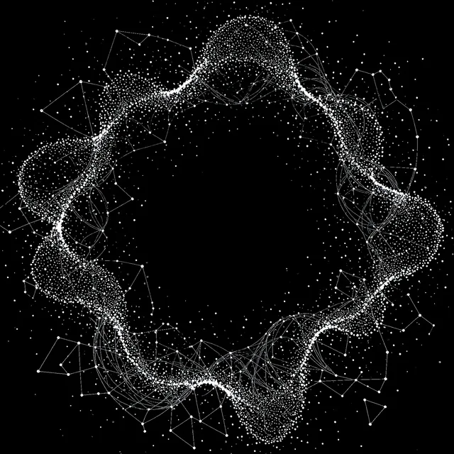

# Tiffa

> English version below · [中文文档](README.md)

**Play against all things; walk with time as your companion.** A **fully portable, absolutely private** local AI assistant. It remembers you, goes with you on a USB stick, and even a 3.5GB Q1_0 quantized model runs full agent tasks stably.

[](https://github.com/swond-Mao/Tiffa) [](https://github.com/swond-Mao/Tiffa/blob/master/LICENSE) [](https://github.com/swond-Mao/Tiffa) [](https://github.com/swond-Mao/Tiffa) [](https://github.com/swond-Mao/Tiffa)

Based on [oh-my-pi v17.2.2](https://github.com/can1357/oh-my-pi) · MIT License · Windows

> 🔗 **Built on the open-source [oh my pi (OMP)](https://github.com/can1357/oh-my-pi) framework v17.2.2** — a deep customization, not built from scratch. Upstream ⭐: <https://github.com/can1357/oh-my-pi> · Site: <https://omp.sh>

---

## Demo

<video src="demo/tiffa-demo.mp4" controls width="720"></video>

> A 22-second live demo: startup ritual → multi-session chat → computer operation → memory recall. The raw video is at `docs/demo/`, downloadable for playback.

---

## Why Tiffa

Have you ever felt this way — you've been talking to an AI for three months and it keeps getting to know you; then you switch computers, the system crashes, you reinstall, and that "it" is gone, leaving you with a stranger. **Tiffa exists to solve this — and leaves no trace anywhere.**

| Capability | Plain desktop assistant | OpenWebUI / Ollama | **Tiffa** |
|------------|:---:|:---:|:---:|
| Everlasting memory (survives PC swap / reinstall) | ❌ | ⚠️ session-level | ✅ layered memory + semantic recall |
| Absolute privacy (no login, no cloud) | ❌ | ⚠️ partial | ✅ fully local, take-it-with-you |
| Works with weak models (Q1_0) | ❌ | ⚠️ | ✅ seven-layer backstop |
| Change behavior with one complaint (no restart) | ❌ | ❌ | ✅ TTSR takes effect instantly |
| Operates the Windows desktop directly | ❌ | ❌ | ✅ Computer Use |
| Whole-folder portable (USB plug-and-run) | ❌ | ❌ | ✅ |

---

## Who Is It For

- **Privacy-sensitive users** — office / shared computers: no login, no registration, no trace; pull the drive and go
- **Multi-machine users** — one at home, one at work, a USB stick in your pocket; memory travels with the drive
- **Weak-hardware players** — a 3.5GB Q1_0 model still finishes agent tasks stably; old machines run it just fine
- **AI tinkerers** — 7 themes, custom animated startup screen, one-line complaints that change behavior — plenty to play with

---

## Core Features

- **Everlasting memory** — layered memory (USER.md / global semantic / PROJECT.md / project semantic) + local Mnemopi Embedding; your memory follows you across machines.
- **Absolute privacy** — no login, no registration, no trace on any server; all data stays on a USB stick.
- **Works with weak models** — local and cloud both welcome; seven-layer infrastructure backstops even a Q1_0.
- **Constraint system** — three layers (TTSR 13 rules / behavioral constraints / tool_call circuit-breaker), model behavior governed by code.
- **Operates the computer** — Computer Use v3 with UIA atomic toolset and five-tier degradation, drives your Windows desktop directly.
- **Desktop frontend** — Electron GUI (React + TypeScript): multi-workspace / multi-session / model selector / dual tabs / Diff / 7 themes.
- **Fully portable** — one folder is everything; copy to a USB drive and run.

---

## Architecture



---

## Everlasting Memory

Tiffa's memory is a layered living system, not simple file storage:

```
L1  USER.md       — Who you are, your preferences
                    "I'm Zhang San, hate pointless openers, always lead with the conclusion"
                    Read every turn, injected with zero latency

L2  Global semantic memory — Cross-project usage history
                    "User has an RTX 5090, manages services with NSSM"
                    Semantic recall, accumulates forever, never lost across sessions

L3  PROJECT.md    — Project charter
                    "This project uses SQLite, cache dir is data/"
                    Hand-maintained, auto-switches when switching projects

L4  Project semantic memory — Recent progress and decisions
                    "Fixed the ComfyUI pipeline yesterday, tuning the sidebar today"
                    Semantic recall, takes priority over global memory
```

Close it and reopen — it still knows you. Switch projects — it knows the context. A week later, flip through the logs and pick up the thread.

### Mnemopi Semantic Memory

The embedding model runs locally (`BAAI/bge-small-zh-v1.5`, 512-dim ONNX, no API needed). Memories are written into a vector database, auto-accumulating (written every 2 turns) and auto-recalled (relevant memories injected on the first message of a session).

Anti-bloat: at most 10 recalled per call, 2000-token injection cap, old memories auto-degrade and compress — the database can grow without limit while the context never overflows.

Long-conversation auto-compaction: by default it uses **snapcompact visual-frame summaries** (when a vision model is available); when the text to be compressed is too large (default > 2MB), it automatically downgrades to **side-path structured summarization** (a cheap model generates a 9-segment summary), preventing visual frames from blowing up the context. Weak models can resume at low cost, with tool details preserved at the semantic level.

### Progress Sedimentation: Daily / Weekly / Monthly Reports

Tiffa doesn't just record "what you said" — it records "what you accomplished." Every time a long conversation is compacted, the side-path model distills the conversation into a one-line log entry written to the project's `.progress/log.md`; on session start or day-crossing it auto-aggregates and sediments **daily / weekly / monthly reports** into `PROJECT.md` — come back a week later, open `PROJECT.md`, and you'll know what was advanced, where it got stuck, and what's next.

---

## Constraint System

Tiffa's constraints come in three layers, each with its own job:

**Layer 1: TTSR Streaming Rules** (zero Context cost)
- Written in `.md` files, detected in real time as the model outputs, violations blocked immediately
- 13 rules covering pointless openers, code-block formatting, dangerous operations, tool-call chatter, etc.

**Layer 2: before_agent_start Hook** (semantic constraints)
- File conventions, task-planning methods, skill iron rules
- System Prompt prefix injection, for behavioral / semantic constraints

**Layer 3: tool_call Hook** (dangerous-operation blocking)
- Dangerous path blocking (System32 / Windows / Program Files)
- Self-modification of config files blocked
- Silent tool-call detection (3 consecutive → steer reminder)

Unhappy with the model's behavior? Just complain in one line:

```bat
/吐槽 你不应该把产物放在工作区根目录
```

Chinese, English, file placement, wordy openers… whatever the flaw, say it. `/omfg` triggers the same. The model analyzes the problem and generates a TTSR rule file, effective instantly. No code changes, no restart.

---

## Constraining Model Behavior with Code

Tiffa doesn't rely on "nicely-worded" prompts to force the model into line — it **constrains the model's behavior layer by layer with code**, breaking error-prone steps into deterministic steps and letting the model walk through them. This is why weak models can complete tasks stably; strong models, in turn, produce **deterministic artifacts** per your requirements — no drifting, no freelancing.

**Craftman mode** is one example: when producing interactive web pages, posters, or presentations, Tiffa runs the craftman multi-skill orchestration — first confirming the theme / style / whether to generate images with you, then calling `pptgen` / `comfyui` / `canvas-design` per the plan, finally merging the output. Paired with an **HTML guard**: any `.html` written directly that references the visual component library (`shared-visual-components` / `data-theme=`), if craftman hasn't actually run, gets blocked with a prompt to go through the flow first — both "asked but didn't run" and "hand-rolled workaround" are sealed off. The whole flow is **backstopped by code**, not by the model's conscience.

**Whether weak or strong, this mechanism is the backstop:**

| Mechanism | Effect |
|------|------|
| TTSR rule blocking | Zero Context-cost constraint, saves ~500 token per turn |
| Pointless-opener blocking | The most frequent dumb pattern of weak models, cut directly |
| XML tool-call blocking | From "can't call tools at all" to "can" |
| Tool-call chatter blocking | Talk less, do more, save tokens |
| Side-path structured summarization | Long conversations don't fragment; weak models can resume context |
| Loop Guard | Exact-repetition detection + auto-retry |

**Side-path model summarization — the part we're proud of.** Long-conversation compaction and progress sedimentation are both handed to an independent side-path small model, which has three advantages others lack:
- **Third-party perspective, unpolluted by context** — it doesn't read the main conversation's step-by-step reasoning, only sees what needs summarizing, so conclusions are more objective and don't drift along with the main model;
- **Cheap model saves money** — use the cheapest small model for the manual labor of summarization, while the main model only does the real work;
- **No agent constraints, saves tokens** — the side-path model doesn't load the main agent's system prompt and tool definitions, so its context is extremely light and the summarization cost is nearly negligible.

**Even a Q1_0 extreme-quantized model works stably.** It's not that the model got stronger — it's that the infrastructure covers its shortcomings. Strong models on this same base become steadier, cheaper, and more controllable.

---

## Operating the Computer

Not just writing code — Tiffa can directly operate your Windows desktop:

- **Atomic toolset**: `ui_inspect` (read control tree) / `ui_act` (click & type) / `ui_screenshot` (screenshot) / `desktop_input` (mouse & keyboard) / `computer_use` (all-in-one)
- **Five-tier degradation**: UIA Pattern direct call → precise coordinate click → SoM numbered labeling → normalized coordinates fallback → OCR text recognition
- **Mandatory three-phase flow**: app probe (cannot skip) → strategy selection (prefer CLI/API/COM back-channel) → execution
- **Default VLM**: Doubao `doubao-seed` vision model, configurable in the background "MCP Models" field

> Honestly: it's not especially great. Complex interfaces, dynamic popups, and owner-drawn controls still miss. At this stage it's better suited for deterministic tasks like "click a fixed button, fill a fixed form." But it does exist — among local assistants, few can directly operate the desktop.

---

## Desktop Frontend

Electron GUI (React + TypeScript renderer), not lines of text in a terminal:

- Project sidebar — multi-workspace switching, archiving without loss
- Conversation tabs — each dialogue independent model, independent memory
- Model selector — one-click switch local / cloud models
- Right-panel dual tabs — Outline (Todo + project charter) / Files (flat navigation + drawer preview)
- File drawer — HTML rendering / code highlighting / image centering / Markdown formatting
- Diff view — code changes clear in red and green
- 7 themes — day / night mode one-click switch

### Startup

Startup isn't a dry spinning circle — it's an entrance ritual:

```
  与万物对弈，伴时间同行      ← Main title emerges
   夜色将尽，晨光初透       ← Wake the engine
   静水深流，暗涌潜行       ← Load memory
   行囊在肩，天地为卷       ← Organize context
   灯火已明，门扉待启       ← Ready
```

**You can put your own image on the startup screen.** Drop `startup-image.png/.jpg/.webp/.gif` into the `data/` folder and restart — done (≤20MB; animated GIF / WebP work fine). White-background black-text images are **auto-inverted** in dark theme to black-background white-text, while light theme keeps them as-is — one image covers both themes, and switching from a starfield to your own artwork takes one restart.

---

## Portable: Copy and Go, Leave No Trace

```
Tiffa/           ← This one folder is everything
├── electron/    ← Desktop frontend
├── npm-global/   ← Bun + core
├── plugins/     ← Extensions + skills
├── data/        ← Config + memory + sessions + rules
└── workspace/   ← Your projects
```

**Copy to a USB drive, plug in and use.**

- Writes no registry
- Installs no global packages
- Leaves no files in `%APPDATA%` / `%LOCALAPPDATA%` (userData locked to `data/electron-userdata`, HOME / USERPROFILE redirected to `home/`)
- **npm / pip caches also point into the package** `.cache/` — zero C-drive writes during both install and runtime
- The workspace (workspace/) is also on the USB drive, touching none of the target computer's hard disk
- No login, no registration, no records left on any server

You finish on the office computer, pull the drive and take it. Plug in at home — all memory, projects, and config intact. No account, no cloud, nowhere that retains your usage traces.

---

## Install

```bat
install.bat        :: One-click install (China mirrors; auto-downloads Node / Bun / core / Electron / Python / offline embedding models)
```

- Resumable: re-run after an interruption auto-skips completed steps
- All download caches land in the package's `.cache/` — copy the whole folder away once done
- First launch walks you through naming your AI (default: Tiffa)

---

## Engineering: CI / Tests / Release

- **CI quality gate** (GitHub Actions): typecheck → unit tests (main.test.js 21 + vitest 4) → renderer build → artifact verification — no merge while red
- **Three-layer automated testing**: ① protocol E2E (full chain spawning the real core) → ② agent self-run (let Tiffa examine itself) → ③ browser UI verification
- **One-command release**: `cd electron && npm run release` — auto-tags and pushes to three remotes (gitee / github / gitcode) after all checks pass

---

## Launch

```bat
tiffa-desktop.exe      # Double-click to launch
tiffa-desktop.vbs      # No console window
start-desktop.bat      # With --portable-root parameter
start-tiffa.bat       # TUI/WebUI/RPC terminal mode
```

Or dev mode: `cd electron && npm start`

---

## Screenshots



> 📷 **Real screenshots to be added.** Suggested: ① desktop GUI main view ② memory-recall illustration.
> Drop images into `docs/screenshots/`, then uncomment the line below to display:
>
> `<!--  -->`

---

## Technical Easter Egg: The Seven-Layer Transformation

A bare model is like an unsharpened knife. Tiffa's seven-layer architecture is the whetstone:

```
  Drive instructions ─── Let the model know "who I am"
  Permission system   ─── Let the model know "what I can do"
  Hooks chain        ─── Correct the model when it errs
  Rule system        ─── Let the model know "what I cannot do"
  Memory system      ─── Let the model remember "what you told me"
  Plugin system      ─── Let the model gain new abilities
  Skill system       ─── Let the model know "what to do when this happens"
```

All seven layers together produce this effect: **even a Q1_0 extreme-quantized model works stably.**

---

## Credits

Tiffa stands on the shoulders of [oh my pi (OMP)](https://github.com/can1357/oh-my-pi) — an open-source AI coding-agent framework that provides the entire core Tiffa is built upon. If you like Tiffa, please also star the upstream project ⭐ so more people discover OMP: <https://github.com/can1357/oh-my-pi> · Site: <https://omp.sh>.

---

## License

MIT. Just use it.
